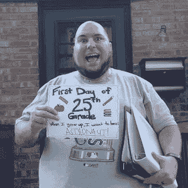

# 如何在增加人力资本的同时保持财务上的精明

> 原文：<https://medium.datadriveninvestor.com/how-to-be-financially-smart-while-growing-your-human-capital-db37f6ae8b05?source=collection_archive---------4----------------------->

我以前的一个同事联系了我，告诉我关于寻找项目和支付研究生教育的想法。在我的第三个硕士项目中，我想分享我所知道的，我认为它可能有更广泛的用途:

Can’t Stop. Won’t Stop

你好，埃德加。我有一段时间没和你说话了，但我想问你是否知道奖学金或资助硕士项目。你总是在学校！我想去，但想尽可能少付钱。

 [## 外汇投资如何帮助偿还你的债务-数据驱动的投资者

### 外汇是对外汇市场的投资，不同国家的货币在外汇市场上进行兑换

www.datadriveninvestor.com](https://www.datadriveninvestor.com/2019/02/13/how-forex-investment-helps-to-repay-your-debts/) 

你好。在研究生院费用是一个巨大的考虑。根据你想做的事情，有不同的融资方式。这将取决于学习的课程或机构。当我第一次去堪萨斯州立大学的研究生院学习英语时，他们提供了一揽子资助，作为交换，我要教几节课。我获得了学费减免和每年 8000 英镑的津贴。这还不够生活，当我住在我那糟糕的地下室公寓的室友搬走时，我不得不借钱生活。在时间投入和报酬上有巨大的差距，但是对于一个刚刚从大学毕业的年轻人来说，这不是问题。最好的情况是职业技术，但这可能不会很快被复制，我真希望我从一个比 DeVry 声誉更好的机构获得证书。(顺便说一句，我不确定有多少我们的同龄人最终找到了与我们接受培训的行业相关的工作。我自己只是在我实习的机构运气好)。对于更多的就业后技术教育，我真的意识到这要花多少钱，因为我还在偿还关于 10K 的贷款，这些贷款是我资助的英语研究生课程的贷款。我上的第一堂课是在市立大学，后来当我搬到离工作地点更近的地方时，我去了社区大学。这些都是很好的交易，我有很好的老师。几门课的书比课程本身还要贵。

对于大师的作品，考虑的就不一样了。我去寻找以非营利为重点的商业导向课程。有很多学位都涉及到这一点——MPA、MNA 等。如果我想离开非营利组织的工作，我会被使用非营利组织 MBA 课程的学校所吸引。协和女神吸引我的一个原因是它的标价。整个学位不到 30K，而且考试门槛很低。自 2003 年以来，我没有参加过 GMAT 考试，也没有参加过 GRE 考试。其他学校的标价要高得多。比如德保罗商学院 80K。但重要的是要知道，学校是在争夺生源。我和招生人员谈了谈，并谈到我对价格有多敏感，他们提供了 20%的折扣，所以只有 60K。这还是太多了。我想要一个比 Concordia 更好的名字，但对我来说不值得花双倍的价钱。

同样的事情也发生在罗斯福身上。基于之前的工作，我拿到了大概 2000 /学期的奖学金。问题是它只适用于全职工作。

有些人有资金选择，如通过工作的计划。我有个朋友，他的工作支付了他整个 MBA 的学费。如果你要攻读博士学位，那么在很多领域你可以获得比我在 K-State 获得的更多的资助，你可以让自己沉浸在学术生活中。

很多博士学位不给你任何资助，你最终只能通过贷款或自掏腰包来支付。在走这条路之前，我会对就业市场和这些学位的效用做大量研究，以确保它是行业所需要的。我没有继续学习英语的一个主要原因是它太窄了。博士学位只是让你有资格教英语，相对于授予的最终学位数量，这些职位非常少。

我自己一直依赖借贷。现在，我有大约 26K 的未偿贷款。但是我妻子和我都有专业的工作，我们可以比正常的还款时间表更快地付清欠款。我有大约 250-300 学分，我妻子上过研究生课程，所以尽管我很在意价格，但这对我们的个人财务来说是一个巨大的好处。

也就是说，这并不是所有的成本。尽管我喜欢为学习而学习，但更多的教育在专业上帮助了我，我妻子的教育也是如此。主要的区别在于，年龄稍大，经济负担更重，我所接受的教育更有针对性，最终目标是对工作有用。

我打算在几年后继续攻读博士学位，因为这是我的个人目标，但除非我得到资助，否则我不会这么做，这是一个很大的承诺。

如果你有任何问题，让我知道。祝你好运！

埃德加！非常感谢你的消息。我在想，如果我选择更便宜的，这有什么关系。我完成了这个项目，现在是 RHIA 人、中国共产党人和 CPMA 人。我在一个卫生系统的合规部门工作。我是一名高级审计师，但我认为我可能需要一个硕士学位才能达到我渴望的领导水平。我在考虑博立顿大学的一个项目，这个项目和很多项目的价格差不多。你认识去那里的人吗？我要去看看协和女神。

答案是“视情况而定”，因为这很大程度上取决于你认识谁，而你的资历是次要的，只要你在大多数工作和组织中拥有这些资历。比如，我将永远拥有那个 MBA 学位，我在哪里获得的学位没有我拥有它重要(除非在真正的精英阶层，你会因为没有进入前 10 名的学校而被评判)。只要确保学校和项目对你想做的事情有适当的认证就行了。不然去便宜点也不会真的吃亏。最重要的是，你的项目将会成为你所在领域的其他人的引荐，所以它增加了你认识的人的圈子。