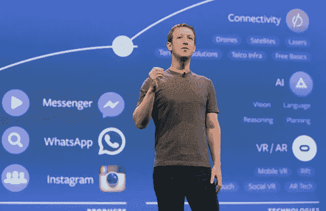

# 如何像苹果和脸书一样创新:第一手的 14 个见解

> 原文：<https://medium.datadriveninvestor.com/how-to-be-innovative-like-apple-and-facebook-14-insights-at-first-hand-5db528a750d1?source=collection_archive---------49----------------------->

像 10 年前一样，2018 年企业仍然暴露出一些创新障碍。

Sideways6 调查了来自世界各地的 1039 名员工，结果如下:82%的员工表示他们对如何发展公司有想法，但公司内部的恐惧、等级制度和耳聋对创新过程有很大的负面影响。

最简单的方法是受到一家大公司的启发，这家公司多年前就意识到为什么创意和创新是进步的关键。

2018 年 2 月 [Fast Company](https://medium.com/u/ada2289350de?source=post_page-----5db528a750d1--------------------------------) 在其[50 强](https://www.fastcompany.com/most-innovative-companies/2018)中称苹果为“最具创新力的公司”(网飞第 2，亚马逊第 5，Instagram 第 12)。2017 年 [Spigit](https://medium.com/u/f7e6681c571b?source=post_page-----5db528a750d1--------------------------------) 向我们展示了创新巨人的另一个例子——脸书。

为什么？从全球来看，他们和所有公司一样拥有同样的创新资源:顾客和员工。技术是答案吗？或者他们的创新方式有什么特别之处？

脸书在 13 年前出现**，但现在它拥有 Instagram、Whatsapp、Aquila 并拥有超过 20 亿用户！苹果从 2010 年开始有点停滞不前——他们的最后一款产品是 iPad，但在 2017 年，无线 AirPods、面部识别和新显示器再次证明了他们的力量。**

**过去，人们说 iPhone 永远无法工作，因为它没有物理键盘，但今天**几乎 8600 万人只在美国使用 iPhone**(2017 年统计)。**

**我们研究了蒂姆·库克的采访，以下是给那些想带领公司创新的人的建议。**

****

**Tim Cook**

## **来自苹果的 9 个创新见解**

*   **你的产品丰富了人们的生活吗？你的产品是否给了人们做以前做不到的事情的能力？**
*   **当你同时做这两件事时，这就是一个好产品——很明显，这些事是不可思议地联系在一起的**
*   **公司内部福利很重要**
*   **产品和人总是重要的。在每年年底、每月、每周或每天问自己，我们在这方面取得进展了吗？**

> **世界上的噪音比变化多。蒂姆·库克**

*   **你必须确保你把注意力集中在重要的事情上，并且屏蔽噪音。**
*   **不要等着竞争对手来看他们会怎么做。**
*   **创新需要时间和金钱。但这是值得的。天才产品的出现并不出人意料——这是一条漫长的道路。**

> **[一个产品]就像一列火车——火车离开了车站，如果在那之后你有了一个伟大的想法，它将搭乘下一列火车。你不会把这个人叫回警局的。**

*   **你必须相信并确信你的产品是伟大的——然后，你可以向人们展示它。**
*   **关心用户的想法，但要考虑最周到的事情，不去理会那些噪音。**

**你同意蒂姆·库克的观点吗？苹果和我们分享了它的创新和产品理念，你们公司有吗？**

**Spigit 写了一篇关于脸书和创新的文章，让我们看看脸书的创新技巧。**

****

**Mark **Zuckerberg****

## **来自脸书的 5 个创新见解**

*   **利用集体智慧**

> **我们今天知道和使用的许多脸书的产品和功能都是员工挠自己痒痒的直接结果:当朋友失踪时，Messenger 中的位置请求，离线消息，标志性的脸书“喜欢”按钮，脸书的广告和开发者平台**

*   **关注创意——它应该成为公司文化的一部分**
*   **经常构思:定期组织与团队和远程同事的会议！脸书每月举办一次黑客马拉松！**

> **把创新想象成肌肉。你做得越多，它就变得越大，表现得越好。Spigit**

*   **落实思路！ ***“有想法而不实施得不偿失。不实施想法不仅会让你错失创造新产品、服务和改进的机会，还会慢慢失去员工的活力，导致参与度降低。”*****
*   **你的高管应该参与创新。谈到脸书的黑客马拉松，首席执行官马克·扎克伯格和其他高管会考虑员工的意见，然后给出项目的最终决定。**

**你需要明白，你和你的公司，即使很小，也有像苹果和脸书一样创新的机会。试试看！专注于创新。**

**68%的员工认为他们的公司缺乏管理创意的结构化流程。从 it 开始—实施清晰易用的创意管理应用程序。如果你愿意，你可以[试试 IdeaKeep](http://ideakeep.me/?utm_source=medium&utm_medium=article&utm_campaign=innovatiofbapple) 来达到这个目的——它是免费的；)**