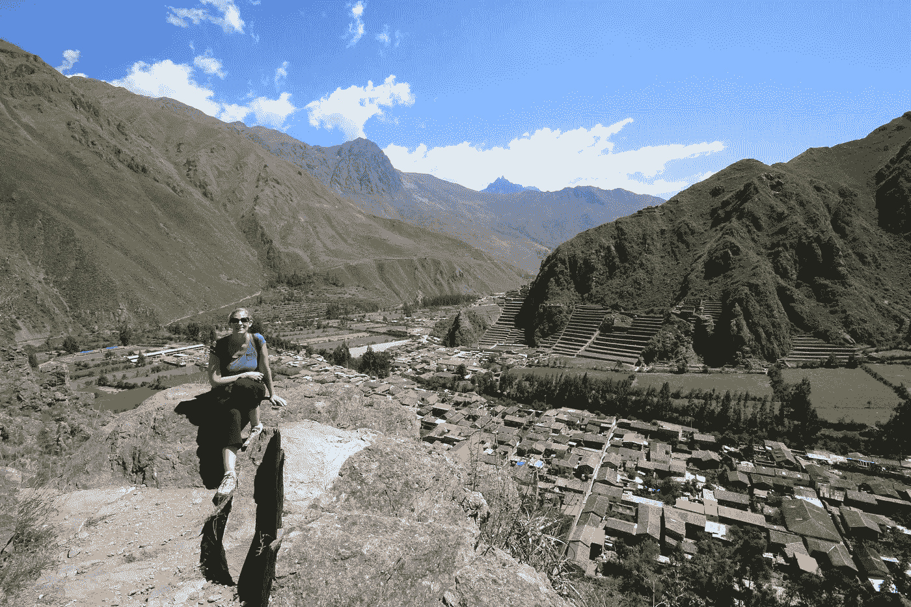

# 如何独立于地点——在任何你想去的地方做你想做的事:艾米·斯科特解构游牧生活

> 原文：<https://medium.datadriveninvestor.com/how-to-be-location-independent-doing-what-you-want-anywhere-you-want-amy-scott-deconstructs-the-d77b8c6b2061?source=collection_archive---------27----------------------->

Amy Scott

如果你对以实际可行的方式环游世界感兴趣，那么艾米是回答你问题的最佳人选，我们将在这一集深入探讨这个问题。

艾米在辞职环游世界之前，在旧金山湾区的一家旅游出版公司开始了她的编辑生涯。然后，她创建了“[游牧社论](https://www.nomadeditorial.com/)”，在这样做的同时在经济上支持自己——接下来是“[游牧社区](https://collective.nomadtopia.com/)”，这是一个支持其他人生活或创造独立于地理位置的生活方式的在线社区，她主持播客“[游牧广播”](https://www.nomadtopia.com/)

在这一集里，如果你想以一种可持续和愉快的方式旅行，我们将广泛提供你需要的所有工具、网站、书籍、博客和灵感。

如何处理跨国合同？有人在美国有银行账户吗？一个人如何处理医疗和牙科需求，处方？医疗保险呢？那件事让我大吃一惊！

如果你在你居住的国家为某人做自由职业者，不同的法律是如何运作的？税收是如何运作的？你有美国的邮寄地址或邮政信箱吗？邮件怎么样？信用卡公司，账单…？

什么是最好的生活安排，对他们有什么好处和坏处？你如何获得租约？会寂寞吗？会害怕吗？会有风险吗？

旅行必备物品有哪些？游牧旅行是简化了还是复杂化了？游牧生活的缺点/问题是什么？

我们将在这一集的信息包中一一讲述。艾米很棒，她过着充实的生活，并为我们提供了环游世界所需的工具。

在 iTunes 上听或[在这里下载](http://livingalifeinfull.libsyn.com/)。你也可以在[阴云](https://overcast.fm/itunes1281672367/living-a-life-in-full)、[音云](https://soundcloud.com/chris-stout-dr-chris-stout)、[缝合器](https://tinyurl.com/Stitcher-LivingALifeInFull)、 [Spotify](https://tinyurl.com/Spotify-LivingALifeInFull) 、 [Google Play 音乐](https://tinyurl.com/GooglePlayMusicALifeInFull)，以及 [iHeartRADIO](https://www.iheart.com/podcast/living-a-life-in-full-29468501/) 上收听。请在自己喜欢的平台订阅，不要错过一集。以下是[展示注意事项。](http://www.alifeinfull.org/podcast.html)

“充实地生活”是你一直想与发表精彩 ted 演讲的人、你最喜欢的书的作者或你一直想了解更多的鼓舞人心的奥林匹克运动员进行的对话。

这个节目是给好奇的人看的。你不仅想知道更多有趣和创新的东西，还想知道是什么让他们兴奋，甚至是什么让他们发笑。这是与那些对世界和他人的生活产生影响的人进行的研究生水平的对话。

这个节目带给你新的想法和方法，这样你就能过上充实的生活。

这个节目是信息和灵感的平等部分，但没有格言和口号。我们以引人入胜的方式涵盖了广泛的主题——从燃烧的人到文艺复兴周末，从联合国到顶尖大学，从诺贝尔奖获得者到宇航员——我们有一个令人惊叹的通讯录。

受访者包括高水平运动员、畅销书作家、高素质领导者、改变世界的人道主义者、创新研究人员、卓越的初创企业创始人、聪明的生活黑客、打破思维定势的思想领袖和全球创新者。

这个故事最初出现在 LinkedIn 影响者的帖子中。如果您想了解更多或联系，请在 http://DrChrisStout.com**。你可以在*[*LinkedIn*](http://www.linkedin.com/influencer/3055695)*上关注我，也可以找到我的* [*推文*](http://twitter.com/drchrisstout) *。通过 http://ALifeInFull.org 的***可以获得物品和工具。如果你喜欢这篇文章，你可能也会喜欢:*[https://www.linkedin.com/today/posts/drchrisstout](https://www.linkedin.com/today/posts/drchrisstout)**