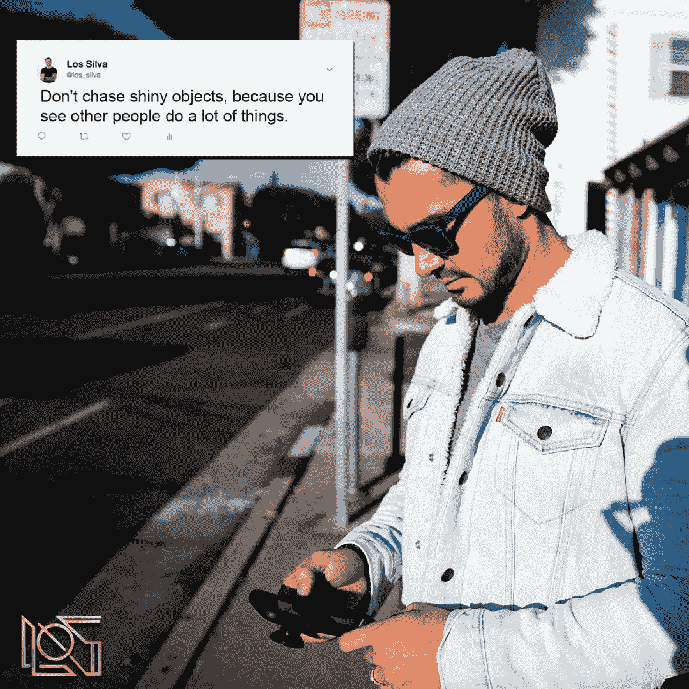

# 如何在你的听众面前无所不在

> 原文：<https://medium.datadriveninvestor.com/how-to-be-omnipresent-for-your-audience-8892452525d9?source=collection_archive---------43----------------------->

我想谈谈无所不在，以及这对你和你的社区作为一个有影响力的人意味着什么。

无所不在的定义是**随处可见**。

这是认知偏差的一部分，锚定认知偏差。这意味着你被锚定为一个让你看到他们想看到的东西的人，在你的头脑中你看到了这些东西。

我们如何实现这一目标？

在你的企业中创造无处不在的影响力的最佳方式是什么……通过**无处不在来真正建立影响力，而不必总是出现在任何地方。**

我创造了一个 5 步系统和过程来创造无所不在。

让我们开始吧。

第一步听起来很简单，但是太多人试图跳过它……**做好你所做的事情**。

作为你所在领域的影响者，你必须建立一个好的品牌和好的业务。

你必须擅长**为你销售的产品创造成果。**

例如，我们帮助有影响力的人将品牌规模扩大到七位数甚至更高，这就是我们所做的，我们非常擅长。

如果我们以前不是，你猜怎么着？我们不会卖这个。

我们在学习，我们在进步，我们在实施不同的系统，帮助我们在这方面成为世界一流。

在你所做的事情上成为世界级的，这是第一步。

这是必要的，因为它让你不断获得线索、流量和结果。

这种情况会持续到第二步。**与一件事相关**。

就像我上面说的，我们帮助有影响力的人扩大他们的品牌，并把他们变成企业。

因为…特别是在开始的时候..你什么都做了。

你是首席执行官，“首席一切官”，你到处移动，你不知道该做什么。

因此，我们进来，我们清理这整个混乱，让你擅长你的独特能力，然后我们把一切都扩展为一个企业。

这是我们的核心竞争力。

我们只有两种产品。我们将在合作关系中为你做这件事，但因为我们不能以那种方式接受太多人，我们也在教练关系中做这件事。

你擅长和相关的是什么？**不要追逐闪亮的物体，因为你看到别人做了很多事情。**

忠于你的提议，并在适当的时候扩展它。

第三步。拥有一个核心产品。

就像我说的，我们有两种合作方式。这两条途径是我们的核心产品。

接下来，第四步。你的营销角度是什么？

我们在这里向你展示具体的角度，这就是你需要如何与你的人就这些角度进行对话。

您可以继续创建相同的关系。现在，如果你看看我们正在做的事情，**我们正在通过互联网上不同的社交平台，主要是我们的目标受众生活的地方，创造存在感。**

你怎么能有一个核心产品，并在其中建立不同的营销角度？

#4..从一个平台开始，直到该扩展的时候。

例如……我们曾大量投放脸书广告，但现在随着我们组建了一个更大的团队，我们在组合中加入了 YouTube 广告，而且自从在 YouTube 中变得稳固后，我们已经扩展到 Instagram。

我们正在有策略地针对你进行同样的**对话，所以你可以看到不同的角度，不同的结果，但它始终是一个核心的提议。**

第五步，最后一步..**在你的营销中创造更多的一致性**。

很多时候，我们和这样的人交谈:“是的，我在 Instagram 上刷了一下，或者我周二在脸书上发了帖子，我周三和周四就忘了。”

听着，这是生意，这是品牌，你需要创造一致性。

人们关心他们最喜欢的节目，因为他们知道它什么时候来，他们在期待它。

当你告诉他们你要创造时，他们期待你去创造。不要停止，**成为并保持一致的创造者。**

我经常提醒自己，“一致性，一致性，对话。”

这将为你的企业创造转化。**全等对话是从不同角度谈论同一个话题的相同对话。**

与你的客户建立对话是为了让他们感觉与你更亲密，建立更好的关系，更信任你，并看到你能提供的角度和结果。

这将让他们毫不犹豫地给你打电话或买你的东西，并创造这些转换。

这就是你如何在你的业务中创造无所不在。