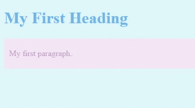

# 如何成为全栈开发者— HTML

> 原文：<https://medium.datadriveninvestor.com/how-to-become-a-full-stack-developer-html-369fb58cc221?source=collection_archive---------17----------------------->

[](http://www.track.datadriveninvestor.com/1B9E)

Photo by [Kobu Agency](https://unsplash.com/@kobuagency?utm_source=medium&utm_medium=referral) on [Unsplash](https://unsplash.com?utm_source=medium&utm_medium=referral)

## 内容

系列文章:

*   [简介](https://medium.com/datadriveninvestor/how-to-become-a-full-stack-developer-intro-8419c9aa342d)
*   第 1 部分— HTML、CSS —可视化部分
*   第二部分— [前端开发](https://medium.com/@antmihlin/how-to-become-a-full-stack-developer-front-end-5bb6c2422f5a)
*   第 3 部分— [后端开发](https://medium.com/@antmihlin/how-to-become-a-full-stack-developer-backend-53c0330eaa64)

我们将从 web 开发的视觉部分开始。

# **如何运作？**

如引言中所述，浏览器从服务器接收数据。它可以是图像、层叠样式表(CSS)、超文本标记语言(HTML)、Javascript (JS)文件等等。

浏览器读取 HTML、CSS、JS 文件并执行特定的行为。

*   HTML —负责内容。它描述了元素的层次和类型。
*   CSS —定义元素样式和定位。
*   JS —添加交互行为。可以动态改变 CSS 和 HTML。

# **HTML**

最终，HTML 是一种描绘元素归属的语言。设置段和逻辑部分。

如页眉、页脚、导航、侧边栏等。

出于什么原因，我们需要任何想象力？这是一种向计算机描述页面内容的方法。HTML 集合可视化表示。至少是由浏览器的默认设置定义的基本设置。

此外，屏幕阅读器和搜索引擎使用的语义 HTML。它通过解析成逻辑元素来评估文本。

由名为**标签**的块构成的文档。有两种类型的标签。等级和非等级。

第一类可以包含其他标签，由开始标签和结束标签组成。会是这样的:

```
<p> Some content </p>
```

你会在学习的过程中发现包容的规则。

第二个会是这样的:

```
<input />
```

HTML 有基本的结构规则。基本文档示例:

```
<!DOCTYPE html>
<html>
<head>
<title>Page Title</title>
</head>
<body><h1>My first Heading</h1>
<div class="some-block">
  <p>My first paragraph.</p>
</div></body>
</html>
```

结果:


让我们理解这里发生了什么。首先，我们通过`<!DOCTYPE html>`定义文档类型。

此时，通过`<html>`打开文档。

放在`<head></head>`里面。将放置所有不可见的数据。例如元数据、浏览器标签的样式和标题。

然后`<body> </body>`，这里将放置页面的可见内容。

阅读本教程的所有章节，不要忘记亲自尝试。这将是一个人在这个舞台上所需要的一切。

每个标签都有属性。通过设置属性，可以执行不同的操作:样式、事件、标识符。[这里的](https://www.w3schools.com/tags/ref_attributes.asp)是属性的完整列表。

具有属性的标签示例:

```
<div id="some-id" class="some-class" style="color:red;" ></div>
```

# **CSS**

级联样式表可以以几种不同的方式与 HTML 交互。内联样式设置为属性:`<div style=""></div>`。内联样式直接作用于标签，不需要与标签相关联的特征。

另一种方法是在 head 标签中包含 CSS 文件。按照这些思路:

```
<head>
  <link rel="stylesheet" type="text/css" href="styles.css">
</head>
```

或者另一方面，在 head 标签中编写样式:

```
<head>
  <style>
   .some-class{
     color:red;
   }
  </style>
</head>
```

头部样式需要使用所谓的“选择器”来表征与标签的关联。

尝试以各种方式包含样式。每一个都应该根据用例来使用。在更大的 web 应用程序中，建议使用外部文件，因为它会使项目更有序。

现在我们来看看如何包含样式。我们实际上应该如何写风格？

接下来是样式语法。

内嵌样式:

```
<div style="color:red;background:blue;" >Text</div>
```

头型:

```
div{
  color:red;
  background:blue;
}
```

有多种方法可以到达标签进行样式化。这可以通过标签、类、id 来完成。同样，层级将有助于到达特定的元素。例如:

```
body{
 background:#E0F7FA;
}h1{
  color:#64B5F6;
}div.some-block {
  background: #F3E5F5;
 padding: 5px 10px;
}div.some-block p{
  color: #CE93D8;
}
```

结果:



从那以后，你可以继续做实验。这是我们创建的页面。尝试做修改。

这里有很好的 CSS 教程。它们涵盖了风格的所有方面。

# **有用的工具**

[按下](https://wordpress.org/)

[Codepen](https://codepen.io) — HTML、CSS、JS 在线编辑器。

Chrome 开发工具——浏览器中的开发工具。

# 结论

恭喜你，你已经可以创建你的第一个网站了！

目前，它将是静态页面。但是有了这些知识，就有可能使用内容管理系统(CMS)来创建动态网站。比如 [Wordpress](https://wordpress.org/) 。