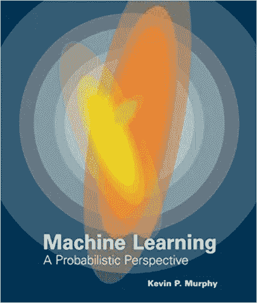
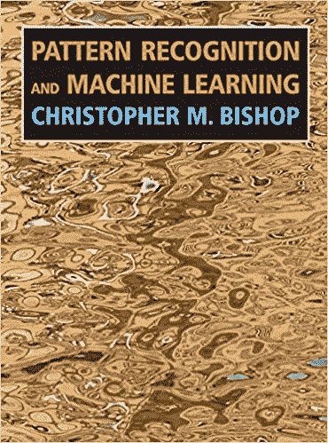
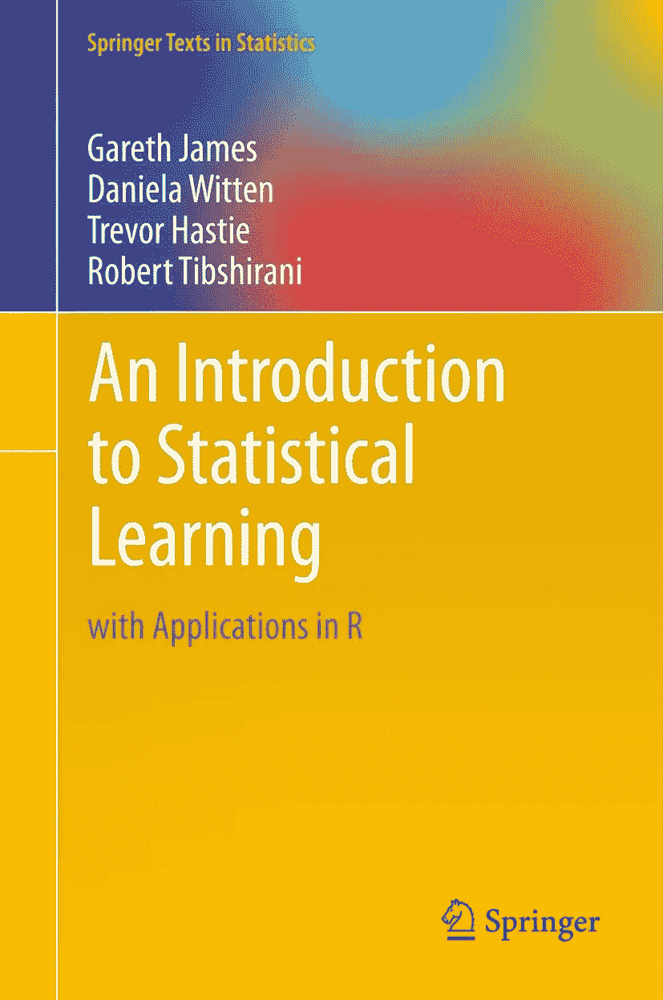
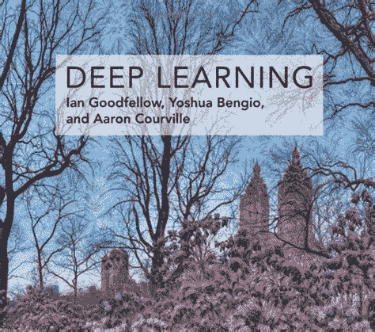
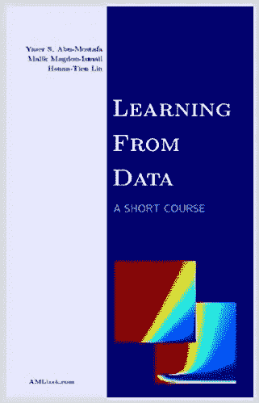
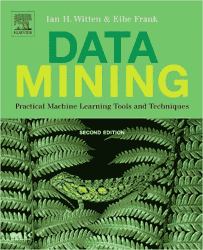
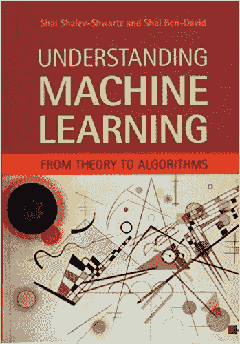
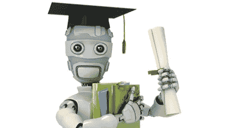
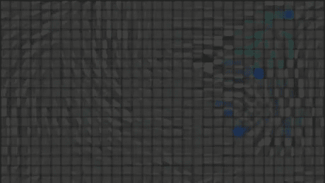
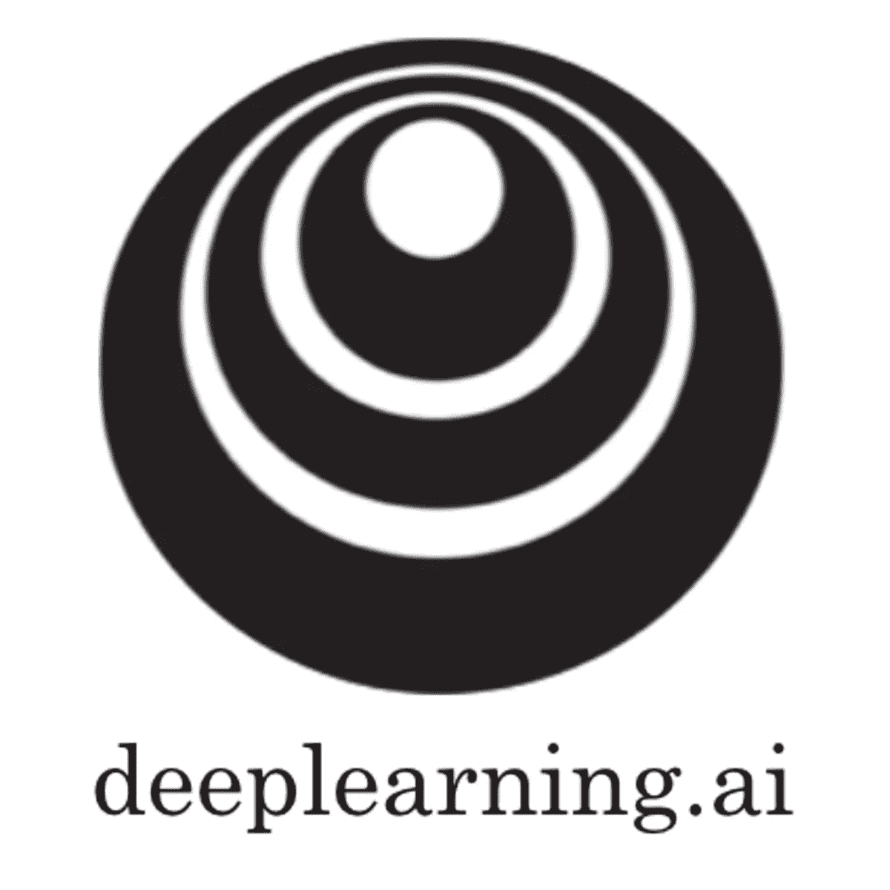

# 如何成为一名机器学习和深度学习工程师？

> 原文：<https://medium.datadriveninvestor.com/how-to-become-a-machine-learning-and-deep-learning-engineer-f0dbb62f1227?source=collection_archive---------3----------------------->

如果你在这里，那意味着你知道我们为什么需要机器学习和深度学习，以及人工智能科学在当今世界如何发展，所以你不需要我向你解释它们。所以我们先从资源介绍开始；)在这里我想和其他对机器学习和深度学习领域感兴趣的人分享我的一点经验和我在网站上的大量搜索，为这些朋友创建一个小小的路线图。

这里有一本好书的列表，并附有对它们的简要说明，你可以通过阅读来了解机器学习的基本知识:

## 机器学习:概率视角——凯文·墨菲撰写

这本书是机器学习世界中最昂贵(从科学角度来看)也是最有价值的书。它非常完整，几乎涵盖了机器学习的所有方面。这本书是以一种非正式的、容易理解的风格写的，用伪代码完成了最重要的算法。所有主题都用彩色图像和工作实例进行了丰富的说明，这些应用领域包括生物学、文本处理、计算机视觉和机器人学。

 [## 2019 年深度学习的终极学习路径及更多...-数据驱动型投资者

### 又一个美好的一周，一些好的教育内容将会到来。我最喜欢的&最受欢迎的帖子之一…

www.datadriveninvestor.com](https://www.datadriveninvestor.com/2019/01/07/the-ultimate-learning-path-for-deep-learning-in-2019-more/) 

但是它的缺点是，第一，太长了。它有 25 个沉重的章节。第二，需要对数学和统计学有深刻的理解。这本书使用了大量的线性代数，也使用概率模型和推理作为统一的方法。覆盖范围结合了广度和深度，提供了必要的背景材料，如概率，优化，线性代数等主题，以及讨论该领域的最新发展，包括条件随机场，L1 正则化和深度学习。如果你擅长这些领域，我强烈推荐这本书给你。

## 模式识别和机器学习——由克里斯托弗·毕晓普撰写

这是墨菲先生的书的简易版。这也是一本名著。它面向高年级本科生或一年级博士生，以及研究人员和从业人员。不需要预先了解模式识别或机器学习概念。

但熟悉多元微积分和基本线性代数是必需的，一些概率使用的经验将是有帮助的，尽管不是必要的，因为这本书包括基本概率论的自含式介绍。这本书适合机器学习，统计学，计算机科学，信号处理，计算机视觉，数据挖掘和生物信息学的课程。

## 《统计学习导论》——加雷斯·詹姆斯、丹妮拉·普伦德、特雷弗·哈斯蒂和罗伯特·蒂布拉尼

这本书提供了一个可访问的统计学习领域的概述，这是一个重要的工具集，用于理解从生物学到金融到市场营销到天体物理学等领域出现的大量复杂的数据集。这本书由十章组成，涵盖了复杂现实数据集的建模和挖掘工具。这种风格适合于本科生和研究人员，并且伴随每章的实践和理论练习有助于概念的理解。彩色图形和真实世界的例子被用来说明所提出的方法。由于这本教科书的目标是促进科学、工业和其他领域的从业者使用这些统计学习技术，每章都包含一个关于实现 R(一个非常流行的开源统计软件平台)中提出的分析和方法的教程。这本书很好地介绍了 r。书中介绍的所有统计方法的代码都得到了仔细的解释。

## 《统计学习的要素》——杰罗姆·h·弗里德曼、罗伯特·蒂伯拉尼和特雷弗·哈斯蒂

这本书在一个共同的概念框架中描述了这些领域中的重要思想。虽然这种方法是统计学的，但重点是概念而不是数学。给出了许多例子，大量使用了彩色图形。对于统计学家和任何对科学或工业中的数据挖掘感兴趣的人来说，这是一个有价值的资源。这本书的覆盖面很广，从监督学习(预测)到非监督学习。许多主题包括神经网络、支持向量机、分类树和 boosting。

## [深度学习在线书籍](http://www.deeplearningbook.org/) —由伊恩·古德菲勒、约舒阿·本吉奥、亚伦·库维尔撰写

深度学习是机器学习的一种形式，它使计算机能够从经验中学习，并根据概念的层次结构来理解世界。因为计算机从经验中收集知识，所以不需要人类计算机操作员正式指定计算机需要的所有知识。概念的层次结构允许计算机从简单的概念中学习复杂的概念；这些层次结构的图表可以有许多层。

这本书是对深度学习广泛主题的介绍，涵盖了数学和概念背景，工业中使用的深度学习技术，以及研究视角。因为这本书是由该领域的三位专家写的，所以它是关于这个主题的唯一一本综合性的书。Ian Goodfellow 是 OpenAI 的研究科学家；Yoshua Bengio 是蒙特利尔大学的计算机科学教授；亚伦·库维尔是蒙特利尔大学的计算机科学助理教授。

该文本提供了数学和概念背景，涵盖了线性代数，概率论和信息论，数值计算和机器学习的相关概念。*深度学习*可用于规划行业或研究职业的本科生或研究生，以及希望开始在其产品或平台中使用深度学习的软件工程师。

## 从数据中学习——作者亚塞尔·阿布·穆斯塔法

这本书，以及专门准备的读者可以免费访问的在线材料，提供了机器学习的完整介绍，这种技术使计算系统能够利用从观察到的数据中积累的经验来自适应地提高它们的性能。

作者是加州理工学院(Caltech)、伦斯勒理工学院(RPI)和国立台湾大学(NTU)的教授，这本书是他们机器学习热门课程的主要文本。

“从数据中学习”有着不同的理论和实践轨迹。在本书中，他们平衡了理论和实践，数学和启发式。建立学习概念框架的理论也包括在内，影响真实学习系统性能的试探法也包括在内。他们所强调的是必要的基础知识，这些知识给任何学习数据的学生打下了坚实的基础。

## 数据挖掘:实用的机器学习工具和技术——由 Ian H. Witten，Eibe Frank 撰写

这本书提供了机器学习概念的全面基础，以及在现实世界的数据挖掘情况下应用机器学习工具和技术的实用建议。

这本书是针对信息系统从业人员，程序员，顾问，开发人员，信息技术经理，规范作家，数据分析师，数据建模师，数据库 R&D 专业人员，数据仓库工程师，数据挖掘专业人员。这本书也将对希望将数据挖掘作为其数据管理知识库和专业知识的一部分的高水平本科生和研究生水平的数据挖掘和机器学习课程的教授和学生有用。

Chris Pal 加入了 Ian Witten、Eibe Frank 和 Mark Hall 的第四版，他在概率模型和深度学习方面的专业知识极大地扩展了这本书的覆盖范围。这本书继续提供它所描述的算法的 Weka 实现的参考。

## 理解机器学习:

从理论到算法——作者:Shai Shalev-Shwartz，Shai Ben-David

这本教科书的目的是以一种有原则的方式介绍机器学习，以及它所提供的算法范例。这本书提供了机器学习的基础理论和数学推导，将这些原则转化为实际的算法。在介绍了基础知识之后，这本书涵盖了以前的教科书没有涉及的广泛的中心话题。为高级本科生或初级研究生课程设计，该文本使机器学习的基础和算法对统计、计算机科学、数学和工程的学生和非专家读者是可访问的。这本书解释了自动学习方法背后的原则和它的使用背后的考虑。作者解释了最重要的机器学习算法的“如何”和“为什么”，以及它们固有的优势和弱点，使该领域对计算机科学，统计和工程的学生和从业者开放。

现在，这里有一个最佳 MOOCs 课程的列表，并附有对它们的简要解释，你可以通过它来学习机器学习的要点:

## [斯坦福机器学习【coursera.org 的 ](https://www.coursera.org/learn/machine-learning)

本课程是机器学习领域最先进的课程之一。它长达 11 周，包含动机视频和许多有趣的图表以及 ng 教授在讲座中播放的视频剪辑。通过这门课程后，你有能力从事机器学习算法方面的工作，或者在这个领域找到一份好工作。你的导师是吴恩达，斯坦福大学的兼职教授。在本课程中，您将了解一些最广泛使用且最成功的机器学习技术。你将有机会自己实现这些算法，并获得实践的机会。假设您熟悉基本的线性代数(矩阵、向量、矩阵向量乘法)和基本的概率(随机变量、概率的基本性质)，但是如果您不知道其中的任何一个，不要担心，您将在整个课程中再次复习它们。基础微积分(导数和偏导数)会很有帮助，会给你关于算法的额外直觉，但不是完全完成这门课程所必需的。本课程的另一个优势是，你将学习如何使用 Matlab/Octave 实现你的算法，之后，如果你想切换到 Python 这样的语言，你会对并发矩阵算术运算有直觉。此外，您还将学习一些解决算法问题的技巧，以及如何让算法更好地工作。

## [机器学习的神经网络【coursera.org ](https://www.coursera.org/learn/neural-networks)

本课程是吴恩达先生机器学习的伟大后续。在本课程中，您将学习人工神经网络以及它们如何用于机器学习，如应用于语音和对象识别、图像分割、建模语言和人类运动等。它既强调了基本算法，也强调了让它们正常工作所需的实用技巧。你的导师是杰弗里·辛顿教授(深度学习教父！)来自多伦多大学。材料更高级，你需要自己做大量的学习才能在这门课程中取得成功。无论是视频还是讲座幻灯片，材料的质量都非常好。一些本科水平的编程经验和数学知识有助于更好地获得直觉。但是要注意，材料有点难，你需要很强的动力才能通过这门课。这门课程长达 16 周。

## [深度学习专业化](https://www.coursera.org/specializations/deep-learning)coursera.org

另一个好的和有趣的课程，由吴恩达教授创建，以打入人工智能。它提供了实现神经网络和深度学习算法所需的所有基础知识和专业概念。你可以找到逻辑回归和计算图等的所有细节。

这个专业是 deeplearning.ai 项目，不是 coursera，但它可以在 coursera.org 上访问。在五门课程中，你将学习深度学习的基础，了解如何构建神经网络，并学习如何领导成功的机器学习项目。您将了解卷积网络、RNNs、LSTM、Adam、Dropout、BatchNorm、Xavier/He 初始化等等。你将从事医疗保健、自动驾驶、手语阅读、音乐生成和自然语言处理的案例研究。你不仅会掌握理论，还会看到它是如何应用于工业的。你将在 Python 和 TensorFlow 框架中实践所有这些想法，这些都会教给你。

这个专业化最有趣的部分是它对深度学习和机器学习领域知名人士的采访。吴教授采访了杰弗里·辛顿、伊恩·古德菲勒、彼得·阿比尔……他们将与你分享他们的个人故事并给你职业建议。

> 如果有更多你认为有用的书或课程，你可以提醒我用电子邮件把它们添加到这个列表中:soroush.hashemi76@gmail.com

我在这次旅程中的资源:

*   [https://www . book depository . com/Machine-Learning-Kevin-P-Murphy/9780262018029](https://www.bookdepository.com/Machine-Learning-Kevin-P-Murphy/9780262018029)
*   【https://www.springer.com/gp/book/9780387310732 
*   [https://books . Google . com/books/about/An _ Introduction _ to _ Statistical _ learning . html？id = qcI _ AAAAQBAJ&printsec = front cover&source = KP _ read _ button](https://books.google.com/books/about/An_Introduction_to_Statistical_Learning.html?id=qcI_AAAAQBAJ&printsec=frontcover&source=kp_read_button)
*   [https://www . Amazon . com/Introduction-Statistics-Learning-Applications-Statistics/DP/1461471370 # product description _ secondary _ view _ div _ 1524173311663](https://www.amazon.com/Introduction-Statistical-Learning-Applications-Statistics/dp/1461471370#productDescription_secondary_view_div_1524173311663)
*   【https://www.springer.com/gb/book/9780387848570 
*   [http://open classroom . Stanford . edu/main folder/course page . PHP？课程=机器学习](http://openclassroom.stanford.edu/MainFolder/CoursePage.php?course=MachineLearning)
*   [https://www.coursera.org/learn/machine-learning](https://www.coursera.org/learn/machine-learning)
*   [https://www . course talk . com/providers/coursera/courses/neural-networks-for-machine-learning](https://www.coursetalk.com/providers/coursera/courses/neural-networks-for-machine-learning)
*   [https://mitpress.mit.edu/books/deep-learning](https://mitpress.mit.edu/books/deep-learning)
*   [https://www.coursera.org/specializations/deep-learning](https://www.coursera.org/specializations/deep-learning)
*   [https://www . Amazon . com/Learning-Data-亚塞尔-S-阿布-穆斯塔法/dp/1600490069](https://www.amazon.com/Learning-Data-Yaser-S-Abu-Mostafa/dp/1600490069)
*   [https://www . goodreads . com/book/show/15706459-从数据中学习](https://www.goodreads.com/book/show/15706459-learning-from-data)
*   [https://www . Amazon . com/Data-Mining-Practical-Techniques-Management/DP/0123748569 # product description _ secondary _ view _ div _ 1524426774740](https://www.amazon.com/Data-Mining-Practical-Techniques-Management/dp/0123748569#productDescription_secondary_view_div_1524426774740)
*   [https://www.cs.waikato.ac.nz/ml/weka/book.html](https://www.cs.waikato.ac.nz/ml/weka/book.html)
*   [https://www . Amazon . com/Understanding-Machine-Learning-Theory-Algorithms/DP/1107057132 # product description _ secondary _ view _ div _ 1524427680165](https://www.amazon.com/Understanding-Machine-Learning-Theory-Algorithms/dp/1107057132#productDescription_secondary_view_div_1524427680165)