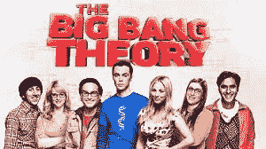
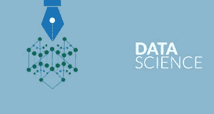
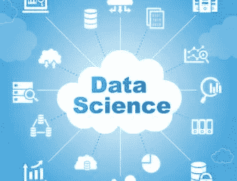
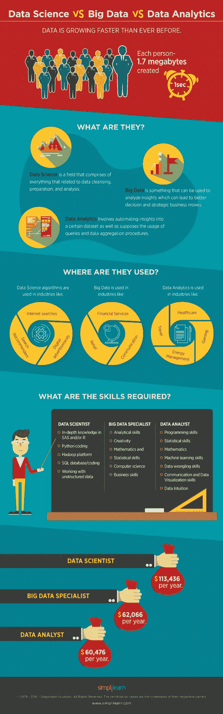

# 如何在 6 个月内进入数据科学:我的明星之旅

> 原文：<https://medium.datadriveninvestor.com/how-to-become-a-top-data-scientist-in-6-months-my-journey-and-experience-83a05b5fe167?source=collection_archive---------0----------------------->

我来自律师、经济学家、医生和心理学家的家庭。我妈妈和我哥哥他们非常聪明，但是我绝对相信他们不知道我是做什么的。

保罗·欧内斯特(Paul Ernest)说: (埃克斯特大学)“数学的一个广泛的公众形象是，它是困难的、冷酷的、抽象的、理论化的、超理性的，但却是重要的，而且很大程度上是男性化的。它还有一种形象，即除了少数具有“数学头脑”的超级智能生物之外，所有人都无法接触到它……与文盲所带来的耻辱相反，在西方英语国家，算术几乎是受过教育的人引以为豪的事情”。

从我的个人经历来看，似乎坐在我旁边的每个人都有一个故事，讲述他们在统计方面有多么糟糕，以及他们如何在大学所有的考试中作弊。不懂数学似乎很酷。如果你知道，那么你很可能就是《生活大爆炸》里的谢尔顿。那个电视节目中的角色在数学方面很有天赋，他们被描绘成可爱的书呆子，我们嘲笑他们的互动和他们解决问题的方式，但对这个国家的许多人来说，数据科学家就是这个样子，所以我们中的一些人和他们一起笑，但许多人嘲笑他们，所以这对我们没有帮助。

当我在一月份开始我的旅程时，我真的没有想到我会如此热爱数据科学。我可以说现在数据科学是为我设计的。这绝对是我梦寐以求的职业，但我不知道还有这种职业。它融合了经济学、数学、统计学、编程语言、市场营销和心理学。除此之外，我喜欢写数据科学方面的技术文章，并帮助其他人。正如我的老师基里尔·叶列缅科在《你的数据科学之路》中所说，写一些关于技术和区块链技术的东西是非常重要的。我的导师 Slavo 告诉我，我可能会在 6 月份得到数据科学的实习机会，而不是在 2 月份得到数据分析师的工作！！对我来说这是一次疯狂的旅程。到目前为止，我已经使用 Tableau、Google Data Studio、Analytics 等工具完成了几个项目。这些天我也开始使用 Python，学习所有关于 ML、DL、AI 和区块链的知识。我现在正在开发我的第一个区块链。我在之前工作的公司有几个项目。几天前，我开通了一个工作账户，并立即在一家美国公司找到了一份数据可视化的兼职工作。

# 我决定辞去前一家公司的工作，兼职为贝尔格莱德一家令人惊叹的 IT 公司撰写技术文章，其余时间与 Kirill 和 Hadelin 一起学习数据科学课程。我的计划是学到九月，并在途中练习。我知道这很难做到，但我知道我能做到。我对数据科学的热情是巨大的，我一生中从未有过这样的感觉。九月，我将成为一个了不起的数据科学团队的一员。机会就在那里，我只需要明智地利用它。

我现在在学区块链，Sql，数据科学和机器学习 Bootcamp 的 Python，机器学习 A-Z:数据科学的 Python & R 手动，深度学习 A-Z:人工神经网络手动。我的导师斯拉沃告诉我，在此之前的一切都只是为重要的事情热身。以下是我的教程。我必须在 31 之前完成它。八月。

 [## SQL 和数据库设计 A-Z:学习 MS SQL Server + PostgreSQL

### 在实践中学习 SQL Server 和 PostgreSQL。通过真实世界的数据科学练习提升您的数据分析职业生涯

www.udemy.com](https://www.udemy.com/sqldatabases/learn/v4/t/lecture/6220534?start=0)  [## 区块链 A-Z:了解如何构建您的第一个区块链

### 通过现实生活中的例子，利用自互联网以来最具颠覆性的技术的力量！主区块链…

www.udemy.com](https://www.udemy.com/build-your-blockchain-az/)  [## Python 用于数据科学和机器学习训练营

### 了解如何使用 NumPy、Pandas、Seaborn、Matplotlib、Plotly、Scikit-Learn、机器学习、Tensorflow 等等！

www.udemy.com](https://www.udemy.com/python-for-data-science-and-machine-learning-bootcamp/learn/v4/t/lecture/5440650?start=0)  [## 深度学习 A-Z:动手操作的人工神经网络

### 向两位机器学习和数据科学专家学习用 Python 创建深度学习算法。模板…

www.udemy.com](https://www.udemy.com/deeplearning/learn/v4/t/lecture/6743222?start=0)  [## 机器学习 A-Z:数据科学中的 Python & R 实践

### 向两位数据科学专家学习用 Python 和 R 创建机器学习算法。包括代码模板。

www.udemy.com](https://www.udemy.com/machinelearning/learn/v4/) 

我每天都在使用 Tableau，并试图掌握它。现在我的专长是在 Tableau。我也在浏览这些教程:

 [## 数据科学的颜色 A-Z:数据可视化颜色理论

### 了解如何应用色彩理论来改进您的数据科学和分析数据可视化和演示

www.udemy.com](https://www.udemy.com/colordata/)  [## Tableau 专家:Tableau 10 中的顶级可视化技术

### 成为 Tableau 10 - Master 可视化技术的专家，包括桑基图、中提琴图等

www.udemy.com](https://www.udemy.com/mastering-top-visualization-techniques-in-tableau/)  [## Tableau 访谈问答:数据科学职业 Tableau

### Tableau 面试问题，最大化你获得数据分析或 Tableau 开发人员或分析师工作的机会

www.udemy.com](https://www.udemy.com/tableau-interview/) 

我将开设 Kaggle 帐户，并尝试与世界各地的其他数据科学家竞争。所以祝我好运吧。我打开 Quora，回答关于数据科学的问题。我还开通了我的第一个 YT 频道，下周我将录制我的第一个如何使用 Tableau 的教程和我的数据科学之旅节目。除此之外，我还开设了名为游击营销大师班课程。这是塞尔维亚的第一门课程，我们在这里谈论和学习游击营销和营销中的数据科学。它仍然是第一版，但我正在开发第二版，将于九月发布。

我为什么要这么做？因为我相信掌握一件事的最好方法是从理论上学习，在商业上实施，并把你的知识传播给其他人。

另外，当我完成所有这些之前的教程时，我想给你我的愿望清单。所以这将是我从 9 月 1 日开始的道路:

 [## 深度学习和 NLP A-Z:如何创建聊天机器人

### 学习理论以及如何在 Tensorflow 和 Python 中实现最先进的深度自然语言处理模型

www.udemy.com](https://www.udemy.com/chatbot/)  [## 深度学习和计算机视觉 A-Z:OpenCV、SSD 和 GANs

### 成为所有现有最新计算机视觉工具的向导。检测任何东西并创建强大的应用程序。

www.udemy.com](https://www.udemy.com/computer-vision-a-z/) 

# 直到下一篇博客快乐分析，

# 曼亚

# 你可以在 [Linkedin](http://www.linkedin.com/in/manjabogicevic/) 和 [Instagram](http://www.instagram.com/manjabogicevic/) 上关注我了解更多故事。

页（page 的缩写）我正在开发一个网站，在那里你会发现关于数据科学和区块链的有趣的事情。:)

