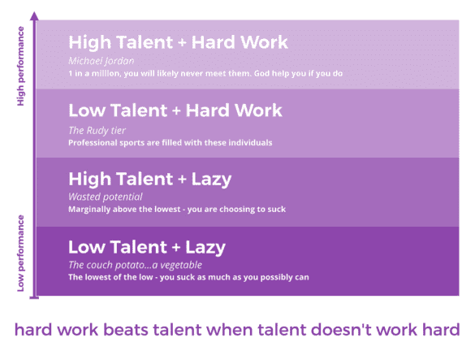
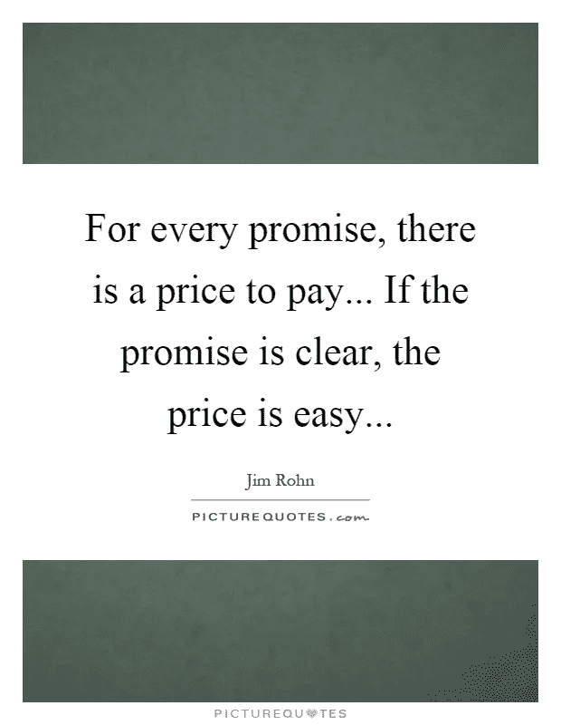
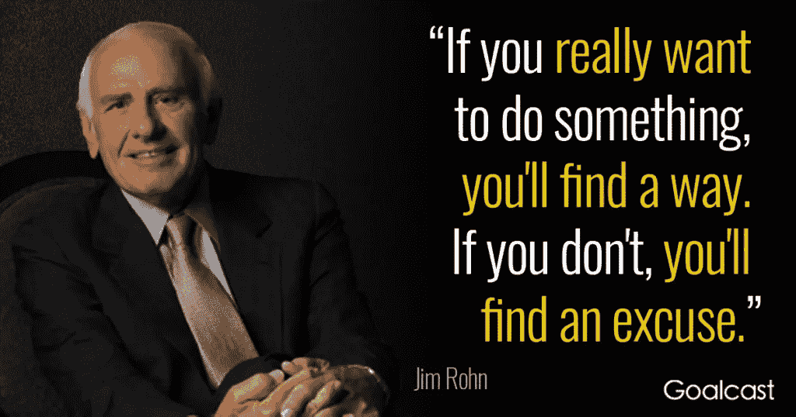

# 如何获得财务自由

> 原文：<https://medium.datadriveninvestor.com/how-to-become-financially-free-1b486d4c45aa?source=collection_archive---------0----------------------->

Photo by rawpixel on Unsplash

我已经做了 20 多年的人力资源从业者。招聘和解雇是我工作的一部分。我喜欢关于雇佣的部分。但是我总是讨厌开枪的部分。

在我放走的每个人背后，我知道这不仅会对那个人的经济和心理产生连锁反应，也会对他们的家庭产生连锁反应。

随着时间的推移，解雇员工已经开始让我感到厌烦。

这迫使我反思，我是否真的想在另一个人和公司的摆布下生活。毕竟，我可能是被解雇的人之一。

我决定不。

我决定永远不要完全依赖一种收入来源。2016 年 4 月，我决定开始努力创造多种收入来源。

我仍然喜欢在公司工作。我喜欢有固定收入并和同事一起工作的想法。但我也知道，我从来不想把我整个家庭的生活和幸福交到另一个人或公司的手中。

为了做到这一点，我必须在经济上获得自由。

但首先，让我们明白什么是财务自由。

# 财务自由的定义

每个人对财务自由的定义都不一样。

有些人想要像不需要工作一样工作，有些人想要经常旅行，有些人想要能够资助孩子的教育，还有一些人想要在 30 岁之前退休，或者能够慷慨地为他们所爱的人提供帮助。

然而，有一点是肯定的，财务自由并不意味着拥有无限的金钱。任何怀有这种希望的人都不会看到它实现，不管你有多富有。

即使你赚的钱比你知道怎么花的还要多，如果你不知道怎么处理，你也会很快失去它。看看这 18 位曾经名利双收却倾家荡产的名人吧。

所以我开始了我的旅程，去弄清楚财务自由到底是怎么一回事。我发现其他志同道合的人过着财务自由的生活。他们不一定是物质上最富有的人，但他们肯定过着富裕的生活。

我注意到他们做了三件不同的事情。

# 如何获得财务自由

# #1.获得正确的心态

我从财务自由的人身上学到的是他们的心态和他们与金钱的关系。

互联网上个人理财博客的数量在几千到几万之间——这取决于你看的是哪种统计数据。事实是，有很多个人理财博客和专栏。

但是，事实仍然是——金钱是人们继续着迷的三大话题之一，仅次于性和减肥。

为什么？

我喜欢布拉德和泰德·克朗茨关于金钱话题的解释。他们称之为金融心理学。

金融心理学背后的理念是，仅靠金融建议不足以改变破坏性的金融行为。如果是这样的话，更多的人将没有债务，拥有幸福的婚姻。

相反，[消费者债务处于历史最高水平](https://www.cnbc.com/2018/05/21/consumer-debt-is-set-to-reach-4-trillion-by-the-end-of-2018.html)，[金钱和财务问题仍然是离婚的头号原因](https://www.independent.co.uk/news/business/news/money-marriage-end-divorce-day-relationships-personal-finances-slater-gordon-a8147921.html)。

布拉德和特德·克朗茨在他们的书《金钱至上 [**】中谈到了金融热点和金钱脚本在我们与金钱的关系中发挥的关键作用。正是这些金钱剧本导致我们对金钱有不健康的行为，阻止我们实现财务自由。**](https://amzn.to/2MGSxXI)

# 金融热点、货币脚本和货币混乱

*金融热点*是与金钱相关的重要经历或影响，比如我们的家庭。我们的家庭有意无意地传递着关于金钱的信息。我们对金钱的印象也受到经济事件和我们文化的影响。

这些金融热点塑造了我们对金钱的假设和信念，金钱意味着什么以及它是如何运作的，这成为我们的*金钱剧本*——我们头脑中关于金钱的自我对话。

结果是，我们中的一些人患上了金钱失调症，或者对金钱不健康的行为。

财务自由的人已经找到了他们的财务爆发点，金钱脚本，并解决了他们对待金钱的不健康行为。

在他们的书中，Brad 和 Ted Klontz 通过练习来帮助你识别和处理你的金钱脚本和破坏性的财务行为。

简而言之，关键的步骤是首先意识到你的金钱脚本和金钱紊乱。然后重写你的金钱脚本，逐渐改变你不健康的金钱行为。要做到这一点，你需要制定策略来改写你的现实。

# 一个个人的例子来说明

我伴随着男人应该为妻子提供的金钱剧本长大。做一个全职妈妈是男人和她自己作为女人的终极地位象征。

这也意味着妇女完全依赖她们的丈夫。这意味着他们也可能陷入不幸的婚姻，因为他们没有经济独立。

虽然我摆脱了经济上对丈夫的依赖，但我仍然坚持金钱原则，我希望他能为家庭提供全部，或者至少比我多。当我开始挣得比我丈夫多时，我怨恨他，这给我们的婚姻带来了压力。

直到我意识到我的金钱剧本，并重新定义了我对丈夫真正重要的概念，我们才努力让我们的婚姻更加牢固。

# #2.努力工作

我跟踪研究成功人士已经有一段时间了。

取得成功的人不是一夜之间就能成功的。

除了学习金融、投资和储蓄的基础知识，我还探索了如何在朝九晚五的工作之外创造其他收入来源。

为了赚取多种收入来源，我必须向人们提供价值，让他们乐意并心甘情愿地放弃他们辛苦赚来的钱，为我的产品和服务付钱。

为了做到这一点，我需要研究和了解我服务的人，与他们交谈并接触他们，与有影响力的人发展关系，确保我发布的任何东西都是最高质量的，并不断思考我还可以如何为我的目标受众服务，等等。

换句话说，很多很多的艰苦工作。

# 努力工作总会打败懒惰的天才

我喜欢 [Alex Kouts](https://twitter.com/akouts?lang=en) 每次用他的鲁迪图表描述努力工作如何击败有天赋但懒惰的概念，就像在[乔丹先锋秀上讨论的那样。](https://www.jordanharbinger.com/alex-kouts-the-secrets-you-dont-know-about-negotiation-part-one/)

亚历克斯·库特的鲁迪图表来自乔丹先驱秀

你们当中那些对成功所需要的高强度艰苦工作感到厌烦的人，也许现在应该停止阅读了。

对于我们这些愿意努力工作的人来说，好消息是，即使你没有什么天赋，你仍然远远超过那些有天赋但懒惰的人。

# #3.明白有“取舍”，也称为“选择”

有人说你可以拥有生活中任何你想要的东西。还有人说，人生不能事事如意。

为了过上财务自由的生活，我从富足和选择的位置开始，而不是匮乏和受害者思维——生活“发生”在我身上，而不是我“创造”我想要的生活。

这是一个视角的问题，而不是一个杯子半空或半满的问题。“半杯”甚至不在我的考虑范围内，因为我更愿意认为我的杯子是完全满的。

这就是我选择采用的富足心态。为了开始培养这样的心态，我开始练习[正念感恩日记。](https://blog.mindvalley.com/gratitude-journal/)

在我努力还清债务的时候，有一份固定的薪水对我来说很重要。但这并不妨碍我兼职做多种收入来源。

权衡？

早上 5 点开始我的一天，在 6:30 开始我一天的工作之前，先做我的副业。

我花时间努力工作，研究和验证想法，通过写作、会见和与人交谈来建立我的信誉和社会证明。这对我来说很难，因为我比较内向。

像许多其他人一样，作为一个全职工作的妻子和两个年幼孩子的母亲，我的时间也很紧张。

但是只要我能找到的时间，我都会挤出来——清晨、午休时间、每天的通勤时间等等。尽我所能开发我的其他收入来源。

我不断把自己推出自己的舒适区。这些是我为创造我想要的生活方式而做出的选择。

我们大多数人都忘记了做出选择的特权和自由。相反，当我们采取受害者的心态，说我们“除了……别无选择”时，我们就放弃了这种力量。如果每次我听到有人这么说，我都能得到一美元，这本身就会创造另一个收入来源！

# 结论

财务自由就是拥有你想要的生活方式。

这不是希望或希望就能实现的，而是进入正确的心态，努力工作(大量工作)，做出能让你达到目标的选择。

这些选择可能会在短期内涉及权衡取舍，这样你就可以实现你长期追求的生活方式。

耐心和努力工作是基本要求，因为真的没有一夜暴富的东西，除非你继承遗产，而我们大多数人都没有。

那么，你是想过上财务自由的生活，还是想在余生中告诉自己“别无选择”,但却被困在日常琐事中？

选择权在你。

# 与我联系

如果你喜欢你读到的内容，请订阅我的博客[这里](https://twopointzero.me/)接收更新，并收到我的免费电子书《忙碌的人的 12 个聪明的理财习惯》，其中还包含下载我的免费电子书《**勇敢点，要你想要的:要你值得的钱的指南**》的链接。

*原载于 2018 年 9 月 2 日*[*www . two point zero . me*](https://twopointzero.me/financially-free/)*。*

