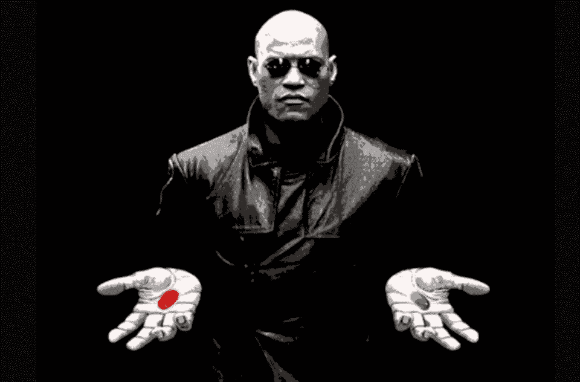
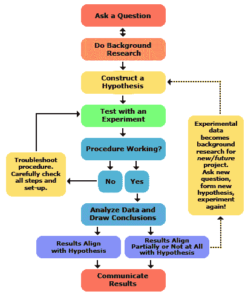

# 如何用数据科学从母体变成 Neo

> 原文：<https://medium.datadriveninvestor.com/how-to-become-neo-from-the-matrix-with-data-science-47ac4ab9b54e?source=collection_archive---------7----------------------->

Be unique, be creative, be different.

# 科技兔子洞到底有多深？

人们经常把技术革命和信息时代说成是某种进入另一个维度的科幻突破。他们听起来好像人类终于打开了潘多拉魔盒，找到了进化的圣杯，这将把我们提升到某种下一层次的存在，这是我们自大约 6000 年前现代文明诞生以来从未经历过或无法想象的。像“**大数据”、“人工智能”、“机器学习”、“算法”**等等这样的流行语，每天在我们的新闻提要上弹出数百次，让我们感觉自己是一个如此先进的种族。有些人说，我们可能在几年内根除 99%的致命疾病，其他人则在谈论将人类意识上传到合成身体，这样我们就可以永远活着，我相信我们都听说过埃隆·马斯克的理论，即人工智能将在 10-15 年内接管很大一部分工作，很大一部分人可能最终依靠普遍收入生活，享受生活，而人工智能正在昼夜不停地执行自动化任务，没有睡眠，误差非常小。**无人驾驶汽车**将降低人为错误和事故的发生率，当我们在上班的路上在驾驶座上小睡片刻，或者在车里练习一些椅子瑜伽，以保持我们的身心年轻健康。**那么，我们是不是应该坐以待毙，享受这段旅程，等待人工智能的奇迹发生？换句话说，技术革命能保证我们预测未来的所有这些激动人心的科学突破吗？**

> 简而言之，这要由我们所有人来决定！

There is always a choice and it is up to us to make it…

# 每个人都可以获得相同的信息。那么，你打算用它做什么，与众不同？

> 你愿意这样做吗？

Be like everyone else…

> 还是这个…？

Be unique and believe in yourself!

让我们来想想历史上几个标志性的创新者，也被称为“天才”，并试图找到他们之间的共同联系，以及为什么他们能够在各自的领域取得重大突破。文森特·范·高夫和他那个时代的每个人一样，可以使用相同的画布和相同的颜色和类型的颜料，但使他的艺术与众不同的是他将它们结合起来的独特方式，以及通过他自己的想象力和创造力的独特视角来看待世界。阿尔伯特·爱因斯坦和其他人一样可以接触到相同的书籍和公式，但也是他独特的看待事物的方式和他自由的思想让他突破了想象的界限，提出了他的相对论。他下面最著名的一句名言就是这样诞生的:

> “想象力比知识更重要”

我可以列举更多的例子，比如**巴勃罗·毕加索(**“当我用完红色时，我用蓝色”**)、尼古拉斯·特斯拉、埃隆·马斯克、**。但我想说的是，在所谓的技术革命之前的许多年，就有许多革命性的科学发现和发明以及许多天才的艺术诞生了。所以，这不仅仅是关于工具和数据，而是关于以一种独特的方式使用它们。能够跳出框框思考，通过自己的想象力和创造力来看待这个世界，将有助于你提出独特的问题，探索抽象的想法。当谈到**改变世界的人**——无论是他们的艺术、科学、哲学、宗教还是领导力——他们都有一个共同点——他们有足够的想象力、疯狂和勇气潜入未知的海洋，挖掘超过 99%的人敢于挖掘的深度。

# **这叫数据科学，不是数据拼字游戏……**

> “没有计划的梦想只是一个愿望……”

**想象力和创造力**在试图**提出一个原创的想法和提出有趣的问题**时发挥着巨大的作用。大多数重大的科学突破都是从抽象的哲学概念或需要检验的独特假设开始的。

> 这就是科学变得更像一门艺术的地方…但只是一分钟…然后它很快从白日梦中挣脱出来，又变成了科学！

一旦你带着你独特的想法从你的白日梦或迷幻药之旅(是的，在谷歌、脸书，甚至在传统上更保守的地方，如华尔街，有一个迷幻药微量给药小组)回来，是时候卷起袖子，开始制定一个可靠的计划，寻找必要的数据，让你进行分析，测试你的假设，并回答你独特的问题。

如果没有一个坚实的计划和实现天才潜能的过程，成为天才本身就毫无意义。想一想你们每个人一生中有多少天才的想法？)你从未试图系统地追求，最终只是消失在虚空中……两年后，你听说有人实现了你的想法，赚了十亿美元。也许有时候所有的拼字游戏都会为你到位，所以你可以“即兴发挥”,让你的实验不需要太多的准备和有条不紊的计划。但大多数情况下，这可能行不通。这就是**科学方法**发挥作用的地方！

# **科学方法**

那么，我们来谈谈科学的方法。一切都从一个问题开始…

The Scientific method

因此，以下是我对大家的几点建议:

1.  不要害怕做自己，让你的独特性和创造力引导你进行科学探索。你可以用数据来表达自己，就像用绘画、动作或乐器一样。
2.  **大胆思考，跳出框框**——如果一个想法听起来太疯狂太可怕，那么它很可能值得追求！你可能会有所成就，所以如果你相信它，就要有勇气去追随它，不管其他人怎么说。
3.  **有一个坚实的行动计划**——使用科学的方法，严格遵循你的过程。大多数人起初不会相信一个革命性的想法，直到你用数据支持它，并试图用假设检验和科学方法来证明它。
4.  不要害怕失败——一次又一次地犯错只是旅程的一部分。大多数重大的成功都是建立在无数微小失败的坚实基础上的。
5.  **改变你的视角来改变世界！！！**