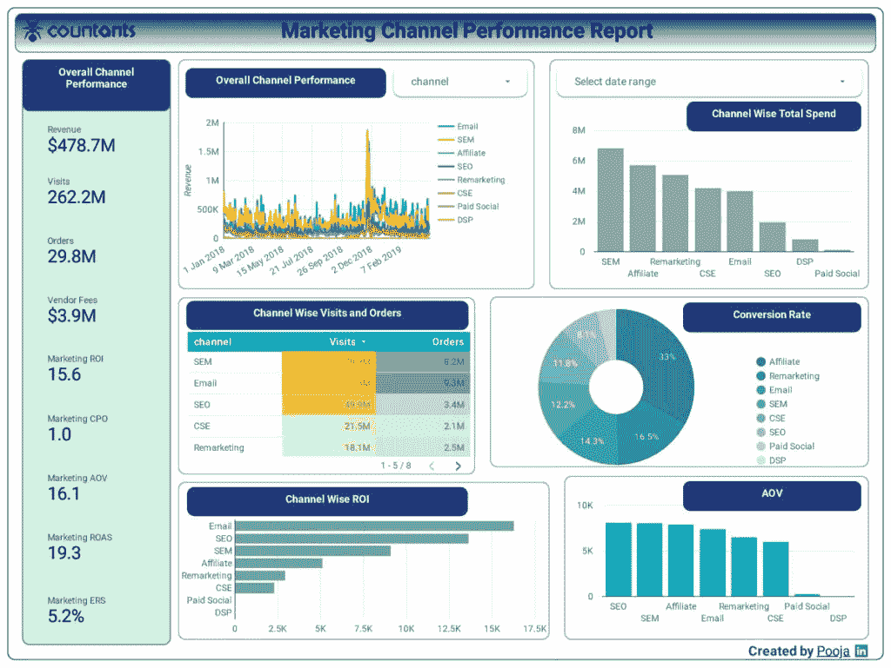

# 如何使用谷歌分析嵌入 API 工具建立一个仪表板

> 原文：<https://medium.datadriveninvestor.com/how-to-build-a-dashboard-using-google-analytics-embed-api-tool-a28c4be75dc7?source=collection_archive---------2----------------------->

随着数据可视化工具的出现，您可以轻松地将各种数据源嵌入到业务的用户友好仪表板中。[数据可视化](https://www.countants.com/blogs/data-visualization-how-it-is-going-to-evolve-into-the-future/?utm_medium=social&utm_source=Medium&utm_campaign=Traffic)改变了任何业务用户查看各种数据点并从中获得宝贵见解的方式。

你是否使用谷歌分析工具来监控你的网站流量以及用户访问最多的网页？然后，是时候将实时谷歌分析数据嵌入到您的业务仪表板中了。

那么，使用[谷歌分析仪表板](https://neilpatel.com/blog/google-analytics-dashboards)有什么商业好处呢？你如何将谷歌分析数据包含在你的仪表盘中呢？我们将在余下的章节中给出答案。

# 什么是谷歌分析 API 仪表板？

也称为 Google Analytics Embed API，Google Analytics API 是一个流行的 JavaScript 库，可用于在任何网站上创建和嵌入 Google Analytics 仪表板。作为一名数据分析师，您可以使用 Google Analytics Embed API 构建一个仪表板，该仪表板使用一组可以插入任何仪表板的多个组件。

 [## 雅虎财经 API |数据驱动投资者的 6 种替代方案

### 长期以来，雅虎金融 API 一直是许多数据驱动型投资者的可靠工具。许多人依赖于他们的…

www.datadriveninvestor.com](https://www.datadriveninvestor.com/2019/02/25/6-alternatives-to-the-yahoo-finance-api/) 

为什么 Google Analytics Embed API 库如此受开发者欢迎？以下是它的一些功能:

*   仪表板用户轻松访问 Google Analytics 登录帐户。
*   Google Analytics 源数据仪表板的多个视图，便于您轻松比较业务分析数据。
*   易于与谷歌图表工具集成，提供任何谷歌分析工具中看到的数据可视化。
*   允许使用第三方数据可视化工具，包括 D3.js 和 Chart.js。
*   构建您自己的 JavaScript 组件，以便于共享和重用。

那么，Google Analytics API 仪表板是如何实现更好的数据分析和跟踪的呢？让我们在 Google Analytics Embed API 教程的下一部分回答这个问题。

# Google Analytics API Dashboard 如何让数据分析和跟踪受益

Google Analytics Embed API 库通过以下功能实现了更好的数据分析和跟踪:

## 创建基本仪表板

它允许开发人员创建和呈现一个基本的仪表板，其中包含图表数据，如特定时间段内的网站流量。此外，您可以从任何 Google Analytics 视图更新这些数据。

它允许开发人员创建和呈现一个基本的仪表板，其中包含图表数据，如特定时间段内的网站流量。此外，您可以从任何 Google Analytics 视图更新这些数据。

例如，这个[“流量跟踪”](https://www.countants.com/services/cloud-visualization/traffic-tracking-dashboard/?utm_medium=social&utm_source=Medium&utm_campaign=Traffic)仪表盘还提供了对网站流量各种来源的数据洞察。

## 提供内置的用户交互性

带有交互式图表的 Google Analytics API 仪表板允许用户更深入地探索数据，并识别基于数据的模式和趋势。其中一个功能是能够在一个图表上应用过滤器，并向下钻取图表元素以打开另一个具有相同过滤器的图表。

## 创建您自己的定制组件。

您可以使用 Google Analytics Embed API 及其集成的内置组件轻松构建仪表板。此外，您可以使用 Google Analytics API 创建自己的定制组件，以获得更多便利和功能。

此外，通过使用

## 启用仪表板的多个视图。

Google Analytics 工具不支持业务数据的多视图或并排视图。然而，同样可以使用 Google Analytics Embed API 库来实现。

例如，由 Google Analytics API 提供支持的 Google Analytics 电子表格附加工具允许您使用多个视图发布查询和报告数据。

## 监控多个谷歌分析帐户。

在这个 API 库的支持下，Google Analytics dashboard 可以通过一个集中的视图来监控多个 Google Analytics 帐户。如果您为一个或多个客户端管理多个 Google Analytics 帐户，此功能尤其有用。

以下仪表板显示了此功能的一个示例，您可以在同一视图中同时查看不同帐户的网站。

*想知道如何创建一个仪表板来跟踪多个 Google Analytics(或 GA)来源吗？让我们在下一节中对此进行研究。*

# 如何跟踪多个谷歌分析来源的表现

如前所述，您可以使用 Google Analytics API 库构建一个仪表板，该仪表板可以分析和可视化来自多个 GA 帐户的数据。这些仪表板可以有效地跟踪绩效指标，如转化率、点击链接或来自多个数据源的任何与活动相关的绩效。

例如，下面的[“营销绩效”](https://www.countants.com/services/cloud-visualization/marketing-performance-dashboard/?utm_medium=social&utm_source=Medium&utm_campaign=Traffic)仪表板提供了对不同营销渠道的绩效衡量的洞察。

同样，衡量你从脸书、Twitter 或 YouTube 等流行社交媒体渠道获得的流量，可以确定哪个平台最适合你的商业模式。

要连接和分析来自多个来源或帐户的 Google Analytics 数据，您需要按顺序执行以下步骤:

1.  通过 Google BigQuery 和 SQL 连接 Google Analytics 数据，检查任何新的 ViewIDs。
2.  将 GA 数据上传到 Google 云存储。
3.  将 GA 数据导出到 Google BigQuery。
4.  使用 Cloud Scheduler 或 Airflow 运行调度脚本。

现在让我们详细讨论这些步骤。

## 通过 Google BigQuery 和 SQL 连接 Google Analytics 数据，检查任何新的 ViewIDs。

作为第一步，您可以使用 GA 报告工具中的 BigQuery 连接器将 GA 数据连接到 Google BigQuery。这一步对于检查任何用于数据检索的 Google Analytics ViewID 是必要的。

1.  使用任何基于 Python 的应用程序或脚本工具，将您的 GA ViewID 表上传到 Google BigQuery。
2.  使用相同的工具，通过一个定制的 SQL 查询检查 Google 工作表中任何新的 ViewID 更新。您可以通过 BigQuery 连接将自定义查询直接输入任何报告工具。创建自定义查询的示例如下所示。
3.  执行 SQL 定制查询来更新 Google Sheets 中所有新的 ViewIDs(来自多个 GA 数据源)。

## 将 GA 数据上传到 Google 云存储。

下一步旨在获取 GA 数据并将其上传到 Google 云存储。您需要自动化这个过程，因为查询时间更新本质上是动态的，因此需要每天更新。这个需求使得它适合在云平台上执行，因为一旦数据可用，您就可以自动触发需求(而不是根据时间表)。

除了存储万亿字节的数据，谷歌云存储是与谷歌数据存储分析链接的理想平台。

1.  使用任何 Python 脚本工具获取谷歌分析数据并上传到谷歌云存储。这可以通过编写任何身份验证脚本来完成。

对于身份验证脚本，您可以使用 Google App Engine 作为后端服务器。

1.  当 Google Sheet 收到一个新的 ViewID 时，后端配置文件会自动更新为前 3 个月检索到的 ViewID 数据。

此外，每天的数据更新会在 Google Sheet 中自动更新。

1.  使用任何基于 Python 的应用程序或脚本工具，将您的 GA ViewID 表上传到 Google BigQuery。

## 将 GA 数据导出到 Google BigQuery

下一步是将 Google 分析数据导出到 Google BigQuery。使用 BigQuery 的优势在于，您可以为您的网站或移动应用程序实现大数据分析工具。另一个优点是，您可以在任何您希望的平台上实现数据可视化。

要执行这一步，您需要做的就是编写一个 Python 脚本，该脚本可以将 GA 数据从 Google App Engine 环境中的 Google 云存储上传到 BigQuery。

## 使用 Cloud Scheduler 或 Airflow 运行调度脚本。

最后一步是使用云调度器或 Airflow 来调度所有作业在特定时间运行。该步骤旨在对所有计划作业执行端到端测试，并验证 GA 数据。

# 结论

得益于易用性和广泛功能的结合，使用 Google Analytics Embed API 构建仪表板可以将您的数据分析和可视化提升到一个新的水平。

凭借其在云计算分析和[可视化](https://www.countants.com/blogs/5-data-visualization-techniques-that-you-should-start-using-now/?utm_medium=social&utm_source=Medium&utm_campaign=Traffic)工具方面的专业知识，Countants 帮助其客户做出了更好、更明智的商业决策，从而改变了他们的业务。

在不断发展的市场环境中，Countants 的定制数据解决方案为不同行业领域的企业提供了竞争优势。

你想探索你的企业如何利用谷歌分析数据吗？[今天和我们连线](https://www.countants.com/contact-us/?utm_medium=social&utm_source=Medium&utm_campaign=Traffic)！