# 如何与 Julia 一起从零开始构建深度神经网络:

> 原文：<https://medium.datadriveninvestor.com/how-to-build-a-deep-neural-network-from-scratch-with-julia-862116a194c?source=collection_archive---------0----------------------->

## 了解如何使用 Julia 以高效的方式构建一个功能齐全的深度神经网络。

[深度学习](https://en.wikipedia.org/wiki/Deep_learning)是**人工智能**最有前途的领域，在从计算机视觉到自然语言处理等领域都取得了成功。在本文中，你将学习**如何在没有任何领域知识的情况下构建一个神经网络。**

## 要求:

*   **线性代数**
*   **基础微积分**
*   **编程**

 [## 机器学习的外汇交易挑战|数据驱动的投资者

### 机器学习是人工智能的一个分支，之前占据了很多头条。人们是…

www.datadriveninvestor.com](https://www.datadriveninvestor.com/2019/02/18/the-challenge-of-forex-trading-for-machine-learning/) 

## 什么是神经网络？

神经网络(NN)可以定义为一个**计算系统**，它从数据中学习模式，试图模仿生物神经元如何共享信息。一个神经网络由一个输入层、 **L** 个隐含层和一个输出层构成。

Neural Network with a single Hidden Layer

每一层都由**神经元**组成。每个神经元都有两组参数，**权重和偏差**，在讨论我们的实现后，它们的功能将变得更加清晰。

当输入数据进入神经元时，它使用权重和偏差作为参数来计算一个线性函数。那就是:

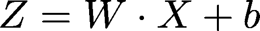

其中 **X、W** 和 **b** 分别为输入数据、权重和偏差。如果一个神经网络只进行这种计算，它将类似于线性回归。为了学习**非线性**模式，有必要在计算 **Z 后应用不同的函数。**这被称为**激活函数**:

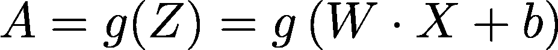

这个过程在整个网络的每个神经元中重复，直到它到达**输出层。**

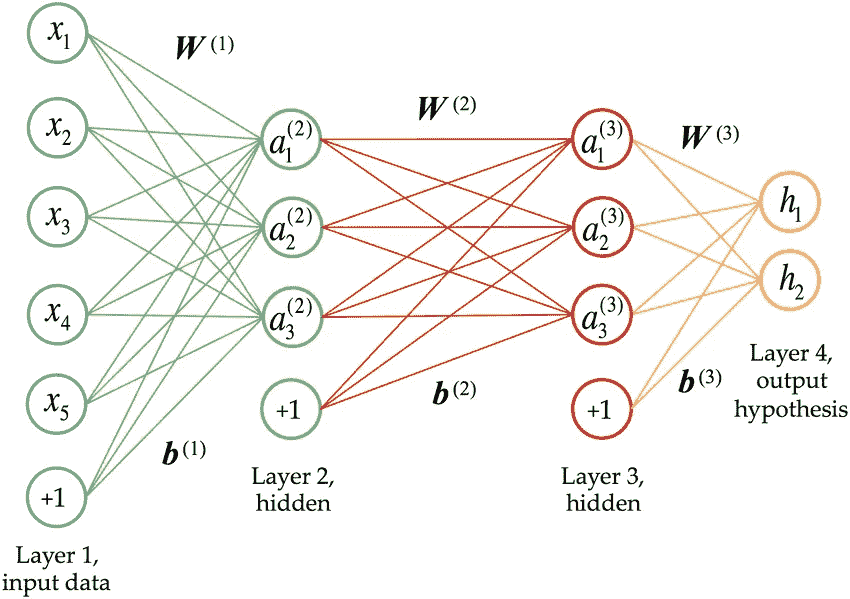

我们可以通过定义一个**成本函数**将神经网络的输出与目标数据 **Y** 进行比较。成本函数的一个例子(为了说明其目的)是均方误差(MSE):

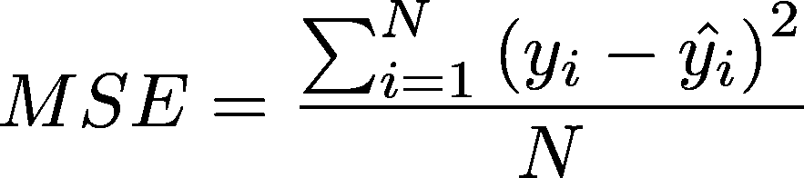

其中 y_hat 是神经网络的输出。成本函数是对我们的预测与现实有多大差异的度量。我们的神经网络的目标是通过**最小化成本函数和学习最优参数**，尽可能地逼近目标数据的预测。

**通过[反向传播算法](https://en.wikipedia.org/wiki/Backpropagation)学习**权重和偏差。在数学中，最小化一个函数需要**对函数求导**(梯度)。如果函数是几个函数的组合，可以使用[链规则](https://en.wikipedia.org/wiki/Chain_rule)到**计算不同参数**的导数。

在计算关于参数的导数之后，我们可以通过使用[梯度下降](https://en.wikipedia.org/wiki/Gradient_descent)算法来更新它们，该算法是一种**迭代优化算法，用于找到函数**的最小值。直观上，梯度下降可以被形象化为:

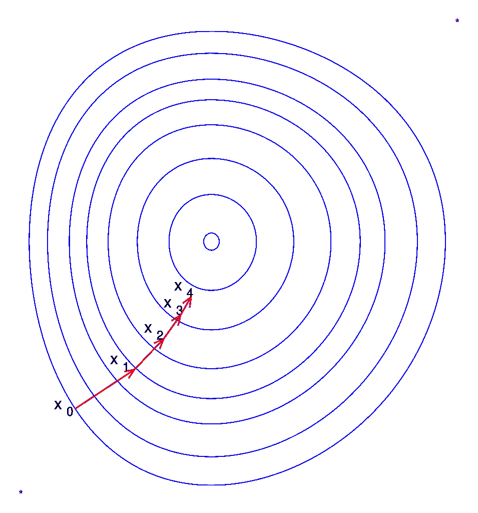

Gradient Descent converging to a local minimum after 4 iterations.

这个过程被系统地重复，直到我们的神经网络达到高精度。从这一点，我们将输出的计算表示为*前进步骤*，梯度的计算表示为*后退步骤。*为了巩固我们对 NN 的理解，**我们将和 Julia 一起从零开始构建一个神经网络，专注于一个具体的问题**。

## 示例:

我们的目标将是教我们的神经网络执行**二元分类**。也就是说，给定输入数据 **X** ，我们希望它预测目标数据 **Y** (由 0 或 1 组成)。我们将建立一个 L 隐藏层模型，使用 [ReLu](https://en.wikipedia.org/wiki/Rectifier_(neural_networks)) 和 [Sigmoid](https://en.wikipedia.org/wiki/Sigmoid_function) 作为**激活函数**。

ReLu 和 Sigmoid 函数可以在 Julia 中用矢量化实现定义为:

鉴于这个问题，我们将解释如何实现向前和向后的步骤，以便最终我们将有一个功能齐全的神经网络。

## 参数初始化:

首先，我们必须初始化神经网络的参数。为了便于**对称破缺**，有必要随机初始化权重。[对称性破缺](https://en.wikipedia.org/wiki/Symmetry-breaking_constraints)是数学中的一个概念，出现在最优化问题中。请记住，最终我们会尝试优化一个函数，使用不同的权重，**到达最低点**的几率会更大。

## 向前一步:

下一步是为我们的 L 层神经网络计算**正向传播步长**。我们将使用辅助函数，以便更好地理解组成此步骤的不同过程。过程的**线性部分**可以计算为:

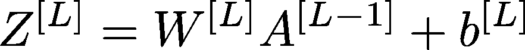

请注意，每一步中的信息都将存储在一个变量“缓存”中，这将允许我们加快反向传播步骤。

计算线性步长后，我们将对输出应用 ReLu 或 Sigmoid 函数:

为了从我们的模型中获得最终结果，有必要迭代每一层，将每一层的输出作为下一层的输入。

从我们的模型获得输出后，我们可以计算一个成本函数，它将决定我们试图解决的**优化问题**。对于本例，将使用[二进制交叉熵](https://peltarion.com/knowledge-center/documentation/modeling-view/build-an-ai-model/loss-functions/binary-crossentropy)，定义如下:

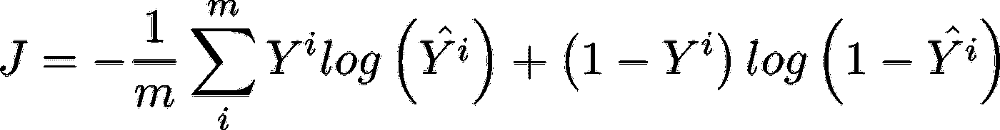

我们的学习算法将由成本函数的**最小化来驱动。将调整参数，使 **J** 最小。**

## 反向传播步骤:

反向传播可以说是训练神经网络中最令人困惑的部分，我们将把它分解成几个函数，以便更深入地了解它实际在做什么。

记住，对于每一层，线性部分的计算如下:

给定相对于 **Z** 的导数(将称为 **dZ** ，我们要计算相对于参数和激活部分的导数: **dW** 、 **db** 和 **dA:**

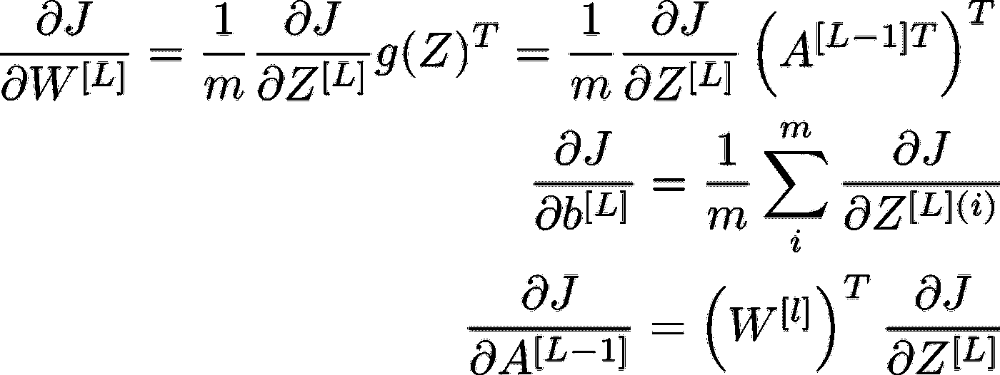

Backpropagation Formulas

精通微积分的读者可以通过应用**链式法则**来尝试从零开始推导这个公式。使用前面步骤中的缓存在 Julia 中实现矢量化版本:

相对于 **Z** 的导数可用以下公式计算:

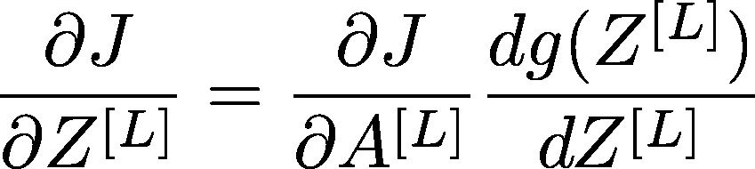

这需要计算激活函数的导数。我们将构建两个函数来计算 ReLu 和 sigmoid 导数的矢量化版本:

在单一函数中整合线性和活化导数:

所需的最后一步是**计算成本函数相对于最后一层**输出的导数。在这种情况下，它是二元交叉熵相对于 sigmoid 函数的导数:

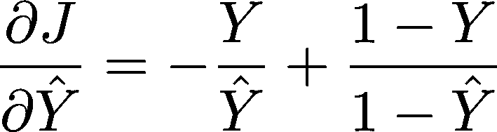

在每次迭代中，我们必须从输出层开始计算每一层中每个参数的梯度。梯度存储在字典中，用于更新参数。

通过[梯度下降](https://en.wikipedia.org/wiki/Gradient_descent)算法更新参数:

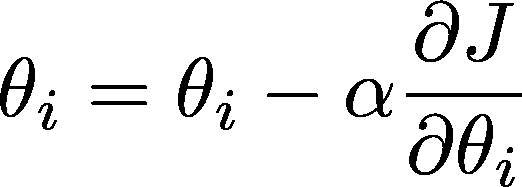

其中α是学习率，这是一个超参数，必须在**用不同的值**进行实验后选择。

## 总结:

收集不同的步骤，我们可以写下一个 **train_nn** 函数，这个函数**在给定的迭代次数**内一起执行向前和向后的步骤。这是另一个必须根据经验选择的超参数。

解决我们的二进制分类问题，我们可以绘制**成本函数和精度与迭代次数的关系图**，以确保我们的学习算法正常工作:

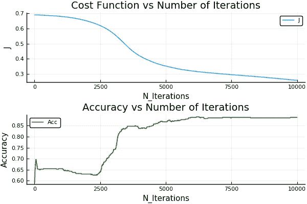

该代码可在 https://github.com/XabierGA/DNN_Julia 找到。在下一篇文章中，我们将使用该模型来执行图像分类。