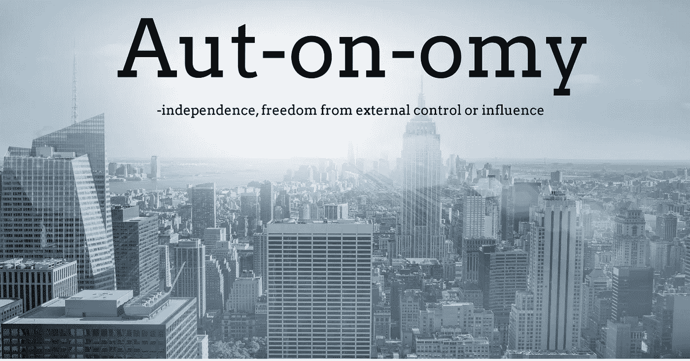
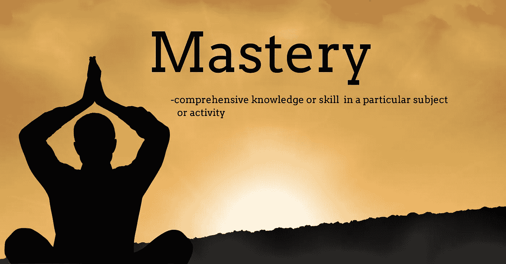

# 如何建立高绩效的敏捷团队

> 原文：<https://medium.datadriveninvestor.com/how-to-build-a-high-performing-agile-team-992ceb694e2a?source=collection_archive---------1----------------------->

人是任何公司最重要的资产，伟大的软件产品是由伟大的团队创造的。那么，你如何着手在你的公司建立一个敬业、高效的产品团队呢？你需要明白的第一件事是，敬业的团队是由敬业和积极的个人组成的。为了建立一个高绩效的团队，我们应该首先了解是什么激励着个人，并以此为基础进行建设。

**不是钱的问题**

如果报酬过低，优秀的人会离开，但一旦你支付有竞争力的薪酬，激励人们每天超越自我的就不是金钱了。

**这与期限和压力无关**

有大量证据表明，知识工作者对被催促的反应尤其糟糕。哈佛商学院[最近一项名为“枪口下的创造力”的研究](https://hbr.org/2002/08/creativity-under-the-gun)检查了 9000 多名从事需要高度创造力的项目的人的日常日记，并测量了他们在不同程度的时间压力下的创新能力。事实证明，当工人们不断被要求争分夺秒时，他们的工作效率是最低的。在极端的时间压力下工作时，他们想出的新点子更少，不仅是在截止日期当天，在接下来的日子里也是如此。紧张的截止日期和制造的紧迫感会很快失去效力，扼杀团队。我们需要彻底消除紧迫感。

这是关于自主、掌握和目标的

丹·平克的优秀著作《驱动力》详细探讨了激励人们的因素，他认为在家庭和工作中高绩效的秘诀可以归结为三点，即引导我们自己生活的人类深层需求(自主)、学习和创造新事物(掌握)、通过我们自己和我们的世界做得更好(目的)。

为了创建一个高绩效的团队，你需要在你的团队中灌输这三种美德，这里有一些有用的技巧。

# 自治

image made in www.designwizard.com

组建自治团队时，你首先需要考虑的是团队结构。只有当一个团队被充分授权做出自己的决定时，它才能真正自治。这样的团队是自我导向的，并完全负责确定如何在业务定义的约束内解决问题。Spotify 的团队所推广的跨职能团队拥有端到端的功能交付——他们由产品负责人、UX 设计师、开发人员和测试人员组成。

理想情况下，团队的规模应该在 5 到 7 人左右。这确保他们容易管理，会议可以保持高效，任何规模和团队变得更加难以管理和缓慢。这张图展示了随着团队规模的扩大，沟通的渠道是如何增加的，它很好地概括了事情

image from [https://getlighthouse.com/blog/developing-leaders-team-grows-big/](https://getlighthouse.com/blog/developing-leaders-team-grows-big/)

**建立清晰的决策流程**

接下来，你需要为团队建立一些清晰的界限，他们可以自己做出什么类型的决策(越多越好)，什么类型的决策需要在团队外部做出。我发现让你的团队写下他们有权做出什么类型的决定，以及他们认为他们应该能够做出什么类型的决定，这是一个非常有用的练习，这真的让人大开眼界。

**建立开放坦诚的沟通**

像 slack 这样的开放交流工具对于建立诚实透明的交流和分享知识来说是非常棒的。如果需要的话，电子邮件应该保持在最低限度。你知道吗，每次团队成员通过电子邮件进行秘密对话时，都会有一个天使哭泣！通过电子邮件分享或同意的任何知识都存在一个孤独的收件箱中，永远不会被新加入者或其他团队成员发现。帮团队一个忙，取缔电子邮件！

**拉推模式**

缺乏授权和业绩不佳之间有很高的相关性。一个团队需要能够管理他们自己的日常工作量，能够做出技术决策，并且如果必要的话，能够改变他们的工作方式。当团队得到一份清晰的、以商业为重点的简报，然后被授权找出自己交付的最佳方式时，他们会表现得最好。故事应该由团队成员从产品待办事项列表的顶部拉到 sprint 中。

**让失败变得安全**

埃里克·里斯(Eric Ries)有一个著名的描述，他把一个创业公司的跑道描述为公司在资金耗尽之前能够完成的支点数量。你越快建立一个东西，测试它，如果它失败了就改变策略越好。无论你是在小型还是大型组织中工作，创造一种团队可以安全失败的文化都是至关重要的。自主团队不怕犯错误，他们庆祝失败并从中吸取教训。尽早犯错意味着团队可以学习和适应。事实上，如果一个团队没有失败，没有犯错误，没有在前进的道路上进步，我敢打赌它走得不够快。伟大的团队请求原谅，而不是许可！

# 精通

image made in [www.designwizard.com](http://www.designwizard.com)

培养工艺文化和持续学习对团队非常有益。一个专注于持续改进和学习的团队将会做出伟大的事情，他们不会接受平庸或拖沓。

**持续交付=持续学习**

当开发一个发布周期很长的产品时，团队在看到任何一个产品发布之前，通常会开发几个特性或修复几个 bug。这是一个巨大的问题，当事情发生时(事情总是会发生)，要找出问题的根本原因并部署解决方案会更加困难。另一方面，随着部署越来越频繁，发布之间的时间间隔就越来越短。突破性的变化是固定的，而功能在每个人的脑海中是新鲜的。

有句老话说——如果你不擅长某件事，那就多做几次。转向连续交付有助于团队更好地打包、测试和发布他们的变更。一个软件工程团队，只要他们愿意，就可以将他们的代码直接投入生产，除了他们自己创建的 master 之外，没有其他的过程可以隐藏。

**留出自我提升的时间**

为你的团队安排学习和提高的时间。这里列出了一些有用的技巧

**非正式会谈**——邀请你公司的人在午餐时间进行一次非正式的介绍/会谈。主题应该是他们非常熟悉的东西，其他人可以从中学习。联系其他公司的朋友，邀请他们在午餐时到你的办公室谈 40 分钟。

**科技爆米花**——每周留出一个小时让你的团队在线观看一场科技讲座或演示，并在之后就学到的东西展开讨论(周五下午的工作不错)。

实践社区(Cop)——自治团队可以在你的组织中形成信息孤岛。CoP 是对特定技术或业务领域有共同兴趣的有组织的人群。他们定期协作以共享信息、提高技能，并积极致力于提高该领域的一般知识。例如，你可以鼓励在你的组织中成立一个产品负责人团队或测试工程师团队。从我的经验来看，随着时间的推移，警察会旋转起来，消失，并被不同的警察取代。形成新的和现存的对彼得来说是健康的

**编码形** —编码形是通过多次编码来解决一个问题，形的要点不是得出正确的答案。重点是你一路上学到的东西。目标是实践，而不是解决方案。这里有很多形[和](http://codekata.com/)

**黑客马拉松—** 企业黑客马拉松是激励你的团队以创新的方式一起工作的好方法。他们促进创造力、协作和创新思维。我之前在[写过一篇关于如何运营企业黑客马拉松的帖子](https://medium.com/@aidanjcasey/how-to-run-a-successful-hackathon-at-your-company-e203c838fccb)

**回顾的力量**

回顾会议是你的团队关注掌握和自我提高的最有力的工具。这是一个对之前的冲刺进行批判性反思并确定团队可以改进的领域的机会。如果你发现你的团队的回顾停滞不前，那么查看一下[有趣的回顾网站](http://www.funretrospectives.com/)了解如何让他们变得有趣。

# 目的

Photo by [Denys Nevozhai](https://unsplash.com/photos/z0nVqfrOqWA?utm_source=unsplash&utm_medium=referral&utm_content=creditCopyText) edited in www.designwizard.com

第三个也是最后一个要灌输给团队的美德是强烈的目标感。这一切都始于每个人都理解的伟大产品愿景。一个团队需要明白他们努力的方向。一旦你理解了原因，你就可以清楚地将你所做的每一个决定和你所添加的每一个特性与产品的发展方向联系起来。你的产品愿景是团队的北极星，指导他们的工作和决策过程。

**所有人都必须清楚地了解产品积压**

产品积压决定了团队的目的。整个团队必须密切了解待办事项；所有团队成员都必须了解下一个特性的取舍，以及为什么一个特性比另一个更重要。

**开窗测试！**

想象一下，你所有的产品积压都写在卡片上，按优先顺序贴在墙上，一阵风把所有的卡片都吹走了。如果你让每个团队成员把它们捡起来，按优先顺序放回原处，他们会以同样的方式排列卡片吗？如果答案是否定的，那么你需要与每个人分享更多关于待办事项的信息。

**信息辐射器**

当有效使用物理墙、白板和电子显示器时，可以放大团队的关键指标。您应该提供数据，向您的团队提供关于他们成功程度的反馈——根据您的业务，这可能是您的总客户数、销售信息、网站上线时间、跳出率等。当信息在团队周围高度可见的区域传播时，它可以提醒每个人产品的目的和事情的进展。

**庆祝客户反馈**

持续的客户反馈循环是产品交付的重要组成部分——一个功能只有在经过客户验证、调整和测试后才算成熟，但我们经常忘记庆祝反馈和成就。想办法定期与您的团队分享客户反馈。没有什么比听到你开发的新功能如何让客户开心更有意义的了。客户反馈循环培养了团队的使命感。

**总之**

伟大的敏捷团队经常交付成果。他们把一些东西放到野外，并对反馈做出反应。敏捷团队从成功和毫发无损的恢复中赢得信任，从失败中变得更加强大。为了建立一个能赢得信任的团队，你必须首先围绕一个能让他们信任的团队建立一个框架。通过塑造你的团队，你正在塑造你的交付过程。我认为你的过程应该体现三种美德:自主、精通和目标。

**轮到你了**

喜欢这个帖子？请给它一些爱&分享；-)