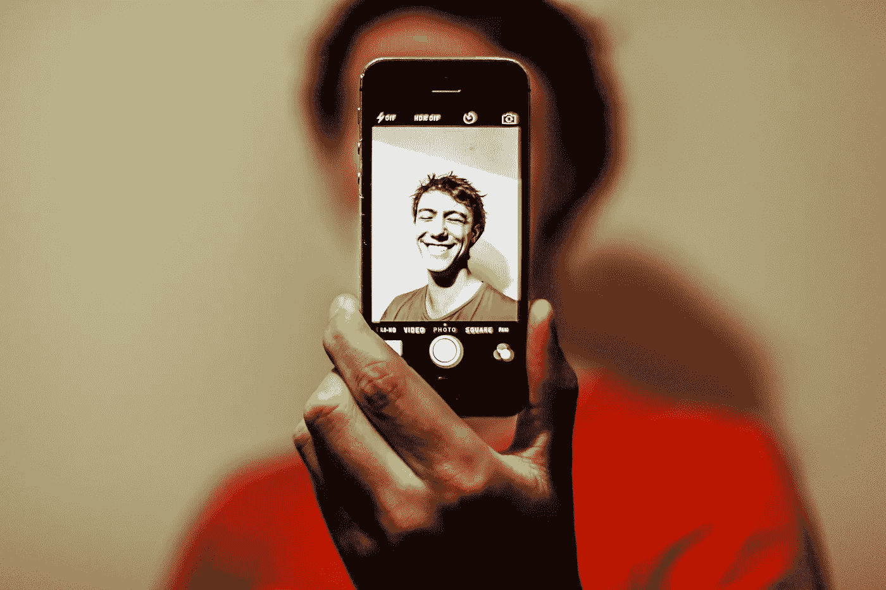
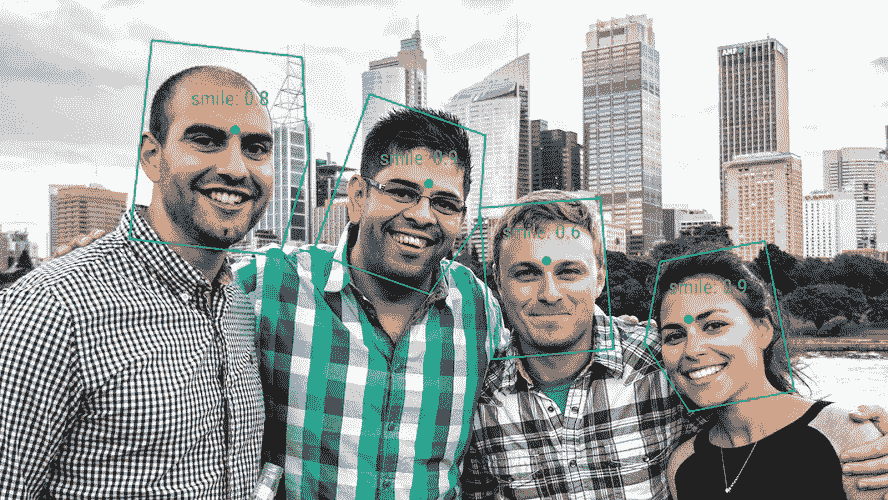
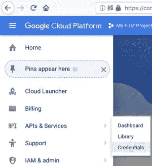

# 如何构建机器学习应用程序:选择最佳图像识别 API

> 原文：<https://medium.datadriveninvestor.com/how-to-build-a-machine-learning-app-choosing-the-best-image-recognition-api-297d4d97c84c?source=collection_archive---------7----------------------->

**你已经准备好将你的使用图像识别的机器学习应用程序的想法变成“下一个最好的东西”！**它将彻底改变移动广告、教育部门、汽车行业、金融世界……你能想到的都有。

但是，现实让你震惊:

> **“如何在我的应用程序中实现图像识别功能……简单易行？”**

而如果你没有[机器学习](https://www.optasy.com/blog/ai-vs-machine-learning-ai-different-machine-learning-or-are-they-same-thing)背景，“易用”这个因素就变得尤为重要。

**您如何将这样的服务/API 整合到您的应用中？一个应该分析、组织、改变不同图像的应用程序？**

现在，当你构建一个基于机器学习的应用程序时，你需要记住以下几点，以及一些最佳的图像识别 API。

**这样你就可以比较和试验，以选择一个完全适合你的目标和你的机器学习背景的…**

# 1.构建机器学习应用程序时要记住的 4 件事

在你开始在你的网络或[移动应用](https://www.optasy.com/blog/mobile-app-development-trends-2018-will-redefine-digital-world)中启用机器学习功能之前，请确保:

*   你已经深入了解了你的目标市场
*   你已经**恰当地准备了你的数据**:确保你选择了最好的数据源和数据收集技术
*   你已经为你的应用选择了最好的算法**(运行它，调整它，测试它)**
*   你正在使用正确的方法:对于设备上的机器学习，你需要注意你的模型的大小(确保它不是过大的；否则，你需要依靠云服务进行机器学习)

**注意:**组织你的数据集，确保**你的图像有不同的长度**，它们具有大量的特殊性，从而帮助你的定制模型更准确地识别目标物体/情感/场景。

# 2.在您的应用中实现图像识别:选择最佳 API

***“市面上最好的图像识别 API 有哪些？”你现在一定在问自己。***

*“对我来说，将图像识别集成到我的机器学习应用程序中的最佳解决方案是什么:*

*   *我几乎没有机器学习背景*
*   *我正在寻找* ***一个图像分析软件，它实现简单，易于使用，但功能强大***
*   *…应该可以让我快速训练出一个* ***自定义模型***

# *2.1.移动视觉 API*

*一个由谷歌驱动的框架配备了**检测图像和视频中物体的能力**。*

*为此，它使用 3 种类型的检测器:*

*   *人脸检测器*
*   *文本检测器*
*   *条形码检测器*

**

*图片来源:[谷歌开发者。](https://developers.google.com/vision/)*

**“人脸检测器”*“加载”了一些出色的功能，例如:*

*   *提供**关于被分析的图像/视频中的人脸状态的信息**:眼睛睁开/闭上、微笑、哭泣等。*
*   *识别脸部:嘴、鼻子、眼睛*
*   ***分析单幅图像上的多张脸***
*   *在录制的视频、移动相机和静止图像上识别人脸*

***注意:**切记这个 API **不提供人脸识别功能**；它无法分辨两张呈现人脸的图像是否相同。*

# *2.2.谷歌视觉 API*

***寻找一个更复杂、更…精致的*“对象检测”*服务？***

*图像识别软件的功能不仅仅是:*

*   *提供相似的图像*
*   *“检测”人脸和视觉对象*

*…并检测关于上传图像的*？识别是否:**

*   **照片中的生物是人还是狗**
*   **人物或悲或喜(情感分析)**
*   **它们是在谷歌安全搜索中被标记为“不可以”的色情或参与活动**

**…并给给定的图像贴上标签(“天气”、“秋天”、“遛狗”、“男性”)？**

**然后，[谷歌视觉 API](https://cloud.google.com/vision/) (或者“云视觉 API”)就是你要找的。**

**与其他领先的图像识别解决方案不同，它会“宠坏”您:**

*   **一个简单的 REST API**
*   **地标检测功能**

**它是怎么做到的？**API 将你的机器学习 app 的代码连接到** [**谷歌的图像识别**](https://www.infoworld.com/article/3269367/apis/how-to-use-the-google-vision-api.html) **能力。****

**现在，您可以这样设置:**

****

1.  **注册一个谷歌计算引擎账户**
2.  **选择一个项目(如果你是新注册的用户，那么默认选择*“我的第一个项目”*)**
3.  **从屏幕左侧的菜单中“抓取”一个 API 键(保存到文本文件中)并在您的项目中运行它(只需在此 [URL](https://cloud.google.com/vision/docs/before-you-begin) 处启用 API)**
4.  **选择您的应用程序项目**
5.  **现在，您已经准备好将新的图像识别 API 集成到您的应用程序项目中；只需将文本保存在一个 **google_vision.json** 文件中:**

****这个 JSON 请求将向 Google Vision API 指出要解析的特定图像和要触发的检测功能。****

****注意:**记住，您应该只在个人应用程序中使用这个 API！**

# **2.3.克拉里菲**

**下面是我们列表中的**一款定制图像识别软件**，如果:**

*   **您正在寻找一个添加了视频分析功能的可视化搜索工具**
*   ****你需要一个易于实现和使用的 API 来标记图像**；用于识别和理解图像/视频中的内容特征**
*   **你正在寻找一个具有很强的概念建模的 API**
*   ****您计划整合图像识别功能，使您能够创建和训练自己的定制模型，并根据**进行测试**

> ****“但是我怎么用** [**Clarifai 的自定义训练 API**](http://help.clarifai.com/custom-training/guides/custom-training-overview) **来设置自己的模型呢？”****

**这很简单:**

*   **要声明一个正数，您可以使用:**clari fai . positive(' https://goo . GL/1 q8 w8 s ' dog '，callback)；****
*   **对于预测一个图像你用:**clari fai . predict(' https://goo . GL/xNNRJg ' dog '，callback)；****
*   **声明否定时，使用:**clari fai . predict(' https://goo . GL/xNNRJg ' lion '，callback)；****

# **2.4.爱因斯坦视觉**

**想加入人工智能的小行动吗？**

**构建一个图像识别应用程序，利用人工智能和深度学习模型，训练成大规模识别图像？**

**考虑[爱因斯坦的设想](https://metamind.readme.io/v2/docs)然后！将它集成到您的机器学习应用程序中，并开始探索它的两个 API:**

*   ****爱因斯坦物体检测**:让你能够训练模型，识别图像中的几个不同物体(提供每个物体的位置和大小等信息)**
*   ****爱因斯坦图像分类**:使您能够创建和训练模型，以检测和分类大规模图像**

*****“我会在哪里使用这样一个支持人工智能的 app？”*****

**这是它最常见的图像识别用例之一:**

> **你可以使用存储在你的图片中的所有上下文线索(你的客户偏好、你的产品/服务质量水平、你的库存水平等)。)来增强您的营销、销售和/或服务团队的能力。这样，他们将获得关于你的客户的更准确的见解。**

# **2.5.亚马逊认知**

**如果你不是在寻找情绪分析、物体和场景检测的最佳工具，而是在寻找面部识别的**工具，会怎么样？****

**那你就用亚马逊 Rekognition。**

**它旨在:**

*   **提供详细信息(如胡须识别)**
*   **进行面部对比，评估两张脸是同一个人的可能性**

# **2.6.Google Tensorflow 对象检测 API**

**一种将图像识别功能集成到您的机器学习应用程序中的简单方法。**

**Tensorflow 对象检测 API 是一个开源框架，其设计理念是:**

> ****目标检测模型的建立、训练和部署应该快速而简单。****

**在这方面，可用的[指南](https://codelabs.developers.google.com/codelabs/tensorflow-for-poets/index.html#0)支持整个想法。**

****

**图片来源: [Github](https://github.com/tensorflow/models/tree/master/research/object_detection)**

**下面是 API 的使用方法:**

1.  **下载冻结模型(。pb — protobuf)并将其运行到内存中**
2.  **使用内置的帮助器代码加载类别、标签、可视化工具等等**
3.  **启动一个新会话，并在您的一个映像上运行生成的模型**

****在你的机器学习应用中整合和使用这个 API 的 2 个技巧:****

*   **了解如何提高 API 的速度，以便在移动设备上使用它进行实时对象检测**
*   **尝试更精确的模型，看看有什么不同**

****结束**！**

**我是否设法(至少部分地)回答了您的问题:**

*   ***“构建一个机器学习 app，我需要知道什么？”***
*   ***“如何在我的网络/移动应用中内置自定义图像识别功能？”***
*   ***“目前市场上最好的图像识别 API 是什么？”***

# ****文章原载于【OPTASY.com】****。********