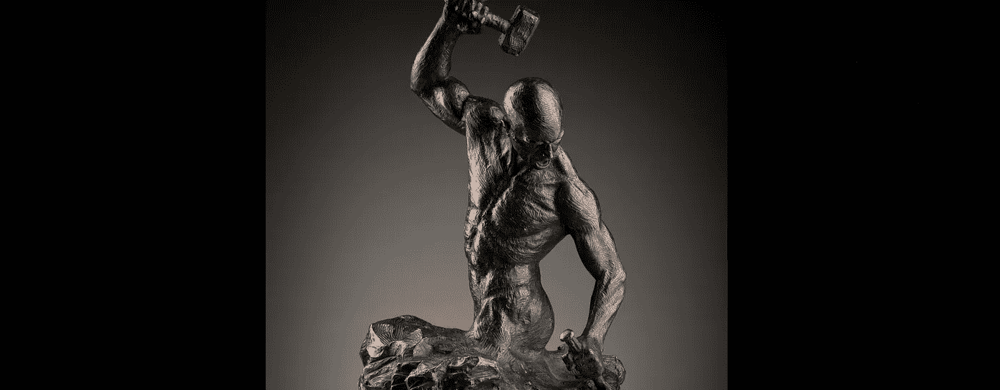

# 如何建立一个新的想法

> 原文：<https://medium.datadriveninvestor.com/how-to-build-a-new-idea-dab72b9f3e16?source=collection_archive---------18----------------------->

Ian Edwards

只有重复和持续的改进才能让你成为焦点；曾经的奇迹只出现在当地社区报纸的背面。
那么，你如何让你的商品和服务成为人们谈论的话题呢？

## 在富足的时代茁壮成长或生存:
什么是富足的时代，它如何将思想淹没在自己富足的洪流中

**定义** :
富足的时代跟随好奇和匮乏的时代而来；我们现在处于一个富足的时代，在这个时代，每一个伟大的想法都有成千上万个更好的想法。

**注意** :
建立任何新的想法，但具有极端的价值和独特性以及超高的设计价值。

**症状** :
促销活动增加，但销售额下降；
竞争有更好、更快、更便宜的选择；
这场竞赛正在失败；
隐藏在其他全新战略中的胜利；
愿景正在被挑战，迷茫的迷雾正在削减利润。

如何建立一个新的想法

**无论我们设计什么、生产什么质量，我们都不应该过分满足和骄傲……这还不够好，只有不断的改进才能让东西变得有价值……**

没有对富足时代的充分理解，一个人根本无法思考、设计或生产任何东西。

 [## 想知道领导是谁？请他决定。数据驱动的投资者

### 一个有效的领导者能为组织提供的最有价值的东西之一是决策能力…

www.datadriveninvestor.com](https://www.datadriveninvestor.com/2019/01/25/want-to-know-who-the-leader-is-ask-him-to-decide/) 

从各个方面研究设计，例如，像从汽车设计师的角度，坐在司机座位上的角度，行人的角度以及为什么不从其他汽车的角度；一行一行，一个项目一个项目地去研究每一个角落，每一个特征，每一个纹理，问一问是怎么做到的，为什么要这样做，或者为什么不采用其他方式。现在对 100 种其他产品也这样做，之后你可能会开始培养第三只眼来欣赏设计？

这只是一个开始。

如果你认为你的学位教会了你一切，可能不是，或者只是如何握铅笔。

**放松…**

通过更深入的研究达到精通，最终发现未知，就像蝙蝠潜入洞穴深处，最终瞥见那辆蝙蝠战车。

某样东西，深邃而神秘地美丽，
当眼睛看到它时，它会让心脏停止跳动。

你不需要成为一个汽车设计大师或人造心脏制造者，那是其他专家的事，你是一个建设者，你的深刻的欣赏是更重要的，这样才能和其他专家一起前进。约伯只是有想法；他让自己成为世界上最优秀的人，为你送来一部 iPhone……想象一下他不得不穿越的战场，与一百年前的电话模型作战。

虽然你的技能更广泛，甚至是通用的，但受到独特的企业家精神、执行力和打破常规思考的驱动，以确保你走上发现之路。你是建设者；你处理一切，因为你有正确的技能。设计思维必须与你的进步同步。研究所有的成功案例；现在从设计的角度重新学习，概念的起源，渐进的造型和不断追求完美。

**什么是时代的富足；**参观最大的购物中心，将它扩大一百万倍，现在在其中漫游，但它仍然不够大…新的全球时代充斥着一切，好的和坏的，平庸的和优秀的，垃圾和收藏品。不了解这个富足的时代，任何想法，不管是什么，都必须创造极端的价值和极端的形象，否则从一开始就注定失败。如果你想做辣酱，你必须研究现有的 10，000 种酱。你必须检查标签、尺寸、形状、价格和样品口味。这同样适用于袜子、围巾、汽车、摩托车、音乐、食物、服装、书籍、无人机、电影、研讨会、高速列车以及任何东西，比如写文章。

这并不意味着无事可做……相反，这是一个无限的市场。如果有很好的创新设计知识，有极端的价值和极端的形象，就会有成功。已经有太多的垃圾和无意义的设计和愚蠢的图像扩散，它自动为高质量的贡献打开了数百万扇新的大门。

跟随心灵、头脑、艺术和科学，勇往直前，但不要盲目。

**设计**:这个学科需要经过专门的训练，才能深刻理解设计的多种多样和多维度，哲学的多样性，流派的复杂性和风格的多样性。没有这样的知识，大多数商品和服务的想法都会悲惨地慢慢死去。

**生产**:能生产就生产，能合作就合作，拥有设计指挥和控制的外包是进入全球化时代市场的最快途径，前提是你完全理解知识产权资产、全球术语并熟悉全球形象定位。这并不容易。

承诺:如何创造和兑现承诺是一门艺术，需要高超的技巧，否则你会脱光衣服站在市场上，像一群暴徒一样激怒顾客。研究大公司的大失败。

**时机**:今天的一切都与时机有关，在正确的时间出现在正确的地点，使用正确的组合。这也意味着快速和极其高效，这需要许多其他特殊技能。

竞争:尽管市场泛滥，但如果你掌握了所有这些优秀的组件，几乎没有任何竞争；只有拥有所有组合的人才能打开所有的门。

**消费**:物品如何从工厂转移到消费者手中；那些对当地和全球的可及性有充分理解和扎实营销的人会兴旺发达，而那些打了就跑的想法只会消亡。

**形象至上**:富足的时代只允许精英中的精英爬到顶端。然而，它只允许精通的专家参加比赛。

**真正的游戏是‘创造极值’
，而不是‘操纵极值’**

最初定义的三个关键渐进阶段

好奇的时代:在这里，对于任何新创造或生产的东西，要么没有，要么只有很少的其他选择。获得原创和制作的机会极为罕见。

**稀缺时代:**在这里，任何生产出来的东西都有数百种其他选择。进入生产和容易复制是非常普遍的。

丰饶时代:在这里，任何被生产或创造的东西都有数以千计的其他选择。生产、复制和全球分销渠道丰富。

**选择攻击**:当有上百万种选择和选项时，会有一种自动拒绝感。埃尔文托夫勒在八十年代定义了未来的冲击。现在，我们可以走进任何一家制造“选择攻击”的大型购物中心，因为大脑拒绝处理微妙的欲望和想象消费的情感觉醒。从 10000 多个品种中选择一种烹饪酱会让所有的兴奋消失，并产生大量的广场恐惧症，迫使一个人换气过度并惊慌地跑出商店。在过去，警卫控制着顾客的冲击；现在是富足的时代，商店里有警卫，这样顾客就不会因为“选择性攻击”而尖叫着跑出去。

**起源:** *“丰饶时代”的概念最初是由 Naseem Javed 于 2005 年在辛迪加专栏发表的；《富足的时代需要创新》《环球邮报》*