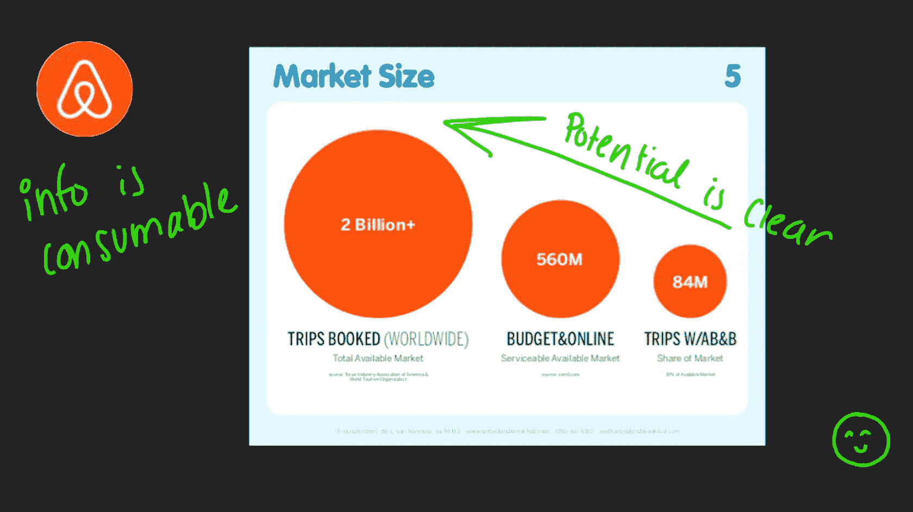
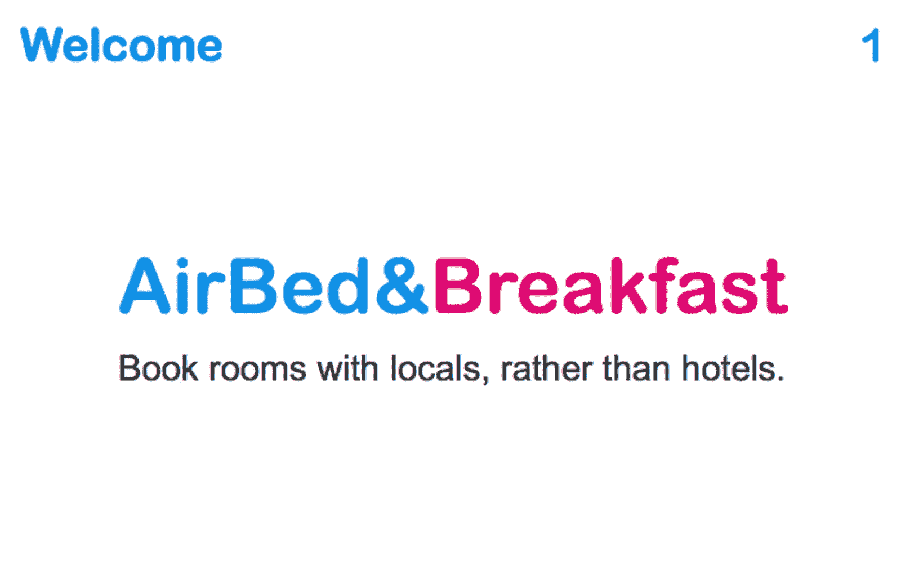
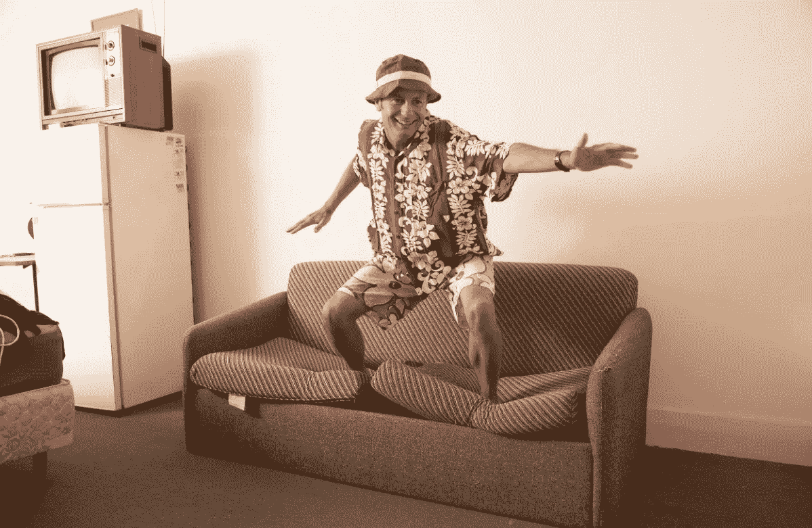

# 如何建立一个球场甲板

> 原文：<https://medium.datadriveninvestor.com/how-to-build-a-pitch-deck-f4c5db9ce1b3?source=collection_archive---------3----------------------->

如果你能制作一套 10 张幻灯片的幻灯片，那么你就能从投资者那里筹集到数百万美元。好吧，好吧，这可能有点夸张，但事实是，现在科技行业一些最著名的独角兽已经这样做了。

例如，考虑最初的 Airbnb pitch deck，它在互联网上随处可见，可供任何寻找灵感的初创公司创始人使用。这个球场是一个美丽的东西。它会让你为这家公司神魂颠倒，打开你的钱包，交出你拥有的每一块钱。它简洁、优雅、切中要害。如果在整个演示文稿中有一个无关的单词，那就是还没有找到。

[推介](https://www.investorintelligence.io/blog/pitch/)的第一张幻灯片非常精彩——只有公司的名字和一个关于公司业务的七个字的陈述——与当地人预订房间，而不是酒店(当时，请记住，这是一个非常激进的想法，所以投资者一定从第一分钟开始就像巴甫洛夫的狗一样垂涎三尺。)

接下来是对许多旅行者面临的问题的描述(“酒店让你与城市及其文化脱节”)、对解决方案的简要描述(“一个用户可以出租空间来接待旅行者的网络平台”)、关于整体市场规模和机会的一些数字、对核心产品的描述、对基本商业模式的回顾(“我们对每笔交易收取 10%的佣金”)、关于当前市场采用率和市场竞争总体水平的一些细节，以及六个(六个！)将 Airbnb 与其他旅行团队区分开来的竞争优势。

太棒了。太棒了。这里有几件事值得更详细地强调。一个是清楚地指出潜在市场机会的规模的绝对智慧。想象一下，大胆地告诉习惯住在五星级酒店的老年人，你将在全球范围内接管整个酒店和酒店业，把所有人都变成沙发冲浪者。这是一个伟大的想法，也是一个更加重要的机会。风险投资家一定很喜欢这一点(一旦他们从震惊中恢复过来)。如果你能把一个价值十亿美元的市场机会包含在一份推介材料中，你就已经走上了成功之路。

 [## 夏普比率悖论:为什么还要投资风险资本？数据驱动的投资者

### 夏普比率是一种基于风险量化回报的方法，具体来说，它是超过…

www.datadriveninvestor.com](https://www.datadriveninvestor.com/2020/03/29/the-sharpe-ratio-paradox-why-still-invest-in-venture-capital/) 

然后，对 Airbnb 计划如何赚钱有一个非常简洁的描述——通过对每笔交易收取佣金。这也是投资者希望看到的。他们需要寻找一条通往未来成功的道路，这将帮助他们实现投资回报的最大化。随后，Airbnb 提供了一份重要竞争优势的清单，以及一份关于为什么他们比任何人都更有能力抓住这个机会的总结。麦克风掉落。

多亏了互联网的魔力，从科技领域的一些大腕那里找到样本宣传资料是非常容易的。当然，你不想复制这些卡片，但是你可以用它们来获得灵感。这里最重要的一点是，你不需要一个巨大的 100 张幻灯片来赢得投资者。你所需要的是[十张非常简洁的幻灯片](http://www.slides.ai/)，在这些幻灯片中，你令人信服地阐述了投资者应该给你开支票的理由。

*最初发布于*[*https://www . investor intelligence . io*](https://www.investorintelligence.io/blog/how-to-build-a-pitch-deck/)*。*