# 如何建立购买数据的推荐系统(循序渐进)

> 原文：<https://medium.datadriveninvestor.com/how-to-build-a-recommendation-system-for-purchase-data-step-by-step-d6d7a78800b6?source=collection_archive---------0----------------------->


Credit: NewsWire, The TakeOut.

## 基于项目的协同过滤在 Turicreate 和 Python 中的应用

无论你是在一家以客户为中心的公司中负责用户体验和产品战略，还是坐在沙发上与心爱的人一起看电影，你都有可能已经意识到推荐技术被用来个性化你的内容和产品的一些方式。

推荐系统是大数据和机器学习最常见、最容易理解的应用之一。其中最著名的应用是亚马逊的推荐引擎，当我们访问该网站时，它为我们提供个性化的网页，以及 Spotify 的歌曲推荐列表，当我们使用他们的应用程序收听时。

上次，我们去[用 Spark 的大量音频数据建立了一个 Spotify 的 Discover Weekly](https://towardsdatascience.com/building-spotifys-discover-weekly-with-spark-4370d5d0df2f) 。这一次，我们将为更多有形的商品构建一个推荐引擎。

# 挑战

如果你在网上查一下，有很多方法可以为基于*评分的*数据建立推荐系统，比如电影和歌曲。基于评级的模型的问题在于，对于目标值不确定的数据，如购买或频率数据，它们不容易标准化。例如，歌曲和电影的评分通常在 0-5 或 0-10 之间。然而，购买数据是连续的，没有上限。

不幸的是，许多在线资源提供的结果并没有评估他们的模型。对于大多数数据科学家和工程师来说，当您涉及数百万数据时，这是一个危险的领域！对于行业来说，没有任何评估，结果本身不会让你的工具有任何用处。


# 目标

在解决这些问题的过程中，我们将建立协同过滤模型，使用购买数据向客户推荐产品。特别是，我们将详细介绍用 Python 和机器学习模块 Turicreate 构建推荐系统的一步一步的过程。这些步骤包括:

*   转换和规范化数据
*   培训模型
*   评估模型性能
*   选择最佳模型

# 产品概述


想象一下，一家食品连锁店发布了一款新的移动应用程序，让顾客无需走进商店就能下单。

该应用程序有机会显示推荐:当顾客第一次点击“订单”页面时，我们可能会推荐前 10 项商品添加到他们的篮子中，例如一次性餐具、鲜肉、薯条等。

该工具还能够基于特定用户搜索推荐列表，以便:

*   输入:客户 ID
*   Returns:用户最有可能想要放入他/她的(空的)“购物篮”中的项目(产品 id)的排序列表

# 履行

## 1.导入模块

*   用于数据操作的`pandas`和`numpy`
*   `turicreate`用于进行型号选择和评估
*   `sklearn`用于将数据分为训练集和测试集

```
%load_ext autoreload
%autoreload 2

**import** **pandas** **as** **pd**
**import** **numpy** **as** **np**
**import** **time**
**import** **turicreate** **as** **tc**
**from** **sklearn.cross_validation** **import** train_test_split

**import** **sys**
sys.path.append("..")
```

## 2.加载数据

中的两个数据集。下面使用的是 csv 格式，可以在`data`文件夹 [*这里*](https://github.com/moorissa/medium/tree/master/items-recommender/data) :

*   `recommend_1.csv`包含 1000 个客户 id 的列表，作为推荐输出
*   `trx_data.csv`由用户事务组成

```
customers = pd.read_csv('../data/recommend_1.csv') 
transactions = pd.read_csv('../data/trx_data.csv')
```

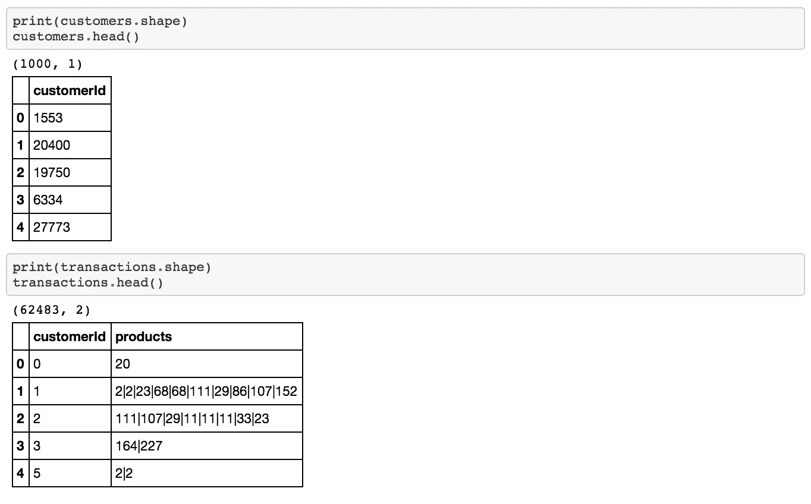

## 3.数据准备

我们的目标是将`products`列中的每个商品列表分解成行，并计算用户购买的商品数量

## **3.1。使用用户、项目和目标字段创建数据**

*   该表将作为我们稍后建模的输入
*   在这种情况下，我们的用户是`customerId`、`productId`和`purchase_count`

```
data = pd.melt(transactions.set_index('customerId')['products'].apply(pd.Series).reset_index(), 
             id_vars=['customerId'],
             value_name='products') \
    .dropna().drop(['variable'], axis=1) \
    .groupby(['customerId', 'products']) \
    .agg({'products': 'count'}) \
    .rename(columns={'products': 'purchase_count'}) \
    .reset_index() \
    .rename(columns={'products': 'productId'})
data['productId'] = data['productId'].astype(np.int64)
```

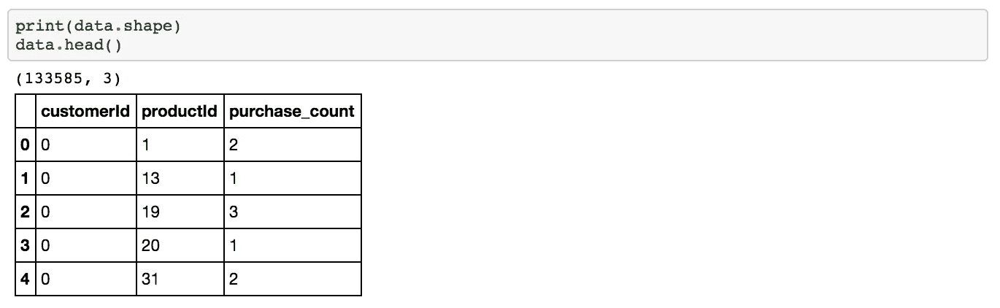

## **3.2。创建虚拟对象**

*   用于标记客户是否购买该商品的虚拟对象。
*   如果一个人买了一件物品，那么`purchase_dummy`被标记为 1
*   你可能会问，为什么要创建一个虚拟对象而不是将其正常化？标准化购买计数，比如说每个用户，是行不通的，因为顾客可能有不同的购买频率和不同的品味。然而，我们可以通过所有用户的购买频率来标准化项目，这在第 3.3 节中完成。下面。

```
**def** create_data_dummy(data):
    data_dummy = data.copy()
    data_dummy['purchase_dummy'] = 1
    **return** data_dummydata_dummy = create_data_dummy(data)
```

## 3.3.跨用户标准化项目值

*   为了做到这一点，我们通过首先创建如下用户-商品矩阵来标准化用户之间每个商品的购买频率

```
**df_matrix** = pd.pivot_table(data, values='purchase_count', index='customerId', columns='productId')
```

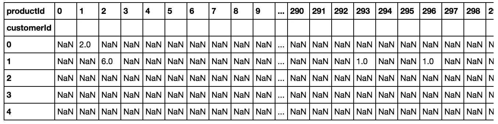

```
**df_matrix_norm** = (df_matrix-df_matrix.min())/(df_matrix.max()-df_matrix.min())
```

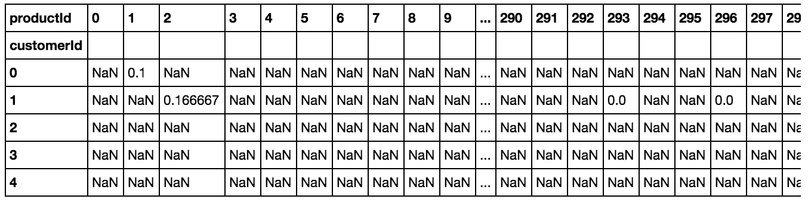

```
*# create a table for input to the modeling* **d** = df_matrix_norm.reset_index() 
**d**.index.names = ['scaled_purchase_freq'] 
**data_norm** = pd.melt(d, id_vars=['customerId'], value_name='scaled_purchase_freq').dropna()print(data_norm.shape)
data_norm.head()
```

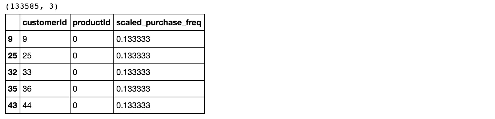

上述步骤可以组合成下面定义的功能:

```
**def** normalize_data(data):
    df_matrix = pd.pivot_table(data, values='purchase_count', index='customerId', columns='productId')
    df_matrix_norm = (df_matrix-df_matrix.min())/(df_matrix.max()-df_matrix.min())
    d = df_matrix_norm.reset_index()
    d.index.names = ['scaled_purchase_freq']
    **return** pd.melt(d, id_vars=['customerId'], value_name='scaled_purchase_freq').dropna()
```

在这一步中，我们对他们的购买历史进行了规范化，从 0 到 1(1 表示某个商品的最大购买次数，0 表示该商品的购买次数)。

## 4.分离训练和测试装置

*   将数据划分为训练集和测试集是评估预测建模的重要部分，在这种情况下是协作过滤模型。通常，我们将大部分数据用于训练，小部分数据用于测试。
*   我们使用 80:20 的比率作为我们的训练测试集大小。
*   我们的训练部分将用于开发预测模型，而另一部分用于评估模型的性能。

下面我们来定义一个分裂函数。

```
**def** split_data(data):
    *'''*
 *Splits dataset into training and test set.*

 *Args:*
 *data (pandas.DataFrame)*

 *Returns*
 *train_data (tc.SFrame)*
 *test_data (tc.SFrame)*
 *'''*
    train, test = train_test_split(data, test_size = .2)
    train_data = tc.SFrame(train)
    test_data = tc.SFrame(test)
    **return** train_data, test_data
```

现在我们已经有了三个数据集，分别是购买计数、虚拟购买和按比例购买计数，我们希望将每个数据集分开进行建模。

```
train_data, test_data = split_data(data)
train_data_dummy, test_data_dummy = split_data(data_dummy)
train_data_norm, test_data_norm = split_data(data_norm)
```

## 5.使用 Turicreate 库定义模型

在运行更复杂的方法(比如协同过滤)之前，我们应该运行一个基线模型来比较和评估模型。由于基线通常使用一种非常简单的方法，如果使用这种方法之外的技术显示出相对更好的准确性和复杂性，则应该选择这些技术。在这种情况下，我们将使用流行度模型。

一种更复杂但常见的预测购买项目的方法是协同过滤。我将在后面的部分中讨论更多关于流行度模型和协同过滤的内容。现在，让我们首先定义要在模型中使用的变量:

```
*# constant variables to define field names include:*user_id = 'customerId'
item_id = 'productId'
users_to_recommend = list(customers[user_id])
n_rec = 10 *# number of items to recommend*
n_display = 30 *# to display the first few rows in an output dataset*
```

`Turicreate`使我们调用建模技术变得非常容易，所以让我们为所有模型定义如下函数:

```
**def** model(train_data, name, user_id, item_id, target, users_to_recommend, n_rec, n_display):
    **if** name == 'popularity':
        model = **tc.popularity_recommender**.create(train_data, 
                                                    user_id=user_id, 
                                                    item_id=item_id, 
                                                    target=target)
    **elif** name == 'cosine':
        model = **tc.item_similarity_recommender**.create(train_data, 
                                                    user_id=user_id, 
                                                    item_id=item_id, 
                                                    target=target, 
                                                    similarity_type=**'cosine'**)**elif** name == 'pearson':
        model = **tc.item_similarity_recommender**.create(train_data, 
                                                    user_id=user_id, 
                                                    item_id=item_id, 
                                                    target=target, 
                                                    similarity_type=**'pearson'**)

    recom = model.recommend(users=users_to_recommend, k=n_rec)
    recom.print_rows(n_display)
    **return** model
```

虽然我为上述所有过程编写了 python 脚本，包括使用 python 脚本查找相似性(可以在这里找到[](https://github.com/moorissa/medium/blob/master/items-recommender/scripts/data_layer.py)*)，但我们现在使用`turicreate`库来更快地捕获不同的度量并评估模型。*

## *6.作为基线的流行度模型*

*   *流行度模型采用最受欢迎的项目进行推荐。这些产品在顾客中销量最高。*
*   *训练数据用于模型选择*

**一、使用采购盘点**

```
*name = 'popularity'
target = 'purchase_count'
popularity = model(train_data, name, user_id, item_id, target, users_to_recommend, n_rec, n_display)*
```

*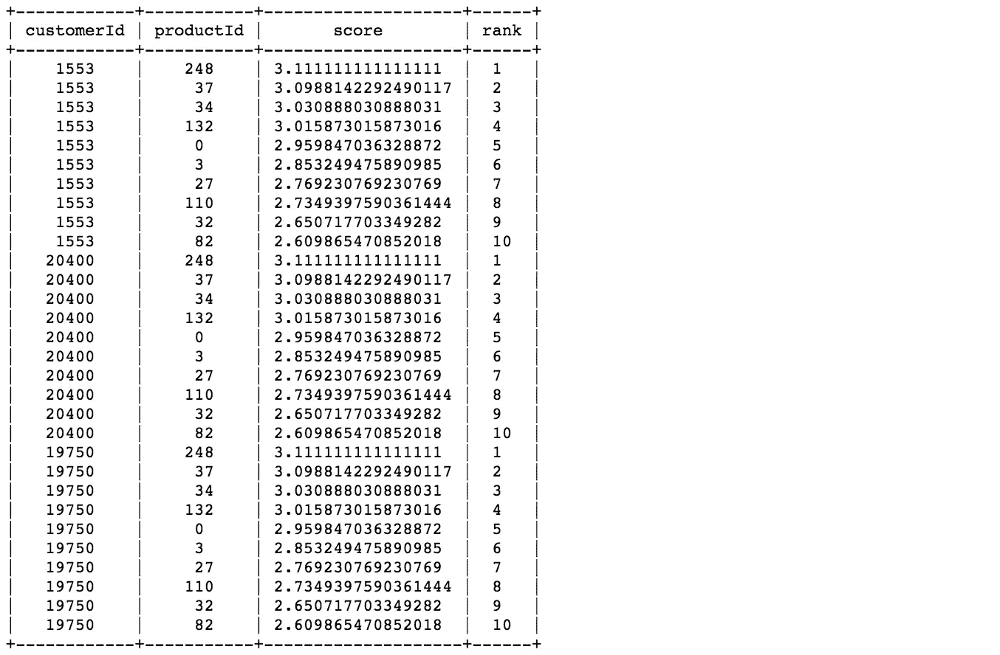*

**二。使用购买假人**

```
*name = 'popularity'
target = 'purchase_dummy'
pop_dummy = model(train_data_dummy, name, user_id, item_id, target, users_to_recommend, n_rec, n_display)*
```

*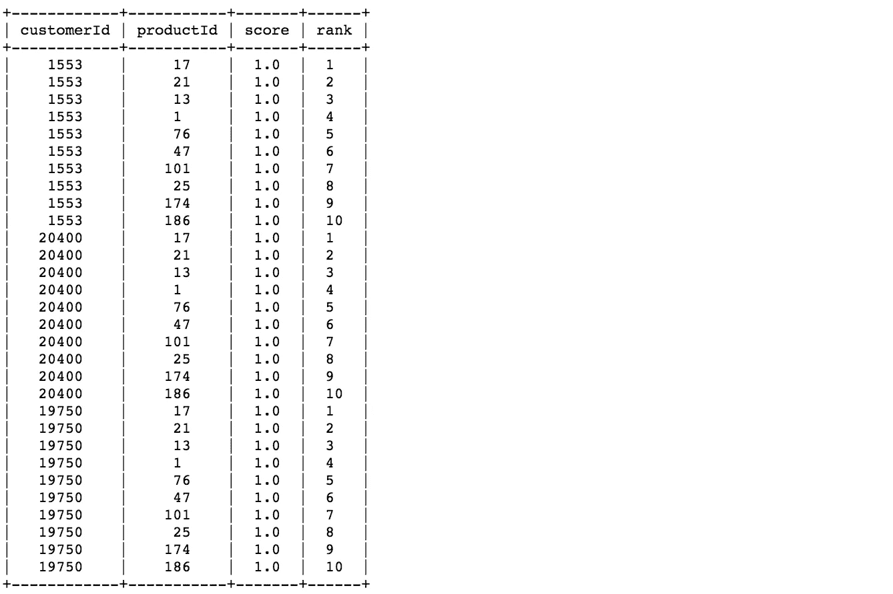*

**三。使用比例采购计数**

```
*name = 'popularity'
target = 'scaled_purchase_freq'
pop_norm = model(train_data_norm, name, user_id, item_id, target, users_to_recommend, n_rec, n_display)*
```

*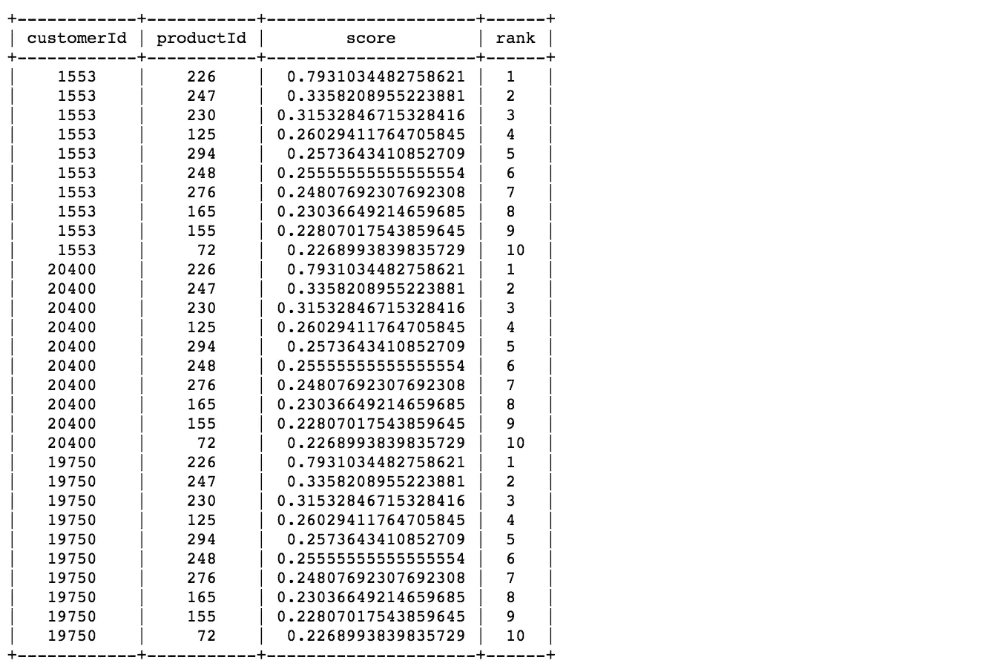*

## *6.1.基线摘要*

*   *一旦我们创建了模型，我们就使用受欢迎程度的分数来预测推荐项目。从上面的每个模型结果可以看出，这些行显示了来自 1000 个用户的前 30 条记录以及 10 条推荐。这 30 个记录包括 3 个用户和他们推荐的项目，以及分数和降序。*
*   *结果，尽管不同的模型具有不同的推荐列表，但是每个用户被推荐了相同的 10 个项目的列表。这是因为流行度是通过所有用户中最流行的项目来计算的。*
*   *在下面的分组示例中，产品 132、248、37 和 34 在客户中最受欢迎(最畅销)。使用他们的购买计数除以客户数量，我们看到这些产品在交易的训练集中平均至少被购买 3 次(与第一个关于`purchase_count`变量的流行度测量相同)*

*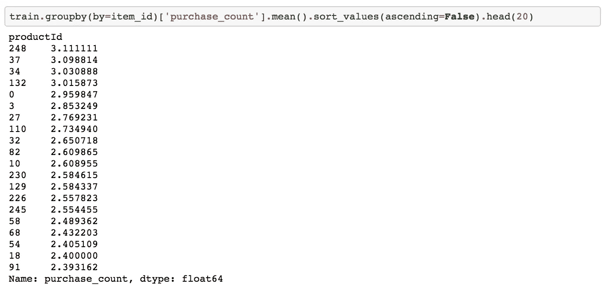*

## *7.协同过滤模型*

*在协同过滤中，我们会根据相似用户购买商品的方式来推荐商品。例如，如果客户 1 和客户 2 购买了类似的商品，例如 1 购买了 X，Y，Z，2 购买了 X，Y，我们将向客户 2 推荐商品 Z。*

## *7.1.方法学*

*为了定义用户之间的相似性，我们使用以下步骤:*

*1.创建用户-项目矩阵，其中索引值表示唯一的客户 id，列值表示唯一的产品 id*

*2.创建项目到项目的相似性矩阵。这个想法是计算一个产品和另一个产品有多相似。有很多方法可以计算这个。在步骤 7.2 和 7.3 中，我们分别使用`cosine`或`pearson`相似性度量。*

*   *要计算产品 X 和 Y 之间的相似性，请查看对这两个项目都进行了评级的所有客户。例如，客户 1 和客户 2 对 X 和 Y 都进行了评级。*
*   *然后，我们在(1，2)的用户空间中创建两个项目向量，项目 X 的 v1 和项目 Y 的 v2，然后找到这些向量之间的`cosine`或`pearson`角度/距离。0 度角或余弦值为 1 的重叠向量意味着完全相似(或每个用户，所有项目，有相同的评级), 90 度角意味着余弦值为 0 或没有相似性。*

*3.对于每个顾客，我们预测他购买他没有购买的产品的可能性(或他的购买计数)。*

*   *在我们的示例中，我们将在项目 Z(目标项目)的情况下计算用户 2 的评级。为了计算这一点，我们对刚刚计算出的目标商品和顾客已经购买的其他商品之间的相似性度量进行加权。加权因子是用户对他已经购买的物品给出的购买计数。*
*   *然后，我们用相似性度量的和来缩放这个加权和，使得计算出的评级保持在预定义的限制内。因此，将使用相似性度量来计算用户 2 的项目 Z 的预测评级。*

## *7.2.`Cosine`相似性*

*   *相似性是 A 和 B 的项目向量的两个向量之间的角度的余弦*
*   *它由以下公式定义*

*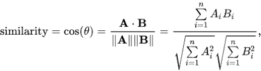*

*   *向量越近，角度越小，余弦越大*

**一、使用采购盘点**

```
*name = 'cosine'
target = 'purchase_count'
cos = model(train_data, name, user_id, item_id, target, users_to_recommend, n_rec, n_display)*
```

*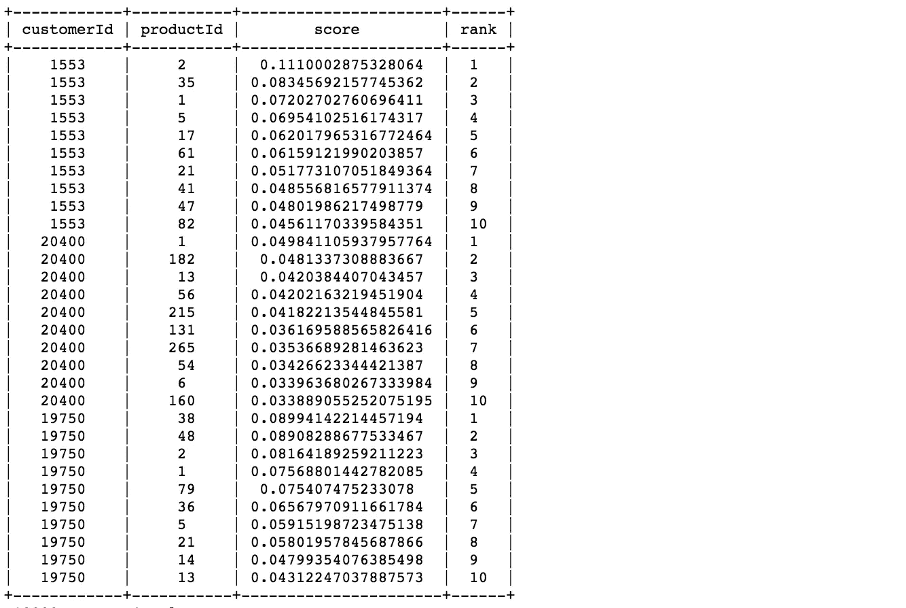*

**二。使用采购模型**

```
*name = 'cosine'
target = 'purchase_dummy'
cos_dummy = model(train_data_dummy, name, user_id, item_id, target, users_to_recommend, n_rec, n_display)*
```

*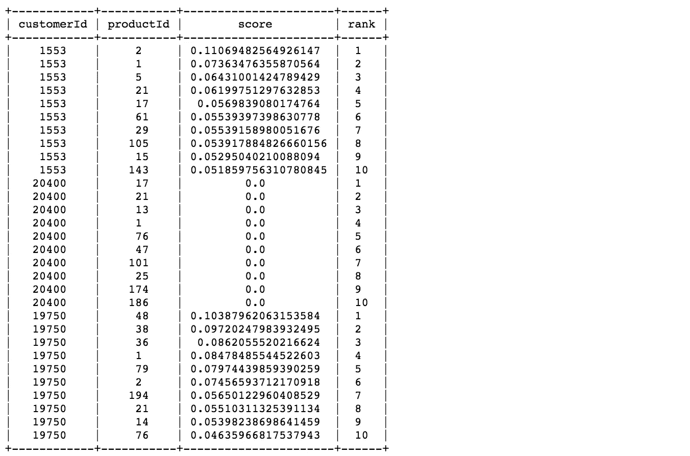*

**三。使用比例采购计数**

```
*name = 'cosine' 
target = 'scaled_purchase_freq' 
cos_norm = model(train_data_norm, name, user_id, item_id, target, users_to_recommend, n_rec, n_display)*
```

*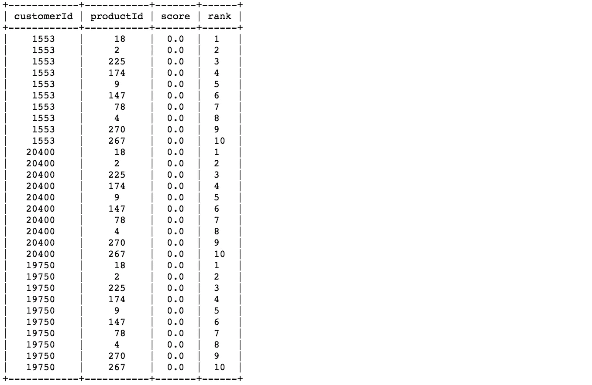*

## *7.3.`Pearson`相似性*

*   *相似性是两个向量之间的皮尔逊系数。*
*   *它由以下公式定义*

*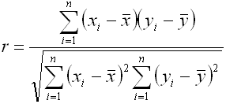*

**一、使用采购盘点**

```
*name = 'pearson'
target = 'purchase_count'
pear = model(train_data, name, user_id, item_id, target, users_to_recommend, n_rec, n_display)*
```

*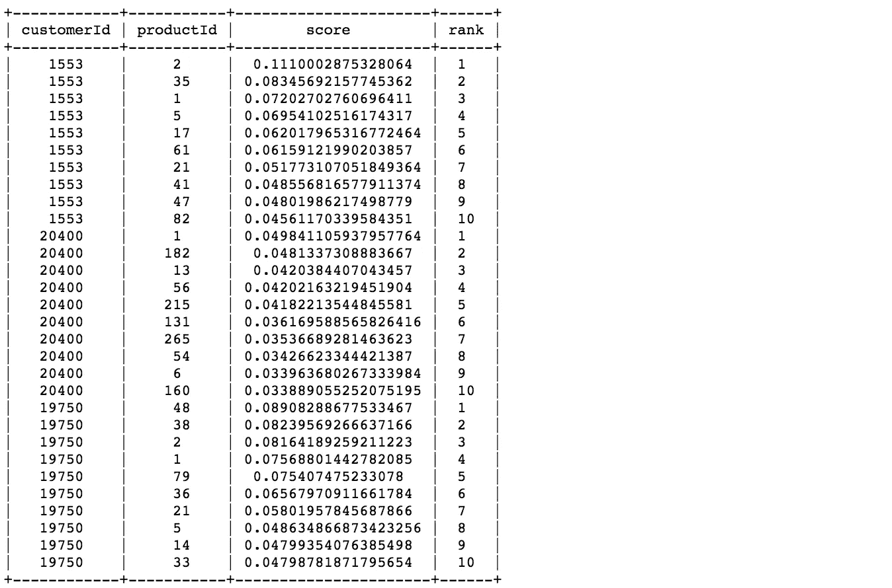*

**二。使用采购模型**

```
*name = 'pearson'
target = 'purchase_dummy'
pear_dummy = model(train_data_dummy, name, user_id, item_id, target, users_to_recommend, n_rec, n_display)*
```

*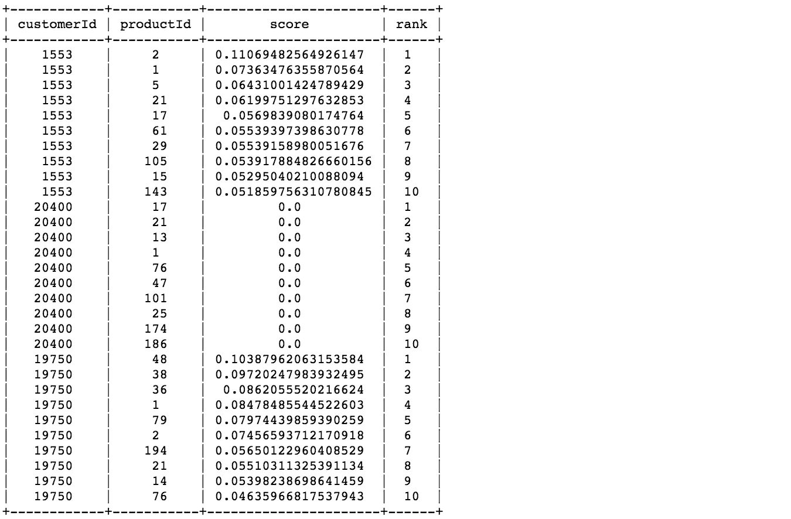*

**三。使用比例采购计数**

```
*name = 'pearson'
target = 'scaled_purchase_freq'
pear_norm = model(train_data_norm, name, user_id, item_id, target, users_to_recommend, n_rec, n_display)*
```

*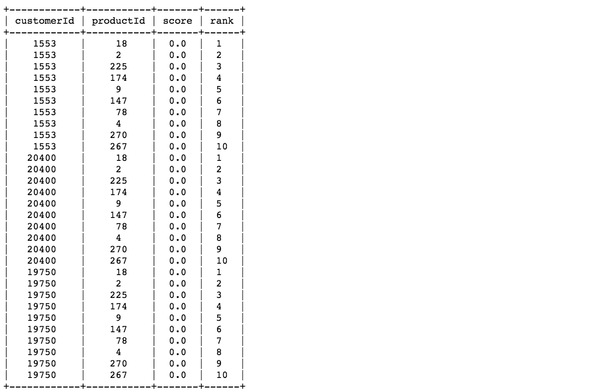*

## *8.模型评估*

*为了评估推荐引擎，我们可以使用 RMSE 和精确召回的概念。*

****RMSE(均方根误差)****

*   *测量预测值的误差*
*   *RMSE 值越小，推荐越好*

****二世。召回****

*   *用户购买的产品中有多少是被推荐的？*
*   *如果客户购买了 5 件产品，而推荐决定展示其中的 3 件，那么召回率为 0.6*

****三世。*精度***

*   *在所有推荐的商品中，有多少是用户真正喜欢的？*
*   *如果向客户推荐了 5 件产品，而他购买了其中的 4 件，那么精度是 0.8*

***为什么召回率和准确率都很重要？***

*   *考虑这样一种情况，我们推荐所有产品，因此我们的客户肯定会涵盖他们喜欢和购买的项目。在这种情况下，我们有 100%的召回！这是否意味着我们的模型是好的？*
*   *我们必须考虑精确度。如果我们推荐 300 件商品，但是用户喜欢并且只买了其中的 3 件，那么准确率是 0.1%！这种非常低的精度表明模型并不伟大，尽管他们的回忆非常好。*
*   *所以我们的目标是优化召回率和准确率(尽可能接近 1)。*

*让我们首先为模型评估创建初始可调用变量:*

```
*models_w_counts = [popularity_model, cos, pear]
models_w_dummy = [pop_dummy, cos_dummy, pear_dummy]
models_w_norm = [pop_norm, cos_norm, pear_norm]**names_w_counts** = ['Popularity Model on Purchase Counts', 'Cosine Similarity on Purchase Counts', 'Pearson Similarity on Purchase Counts']
**names_w_dummy** = ['Popularity Model on Purchase Dummy', 'Cosine Similarity on Purchase Dummy', 'Pearson Similarity on Purchase Dummy']
**names_w_norm** = ['Popularity Model on Scaled Purchase Counts', 'Cosine Similarity on Scaled Purchase Counts', 'Pearson Similarity on Scaled Purchase Counts']*
```

*让我们比较一下我们基于 RMSE 和精确召回特征构建的所有模型:*

```
***eval_counts** = tc.recommender.util.compare_models(test_data, models_w_counts, model_names=names_w_counts)**eval_dummy** = tc.recommender.util.compare_models(test_data_dummy, models_w_dummy, model_names=names_w_dummy)**eval_norm** = tc.recommender.util.compare_models(test_data_norm, models_w_norm, model_names=names_w_norm)*
```

## *8.1.评估输出*

*   **基于 RMSE**

*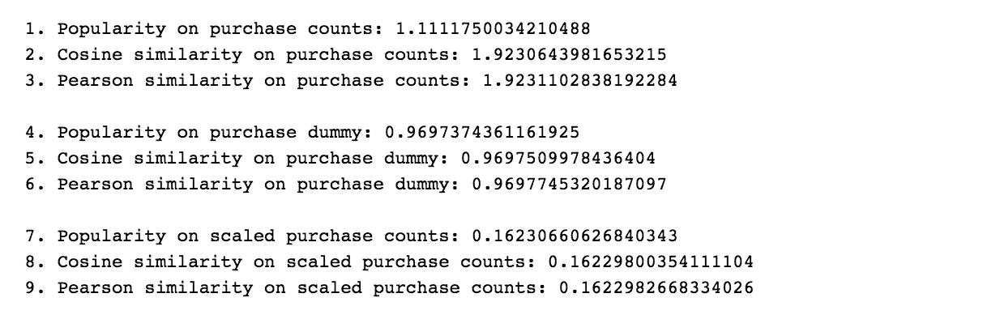*

*   **基于精度和召回**

**

## *8.2.评估摘要*

*   ***流行度与协同过滤:**我们可以看到，对于购买计数，协同过滤算法比流行度模型工作得更好。事实上，流行度模型没有给出任何个性化，因为它只给每个用户相同的推荐项目列表。*
*   ***精度和召回:**查看上面的总结，我们看到购买计数的精度和召回>购买虚拟>标准化购买计数。然而，因为标准化购买数据的推荐分数是零且恒定的，所以我们选择哑元。事实上，虚拟模型和标准化数据模型的 RMSE 并没有太大的不同。*
*   ***RMSE:** 由于 RMSE 使用`pearson`距离比`cosine`距离高，我们将选择较小均方误差的模型，在这种情况下将是余弦。*

> *因此，我们选择**购买虚拟产品的余弦相似度**方法作为我们的**最终模型。***

# *9.最终输出*

*最后，我们希望将推荐输出的格式处理成一个我们可以导出到 *csv* 的格式，以及一个将返回给定客户 ID 的推荐列表的函数。*

*我们需要首先使用整个数据集重新运行模型，因为我们使用训练数据和测试集来评估最终模型。*

```
***final_model** = **tc.item_similarity_recommender.create**(tc.SFrame(data_norm), 
                                            user_id=user_id, 
                                            item_id=item_id, 
                                            target='**purchase_dummy**', similarity_type='**cosine**')**recom** = **final_model.recommend**(users=users_to_recommend, k=n_rec)
**recom.print_rows**(n_display)*
```

## *9.1.CSV 输出文件*

*在这里，我们希望将我们的结果处理成 csv 输出。让我们看看我们有什么:*

```
***df_rec** = recom.to_dataframe()
print(df_rec.shape)
df_rec.head()*
```

*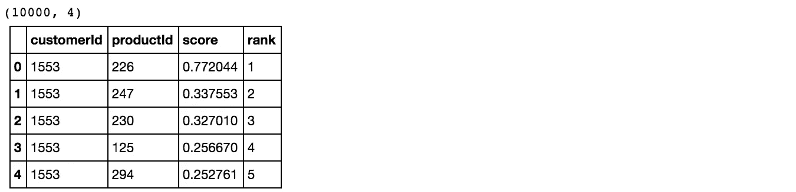*

*让我们定义一个函数来创建所需的输出:*

```
***def** create_output(model, users_to_recommend, n_rec, print_csv=**True**):
    recomendation = model.recommend(users=users_to_recommend, k=n_rec)
    df_rec = recomendation.to_dataframe()
    df_rec['recommendedProducts'] = df_rec.groupby([user_id])[item_id] \
        .transform(**lambda** x: '|'.join(x.astype(str)))
    df_output = df_rec[['customerId', 'recommendedProducts']].drop_duplicates() \
        .sort_values('customerId').set_index('customerId')
    **if** print_csv:
        df_output.to_csv('../output/option1_recommendation.csv')
        print("An output file can be found in 'output' folder with name 'option1_recommendation.csv'")
    **return** df_output*
```

*让我们打印下面的输出，并将`print_csv`设置为 *true* ，这样我们就可以在 *csv* 中打印出我们的输出文件，你也可以在这里 找到它 [**。**](https://github.com/moorissa/medium/tree/master/items-recommender/output)*

```
***df_output** = create_output(pear_norm, users_to_recommend, n_rec, print_csv=**True**)
print(df_output.shape)
df_output.head()*
```

**

## *9.2.客户推荐功能*

*让我们定义一个函数，该函数将返回给定客户 ID 的推荐列表:*

```
***def** customer_recomendation(customer_id):
    **if** customer_id **not** **in** df_output.index:
        print('Customer not found.')
        **return** customer_id
    **return** df_output.loc[customer_id]*
```

*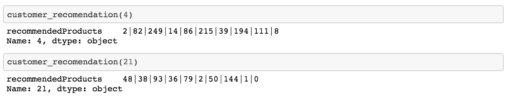*

**答对了！**

# *摘要*

*在本文中，我们能够一步一步地向客户提出建议。我们使用带有`Cosine`和`Pearson`测量的协同过滤方法，并将这些模型与我们的基线流行度模型进行比较。*

*我们还准备了三组数据，包括常规购买计数、虚拟购买以及标准化购买频率作为我们的目标变量。使用 RMSE、精度和召回，我们评估了我们的模型，并观察了个性化的影响。最后，我们选择使用虚拟数据的余弦方法作为我们的最佳推荐系统模型。*

**

*希望你喜欢阅读这篇文章，现在准备创建自己的“添加到购物车”按钮。如果你想要更多这样的阅读，请给 50 个掌声并在下面评论:)享受黑客生涯！*

**Moorissa 是一位使命驱动的数据科学家和社会企业爱好者。2017 年 12 月，她从哥伦比亚大学毕业，研究数据科学和机器学习。她希望每次都能利用自己的技能让世界变得更美好。**