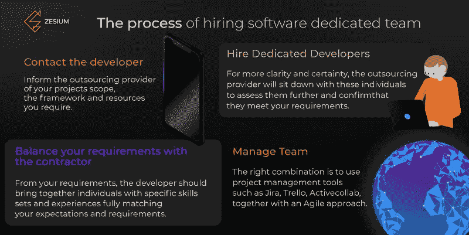

# 如何打造远程梦之队？

> 原文：<https://medium.datadriveninvestor.com/how-to-build-a-remote-dream-team-174e6eb3d54f?source=collection_archive---------13----------------------->

为你的公司建立一个团队是困难的，但是建立一个软件开发团队更加困难。团队合作在建立一个软件专用团队中是必不可少的-你必须找到比我更经常说我们的人。你可能认为你不需要这样的团队，但这里有一些原因会向你展示相反的情况。

# **什么时候你需要一个专门的软件团队？**

如果你不确定你是否需要一个专门的软件团队，这里有一些例子说明你需要他们:

*   **当你没有足够的专业知识，你需要一个狭窄的技术**

您有足够的能力，您的任务正在运行，但您收到了一个新项目，而您缺少该项目的技术，或者您的员工没有足够的经验来处理所有的任务。

*   **当你努力寻找合适的开发人员时**

你正试图为这项任务找到合适的人，但在你想要的领域缺乏自由开发者，或者他们没有你需要的专业知识。

*   **当你的团队很忙，而你需要一个替补时**

我们都有这样的时期，我们被任务塞满了，但是我们缺少人来按时完成任务。在这些情况下，一个专门的团队可能是克服能力差距的正确解决方案。你不必像一次性工作一样永久雇佣他们。

*   **当地开发商价格昂贵，您需要优化预算**

你有一个严格的项目预算或资金不足，所有当地开发商对你来说都太贵了。既然你必须完成这个项目，最快的解决办法就是从你的公司里雇佣一个价格更合理的人。

*   **当您的工作负载发生变化，您需要快速适应时**

你有工作量大和工作量小的时期，你不想每个月给某人同样的钱，因为他们的工作量全年都不一样。通过雇佣远程团队，您可以在工作量较高时填补这些缺口，按项目支付报酬，并且只按他们工作的时间支付报酬。

# **如何评价一个专门的软件开发团队**

*   **公司经历**

不要将复杂或昂贵的项目委托给经验不足 2-3 年的初级团队。这样的团队要么缺乏必要的经验，要么由于缺乏沟通和对您需求的理解而无法按时交付工作。

*   **人员规模**

10 人或更少的团队通常是高度专业化的。这意味着，如果关键团队成员生病或离开团队，没有人可以替代他或她。最好的公司规模应该在 50 到 200 人之间，因为他们大到足以满足你的需求，但又小到足以献身于你的项目。

**公司投资组合**

我建议你联系一下那个公司以前的客户，看看他们对项目管理和开发，团队互动和反馈反应等事情是否满意。另一种了解公司更多信息的方式是像 Clutch.co T2 T3 这样的网站。

*   **产品质量**

要求公司提供他们开发的工作样本和解决方案的示例，或者尝试使用以前客户的服务。如果他们的产品是直观的、高性能的并且工作快速——这个软件开发团队可以交付高质量的产品。

*   **公司网站**

请第三方专家查看所选团队的网站。不要只看设计(虽然它必须是好的)，但也有其他前提-网站必须功能，直观和优化。如果团队不能为他们自己的网站做到这一点，他们将很难为你的产品提供这些品质。

# 如何让一个专注的开发团队变得高效

1.  **将项目分成任务**

如果您不想为项目中的不同任务等待太长时间——而不是等待团队完全完成产品，您可以将项目划分为任务。你的团队应该在一定的时间内交付少量的任务。这样你将确保你的项目在你的时间框架和质量范围内。

**2。利用相同或相似的时区**

如果你想建立一个有效的专门开发团队，你和团队之间的不断沟通是必须的。如果你选择一个时差太大的国家，你会有一个很短的重叠时间，不会有有效的沟通。如果你选择一个和你在同一个时区或相近时区的团队，沟通会更好(尤其是使用 Slack 或 Skype 等工具)，而且去你的合作伙伴办公室的费用也不会很高。

**3。给你的团队提供项目的相关信息**

使用 scrum 板作为敏捷技术来管理专门的开发团队。创建一个 scrum 板，你、团队和项目经理可以用它来提高项目的透明度。这将确保每个人都可以访问任务的进度，从而让每个人都参与进来。此外，您应该使用项目管理工具来确保透明度和效率。

> ***团队合作——走到一起是开始，团结是进步，合作是成功** *【亨利·福特】**

# *如何确保长期成功*

*一个专门的软件开发团队的价值可能很难衡量，产品所有者必须采取额外的步骤来交流进展和评估结果。*

*当与软件专业团队合作时，要评估的不仅仅是劳动力成本。使用[吉拉](https://www.atlassian.com/software/jira?aceid=&adposition=1t1&adgroup=63127837864&campaign=1439934854&creative=291643332398&device=c&keyword=jira&matchtype=e&network=g&placement=&ds_kids=p34164036290&ds_e=GOOGLE&ds_eid=700000001558501&ds_e1=GOOGLE&gclid=CjwKCAjwu5veBRBBEiwAFTqDwRLgO0bCXCy866J0pHYuWK5BUKpiWtq217H8ocuST-Ng2DoB10QRtxoC2oIQAvD_BwE&gclsrc=aw.ds)、[特雷罗](https://trello.com)、 [ActiveCollab](https://activecollab.com/) 等项目管理工具跟踪工作量。使用敏捷方法将帮助您绘制和评估 sprints，以便您可以分析和优化业务开发工作。*

*在敏捷开发中，持续的沟通是必不可少的。如果您的开发团队属于相同或相似的时区，工作会更容易，因为您可以在工作时间使用 [Slack](https://slack.com/) 或 [Skype](https://www.skype.com/en/) 进行交流。另一个好处是，在一路上发生巨大变化的情况下，你们可以很容易地相互拜访。*

*透明度和信任是不可分割的，没有双方的参与，两者都难以实现。一定要和你的伙伴分享细节和想法，以确保你们两个都在同一页上，你会看到你的项目的附加值。*

*建立软件专用团队并不一定如此具有挑战性。通过利用不同工具的优势，并与一家将你视为 VIP(非常重要的合作伙伴)的好公司合作，流程将变得更加容易，收益巨大。*

***结论***

*IT 外包的流行很容易理解，因为它结合了较低的软件开发成本和高技能的员工。如果你做出明智的选择，对于大型项目和持续工作量的长期协议来说，这可能是一个有益的选择。*