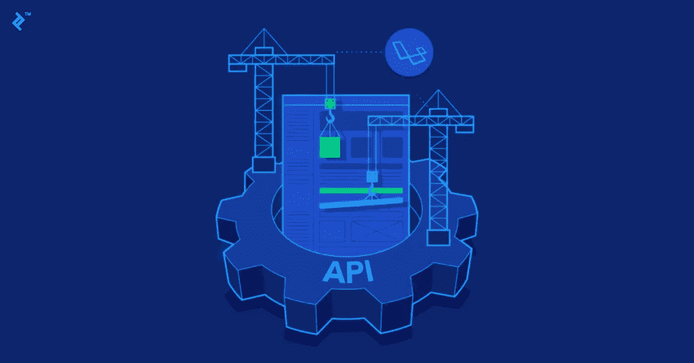
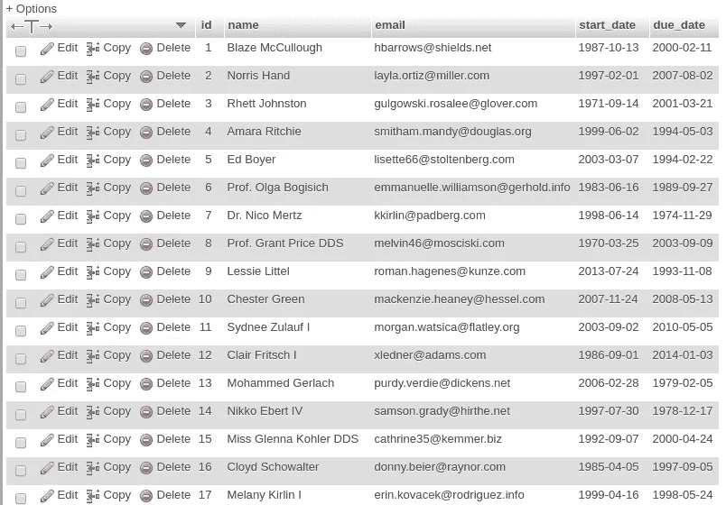
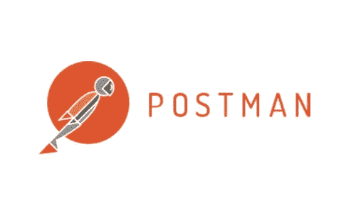
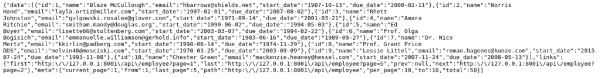
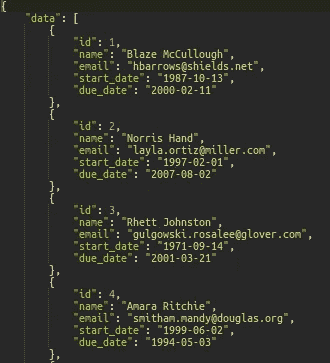

# 如何在 Laravel 6.0 中构建 REST API

> 原文：<https://medium.datadriveninvestor.com/how-to-build-a-rest-api-in-laravel-6-0-71a1487fb406?source=collection_archive---------0----------------------->

本教程的目标是完全的初学者，所以，我们将要构建的 API 将尽可能的简单。本教程假设您已经在正确的文件路径上，并且您的机器上已经安装了 composer。此外，需要基本的 PHP 和 MVC 知识来理解这里发生的事情。

如果你不知道 Laravel 6.0 的新特性，并且想了解一下最近的变化，我推荐你看一看这里的[](https://medium.com/datadriveninvestor/laravel-6-0-what-you-should-know-c3e68e11d1d)**。**

****

# **装置**

**首先，您需要打开您的终端并运行以下命令来安装 Laravel 安装程序:**

```
composer global require laravel/installer
```

**如果您成功地正确安装了 Laravel 安装程序，那么现在您可以运行下面的代码，以您选择的名称创建一个 Laravel 项目。之后，更改目录并检查所有默认文件夹和文件是否都在那里:**

```
laravel new test_apicd test_apils
```

**在我们继续下一步之前，通过运行以下命令检查您是否连接到了您的 web 服务器(只有在您安装了 PHP 的情况下才有效):**

```
php artisan serve
```

# **设置您的环境**

**接下来，您需要在您的。环境文件。由于我们通过 Laravel 安装程序安装了 Laravel，因此应该已经生成了 app 密钥。如果您有应用程序密钥，应该只有两个变量需要更新。将' DB_DATABASE '更改为您要创建的数据库的名称。然后，更新您的“DB_PASSWORD ”,使其等于您的 MySQL 密码。**

**[](https://www.datadriveninvestor.com/2019/02/25/6-alternatives-to-the-yahoo-finance-api/) [## 雅虎财经 API |数据驱动投资者的 6 种替代方案

### 长期以来，雅虎金融 API 一直是许多数据驱动型投资者的可靠工具。许多人依赖于他们的…

www.datadriveninvestor.com](https://www.datadriveninvestor.com/2019/02/25/6-alternatives-to-the-yahoo-finance-api/) 

在创建迁移之前，我们需要创建一个空数据库，以便迁移知道去哪里。使用 PHPMyAdmin 或 Sequel Pro 这样的接口来创建数据库可能更容易。但是如果你想使用命令行。以下是登录 MySQL、创建数据库和显示数据库的命令:

```
mysql -u root -pCREATE DATABASE test_api;SHOW DATABASES;
```

# 迁移


接下来，迁移。在创建我自己的迁移文件之前，我喜欢检查我是否需要 Laravel 附带的默认迁移文件。如果我没有，我就删除它们。它们位于数据库/迁移下。这也是您创建的迁移文件将出现的地方。决定是保留还是删除这些文件后，就该创建迁移文件和表了。为了简单起见，我将创建一个迁移文件。

```
php artisan make:migration create_employees_table --create=employees
```

如果您不知道，命令中的-create 标志将指定您要创建的表的名称。完成后，在数据库/迁移下找到您的迁移文件。现在您将在您的类中看到两个方法。up()会将您的数据“上传”到数据库中。down()将从数据库中“下载”您的数据。在 up()方法中，您需要指定数据库表中所需列的名称和格式。这是我的样子:

```
public function up()
    {
        Schema::create('employees', function (Blueprint $table) {
            $table->bigIncrements('id');
            $table->string('name');
            $table->string('email')->unique(); 
            $table->date('start_date');
            $table->date('due_date'); 
        });
    }
```

一旦您对迁移文件的外观感到满意，就可以运行迁移了。

```
php artisan migrate
```

在继续下一步之前，最好返回到终端中的 MySQL 提示符下，检查您的列是否按照您希望的方式组织。或者用 PHPMyAdmin 或者 Sequel Pro 查一下。

```
USE test_api;SHOW TABLES;SHOW COLUMNS FROM employees;
```

# 填充数据库


播种是将数据快速放入数据库的一个非常有用且简单的解决方案。手动将数据插入数据库会节省你大量的时间和精力。首先，您需要创建种子文件。例如，如果您要播种的表名为“employees ”,那么您的命令将如下所示:

```
php artisan make:seeder EmployeesTableSeeder
```

而植入数据库是将数据插入数据库的一种快速方法。工厂为您节省了大量的时间和精力来指定每个模型种子的值。要创建一个工厂并将其连接到您将立即创建的模型，请运行以下命令(使用单数，而不是复数来命名您的工厂):

```
php artisan make:factory EmployeeFactory --model=Employee
```

然后创建您的模型。

```
php artisan make:model Employee
```

如果您遵循前面的命令，模型将已经链接到种子和工厂文件。

现在，您已经拥有了填充数据库所需的所有文件。在我们继续下一步之前，如果您删除了之前不想要的迁移文件，请执行下一步。如果您保留了它们，您可以跳到我们编辑工厂文件的部分。为了防止您收到有关未找到的列的 PDO 异常 SQL 状态错误，请在模型中的类下输入以下内容:

```
// prevents SQLSTATE[42S22] 'Column not found' error
    public $timestamps = false;
```

现在转到数据库/工厂下的工厂文件。在这里，您将使用 Faker PHP 库定义每一列的值。Faker 是一个提供“假”数据的非常方便的工具。只不过，数据是真实的。例如，如果您提供 Faker 库中的姓名，这些将是真实姓名，如“John Smith”，而不仅仅是随机的字符串。在这个文件中，您将看到一个方法，编辑它，使它返回您想要插入到数据库中的数据。例如，我有四列想要插入数据。因此，我的方法将是这样的:

```
$factory->define(Employee::class, function (Faker $faker) {
    return [
        'name' => $faker->name,
        'email' => $faker->unique->companyEmail,
        'start_date' => $faker->date,
        'due_date' => $faker->date 
    ];
});
```

如果您不确定您的列需要哪些 Faker 数据类型，您可以在这里找到:[https://github.com/fzaninotto/Faker](https://github.com/fzaninotto/Faker)。

既然已经定义了工厂，现在就可以编辑种子文件了。首先找到您创建的种子文件。我的将被称为 EmployeesTableSeeder，它位于 database/seeds 下。它有一个名为 run()的方法。每当您在命令行中运行种子时，都会调用此方法。我们很快就会这么做。

```
public function run()
    {
        factory(App\Employee::class, 50)->create();
    }
```

您的方法中的数字将指定您希望表中包含的行数(在我的例子中是 50)。

一旦你完成了，切换到你的 DatabaseSeeder.php 文件，注释掉这个方法。你要做的就是确保它调用你的种子。

```
public function run()
    {
        $this->call(EmployeesTableSeeder::class);
    }
```

最后，您可以为数据库设定种子:

```
php artisan db:seed
```

要查看一切是否如预期那样工作，请在 PHPMyAdmin 或 Sequel Pro 上检查您的数据库。



嗯，也许名字不完全像“约翰·史密斯”。

# 获取数据


好的，我们有一些数据要处理。为了获取和构造数据，我们首先需要创建我们的控制器:

```
php artisan make:controller EmployeeController -r
```

请注意-r 标志。通过在命令中包含这一点，您将在控制器类中自动获得必要的 HTTP 方法。所以，你会想包括这一点。然而，出于本教程的考虑，我的 API 将特别简单，所以我将删除除' index()'之外的所有方法。

在我们开始修改任何东西之前，让我们访问‘routes/API . PHP’并设置路由，这将使我们能够连接到控制器。您将拥有的路线数量将取决于您拥有的控制器方法的数量。我只使用' index()'，所以，我只需要添加一条路由:

```
Route::get('employee', 'EmployeeController@index');
```

接下来，我们需要制作我们的资源文件。这将决定我们从数据库中检索哪些列，以及它们的标签。例如，如果我们想从每一行中检索 id，并将它们标记为“ID ”,我们将返回:

```
'id' => $this->id
```

“id”是标签，而“$this->id”是从数据库中检索的实际 id。

我希望从数据库中唯一的表中检索所有的列。所以，我的方法是这样的:

```
public function toArray($request)
    {
        return [
            'id' => $this-id,
            'name' => $this->name,
            'email' => $this->email, 
            'start_date' => $this->start_date,
            'due_date' => $this->due_date
        ];
    }
```

差不多完成了。让我们转到“app/Http/Controllers”中的控制器文件。这些将包含所有使用'— resource '创建的方法。除非你像我一样，决定把不需要的都删了。在本教程中，我将只编辑索引文件，这样我们就可以获取数据。在我们这样做之前，让我们通过在您的类上添加以下内容来连接到模型和资源:

```
use App\Employee; // connects to the modeluse App\Http\Resources\Employee as EmployeeResource; // connects to the resource file
```

当连接到上面的资源文件时，你会注意到我们使用了“Employee as EmployeeResource ”,尽管在这种特殊情况下资源文件将被称为“Employee.php ”,所以我们将它引用为“Employee ”,对吗？问题是这个模型也叫做‘Employee . PHP ’,所以我们事先称它为‘Employee’。我们不能用相同的名字来引用它们，因为这会引起冲突。尝试一下，您的文本编辑器会向您抛出一个警告，告诉您该引用已经存在。

在“index()”方法下，我将添加两行代码。第一行将指定分页(我希望每页显示多少行数据，对我来说是 10 行)。第二行将获取我们创建的资源，并简单地将其作为一个[集合](https://laravel.com/docs/6.x/collections)返回。

```
public function index()
    {
        $employees = Employee::paginate(10);

        return EmployeeResource::collection($employees);
    }
```

# 查看数据



尝试查看数据时，您有两种选择。其中一个选择就是在浏览器中输入你的网址。但是，您的数据会显示如下:



咩。或者，你可以使用一个 API 开发平台如[邮差](https://www.getpostman.com/)来查看你的数据:



好多了。

如果您不确定如何输入您的 URL，您应该输入域或 IP 地址，然后输入“api”，然后输入您的资源的名称:

```
[http://127.0.0.1:8001/api/employee](http://127.0.0.1:8001/api/employee)
```

# CORS 构型

这是我们需要做的最后一件事。如果没有 CORS(跨源资源共享)配置，您将无法连接到刚刚用前端应用程序创建的 API。如果你想更多地了解 CORS，我建议你看看这个[视频](https://youtu.be/NzEEIiDytBI)。如果你对印度口音有困难，你可以在这里查看这个相当长的解释。

有很多关于 CORS 配置的教程，但是大多数都不能在 Laravel 6.0 上使用。幸运的是，我将要向您展示的这个方法不需要很长时间，而且相当简单。

首先，你要安装一个来自 https://github.com/barryvdh/laravel-cors 的软件包。

```
composer require barryvdh/laravel-cors
```

安装完成后，跳转到 config/app.php，将这行代码添加到“providers”数组的底部:

```
Barryvdh\Cors\ServiceProvider::class,
```

添加之后，访问 app/Http/Kernel.php，在“受保护的中间件”底部添加这行代码:

```
\Barryvdh\Cors\HandleCors::class,
```

最后，运行以下命令:

```
php artisan vendor:publish --provider="Barryvdh\Cors\ServiceProvider"
```

好了，现在你都准备好了！

请随意使用我在本教程[中构建的示例 API。](https://github.com/greevesh/test_api)**