# 如何在 Rasa 中构建一个简单的聊天机器人

> 原文：<https://medium.datadriveninvestor.com/how-to-build-a-simple-chatbot-2a51394de7f5?source=collection_archive---------1----------------------->

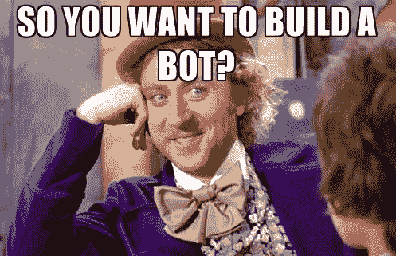

好了，今天我们将讨论构建人工智能驱动的聊天机器人的简单步骤。人工智能驱动的聊天机器人；这个名字听起来可能超级酷，你可能会害怕尝试这些简单的步骤，甚至没有读完整个故事。相信我，这个机器人的现实并不可怕，尽管它的名字听起来超级怪，有点科学。

在本教程中，我们将检查一个名为 RASA 的聊天机器人框架。在我们玩它弄脏我们的手之前，让我们来看看我们的游戏玩家 RASA，人工智能驱动的开源聊天机器人框架。

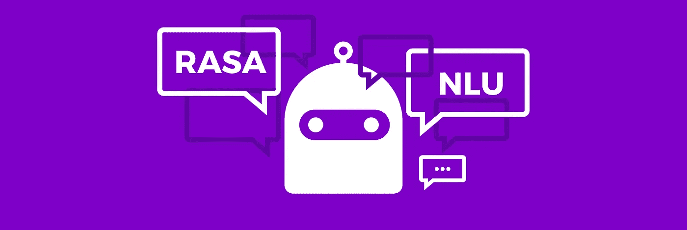

## RASA 总体情况

简单来说，RASA 是一个开源的聊天机器人框架。RASA 有两个主要组成部分，两者都有不同的目标。但最终，它为用户提供了一个完美的解决方案。

 [## 对话式人工智能的兴起将如何影响世界|数据驱动的投资者

### 从不同的专业服务，保险，教育，金融，旅游，电信，到建筑，银行，和…

www.datadriveninvestor.com](https://www.datadriveninvestor.com/2019/02/07/how-the-rise-of-conversational-ai-will-impact-the-world/) 

*   拉萨·NLU
*   RASA 核心

简而言之，***拉莎 NLU*** 是一个自然语言理解组件，用于识别对话中的意图(用户的意图)和实体(与用户意图相关的术语或对象)。

***RASA core*** 是一个对话引擎，处理对话流、话语和动作。别担心，我会在本教程的后面向你解释什么是话语和动作。

RASA 是上述两个主要组件的组合，为开发者提供了一个简单的聊天机器人开发环境。既然我们对 RASA 有了一个想法，那就让我们动手吧。首先，你需要安装 rasa。(建议在安装 rasa 之前安装 python、pip、numpy、scipy 和 tensorflow)

## RASA 安装

这将安装 rasa。更多详情请参考此[链接](https://rasa.com/docs/rasa/user-guide/installation/)。现在您已经安装了 rasa，您必须为您的聊天机器人的 NLU 管道安装先决条件。

## 什么是 rasa 管道，如何选择管道？

Rasa 对传入的消息使用管道。传入的消息由一系列依次执行的组件处理。有用于实体提取、意图分类、拼写检查和其他的组件。rasa 定义了几个管道，如果需要，您可以创建我们自己定制的管道。一般来说，如果你的聊天机器人的训练样本少于 1000 个，你可以使用`pretrained_embeddings_spacy` 管道；如果你的训练样本多于 1000 个，你可以使用`supervised_embeddings`管道。要进一步了解管道，您可以访问此[链接](https://rasa.com/docs/rasa/nlu/choosing-a-pipeline/#understanding-the-rasa-nlu-pipeline)

今天我们使用`supervised_embeddings`管道。对于此管道，我们需要在您的计算机上安装 TensorFlow。

好了，现在我们安装了我们需要的一切，我们可以建立我们的第一个聊天机器人。

现在创建一个新文件夹，并在该文件夹中运行`rasa init --no-prompt`。您将看到如下所示的显示。项目创建完成后，您将看到几个文件夹，它们的结构如下。

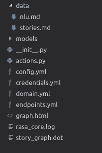

让我们更深入地研究一下文件夹。

**记住** —在 rasa 中，我们使用**意图**来识别用户的意图，使用**动作**来表示机器人对用户输入的响应。

## nlu.md

在这个 md 文件中，有训练数据。你可以在这里定义你的意图。举个例子，让我们来看一个短语，比如“早上好”。这里的 intent(或 the intention)是一个问候语。

我们应该用一种预先定义好的方式来定义意图。你应该这样定义你的意图`## intent:your_intent_name`。在您为您的意图命名后，您可以为培训目的提供该意图的示例。当举例说明你的意图时，你应该遵循下面的模式。(您的示例应以 mark 开头，后跟一个空格)

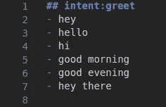

intent with few examples

## stories.md

在这个文件中，您定义了对话路径或故事路径。想象一下这样的对话。

🤓—“嗨”(**意图**)

🤖——“嘿！你好”(**机器人的动作**)

🤓—“非常好”(**意图**)

🤖—“太好了，继续”( **bot 的动作**)

所以这是一个对话，我们需要在 stories.md 文件中定义它。当你定义一个故事路径时，首先你需要给这个故事路径一个名字，然后你根据 rasa 规则定义你的故事。下面是上述对话的例子。

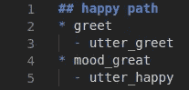

sample story

在上图中，您可以看到故事路径的名称以两个标签(##)开头。用户的意图用星号(*)标记，相关的机器人动作在下一行用破折号(-)标记定义。这些规则是在 rasa 中定义一个故事的主要规则。

## domain.py

这个文件定义了我们的机器人所处的世界，例如用户***输入它应该期望*** 得到的， ***动作它应该能够预测*** ，如何响应，以及存储什么信息都在 domain.py 文件中定义。

***输入它应该期望下面给出***

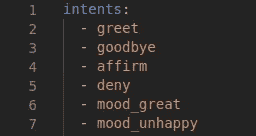

您的意图列表应列在 domain.py 文件中的意图类别下。(这些意图在 nlu.md 文件中定义)

***动作它应该可以预测*** 给出如下

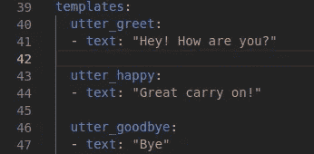

在这里，您可以在 domain.py 文件中的 templates 类别下看到为 out bot 定义的操作。在定义您的操作之后，您必须在 domain.py 中的 actions 类别中列出这些操作。

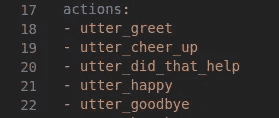

现在你对 rasa 有了一个基本的概念。让我们构建一个简单的聊天机器人。

我们的目标——简单的聊天机器人，向我们要一个笑话来让我们开心。

让我们为聊天机器人创建一个简单的故事。

😊—嗨

🤖嘿，你好吗？

😊—我很无聊

🤖想听个笑话吗？

😊—是的

🤖—敲门敲门

😊—谁在那里

🤖—是我健谈？

😊—健谈的谁？

🤖你总是问谁在那里？

😊— lol

🤖很高兴你笑了

对于这个 bot，下面给出 nlu.md。

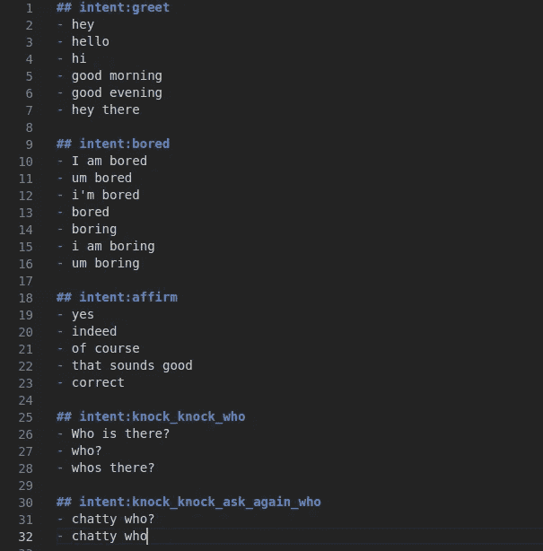

对于这个 bot，domain.py 如下所示

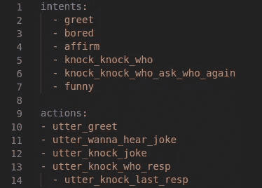

对于我们的机器人，stories.md 如下所示

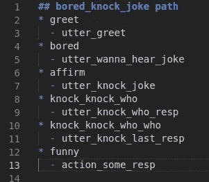

添加这些意图、动作和故事后，您需要使用`rasa train`训练您的聊天机器人，然后使用`rasa shell`运行您的机器人。