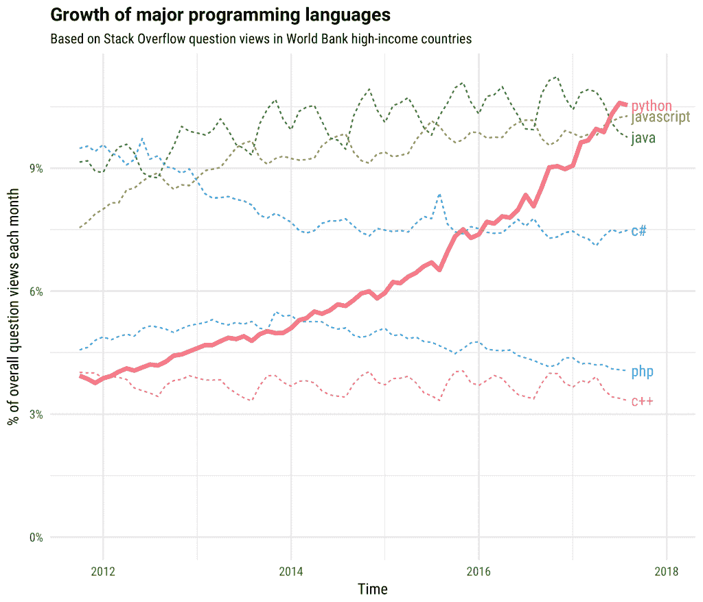
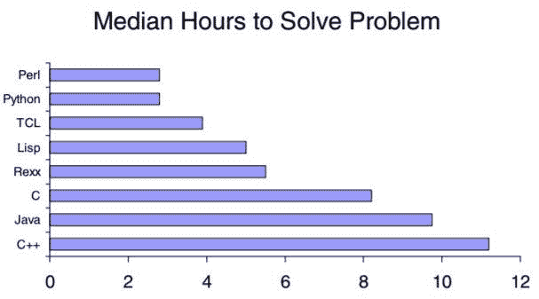

# 如何用 Python 为你的 Fintech 产品构建独特的技术

> 原文：<https://medium.datadriveninvestor.com/how-to-build-a-unique-technology-for-your-fintech-product-with-python-f01b6cdfbf4f?source=collection_archive---------12----------------------->

Fintech 可以直接翻译为推动银行、保险、投资以及基本上任何与金融相关的新技术，也就是说，旨在提供创新、时尚和客户友好的金融产品。

尽管你可能熟悉金融科技风险投资的概念，但你可能不知道它们与 Python 受欢迎程度上升的相关性。

当你仔细观察这两条时间线(见下文)时，你会发现对 Python 开发人员的需求大约在金融科技风险投资开始出现在金融市场的时候开始演变。

[source](https://stackoverflow.blog/2017/09/06/incredible-growth-python/)

[source](https://medium.com/cc-connecting-crypto-with-banking/investor-rundown-reasons-why-we-chose-to-back-orca-cb5e066fedae)

所以这两者结合在一起是有原因的。

# 为什么 Python 非常适合你的金融科技产品

简而言之，Python 是金融领域的优秀编程语言。

在银行业，经济学家已经用它来解决定价问题、交易管理、风险管理等等。Python 符合金融行业的本质和需求。

当然，这不是你的金融科技产品唯一可行的技术。您可以使用其他更传统的技术栈，如 Java 或 C++，但是在您将事情变得比现在更复杂之前，请理解您拥有可以让您更高效、更快速、更直观地开发软件的解决方案。

# Python 提供了简单的语法，对于非技术人员来说很容易理解

Python 以简单著称，这是一个巨大的好处，因为金融科技软件开发可能具有挑战性。

**FinTech 创始人有特殊的规定要处理，比如:**

*   提供最高级别的安全性来保护客户账户和存款
*   符合特定国家的州级规则
*   与特定服务集成，使基本交易成为可能
*   与允许金融科技解决方案运作的传统金融机构整合
*   连接相关的 API 以实现平稳的数据传输

所有这些因素对于建立一个强大、灵活和值得信赖的金融科技产品来吸引、转化和留住最终用户至关重要。那么，为什么不通过部署一种易于编码的语言来使事情变得更简单呢？

**显然，用** [**十行 Python 代码，可以做多达 20 行 Java**](https://pythonconquerstheuniverse.wordpress.com/2009/10/03/python-java-a-side-by-side-comparison/) **！**

这将编码减少了一半。

此外，代码越短，出错的风险就越低，这是你的业务中非常需要的。

Python 可读性强，大家都可以学。这非常好，尤其是当你有不同的专家——技术人员和非技术人员——参与软件开发，并且你希望每个人都在同一页上时。

Python 使得代码更容易向客户解释，他们可以更好地理解开发过程是如何向前发展的。

# Python 堆栈技术让您更快进入市场

金融科技风险投资区别于传统银行的一个主要因素是其灵活性和适应不断增长的消费者预期的能力。

因此，您的技术体系必须具有弹性，为即将到来的升级提供稳定的开放框架。

这正是 Python 所提供的——快速部署和更少的代码需求。这很重要，因为公司最昂贵的资源现在变成了员工的时间。

**旁注:**看看编程语言有多高效:

尽管就性能而言，Python 可能不是最快的语言，但当您考虑上市时间时，它可以很好地工作。

**这对你意味着什么？**

比方说，你的产品的 MVP 版本是使用 Python/Django 栈完成的，你的部分代码仍然可以被修改。您可以尝试修改代码行，编写新的代码来改进您的功能和扩展您的解决方案。

因此，Python 可以让您快速进行产品开发。你的金融科技越早进入市场，你就能越早收集反馈以进行进一步优化，确定你的市场适合度并取得成功。

# Python 提供开源库

Python 的另一个重要优势是可用于 API 集成的开源库。它们可以节省您开发产品的时间，并让您更有效地分析数据，因为您不需要从头开始构建一切。金融科技解决方案需要许多第三方集成。

这意味着，一旦您通过 API 验证了您的集成，您就可以自动传输和分析用户(和组织)数据，而没有任何限制。

**边注:**这是你列出的在金融科技领域流行的 Python 库:

1.  **Finmarketpy —** 分析金融市场
2.  **NumPy —** 科学计算
3.  **熊猫—** 数据分析
4.  **Pyalgotrade —** 算法交易库
5.  **Pybitcointools —** 常识比特币主题 Python ECC 库
6.  **投资组合** —投资组合和风险分析
7.  **Pynance** —从股票和衍生品市场检索、分析和可视化数据
8.  **Pyrisk** —财务风险和绩效
9.  **Quantecon.py** —数量经济学
10.  **Scikit-learn** —机器学习算法
11.  科学计算
12.  滑索——算法交易

你有什么方便的吗？

# 对独一无二的呼唤

在欧洲金融界，有两股相互冲突的力量。一端是年轻且要求高的客户，他们太忙了，没有时间去传统银行，要花几个小时排队等候。他们行动迅速，需要能够让他们快速管理支付的解决方案。

另一方面，传统的银行、投资和保险机构拥有过时的、超级复杂的系统和法规，几乎不可能适应当今数字时代的要求。

出于这些原因，尽管消费者需求强劲，但金融科技风险投资仍不得不在金融业的黑洞中成长。不幸的是，老派官僚不会那么容易进化。

因此，你应该全力以赴，用 Python 为你的 FinTech 产品构建独特的技术，让它创新得不容忽视，简单得不容误解。

这就是 Python 可能是你的答案的地方。

PS:我相信这篇文章会说服你将你的 FinTech 产品基于 Python stack。但是如果还没有，请在下面的评论中提出你的问题。我会回复你的。