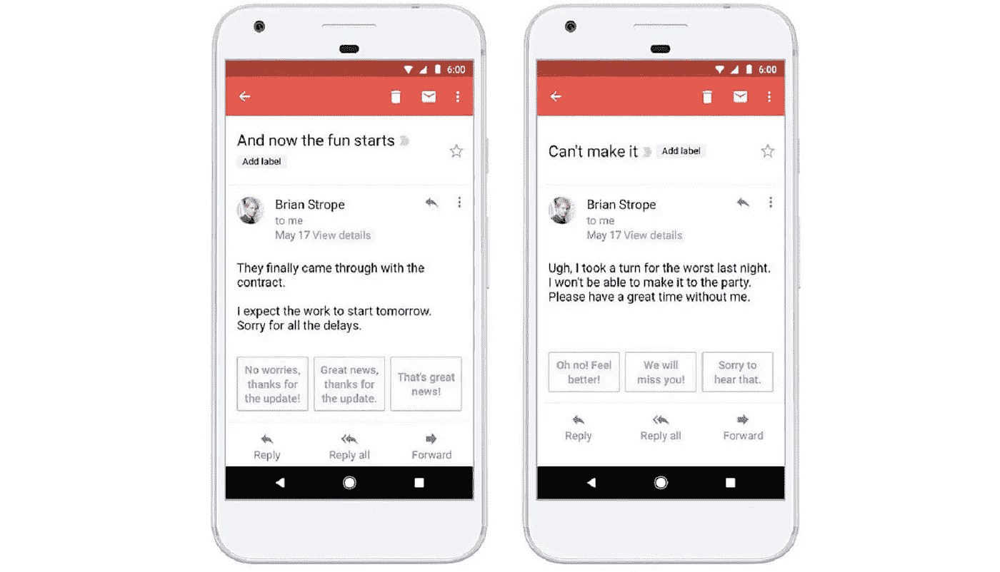
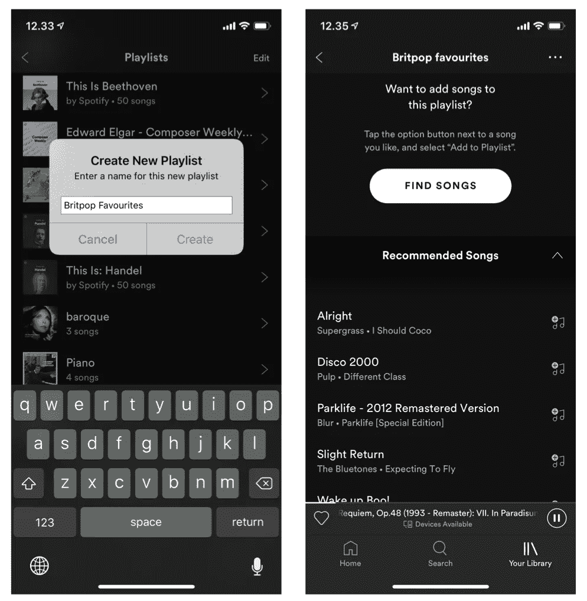
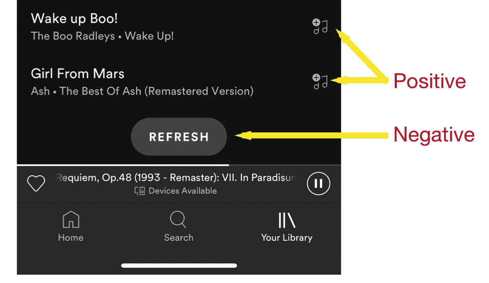

# 如何将人工智能构建到您的产品中

> 原文：<https://medium.datadriveninvestor.com/how-to-build-ai-into-your-product-ae6b54e020c0?source=collection_archive---------9----------------------->

人工智能，特别是机器学习，正在改变我们制造和使用产品的方式。产品经理需要学习新的思维模式来获得收益。

Google’s Smart Reply Feature

亚马逊知道我想买哪些产品。

*谷歌知道我会在邮件回复中写些什么。*

*还有 LinkedIn，除了别的以外，它认识所有和我一起工作过的人。*

但是尽管有这些智慧，这些类型的经历似乎仍然很少。似乎只有科技巨头和人工智能优先的初创公司真正拥抱并受益于这一新的前沿领域。这里有一些给想要获得更多人工智能的产品经理的策略

# 通过实例学习:Spotify 播放列表

在寻找一流的产品体验时，Spotify 总是令人失望。最近在使用机器学习方面真正吸引我眼球的是他们的“创建播放列表”体验。

> [DDI 编辑推荐—机器学习(斯坦福)](http://go.datadriveninvestor.com/stanfordML/matf)

在这个例子中，我创建了一个我最喜欢的 [Britpop](https://en.wikipedia.org/wiki/Britpop) 曲目的新播放列表:

Creating a playlist, and the song suggestions given

我已经印象深刻了！Spotify 已经识别了我的播放列表的标题，并开始建议将英国流行音乐类型的相关曲目添加到列表中。

让我们更深入地研究这个特性，以及它如何利用**人工智能产品** **模式取得成功** …

# 1.使用户能够示教机器

机器学习模型需要积极和消极的信号，才能知道它们是否做得很好。

Spotify 出色地将这些融入了用户体验:每首歌曲旁边的加号按钮是正数，刷新按钮是负数。

Positive and Negative signals via buttons in the UI

这些数据将使数据科学家能够根据其性能重新训练他们的机器学习模型，甚至可以使用[强化学习](https://en.wikipedia.org/wiki/Reinforcement_learning)将改进实时反馈到模型中。

同样聪明的是，在这种情况下，信号在 UX 方面没有任何成本——它们是用户期望拥有的现有典型 UI 元素的一部分。同样，如果用户根本不喜欢这些建议，他们仍然可以通过一个一个地搜索来添加他们的曲目。伟大的不间断人工智能-产品-功能设计！

# 2.从一开始就在灵活性中烘烤

当决策空间很大时，机器很擅长做出选择。因此，如果你有很多选择，例如一个充满内容或产品的目录，你应该开放你的体验，让机器探索所有的结果。

在播放列表建议的示例中，需要做出一些*重要的*决定:

*   推荐几首歌？
*   当用户点击刷新时，如何戏剧性地改变列表？
*   相对于已经在播放列表上的歌曲，用户的个人品味应该被考虑到什么程度？

如果开发人员知道你想尝试让机器来决定这些事情，他们会知道他们需要在代码中保持灵活性。即使你没有建立一个完整的机器学习模型，这些也将是 A/B 测试的绝佳候选，需要同样的灵活性。

# 3.人和机器谁更好？

当考虑如何使用机器学习来改善产品体验时，关键是它是为了**增强，而不是取代产品经理**。产品经理和用户本身非常聪明，他们会比机器学习模型更好(更快)地做出许多类型的决策。

例如，UI 布局决策通常由人类设计师完美完成。决定在哪里放置一个按钮或如何对齐文本，通常最好是按照设计模式来做，通常让机器来优化是没有意义的(它很可能会回到相同的设计模式)。

Centre aligned buttons work pretty well. No need to involve machine learning here!

相反，机器非常擅长根据用户行为给出建议。一旦我开始创建一个更复杂的播放列表，例如“上午晚些时候激励 britpop 跑步”，机器建议可能比人类产品经理能想到的任何启发式方法都更相关和详尽。

# 4.判断 AI-ROI

Spotify 发现，在建立播放列表时推荐歌曲可以为用户节省大量时间。我注意到，自从发现这个功能以来，我创建了更多的播放列表——它们减少了摩擦，并通过使用人工智能增加了价值。

然而，在许多情况下，人工智能不会在人类产品经理所能做的基础上增加太多，而且构建和维护起来会更加耗时。

把人工智能留给它有巨大潜力的产品。为了小收益而内置灵活性和智能通常成本太高。

# 外卖食品

开始在你使用的产品中发现这些模式，下一次你设计一个新功能时，想想一台机器如何能/不能增强体验。