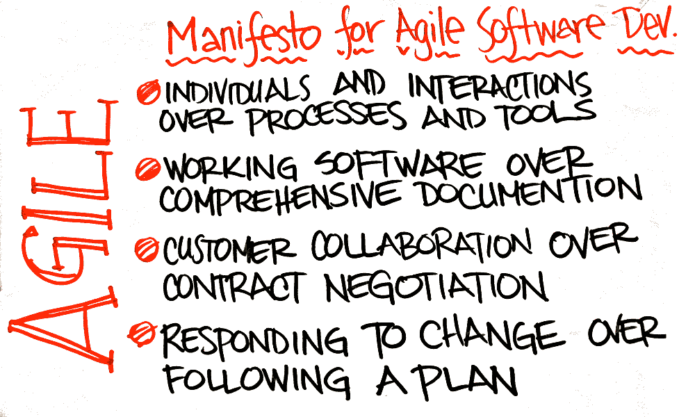
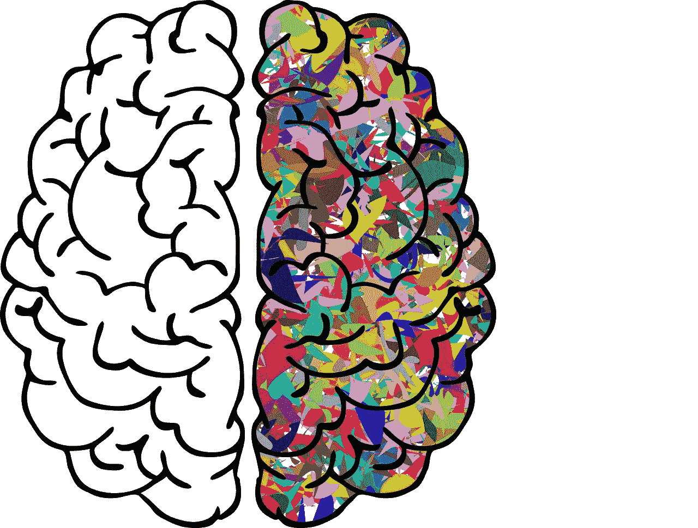

# 如何为你的成功项目建立一个敏捷团队|数据驱动的投资者

> 原文：<https://medium.datadriveninvestor.com/how-to-build-an-agile-team-for-your-successful-projects-data-driven-investor-f8bd8dfcfb83?source=collection_archive---------10----------------------->

Source: tes.com

运动。改变。适应。

这种模型使开发人员能够在没有太多中断的情况下对变化或突发问题做出响应。

敏捷软件开发包含基于'[敏捷宣言](http://agilemanifesto.org/history.html)'原则的最佳实践，即促进跨职能团队之间的高效协作，以成功交付产品或服务。

# 什么是敏捷开发团队？

任何敏捷过程的主要部分都是开发团队，但是团队成为**敏捷团队**需要一些时间和努力。

**Scrum 团队**是前端开发人员、后端开发人员、设计人员和测试人员的跨职能融合。理想的 Scrum 团队由 5-6 人组成。

ScrumMaster(或项目经理)需要确保敏捷团队在过程的每个阶段都在正确的轨道上，但是一旦敏捷团队成长并变得更有效率，他的角色就会减少。

**产品负责人**是另一个重要角色——通常是高管或股东，他们对最终产品如何适应企业长期战略有自己的看法。此人负责直接沟通，向团队通报重大进展，并在必要时实施高层变更。

*将愿景转化为实际成果的最佳方式是拥有一支训练有素的团队。*

Source: ntaskmanager.com

# 敏捷团队的品质

敏捷团队了解变化的动态，因此他们能够适应突发情况——这是任何敏捷团队都需要的。

# 灵活

变化伴随着(用户)反馈而来，这在敏捷开发中至关重要，因此敏捷团队必须快速敏锐地整合反馈。

 [## 数据科学和软件工程哪个更有前途？数据驱动的投资者

### 大约一个月前，当我坐在咖啡馆里为一个客户开发网站时，我发现了这个女人…

www.datadriveninvestor.com](https://www.datadriveninvestor.com/2019/01/23/which-is-more-promising-data-science-or-software-engineering/) 

敏捷团队必须与股东保持联系——他们的最高品质是能够仔细倾听需要做什么，并迅速采取行动。

常见的流程是进行两周的冲刺(这是编码、测试和获得某些特性的反馈的最佳时间)。

# 同样

具有单一目标的统一团队——在每次冲刺后交付一组特性。

敏捷团队通过遵循优先顺序和组织从“到任务”的工作来独立工作，以获得最明显的结果。

由于向同行学习总是比教程更容易，敏捷团队能够解决问题、做出决策并提出创新的解决方案。

有目标有助于敏捷团队前进并保持在正确的轨道上。

# 组织

敏捷意味着效率和自动化——有许多敏捷工具，但是使用自动化工具是必须的。

敏捷包括在春季召开一些重要会议:

*   [**【冲刺】**](https://www.yodiz.com/blog/best-practices-for-sprint-planning-meeting-in-agile-project-management/) **—** 会议应该为即将到来的冲刺提供架构、设定期望并定义待办事项**。**
*   [**回顾和回顾**](https://startinfinity.com/product-management-framework/scrum-sprint/sprint-review-vs-sprint-retrospective) **—** 召开这个会议是为了确保交付的工作具有一致的质量。在任务完成之前，进行同级和经理评审。
*   **—每日会议，重点讨论昨天做了什么、今天在做什么以及会议期间出现的任何问题。**

**所有这些会议确保所有团队成员清楚地了解他们自己的角色和需要完成的任务。**

****

****Source:parenttoolkit.com****

# **适应性**

**不管团队是否对每个特性都没有明确的接受标准，或者不能消除前进道路上的障碍，他们仍然必须完成工作。**

**基本上，敏捷团队可以适应任何情况，无论是理想的还是最坏的情况。**

**团队必须愿意在他们的专业知识之外工作，但不能太远——这并不意味着他们必须在他们不了解的领域工作。**

**这仅仅意味着人们愿意并且能够扩展他们在特定领域的知识，例如，如果某人对数据库很熟练，他/她可以尝试编写组件。**

# **建立敏捷开发团队的阶段**

**如果你想建立一个敏捷团队，你必须意识到这需要时间和努力——团队要经过不同的阶段才能成为拥有共同目标和适当流程的敏捷团队。**

**心理学家 Bruce Tuckman 提出了“形成、冲击、规范和执行”模型，列出了敏捷团队的成长阶段，并展示了最重要的事情，以便更好地理解它们。**

# **形成**

**这一阶段是敏捷转型的开始——它至关重要，帮助人们熟悉彼此和他们的工作，找到有用的信息并建立规则。**

**形成阶段是关于准备和建立基本规则，如概述任务，分配任务，创建时间表和组织工作等。**

**领导者在阐明团队的责任和角色方面起着至关重要的作用。**

****

# **非常精彩的**

**在团队中就像是家庭的一部分——这是大多数团队失败的阶段，因为这里的人们开始突破在形成阶段定义的界限，而且团队成员不同的工作风格发生冲突也并不罕见。**

**基本上，这个阶段是为定义工作量、组织目标和每个成员都应该遵循的指导方针而保留的，以便实现共同的目标。**

**在这一阶段，最好的做法是集思广益，找出团队可能遇到的关键问题的想法和潜在解决方案。**

# **规范化**

**规范阶段用于制定实现目标的策略——它使人们能够解决分歧，学会欣赏团队成员的优势并尊重团队权威。**

**整个团队应该专注于定义最佳的合作方式，并发展共同的价值观。**

**在这个阶段结束时，团队成员应该开始欣赏每个团队成员以及他/她的长处和投入，并开始作为一个有凝聚力的单位一起工作。**

# **受过训练会玩把戏的**

**最后一个阶段是执行阶段——团队成员已经变得自信，能够轻松地合作完成相互交织的任务。**

**当一个团队达到这个阶段时，这意味着他们发现彼此之间很容易沟通，也很容易有效地协调他们之间的任务和职责。**

**这是所有敏捷团队努力达到的一个阶段。**

****

# **敏捷团队的好处**

# **动机**

**如果你增加了团队的信心，就会产生更大的动力。**

**团队意识到公司关心他们的个人发展和进步，并愿意为此投入精力和时间。**

**最重要的是团队获得了彼此的信任，从而创造了归属感。**

# **沟通**

**达到高水平良好沟通的唯一方法是当团队成员有足够的信心表达他们的关注和想法时——这将使团队成员学会新的合作方式。**

# **创造力**

**不同的环境、不同的任务和不同的人促使团队成员更有创造力，在寻找解决方案时发挥他们的想象力，跳出框框思考。**

**如果实施得当，它将鼓励团队在解决日常工作中的问题时应用这种方法。**

**此外，这种类型的创造力也发展了团队解决问题的技能，因为他们学会了一起解决问题，也学会了每个团队成员为团队增加了哪些技能。**

****

# **生产力**

**当团队一起工作一段时间后，他们会互相了解，因此他们会变得更有效率。**

**他们在修复其他团队成员的错误上浪费的时间更少，因为他们已经知道谁在哪个领域拥有高技能。然后将工作分配给具有合适技能的人，从而减少解决单个问题所花费的时间。**

**虽然这看起来像例行公事，但它会改善你的程序，提高你的工作效率。**

# **更好的人际关系**

**如果你有任何教学经验，你会知道打破僵局是引入课程主题并让人们放松的最佳方式。**

**敏捷团队也是如此——为了成功完成任务，需要组织大量的游戏和活动。一些最受敏捷团队欢迎的游戏有[白象、战场、购买功能](https://dzone.com/articles/agile-games-for-team-building)和。**

**有了这些游戏，人们必须紧密合作，结果是发展关系更快，更有趣。**

****

**Source: powerup.net.au**

# **一锤定音**

**统计表明，敏捷项目比传统项目成功 28%[。](https://www.pwc.com/gx/en/actuarial-insurance-services/assets/agile-project-delivery-confidence.pdf)**

**转向敏捷开发是一个非常好的想法，但是它需要时间、努力和所有团队成员以及公司本身的投入。**

**事实证明，当团队成员相互学习时，整个敏捷转型过程会变得更加容易和愉快。**

****

**我获得了英语语言文学硕士学位，当过英语教师，后来加入了几家公司，如 IDC 律师事务所、HRAC 律师事务所、创新圆桌会议和 Zesium，致力于与国际市场的合作。由于这些公司在不同的行业运营，它培养了我的经验和知识，并向我介绍了不同的主题，想法和精彩的世界。我写作是为了享受写作的乐趣——从童年写的关于最喜欢的卡通人物的诗，然后是高中和大学的书籍论文，一直到与行业相关的文章和评论。我喜欢阅读和研究写作带来的东西，学习新事物和新想法——如果我遇到文思枯竭，我会出去和家人一起享受户外时光。**

***原载于 2019 年 12 月 25 日*[*https://www.datadriveninvestor.com*](https://www.datadriveninvestor.com/2019/12/25/how-to-build-an-agile-team-for-your-successful-projects/)*。***

**通过以下链接安排与[**Maja Dakic**](https://app.ddichat.com/experts/maja-dakic)**的 DDIChat 会话。****

**** [## 马贾达基奇-迪迪恰特

### 技术行业(软件、移动应用、物联网、人工智能等)的资深作家。)以及在…

app.ddichat.com](https://app.ddichat.com/experts/maja-dakic)****