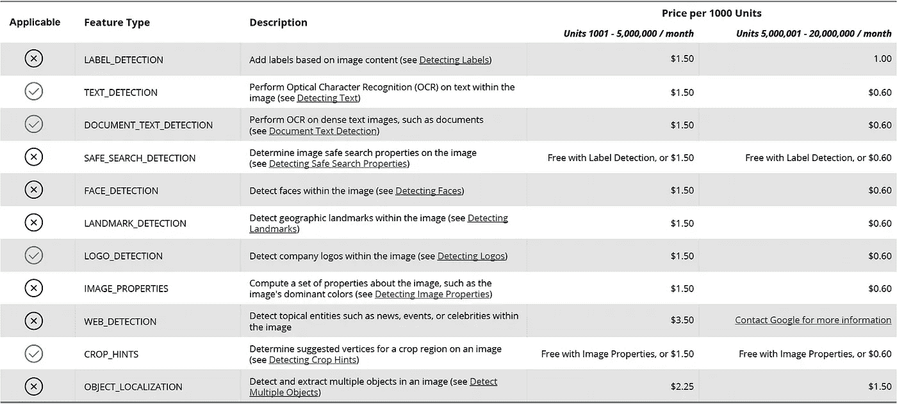
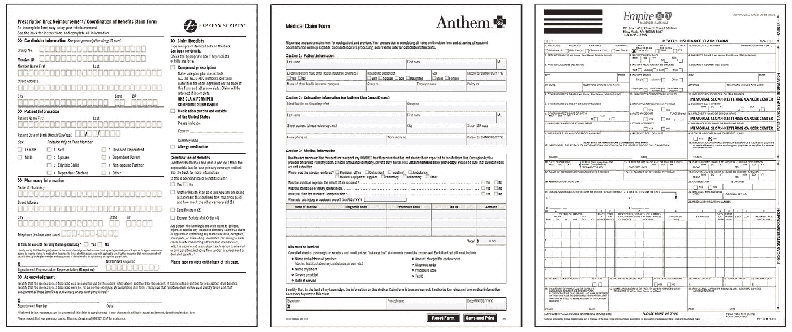
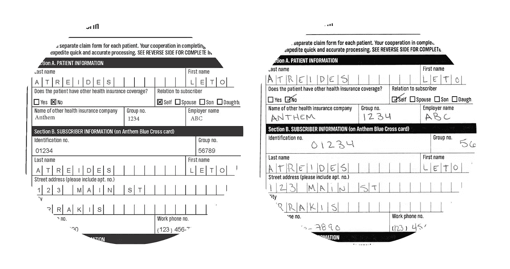
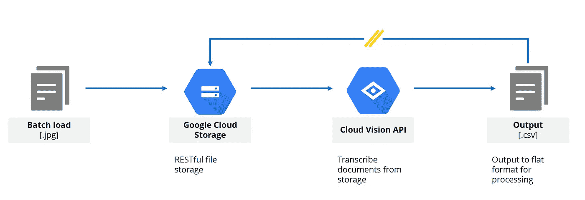
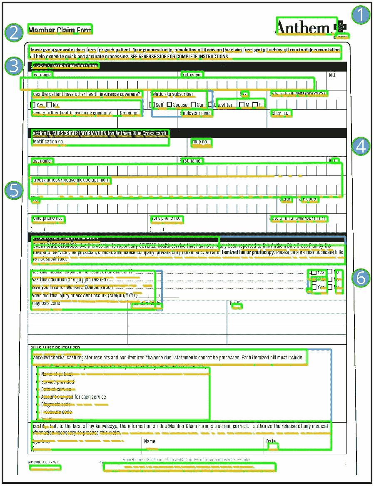
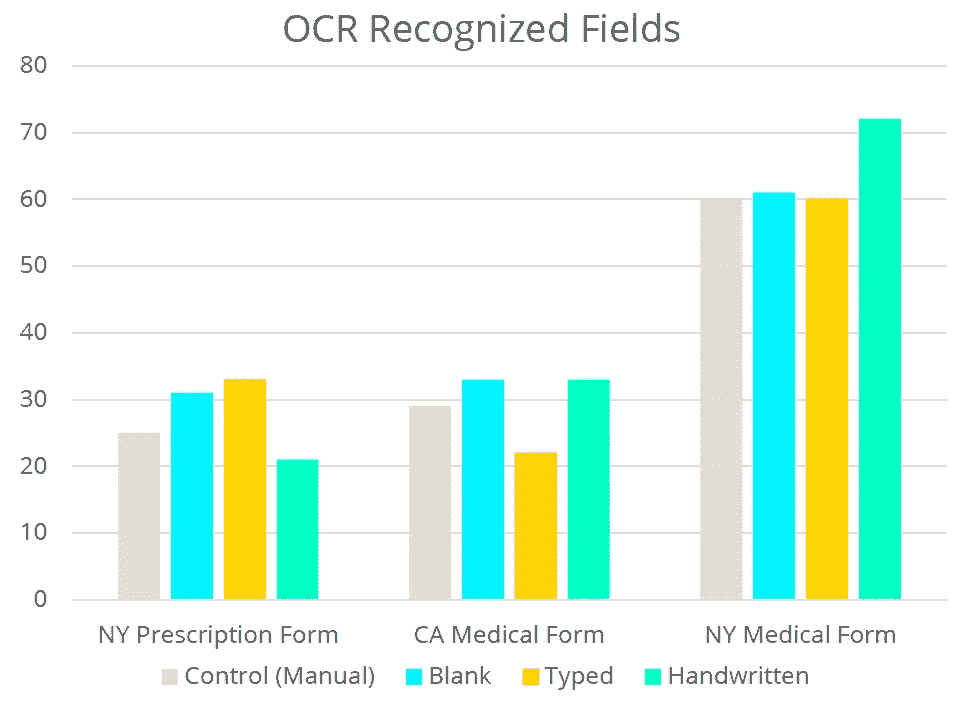

# 如何使用 Google 云平台和 OCR 构建自动化索赔处理管道

> 原文：<https://medium.datadriveninvestor.com/how-to-build-an-automated-claims-processing-pipeline-using-google-cloud-platform-and-ocr-166a9dc9f5d7?source=collection_archive---------4----------------------->

## 为医疗保健设计、编码和测试机器学习管道

> 本文中表达的观点和意见是我个人的，并不代表我的雇主。分享的任何信息均来自公开来源，不包含 PHI/PII。

## **背景**

我在医疗保健行业工作，身边充满了用 ML 技术改善现状的机会。我最近注意到，医疗保险和医疗补助服务中心(CMS)宣布，服务费账单错误率已从 9.5%降至 8.1%。不幸的是，8.1%的错误率仍然意味着医疗保险项目**损失 316 亿美元**。

本文将是系列文章中的第一篇，在这篇文章中，我试图为导致医疗保健系统效率低下的劳动密集型任务构建自动化解决方案。

 [## DDI 编辑推荐:5 本让你从新手变成专家的机器学习书籍|数据驱动…

### 机器学习行业的蓬勃发展重新引起了人们对人工智能的兴趣

www.datadriveninvestor.com](https://www.datadriveninvestor.com/2019/03/03/editors-pick-5-machine-learning-books/) 

## **目标**

由于每年手动抄录数百万份纸质文档的想法让我产生了过敏反应，我决定看看自动化索赔处理过程有多困难。经过一些研究，我选择使用谷歌的云平台，因为它有一套内置的 ML 工具。云视觉 API 能够进行开箱即用的图像标记、徽标检测、OCR 和文本检测。

我的目标是**了解 Cloud Vision API** 的功能和局限性，并为索赔接收的自动化提出一个潜在的 ML 管道。我将成功定义为:**识别给定索赔表中的各种字段**并将手写内容转录为**平面格式的能力。csv)。**

## **计划**

我首先回顾了 API 定价，以了解这一潜在的努力将花费多少。Vision API 在不同的定价层提供了许多功能。价格差异大概是基于每一项所需的计算(加上覆盖基础设施和工程时间的显著加价)。

许多功能很有趣，但与手头的任务无关。似乎对 API 的第一个 1000 次调用是免费的，以后在 1000 个单位时分批调用。假设我们对每个文档都使用 TEXT_DETECTION、DOCUMENT_TEXT_DETECTION、LOGO_DETECTION 和 CROP_HINTS，那么每个文档的总成本是 0.006 美元，这还不错。

## **设计**

知道我们将使用 Vision API 的几个功能后，我想看看它们在不同类型的表单中是如何堆叠的。我浏览了当前健康计划的网站，选择了三种不同的形式，看起来它们可能会产生有趣的结果。

In order: a prescription drug form (NY), a medical claim form (CA), and a medical claim form (NY)

每个都包含不同数量的承诺测试 API 的字段和条目类型。

纽约处方药表格是一份福利协调报销表格。此文档用于确定健康计划是索赔的主要付款人还是次要付款人。在这种情况下，该表格用于从错误的共付额或错误的自付额中申请报销。表单本身有许多有界字符，这些字符简化了人类的阅读，但给模型带来了很大的困难。California 索赔表主要是自由形式测试，但有附加的边界约束，很容易被 ML 算法混淆为文本。最后，纽约的索赔表读起来绝对是一场灾难。)字段和手写文本与符号和数字输入重叠。

## **实验**

我选择为每个表单创建三个组:

*   没有文字的控件。这将测试算法正确分割每个字段并提供基线的能力。
*   使用 PDF 编辑器键入文本完成的表单。
*   使用手写文本填写的表格。

Examples of the typed and handwritten text. It remains to be seen if the Duke’s spice addiction is a valid claim.

## **建造**

为了简单起见，我选择在谷歌的生态系统中做所有的事情。这是一个非常简单的过程，可以通过使用数据流或 Bigquery 等服务轻松扩展。

调用 API 本身很简单，可以调整特性来优化手写或键入的文本。我的猜测是，它将 API 调用转移到在类似数据集上训练的模型，但在后面的层中使用各种文本的特定示例进行微调。

## **结果**

我通过 API 运行每个表单，并记录函数的输出和它识别的字段数量。基于 web 的 API 版本提供了一个方便的可视化工具来理解一些分段是如何发生的。

API 能够识别徽标、表单名称、字段标题、自由格式和有界区域以及框/非文本符号。

我还绘制了每个表单的字段数量。我将结果分为一个控件(我手动计算了字段的数量)，返回的没有文本的数字，键入的文本和手写的文本。

这个图表有点混乱——如果 API 运行良好，那么每个表单对于每种文本类型都应该有相同数量的字段。识别的字段范围越大，性能越差。我们可以看到，NY 处方表单和 CA 医疗表单表现不佳，而 NY 医疗表单似乎返回了大致相同数量的字段(除了我糟糕的书写)。

当文本靠近任何边界时，API 似乎也有问题。我设法与 Vision API 团队的一名成员取得了联系，他解释说，训练数据只包含没有环绕字段的字符，算法很可能将垂直线误认为错误的 1 和 L。常见混淆的一个好例子:

**表单:** CA 医疗索赔表单

**字段名称:**姓氏

**实际文本:**阿崔迪斯

**键入结果:** ALTRE DIES |

**手写结果:** ATRIEL PIESE

## **改进之处**

如果我再做一次，我会根据表单类型安装一些基本的分段规则。例如，使用徽标检测功能，我可以识别正在分析的表单，并基于 ML 技术(边界、OCR)与更传统的审计和验证(电话号码只能是数字，姓氏是文本，等等)的组合来分割文本。

此外，预处理对于消除扫描过程中不可避免地产生的偏斜和噪声是有价值的。Vision API 是执行基本 OCR 的一种灵活且轻量级的方法，但是生产用例需要更强大的数据源来获得有价值的结果。

我们还没有完全解决索赔处理问题，但我比以往任何时候都更相信自动化解决方案是可能的。未来的工作将试图通过使用 fast.ai 团队提供的新的深度学习技术来解决这个问题。