# 如何为游乐园构建引人入胜的移动应用程序:功能和成本

> 原文：<https://medium.datadriveninvestor.com/how-to-build-an-engaging-mobile-application-for-an-amusement-park-features-and-cost-91a651dba4e9?source=collection_archive---------2----------------------->

世界上最大的游乐园吸引了数百万人来享受游乐设施，看他们最喜欢的角色，吃爆米花，度过他们一生中最快乐的时光。如果你正在考虑如何与其他公园竞争，吸引更多的人，并优化你创造的欢乐世界，我们有答案:一个移动应用程序。

# 为什么要为你的公园开发应用程序？

移动应用几乎出现在我们生活的每个领域。我们通过移动应用程序点餐、付账、看医生、玩游戏。然而，许多游乐园仍在使用人们丢失或未能有效使用的印刷地图和传单。对于印刷地图来说尤其如此，因为年轻一代可能不知道如何使用它们。

> *70%的美国游乐园游客因为排队而选择不在公园购买食物和饮料*

在一个每天有成千上万游客的大型游乐园里迷路是很容易的。既然所有的访问者都有移动设备，为什么不把它们用于你的业务呢？

 [## 2019 年移动应用开发之路——数据驱动投资者

### 任何在移动应用程序开发行业工作的人，无论他们是专注于在伦敦开发 iOS 应用程序还是…

www.datadriveninvestor.com](https://www.datadriveninvestor.com/2019/01/15/the-path-of-mobile-app-development-in-2019/) 

找到去游乐园最喜欢的景点的路只是应用程序可以解决的一个问题。让我们来谈谈其他挣扎公园游客的经历:

*   站在无尽的队伍中，不知道要花多少时间
*   在游览景点一天后，努力寻找汽车
*   在公园迷路(至少几次)
*   丢失一堆纸质优惠券、门票和传单
*   去寻找浴室或餐厅

这些经历会影响游客的满意度，让去公园一半是乐趣，一半是压力。一个移动应用程序可以让它变得完全有趣，稍后我们会告诉你怎么做。

*Amusement parks always struggle with endless lines and people flow*

首先，让我们讨论一下，作为一个关心改善业务、提高客户忠诚度和满意度，当然还有增加收入的游乐园所有者或管理者，你面临着哪些挑战。

以下是公园一直在努力解决的一些问题:

**1。管理人员流动。**每个公园都在努力管理想要去他们最喜欢的景点的游客流量。这就造成了排队和人为的交通堵塞。也影响公交路线和园区物流。消除排队现象，确保游客在整个区域内平均分布，是任何游乐园面临的最大挑战之一。移动应用程序可以帮助解决这个问题，它可以显示每个景点的平均等待时间，并显示此刻人最少的地方。

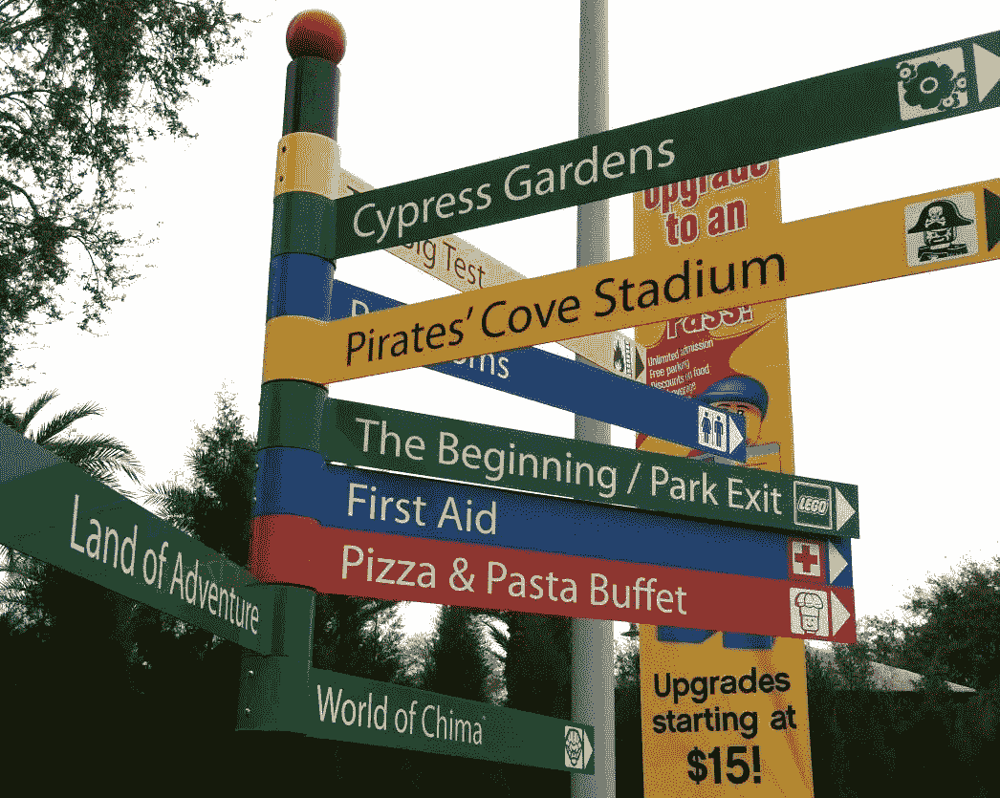

*To manage people flow, you need: maps, directions and information about the line sizes at each place*

**2。跟踪和提高客户满意度。**对于任何没有数字工具的公园来说，这都是一个挑战，管理者和营销人员可以通过数字工具向人们征求评级和反馈。大多数人不会去网站或在打印的问卷上留下评论。然而，有了移动应用，你可以让这个过程变得更容易，甚至可以用游戏化来让它变得更有趣。

**3。增加收入和创造新的收入来源。**如果你曾经和一个孩子一起排队，你就会知道去别的地方比花 20 或 30 分钟买冰淇淋更容易。如果队伍行进缓慢，即使是成年人也会拒绝排队。通过移动应用和移动支付，你可以让这些线路走得更快，从而增加整个公园的总支出。

**4。优化服务交付。**另一个让你的服务更快捷、更有条理的方法是允许公园游客预购。这让您可以更准确地预测需求，并将供应重新分配到需要的地方。此外，您可以使用您的移动应用程序为您的客户提供特别优惠，这将鼓励他们更多地预订。

> 如果你的大多数访客可以避免排队，提前点食物和饮料，或者用应用程序立即付款，他们会多花五倍的钱

这是一个双赢的局面:游客不必等待获得食物和饮料，你也增加了你的收入，因为人们不太可能因为排队而不买东西。

**5。向你的听众学习并向他们演讲。虽然游乐园的游客可能看起来像一大群喧闹的人，但每个部分都需要单独的方法。对任何企业来说，按类别划分观众都是一个挑战，但对游乐园来说，以个性化的方式提供服务更是一个挑战。移动分析可以告诉你每个人在哪些方面花了钱，他们的年龄，以及他们最感兴趣的是什么。然后你可以利用这些数据进行营销，这是我们的下一个挑战。**

> *移动分析可以告诉你每个人都花了多少钱。使用这些数据获得个性化的特别优惠*

**6。用个性化的方法营销你的服务。**从移动分析收集数据后，您就可以使用它了。如果没有应用程序，这很难做到，但个性化推送通知可以帮助你。

想要通过移动应用程序获得潜在收入增长的硬数据吗？Omnico 的研究发现，70%的美国游乐园游客因为排队而选择不在公园购买食物和饮料。这些受访者中有一半人会多花五倍的钱，如果他们可以避免排队，提前点食物和饮料，或者用应用程序立即支付。

另一半人会购买四倍多的食品和饮料，如果他们可以在自助服务亭自助扫描他们的购买，而不必等待工作人员为他们服务。

这些数字证明，投资一次移动解决方案可以为游乐园带来巨大的收入增长。让我们来看看这项投资会有多大，以及如何着手为公园开发自己的移动应用程序。

# 游乐园应用的类型

现在我们将讨论不同类型的游乐园应用程序。请注意，这种划分只是名义上的:你可以创建一个结合了我下面提到的几个甚至所有特性的应用程序。找到最适合你的业务，实施它，并获得回报。

# 寻路应用

寻路应用都是关于 GPS 和地图的。地图集成是这类应用程序的核心功能。然而，还有更多。

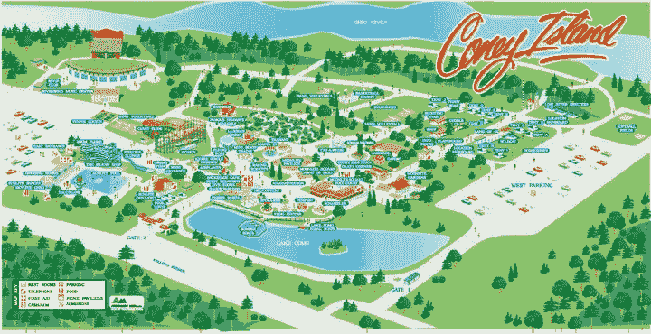

*Such maps sure look fun, but its much easier to find the way with a mobile map*

这些应用有几个目标:

1.帮助游客在游乐园中导航，找到洗手间、餐厅、游乐设施和其他景点。移动应用程序让游客忘记了印刷地图。

2.帮你管理线路和人流。这些应用程序向游客显示每次乘车的等待时间，以及哪里的队伍不是很长。这将有助于你引导人们到较少占用的地方，并大大提高客户满意度。

3.通过在地图上显示公共汽车站和路线来帮助人们出行。

4.当游客在你的公园玩了一整天后，帮助他们在停车场找到他们的车。
整合地图，允许游客标记他们停车的地方，这会让你成为最好的、最有爱心的公园。

# 基于位置的销售和预订应用程序(自我扫描)

这些应用程序将帮助您提高运营效率，因为您将提前知道需要供应多少食物和饮料。鼓励你的访客提前点餐，这样他们就不需要排很长的队去拿食物了。

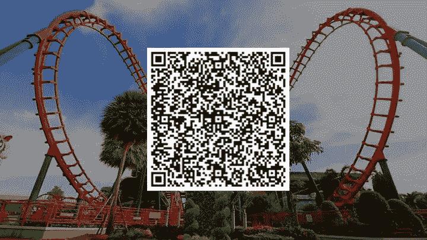

*Add QR-codes for purchases, maps, ordering or more information about your park*

这些应用的功能包括菜单、购物车和在线支付。将地图整合到销售和预订应用程序中也是一个好主意，这样游客可以选择他们想要的东西，并找到一个地方来取他们的订单。

你还可以添加自我扫描功能，这样游客就可以快速购买他们需要的一切，而不必等待:付款可以通过应用程序从他们的信用卡中扣除。

# 酒店和餐厅预订和预定应用程序

游乐园通常有酒店和多家餐馆。如果你的公园就是这种情况，你应该在移动应用程序中提供预订酒店房间或在餐馆预定桌子的机会。

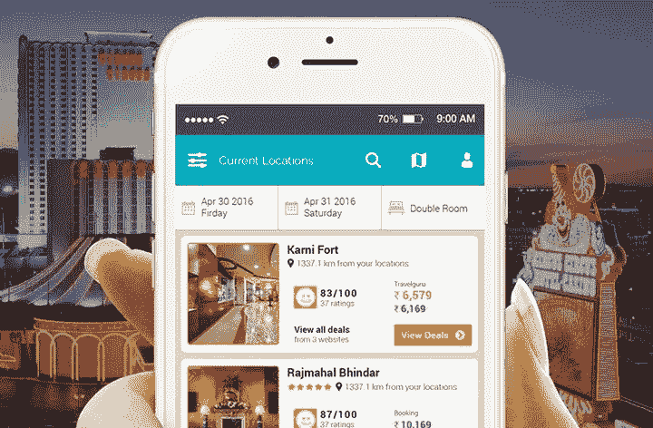

*Let your visitors book and pay for a stay in your park’s hotel from an app*

这些应用程序通常会有保留地连接到您当前的数据库。对于酒店预订，该应用程序应该具有可用房间的图片和描述列表，并提供过滤器。一定要包括评论，并允许用户从移动应用程序中立即支付预订费用。

对于一个餐馆应用程序，你还需要一个列表、一份菜单和餐馆的桌子布局，这样用户就可以选择他们想坐的地方。这种类型的应用程序需要动态的数据交换，因为人们需要看到哪些表是可用的。

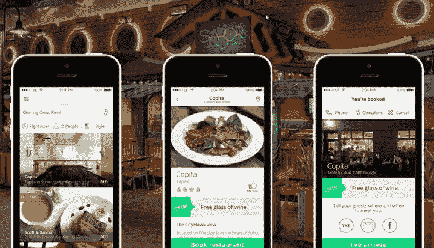

*Allow users to choose a restaurant in your park, see the menu and reserve a table for the evening*

# 品牌忠诚度计划应用

想确保你在公园的经历绝对难忘吗？那么这种类型的申请适合你。构建一个品牌应用程序，为各个用户群提供特别优惠。在分析的帮助下，你会更加了解你的公园游客。然后，您可以使用这些信息提出相关的报价。对于约会的人、大家庭和一群朋友，优惠应该是不同的。

*To win over your visitors and promote your app, you can add special offers and make a loyalty program that’ll make people come back again and again*

您可以允许用户在应用程序中存储优惠券和门票，并添加二维码，以便您的员工可以扫描它们。

如果你想彻底击垮你的访客，你可以在你的应用中加入游戏化。允许他们通过完成任务和在你的公园里玩耍来赚取奖金或额外的游乐设施。你可以添加孩子们绝对会喜欢的增强现实功能。这个杀手锏将帮助他们长久记住你的公园。

现在我们已经回顾了游乐园的所有类型的移动应用程序，让我们来讨论一下在您自己的应用程序中需要的特殊功能。

# 游乐园应用程序的必备功能

**入职** —带领您的用户从注册到他们的第一次用户体验。您可以实现一个教程来教用户如何使用您的应用程序。

**登录**——确保你提供了几种注册和登录的方式:电子邮件、电话号码和社交媒体简介是最好的做法。

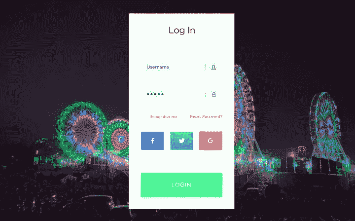

*Provide different ways users can log into your app: email and social media are must-have options*

**个人资料**——个人资料应该包含优惠券、预订等所有信息。您也可以在个人资料中添加其他功能，如设置。

**地图和路线** —地图应该显示你公园里所有重要的位置，比如停车场、餐馆、洗手间、酒店和景点。您还应该显示班车路线和站点，并允许用户锁定他们的汽车在停车场的位置

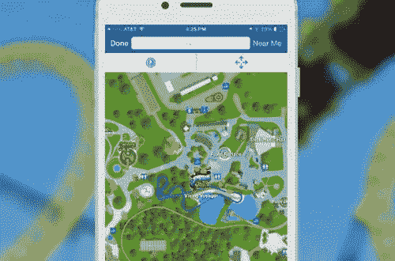

*Add a clear map into your mobile application to help users navigate around your park*

**搜索&过滤器**——你需要为你的酒店列表和餐厅菜单添加这些过滤器，这样用户就能准确找到他们想要的。

**收藏夹** —允许游客标记他们喜欢的景点，并在队伍较短时发送通知。

**人流管理工具** —显示等待时间和景点排队人数。

**支付网关**——有很多支付网关可供选择:Stripe、Braintree 和 PayPal 是最受欢迎的移动应用。

***阅读也:*** [***如何在手机 App 中集成支付网关***](https://www.mobindustry.net/how-to-integrate-payment-gateway-in-a-mobile-app/)

**酒店列表** —它应该列出所有的酒店(或者酒店房间，如果你只有一个酒店的话)。一定要有每家酒店的照片、评级和其他信息，如价格范围和可用房间数量。

**酒店页面** —这是用户点击目录中的酒店图片后看到的内容。酒店页面应该有描述、更多照片和可用房间。

**评级和评论** —允许用户对你的酒店和房间进行评级，并留下反馈。这将有助于您满足客户的需求。

**预订**——这个功能可以让游客预订酒店房间，稍后通过应用程序办理入住手续。

**餐厅目录** —如果你的游乐园里有多家餐厅，把它们列在你的应用程序里，这样用户就可以选择在哪里预订桌子。

**餐厅页面** —提供每家餐厅的更多细节，包括点评、菜单、特价和位置。

预订——允许用户为一个美好的夜晚预订一张桌子。添加可用桌子的数量和预订时间。

食物和饮料清单——添加一份清单，列出你的访客可以预订的所有东西，并附上图片、价格和简要描述。

**NFC**——你可以将 NFC 支付添加到公园内的售货亭，或者使用 NFC 进行推广和营销:例如，每当游客走过某个地点，就会弹出通知。

***阅读也:*** [***推送通知 vs 短信 vs 邮件:该用哪个省钱？***](https://www.mobindustry.net/push-notifications-vs-sms-vs-email-which-should-you-use-to-save-money/)

**二维码扫描仪** —你可以在公园的任何地方放置二维码。要阅读它们，你的应用需要一个二维码扫描仪。

**优惠券和门票** —让游客将它们存储在你的手机应用程序中的一个地方。

**推送通知** —向游客发送特别优惠通知、预订提醒以及目前最冷清景点的通知。

**分析** —深入了解你的访客，看看他们最常去哪里，买什么，以及他们如何使用你的应用程序。分析将帮助您针对不同的目标受众调整服务，并从业务和技术角度改进您的应用。

*Analytics will open you a world of new data you’ll be able to use to make your park operation and marketing even more effective*

**离线功能**——如果你的游乐园里并非到处都有 Wi-Fi，那么增加一些离线功能就很重要了——例如，这样用户仍然可以访问他们的门票和优惠券。

**特别优惠和促销** —这项功能可以成为您所有营销活动的一部分。您还可以将生日优惠添加到您的特别优惠中。

忠诚系统——你可能会有很多游客一次又一次地来到你的公园。通过集成到您的移动应用程序中的忠诚度系统，让他们更加忠诚。

> *确保你公园里的 Wi-Fi 稳定且随处可用。
> 在公园各处和印刷的传单上放置二维码以下载应用程序。*

如果你希望你的应用程序完全不可抗拒，你也可以添加简单的 AR 功能，吸引儿童和成人安装你的应用程序。

# 创建一个游乐园 app 需要多少钱？

开发任何应用程序的成本取决于几个因素:

*   工作范围，意味着功能的数量和复杂性
*   技术栈:一个跨平台的应用比一个本地的要便宜
*   设计及其复杂性:整合动画可能需要大量时间
*   你工作的开发公司的时薪
*   应用程序中集成的第三方服务的数量和价格

开发者的时薪对应用开发的成本影响最大。费率通常取决于开发公司所在的国家。例如，一个在美国开发的应用程序可能比一个在东欧国家开发的应用程序贵五倍。

为了让您对开发成本有一个大致的了解，我将根据 8 小时工作日为本文中提到的所有特性提供一个时间估计。你所需要做的就是应用你入围的开发团队的时薪来查看价格。

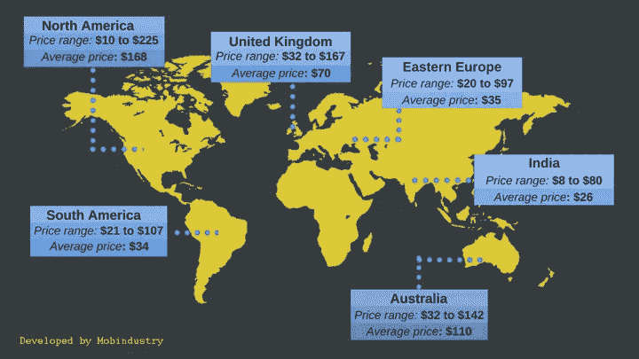

*The price of mobile app development depends heavily on a company’s location. Our experience and developers’ levels are other variables that influence the estimate*

请注意，这一估计不包括业务分析、准备、设计和沟通的时间。如果你想了解更多关于发展阶段的信息，你可以访问[这个页面](https://www.mobindustry.net/mobile-app-development-process/)。

***阅读也:*** [***关于手机 App 开发过程你不知道的 16 件事***](https://www.mobindustry.net/16-things-you-dont-know-about-the-mobile-app-development-process/)

以下是对你的游乐园应用程序功能的评估:

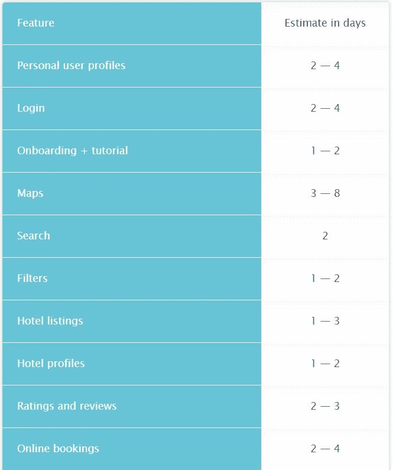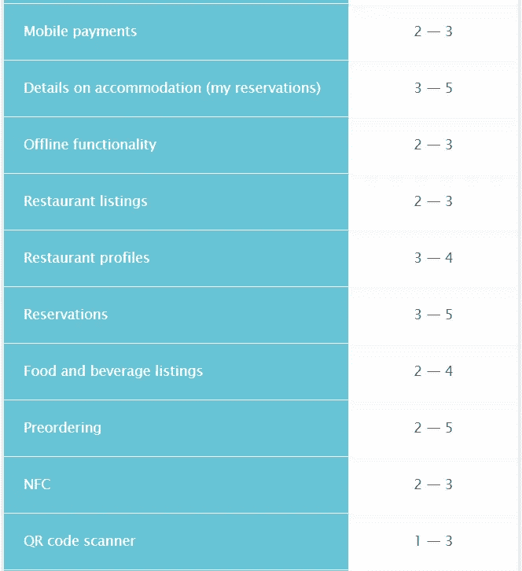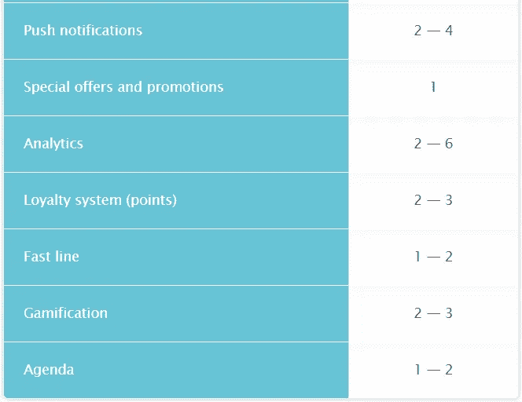

# 结论

移动应用是几乎所有企业的必备工具，因为移动设备是每个人生活中不可或缺的一部分。他们强化品牌，为顾客提供额外的价值，并显示你的关心。

移动应用程序也可以为您的公园提供很大的帮助，提高运营效率并帮助您管理人流。有了移动应用程序，你可以鼓励人们在他们以前不想排队等待的东西上花更多的钱。

要做到这一点，你需要确保整个游乐园的 Wi-Fi 都能正常工作。游客需要一个良好的互联网连接进行网上支付，并检查最近的洗手间在哪里。

如果您想从头开始创建一个游乐园应用程序，或者想在您现有的解决方案中添加一些东西，请随时联系我们。在 Mobindustry，我们开发了旅游和节日应用。我们知道如何将乐趣与专业技术相结合！

**获得免费咨询！**
sales@mobindustry.net

 [## 如何为游乐园构建引人入胜的移动应用程序:功能和成本

### 世界上最大的游乐园吸引了数百万人来享受游乐设施，看他们最喜欢的角色，吃…

www.mobindustry.net](https://www.mobindustry.net/how-to-build-an-engaging-mobile-application-for-an-amusement-park-features-and-cost/#)