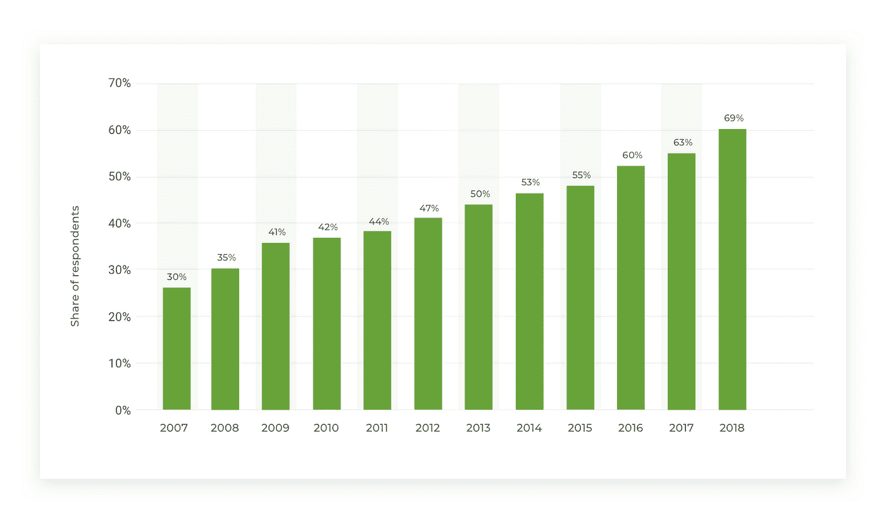
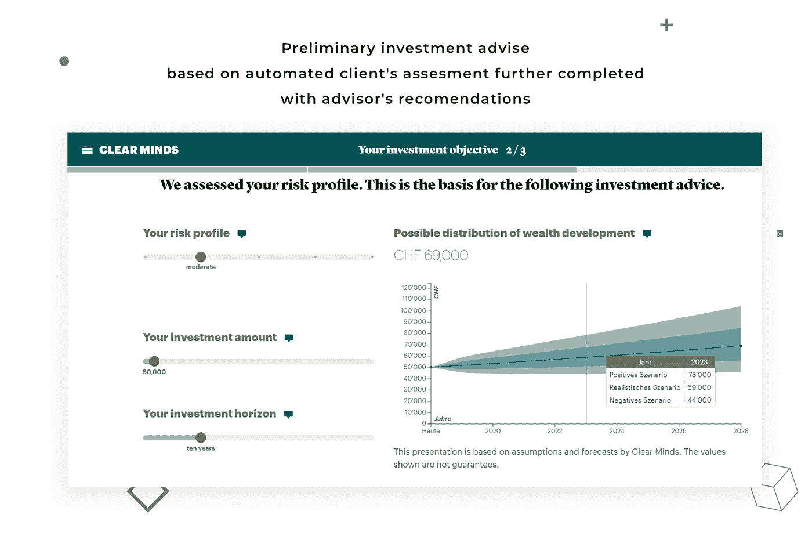
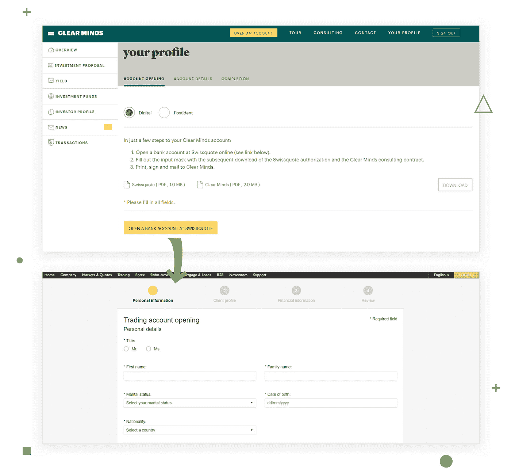
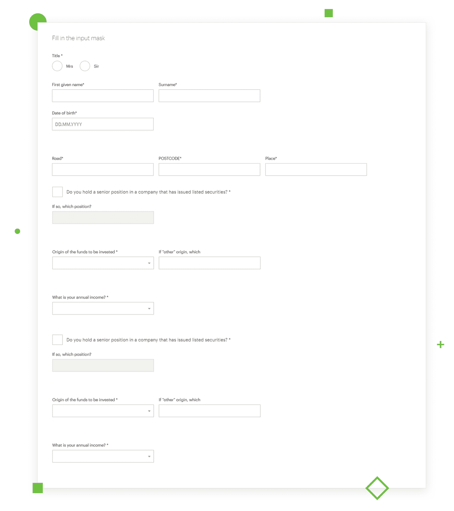
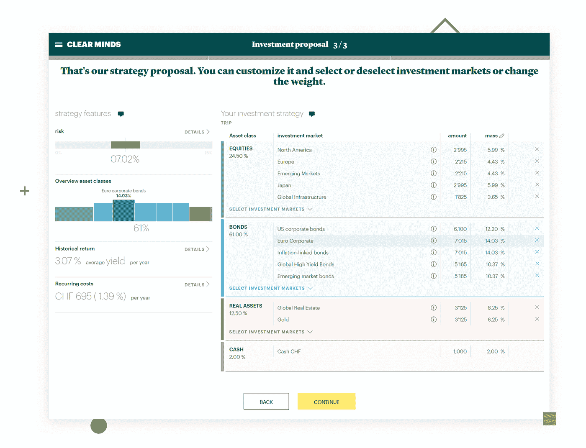
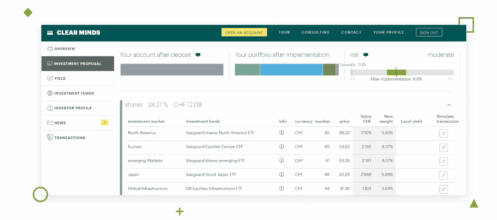

# 如何建立一个投资平台:技巧和窍门

> 原文：<https://medium.datadriveninvestor.com/how-to-build-an-investment-platform-tips-and-tricks-be38aad54d3e?source=collection_archive---------6----------------------->

> 这篇关于 [**如何搭建投资平台**](https://djangostars.com/blog/how-to-build-an-investment-platform/?utm_source=medium&utm_medium=medium.com%2Fdatadriveninvestor&utm_campaign=how%20to%20build%20an%20investment%20platform&utm_content=how%20to%20build%20an%20investment%20platform) 的文章最初发表在 **Django Stars 博客上。**

投资建议是我们都听说过的——你找到一家值得信赖的公司，签一份合同，就如何更好地投资获得建议。

但是，过去在办公室里做的事情，最近正以惊人的速度进入移动世界。这并不奇怪——我们生活的许多方面已经上网了(智能家居、宠物娱乐、体重控制，随便你说！投资公司将注意力转移到在线财富管理平台也只是时间问题。这是一个全球趋势，是金融科技急剧增长过程的一部分。只有在英国， [Statista](https://www.statista.com/statistics/286273/internet-banking-penetration-in-great-britain/) 注意到网上银行和其他服务的以下增长。

*英国网上银行和其他金融业务的增长*

请注意，这些平台并不是完全自主的，分析仍然由顾问运行，但是这个过程已经变得更快、更灵活了。

在线咨询的发展速度因国家及其金融传统而异。**投资容易被广大受众获得且没有最低投资额的国家**(或者这个门槛对于普通人来说是可以达到的)**拥有最发达的在线投资平台。例如，在美国，你可以用 50 美元开始投资，而且个人投资者购买股票有很多选择。根据福布斯的统计，这导致了 5400 万活跃的个人投资者。**

*Image source: Forbes*

虽然不是每个国家都这样。许多国家尚未达到这一阶段。然而，除了美国，还有几个国家对金融科技产品有忠实的立法。这意味着在你开始开发你的平台之前，你必须**确定市场上的情况，这样你的平台才能正常运行，更重要的是要有回报。**

请记住，这不是你在开发投资平台时唯一应该考虑的事情。下面是我们根据自己的经验总结的一系列建议。

# 你可能也喜欢

 [## 构建金融科技产品之前你需要考虑的问题

### 我喜欢金融的一点是，这个行业和时间一样古老——然而，很少有人敢进入它。幸运的是…

djangostars.com](https://djangostars.com/blog/what-you-need-to-consider-before-building-a-fintech-product/?utm_source=medium&utm_medium=medium.com%2Fdatadriveninvestor&utm_campaign=how%20to%20build%20an%20investment%20platform&utm_content=youmayalsolike1)  [## 创建在线抵押贷款服务:提示和见解

### 金融科技在 2010 年代开始崛起，改变了传统金融服务的形象。使用在线…

djangostars.com](https://djangostars.com/blog/creating-an-online-mortgage-service-tips-and-insights/?utm_source=medium&utm_medium=medium.com%2Fdatadriveninvestor&utm_campaign=how%20to%20build%20an%20investment%20platform&utm_content=youmayalsolike2) 

# 投资管理平台基础

一般所有的投资平台看起来都一样。客户打开网站，注册并填写他们的信息。接下来，他们按照这些步骤。

这些数据允许**确定最适合这个特定客户的资产类别和市场，**可以是房地产、材料或其他东西。一旦一切就绪，系统会通过将投资结果与设定的目标进行匹配，对用户的投资组合进行定期健康检查。通过这种方式，用户可以获得关于继续投资是否有利可图或者退出并等待是否更好的建议。

# 开发过程的重要部分

好了，我们开始吧。我们将借鉴的项目是面向 B2C 的投资服务。

## #1:建筑

不是所有的客户都马上知道他们的目标受众，所以你可能必须一部分一部分地构建架构。有些可能变得不可用，以后必须重构。这是可能的，但非常棘手:当改变一个元素时，您可能会影响另一个应该保持不变的元素。

这就是为什么，你需要**决定谁是你的目标受众**——这将根据是 B2B 还是 B2C 来定义平台的架构。注意，B2B 要复杂得多，而且是分支的。

事实上，这个平台并不是完全自动化的。因此，我们创建了**小组，通过这些小组，顾问可以更新投资基金列表，进行风险评估，根据收入、信用历史计算客户的得分**，并确定最佳投资方式以及是否值得投资。

## #2:银行整合

**基于他们的银行数据(信用评分、可靠性等。)，客户获得有关其投资的建议**。这就是为什么这项服务需要与银行达成协议。此外，银行连接允许将汇率集成到平台中。

决定你将联系多少家银行是很重要的，因为这对架构也是至关重要的。

## #3:国家和时区

仔细考虑综合银行的位置。**法律法规和营业时间可能会有所不同。**但是这里有一个提示:如果用户请求某个假期的信息，可以从最近的更新中提取数据。这样，你可以让顾客看不到这些小小的不便。例如，如果他们在周六进行投资询价，他们将从周五开始获得投资利率

## #4:代码记录

要修复或防止错误，您需要知道是什么导致了它。例如，我们创建了一个错误记录工具，记录我们对第三方(即银行)的所有查询以及他们的回复。这样，每个错误都会显示在日志列表中。

## #5:沙盒环境

沙盒环境是连接到开发代码的第三方功能集的精确副本，不会危及客户端数据。

在选择合作银行时，检查他们是否有，这样你就不会冒丢失或损坏任何客户信息的风险，并避免不必要的费用。当你完成编码后，你只需用一个真实的 URL 替换沙盒 URL，你就可以开始了。

## #6:开发流程

从客户的角度来看你的平台。**注册，背景调查，市场选择，投资本身。**

*Example of the registration form*

留点空间，以防资金不能马上到位，第二天汇率会发生变化。为此，您可以限制投资组合的使用，这样，在发生意外汇率变化或转移费用时，用户的一定数量的资产始终可用。

*Suggestions on assets distribution*

为服务应用程序安装通知以与客户互动。这样，他们就不用一直在网站上查看股市行情了。如果有一个销售或购买东西的好机会，应用程序会发送通知。

## #7:匹配 UX

别忘了，你还得用**把** **大量数据和大表格** **挤进小屏幕**。由于移动设备的尺寸，这可能变得特别棘手。

最终用户可能对投资或某些平台功能或领域知之甚少甚至一无所知。你可以通过给客户发送通知和提示来帮助他们，但是要小心不要让界面过载。

使用几种语言时要小心。一些语言倾向于使用更长的单词和句子——例如，与大多数其他欧洲语言相比，英语单词平均更短。

## 我们从开发投资平台中学到的东西

分享是关爱，这就是为什么我们愿意分享我们在开发投资平台的过程中学到的所有有用的东西。在投资平台的七个关键要素之后，这里有七条建议可以让投资平台发展得更顺利。

1.  要建立一个财富管理平台，请有投资领域经验的**开发者。**
2.  为了让这个过程更有效率，提供给开发者的**数据**必须**用具体例子**写成公式。然而，要求应该用专业和简单的语言写下来。
3.  **用于计算投资者可靠性系数、客户风险——存款时间、原始投资等的公式和算法**应尽可能简单和合理**。或者更好的是，有例子。**
4.  **不要让其他开发人员重用你的代码。每个案例都像雪花一样独特，因此，**每个代码都应该从头开始编写。****
5.  **每个人都必须对所有事情保持一致。**使用字典，举办研讨会，了解词汇**，业务流程等。**
6.  ****不要害怕花钱测试**。所有计算投资风险、分配投资组合等的公式。需要测试。有时候，一个在纸上完美运行的公式，在代码中却感觉不正确。相信我，即使你在测试上花费了很多资源，工作代码也是值得的。**

**大概就是这样。有些事情一开始可能听起来显而易见，但小心谨慎总比错过什么好。请记住，您创建的服务应该是每个客户都能理解的，即使是对投资了解最少的客户。这就是为什么你要确保所有的流程顺利运行，每个小功能都完美无缺，为你和你的客户。**

****

> **如果你觉得这篇文章有用，请点击👏下面的按钮:)**