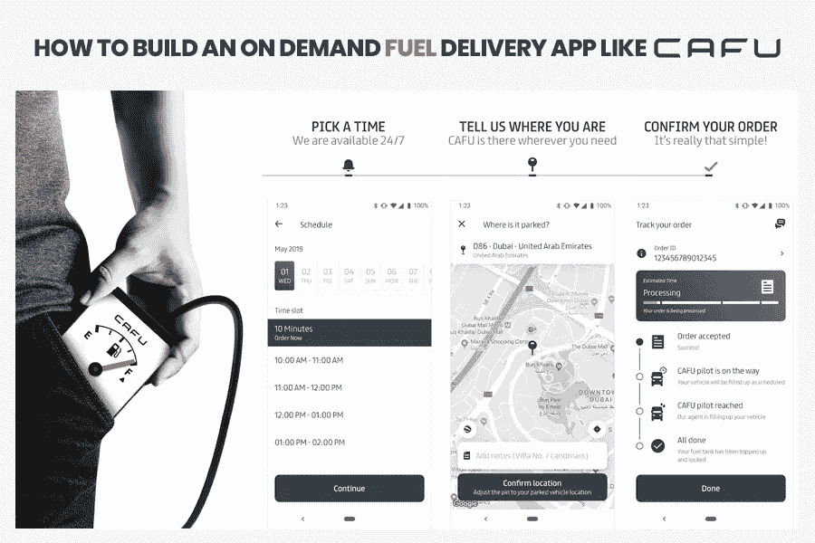

# 如何搭建一个像 Cafu 这样的按需供油 App？

> 原文：<https://medium.datadriveninvestor.com/how-to-build-an-on-demand-fuel-delivery-app-like-cafu-d30dfe9911d0?source=collection_archive---------1----------------------->

迪拜 的几家 [**app 开发公司承诺再也不去加油站了。事实上，尽管按需燃油配送服务在阿联酋，尤其是迪拜已经大获成功，但在加州、伦敦等少数城市，按需燃油配送服务已经停止。**](https://www.xicom.ae/services/mobile-app-development/)

“迪拜”镇上有一个新的送货应用，不，它不是送食物或东西。

这是“ [Cafu](https://play.google.com/store/apps/details?id=com.mena.customer&hl=en) 地区的首个燃油配送应用。

燃油(汽油)配送应用 Cafu 最近于 2018 年 11 月 30 日升级，因此获得了约 10，000 的下载量，甚至为迪拜和阿治曼的居民提供了 super 98 和 super 99 燃油。

从该公司的角度来看，组织者将按需燃油配送服务描述为一种安全、简便的节省时间的方式，而不是在加油站排队。并遵守他们的核心目标，即“支付与在任何加油站支付的普通汽油和优质汽油相同的金额，同时支付最低的运输费用”。再清楚一点，顾客每次送货都要付 18 迪拉姆。

# 关于卡福的更多信息

[**Cafu**](https://www.xicom.ae/blog/cafu-app-uae/) 使用跨国石油和天然气公司使用的最先进的流量计来保证燃油的准确性和精确度。他们的燃油泵与加油站的作用相同，有一个自动喷嘴，可以分配油箱所需的量。他们的汽油通过了 ESMA(阿联酋标准化和计量管理局)认证，确保与您的汽车具有相同的质量。

此外，所有的 CAFU 飞行员都接受过紧急情况和泄漏反应、急救和灭火器使用方面的培训，并通过了危险品认证。甚至他们的车辆都配备了最新的安全技术。

# Cafu 是如何工作的？

它们是基于应用的服务，就像优步的燃料一样。

这都要感谢迪拜最好的**应用开发公司**为你的汽车直接提供燃料。也就是说，如果一个人需要在不去加油站和排长队的情况下为他的汽车加油，只需下载并在应用程序上注册即可。

然后，他通过点击按钮请求将气体输送到你停车的地方。这些应用程序会精确标记他的车停在哪里。如果他/她的汽车需要在其他地方加油，他/她可以手动选择地点。

甚至，安装了自己的应用程序的加油车司机可以在应用程序内置地图的帮助下，导航到所需的标记位置。但是，不要忘记打开你的油箱。他会给汽车加油，同时注意所有的安全规定。该金额将从您在申请时选择的付款选项中扣除。

但是，在深入探讨正在进行的可扩展新机会之前，首先让我们了解什么是按需应用。

# 什么是按需供油应用程序？

你一定听说过斯威奇这个名字。Swiggy 的推出不仅是食品配送的巨大飞跃，也是其他方面的飞跃。毫无疑问，优步是网络舞台上的一大步。所以，按需供油 app 和等级制度没什么区别。

按需燃油交付应用程序是一个相同的复制模型，更像优步的燃油交付。

这就像预订出租车一样简单明了。只需安装应用程序，注册-在您的停车位置请求燃油配送，您就可以随时随地去任何地方。

一旦交货完成，用户付款，任务就完成了，没有任何麻烦。

## 如何搭建按需燃油配送业务 App？

在将它展示为按需燃油交付业务之前，您需要做的只是从一个按需燃油交付应用程序开始。为此，你需要在迪拜雇佣最好的、经验丰富的移动应用开发者。

## 第一步:组建舰队

创建按需燃油交付应用程序最重要的部分是创建一个基础设施——基层工作，这再次需要建立一个燃油卡车车队。

卡车必须遵守您计划开展业务的管辖区的法规和安全要求。例如，在加利福尼亚州，您的企业车队中的燃料运输船需要经过加利福尼亚州度量衡机构、运输部、高速公路巡警、多个消防队和部门的全面审查和检查后进行验证。

所以，为了让你的基础设施和应用经得起未来的考验，在迪拜 雇佣最好的 iOS 和 [**Android 应用开发服务提供商。不要忘记添加所有类型的燃料，不仅仅是柴油和汽油。特斯拉将电动汽车带入了主流，使用压缩或液化天然气的汽车也是如此。**](https://www.xicom.ae/services/android-app-development/)

一旦您的设备准备就绪，就该围绕物理环境构建 it 基础架构了。

## 步骤 2:创建基础设施

在迪拜**移动应用程序开发的顶尖专家的指导下创建 IT 基础设施**帮助实现按需天然气输送解决方案工作比开发出租车应用程序更复杂。

而对于出租车，你需要的只是 GPS 跟踪。即使是设备上的 GPS，即使是设备上的 GPS 也足以覆盖从骑手到驾驶员的整个操作，燃料运输公司需要向处理人员或驾驶员报告大量附加信息(取决于信息)，并且除了执行按需交付应用程序的类似优步的功能之外，还必须自行采取行动。

GPS 本身不能报告多方面的信息，因此承运人必须配备一套额外的硬件或软件工作区，以向处理人员报告额外的信息。

## 步骤 3:维护报告和分析

加油车必须将安全和质量参数保持在安全限值以下，以保持正常运行。这一系列从管理油箱内的温度和压力开始，一直到燃油输送前后的质量。

安装在卡车和燃料箱内的智能设备不断向云控制器发送重要数据，云控制器以日志形式存储数据，并进一步将其输入分析软件进行处理。

接下来，计划者和战略家可以利用处理后的数据相应地再次重写游戏计划。

## 步骤 4:开发软件解决方案

嵌入加油车的智能传感器的数量取决于客户的要求，同样也符合管辖区的安全和常规要求。

一旦最终确定了要与数字解决方案集成的智能传感器列表，就应该开始开发软件部分，包括移动部分和应用程序形式的解决方案。

任何应用程序的本质部分都是它的软件。后端是任何软件安装的不可见部分，它包含一行又一行的代码和一组兼容层，使它能够与其他设备和应用程序接口。后端开发完成后，兼容的应用程序和附件作为一个单一的解决方案联合工作。

# 按需燃油配送应用的额外好处

开发按需燃油配送应用是事情的一个方面。另一面是它所拥有的优势。重要的是要知道，随着传统加油站的出现，你为什么需要一个按需供油的应用程序。

因此，下面是迪拜 领先的 [**移动应用程序开发公司为按需供气应用程序列出的几个好处。**](https://www.xicom.ae/services/mobile-app-development/)

## 1.紧急情况下的“英雄”

想象一下你在一个不知名的地方耗尽了燃料。

你会怎么做？

简单地说，只需点击几下鼠标，您就可以为您的汽车加油，而无需将汽车拖到最近的加油站。

## 2.帮助您节省大量时间

按需燃油交付应用的出现节省了大量时间，因为您不再需要在加油站排队等候。你可以随时随地得到燃料。

## 3.没有燃料溢出使得

这些按需供油应用程序的一个显著优势是它们是环保的。与此同时，它还能确保在重新创造燃油体验的同时，不会出现溢出或燃油损耗最小的情况。

## 4.最优质的燃料

按需供油 app 供应的燃油经过双重过滤，质量上乘。与加油站的燃料不同，它经常被清洗，而且不会在油箱里呆上几个星期。

## 5.便利

毫无疑问，按需供油应用程序的显著优势是它为用户提供的便利。有了在你家的燃料输送解决方案，你不必离开你的会议或舒适的家去给你的汽车加油。只要申请燃料，我们会非常方便地把它送到你家门口。

## 6.较少和较低的维护

除了吸引更多用户之外，开发按需燃油配送应用程序被证明是对燃油行业企业的巨大帮助，因为它的维护成本较低。

有了 Cafu 这样的按需加油 app，再也不需要在法律合规性上做任何投入，最重要的是一个地方。因此，燃油企业主以较低的维护和投资节省了大量资金和精力。

## 定义按需供油应用的功能

到目前为止，您已经熟悉了按需供油应用程序的出现，您应该确保通过一些激动人心的功能跟上竞争优势。以下是一些功能，是经验丰富的熟练 Android/iPhone 应用程序开发人员在应用程序中的首选。

## 1.根据您的选择进行选择

您可以选择时间，数量和类型的燃料，你想为您的车辆提供在您想要的位置。随着网站，你必须提供功能，使用户能够在他们的需求定制。

您应该包括用户可以根据自己的方便选择日期、时间和地点的功能。此外，您应该为用户提供选择他们想要的燃料的数量和类型的选项。

## 2.在停车位置给车辆加油

按需燃油配送 app 的核心动机是将燃油配送到用户想要的位置。所以，你不能忽视位置方面。您必须包括一个功能，允许用户选择他们停放车辆的精确位置。

此外，确保用户在进入该位置时不会面临任何挑战。

## 3.可靠的支付网关

包括支付选项，而开发则是 app 的呼吸空气。在整合支付选项时，您应该注意包括所有选项，从现金、卡支付、网上银行、合众国际社支付和电子钱包。

甚至为了保持无与伦比的安全性， **Android/iOS 应用程序开发公司**的先驱包括可靠和可信的支付网关，如 Paypal、Payment Express 等。

## 4.实时跟踪

在当今的数字领域，实时跟踪对于按需交付应用来说是必不可少的。而且，这不仅仅是趋势；相反，它迎合了一个基本功能。

该功能给出了燃油输送的粗略估计。此外，你应该提供你的联系电话，以防有一些延误。

# 整体移动解决方案

如你所知，按需燃油交付应用程序由两个应用程序组成，一个用于卡车司机，另一个用于用户，有自己的后端和前端。

这将有助于用户最大限度地方便使用和要求的燃料输送。因此，为了使这成为一个可操作的愿景，当务之急是联系迪拜最受信任的 Android 和 iOS 应用程序开发公司，并为您的项目获得粗略的**免费评估。**

# **开发按需供油应用程序的成本估算**

**定义开发按需燃油配送应用程序的成本的价值取决于许多因素，如您希望应用程序具有什么样的功能以及您希望何时部署它。**

**除了前景之外，UI/UX 体验、应用程序平台、前端和后端开发、涉及的技术以及测试工具等因素都起着重要的作用。而且，如果你选择 Xicom 将你的应用想法转化为现在和未来的现实，那么它将在**12000 美元到 15000 美元之间。****

**毕竟，与技术娴熟、经验丰富的成熟生产平台合作，可以提供满足您对应用程序的独特和具体要求的正确解决方案。**

****因此，要想在行业中取得成功，请随时拨打+971.529144795，发掘未来的机遇。****

***原载于 2019 年 11 月 27 日*[*https://www . xicom . AE*](http://www.xicom.ae/blog/cafu-app-uae/)*。***