# 如何用 Tensorflow 建立字体分类的深度学习模型:CNN，Deeper CNN，隐层模型

> 原文：<https://medium.datadriveninvestor.com/how-to-build-deep-learning-models-for-font-classification-with-tensorflow-cnn-deeper-cnn-hidden-e5a4ef716308?source=collection_archive---------0----------------------->

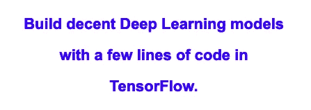

您将学习如何使用 TensorFlow 中的几行代码为分类问题建立和训练体面的深度学习模型。本文涵盖的 5 种模型是:

*   **逻辑回归模型**
*   **单隐层模型**
*   **多隐藏层模型**
*   **带卷积层和池层的深度 CNN**
*   **具有 2 个卷积层和 2 个池层的更深 CNN**

本项目采用了以下方法来实现更好的性能:

*   梯度下降优化器
*   RELU 激活函数
*   学习率衰减
*   一个热编码
*   交叉熵
*   拒绝传统社会的人

 [## 2019 年深度学习的终极学习路径及更多...-数据驱动型投资者

### 又一个美好的一周，一些好的教育内容将会到来。我最喜欢的&最受欢迎的帖子之一…

www.datadriveninvestor.com](https://www.datadriveninvestor.com/2019/01/07/the-ultimate-learning-path-for-deep-learning-in-2019-more/) 

有无衬线和有衬线字体的字母图像。目标是基于单个字母的特定图像来识别字体。这是一个简单的分类问题。

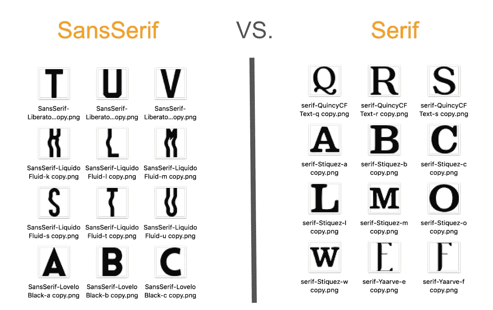

2 types of fonts

## 数据工程

1.  将图像转换为 36*36 像素的灰度
2.  向数据集添加标签:font SansSerif = 0，font Serif = 1
3.  将数据集混洗并分成 2 个数据集:训练数据集(80%)和测试数据集(20%)

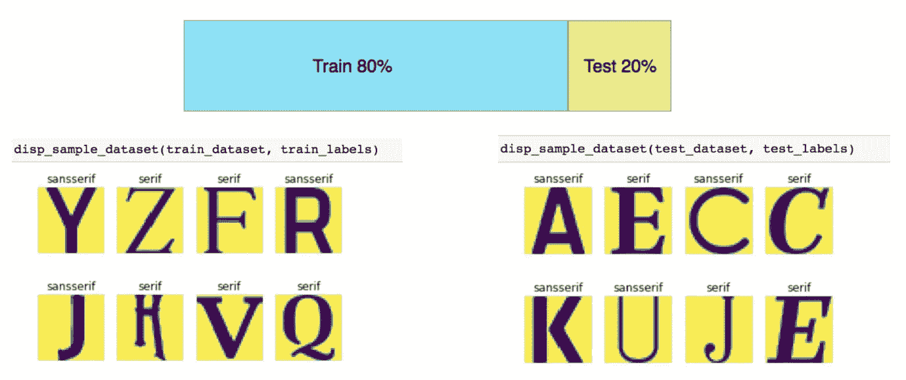

train dataset and test dataset

## **逻辑回归模型**

1.  模型设定

[Logistic regression model](https://gist.github.com/alinazhanguwo/b6d147339757a43510ed2a605720edba#file-logistic-regression-model-py)

2.模特培训

[Logistic regression model trainning](https://gist.github.com/alinazhanguwo/01f4d11a3d1843c182302664e7b36c70)

训练精度:0.718935

测试精度:0.692913

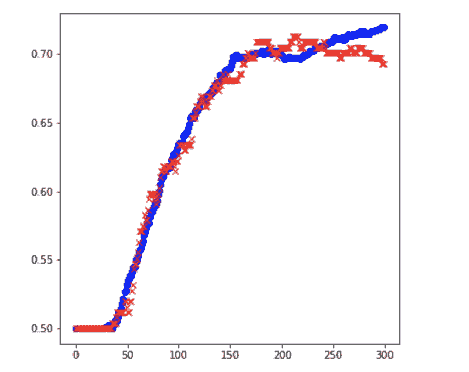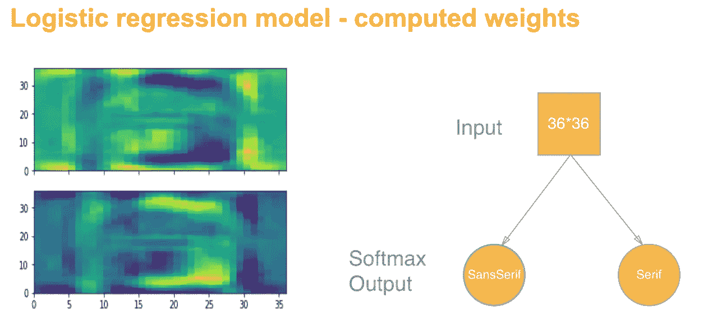

## **单隐层模型**

1.  模型设定

[Single hidden layer model](https://gist.github.com/alinazhanguwo/bdf0345aa5b6abf8b39bb0cea0078d39)

2.模特培训

[Single hidden layer model trainning](https://gist.github.com/alinazhanguwo/2be969a1f9432384253efcdd90cf96a7)

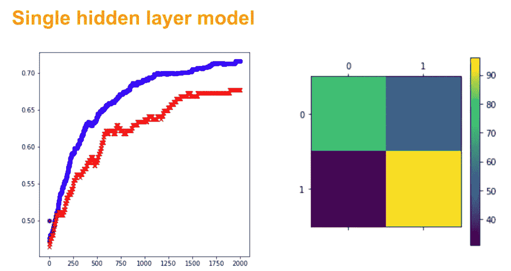

**confusion matrix**

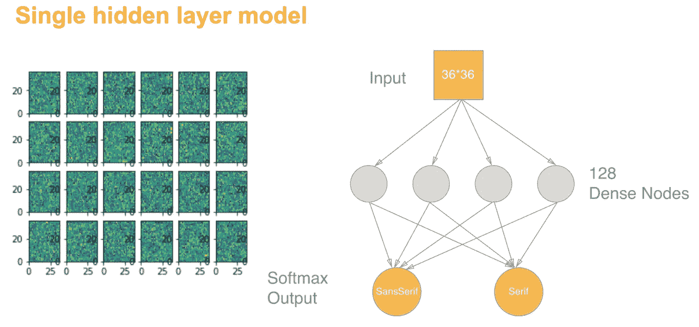

## **多隐藏层模型**

1.  模型设定

[Multiple hidden layers model](https://gist.github.com/alinazhanguwo/23478957afcc7b8d505c92fee6c4b430)

2.模特培训

[Multiple hidden layers model training](https://gist.github.com/alinazhanguwo/4f80f5ccd7fb5ff3c9d0a124d200cd4d#file-multiple-hidden-layers-model-training-py)

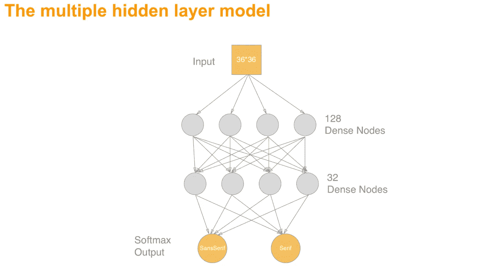

## **带卷积层和池层的深度 CNN**

1.  模型设定

[Deep CNN](https://gist.github.com/alinazhanguwo/04f19063a82ad4a4c7bdc0f22e8895c0)

2.模特培训

[Deep CNN training](https://gist.github.com/alinazhanguwo/9a7a1078d5475772d96b72c87f2bdd38)

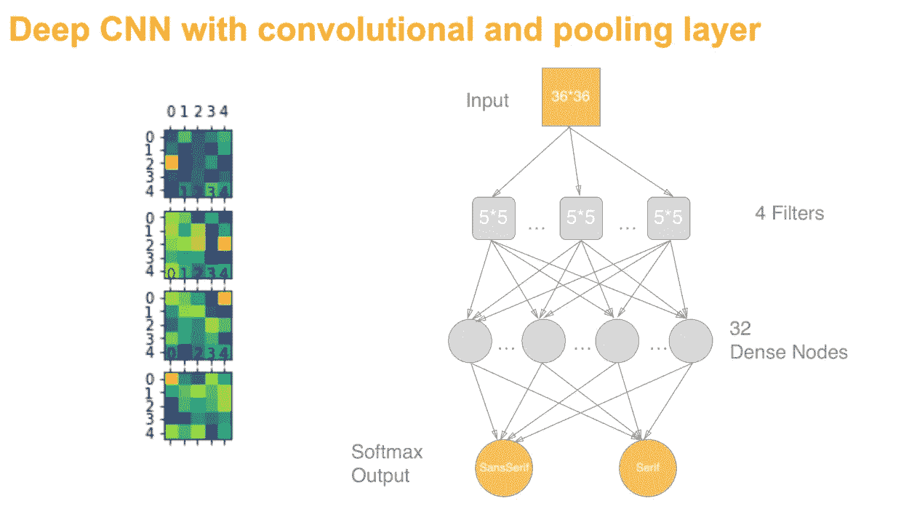

## **具有 2 个卷积层和 2 个池层的更深 CNN**

1.  模型设定

[Deeper CNN](https://gist.github.com/alinazhanguwo/ef3de4eb69d9cfce3318ce7a16237636)

2.模特培训

[Deeper CNN training](https://gist.github.com/alinazhanguwo/04d1297c737a5ef7501bf223736ae8c4)

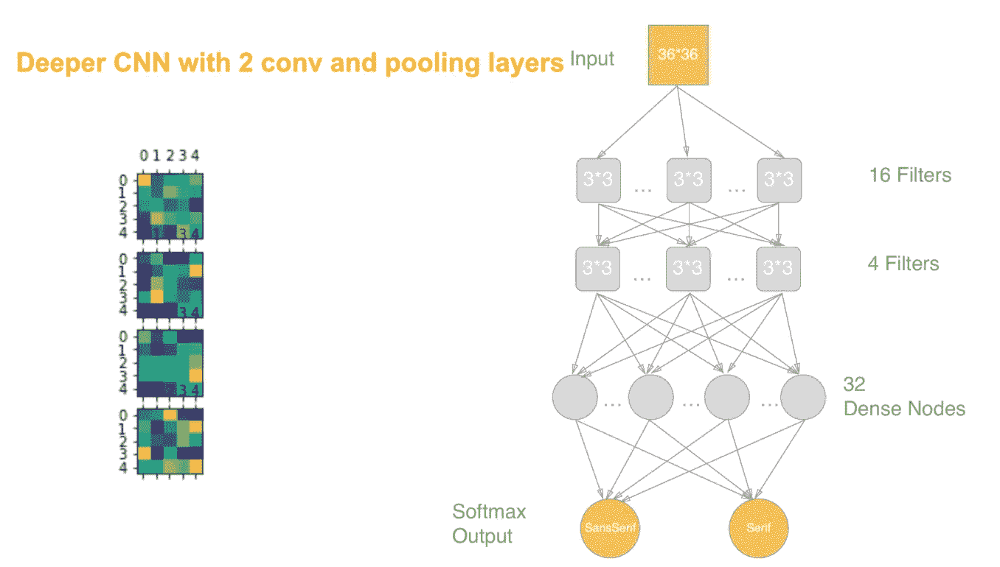

## 摘要

恭喜你。您只需学习如何使用 Tensorflow 为分类问题建立和训练 5 个深度学习模型。

增加池化层还有一点就是因为池化，图像尺寸在逐渐缩小。早期的卷积权重通常训练为检测简单的边缘，而连续的卷积层将这些边缘组合成逐渐更复杂的形状，如人脸、汽车甚至狗。

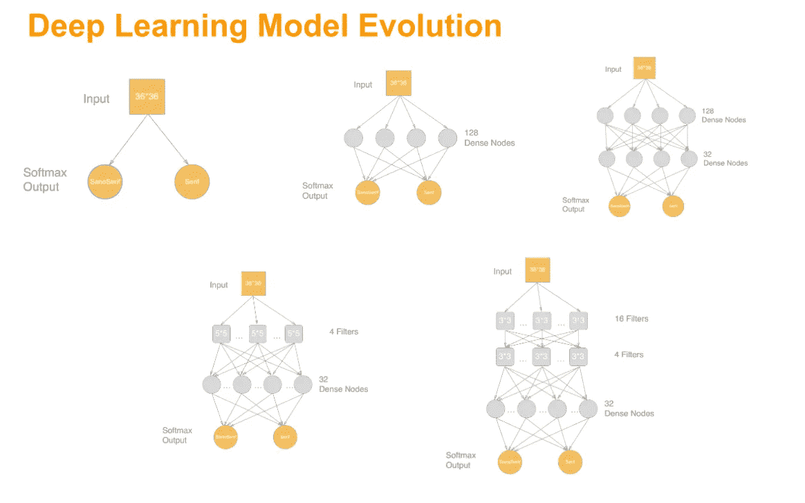

人类的学习是深度学习的开始！玩得开心。