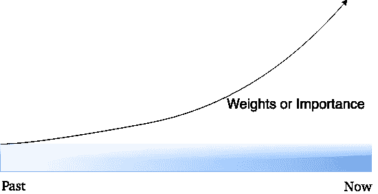
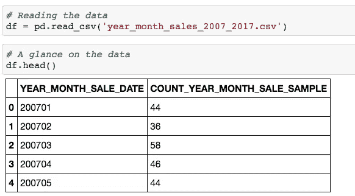
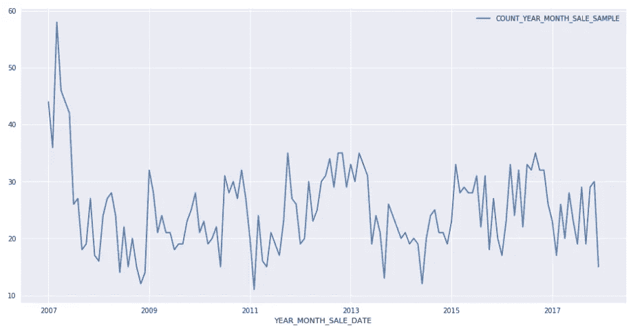
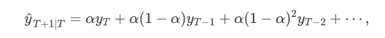
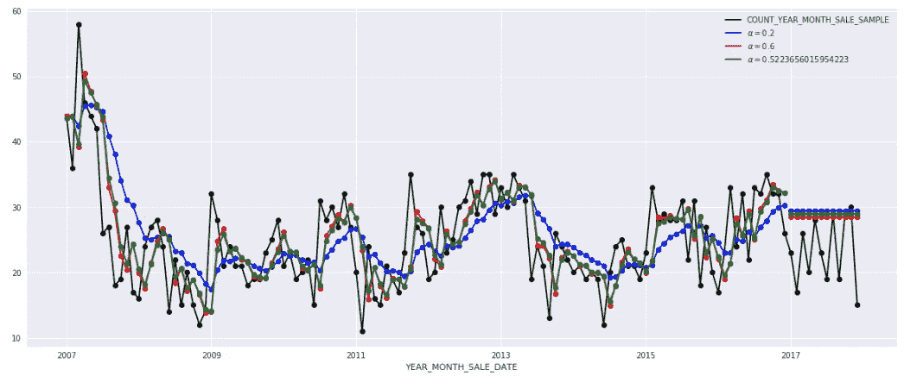
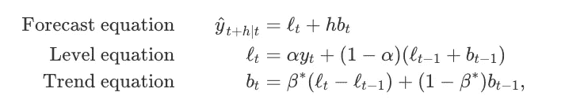
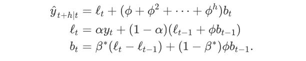
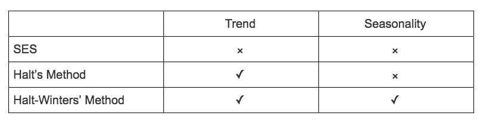
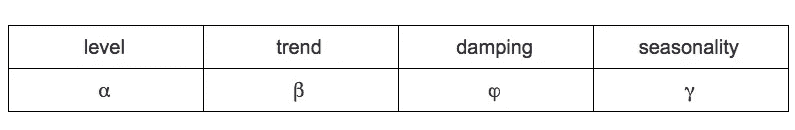

# 如何使用 Python 构建指数平滑模型:简单指数平滑、Holt 和 Holt-Winters

> 原文：<https://medium.datadriveninvestor.com/how-to-build-exponential-smoothing-models-using-python-simple-exponential-smoothing-holt-and-da371189e1a1?source=collection_archive---------0----------------------->

在前 12 个月内，iPhone XS 将售出多少台？埃隆马斯克(Elon musk)在直播节目上抽大麻后，对特斯拉的需求趋势如何？今年冬天会暖和吗？(我住在加拿大。)如果你对这些问题感到好奇，指数平滑向你承诺通过建立模型窥视未来的可能性。

指数平滑法为过去的观测值分配指数递减的权重。获得的观察值越近，分配的权重就越高。例如，与 12 个月前的观察相比，对上个月的观察给予更大的权重是合理的。



Exponential smoothing Weights from Past to Now

本文将说明如何使用 **Python** 和 **Statsmodels** 构建**简单指数平滑**、**霍尔特**和**霍尔特-温特斯**模型。对于每种模型，演示都按以下方式组织:


[Statsmodels](https://www.statsmodels.org/stable/index.html) 是一个 Python 模块，提供了实现许多不同统计模型的类和函数。我们需要将它导入 Python 代码，如下所示。

```
**from** **statsmodels.tsa.api** **import** ExponentialSmoothing, SimpleExpSmoothing, Holt
```

**在我们的示例中，源数据集**包含 2007-01 年至 2017-12 年期间美国一个城镇的房产销售数量。



Source dataset for property sales

使用折线图，我们可以看到多年来的数据变化。

```
df.plot.line(x = 'YEAR_MONTH_SALE_DATE', 
             y = 'COUNT_YEAR_MONTH_SALE_SAMPLE')
plt.show()
```



我们将使用 10 年历史数据(2007-2016 年)预测 2017 年的房地产销售。

**简单指数平滑**

SES 是预测**没有明确趋势或季节模式**的数据的好选择。预测使用加权平均值进行计算，这意味着最大的权重与最近的观测值相关联，而最小的权重与最早的观测值相关联:



其中 0≤ α ≤1 为平滑参数。

权重降低率由平滑参数α控制。如果α较大(即接近 1)，则更近的观测值将被赋予更大的权重。有两种极端情况:

*   α=0:所有未来值的预测都等于历史数据的平均值(或“均值”)，称为**平均法**。
*   α=1:简单地把所有的预测都设为最后一次观测的值，统计学上叫做**朴素方法**。

这里我们运行简单指数平滑的三种变体:

1.  在`fit1,`中，我们明确地为模型提供了平滑参数α=0.2
2.  在`fit2,` 中，我们选择α=0.6
3.  在`fit3,`中，我们使用自动优化，允许 statsmodels 自动为我们找到一个优化值。**这是推荐的方法。**

```
# Simple Exponential Smoothing
fit1 = SimpleExpSmoothing(saledata).fit(smoothing_level=0.2,optimized=**False**)
fcast1 = fit1.forecast(12).rename(r'$\alpha=0.2$')
# plot
fcast1.plot(marker='o', color='blue', legend=**True**)
fit1.fittedvalues.plot(marker='o',  color='blue')

fit2 = SimpleExpSmoothing(saledata).fit(smoothing_level=0.6,optimized=**False**)
fcast2 = fit2.forecast(12).rename(r'$\alpha=0.6$')
# plot
fcast2.plot(marker='o', color='red', legend=**True**)
fit2.fittedvalues.plot(marker='o', color='red')

fit3 = SimpleExpSmoothing(saledata).fit()
fcast3 = fit3.forecast(12).rename(r'$\alpha=**%s**$'%fit3.model.params['smoothing_level'])
# plot
fcast3.plot(marker='o', color='green', legend=**True**)
fit3.fittedvalues.plot(marker='o', color='green')

plt.show()
```

使用 SES 预测 2017 年 1 月至 2017 年 12 月期间的房地产销售。



Forecasting with Simple Exponential Smoothing

**霍尔特方法**

Holt 扩展了简单指数平滑法(解决没有明确趋势或季节性的数据),允许预测 1957 年的趋势数据。霍尔特的方法包括一个预测方程和两个平滑方程(一个用于**水平**，一个用于**趋势**):



其中 0≤ α ≤1 为水平平滑参数，0≤ β* ≤1 为趋势平滑参数。

对于长期预测，用霍尔特方法进行的预测在未来会无限地增加或减少。在这种情况下，我们使用**阻尼趋势法**，其阻尼参数为 0 < ϕ < 1，以防止预测“失控”。



同样，这里我们运行 Halt 方法的三个变体:

1.  在`fit1,`中，我们明确提供了平滑参数α=0.8，β*=0.2 的模型。
2.  在`fit2,` 中，我们使用指数模型，而不是霍尔特加法模型(这是默认的)。
3.  在`fit3,`中，我们使用霍尔特加法模型的阻尼版本，但允许阻尼参数ϕ优化，同时固定α=0.8，β*=0.2 的值。

```
fit1 = Holt(saledata).fit(smoothing_level=0.8, smoothing_slope=0.2, optimized=**False**)
fcast1 = fit1.forecast(12).rename("Holt's linear trend")

fit2 = Holt(saledata, exponential=**True**).fit(smoothing_level=0.8, smoothing_slope=0.2, optimized=**False**)
fcast2 = fit2.forecast(12).rename("Exponential trend")

fit3 = Holt(saledata, damped=**True**).fit(smoothing_level=0.8, smoothing_slope=0.2)
fcast3 = fit3.forecast(12).rename("Additive damped trend")

fit1.fittedvalues.plot(marker="o", color='blue')
fcast1.plot(color='blue', marker="o", legend=**True**)
fit2.fittedvalues.plot(marker="o", color='red')
fcast2.plot(color='red', marker="o", legend=**True**)
fit3.fittedvalues.plot(marker="o", color='green')
fcast3.plot(color='green', marker="o", legend=**True**)

plt.show()
```


Forecasting with Halt’s Method

霍尔特-温特斯法

(彼得·温特斯是霍尔特的学生。霍尔特-温特斯的方法首先是由彼得提出的，然后他们一起研究。多么美好伟大的连接。就像柏拉图遇到苏格拉底一样。)

Holt-Winters 方法适用于包含季节性平滑参数γ的趋势和季节性数据。这种方法有两种变体:

*   **加法:**季节变化在整个系列中大致恒定。
*   **乘法:**季节变化与数列水平成比例变化。

这里，我们运行完整的 Holt-Winters 方法，包括趋势部分和季节部分。Statsmodels 允许所有组合，包括如下例所示:

1.  在`fit1,`中，我们使用加性趋势、加性季节性周期`season_length=4`和 Box-Cox 变换。
2.  在`fit2,`中，我们使用加法趋势、**乘法**季节性周期`season_length=4`和 Box-Cox 变换。
3.  在`fit3,`中，我们使用加性**阻尼**趋势、加性季节性周期`season_length=4`和 Box-Cox 变换。
4.  在`fit4,`中，我们使用加法**阻尼**趋势、**乘法**季节性周期`season_length=4`和一个 Box-Cox 变换。

```
fit1 = ExponentialSmoothing(saledata, seasonal_periods=4, trend='add', seasonal='add').fit(use_boxcox=**True**)
fit2 = ExponentialSmoothing(saledata, seasonal_periods=4, trend='add', seasonal='mul').fit(use_boxcox=**True**)
fit3 = ExponentialSmoothing(saledata, seasonal_periods=4, trend='add', seasonal='add', damped=**True**).fit(use_boxcox=**True**)
fit4 = ExponentialSmoothing(saledata, seasonal_periods=4, trend='add', seasonal='mul', damped=**True**).fit(use_boxcox=**True**)fit1.fittedvalues.plot(style='--', color='red')
fit2.fittedvalues.plot(style='--', color='green')

fit1.forecast(12).plot(style='--', marker='o', color='red', legend=**True**)
fit2.forecast(12).plot(style='--', marker='o', color='green', legend=**True**)

plt.show()
print("Forecasting sales of properties using Holt-Winters method with both additive and multiplicative seasonality.")
```


Forecasting sales of properties using Holt-Winters method with both additive and multiplicative seasonality

总而言之，我们研究了 3 个指数平滑模型的机制和 python 代码。如下表所示，我提供了为数据集选择合适模型的方法。



Methodology for Exponential Smoothing

指数平滑法不同组成形式的平滑参数汇总。



Smoothing Parameters

指数平滑法是当今工业中应用最广泛、最成功的预测方法之一。如何预测零售额、游客数量、电力需求或收入增长？指数平滑是你展现未来所需的超能力之一。

# 报名参加🦞:的 Udemy 课程

## [具有机器学习和统计的推荐系统](https://www.udemy.com/course/recommender-system-with-machine-learning-and-statistics/?referralCode=178D030EF728F966D62D)


[https://www.udemy.com/course/recommender-system-with-machine-learning-and-statistics/?referralCode=178D030EF728F966D62D](https://www.udemy.com/course/recommender-system-with-machine-learning-and-statistics/?referralCode=178D030EF728F966D62D)