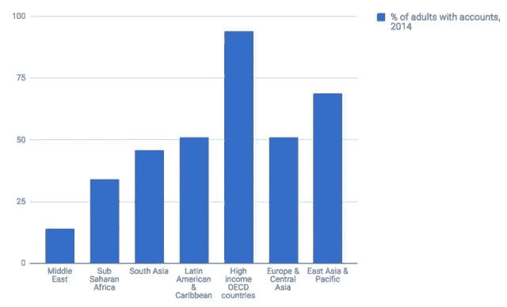
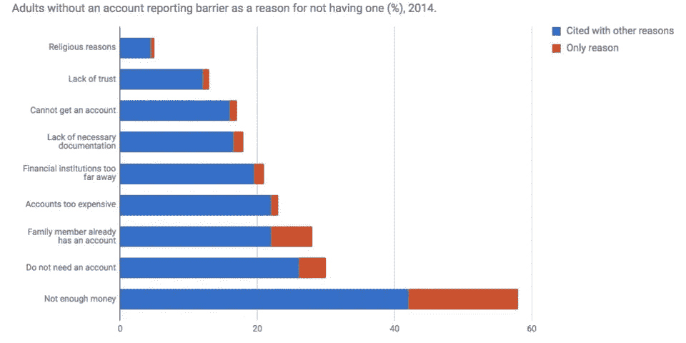

# 如何构建全球金融普惠:区块链

> 原文：<https://medium.datadriveninvestor.com/how-to-build-global-financial-inclusion-blockchain-laborcrypto-5d737aafe04f?source=collection_archive---------3----------------------->

世界上超过 20 亿人没有银行账户。这种金融排斥加剧了贫困和缺乏摆脱贫困的机会。

GLOBAL FREELANCE P2P ECOSYSTEM

如果有一种商业模式可以打破这种障碍呢？有，区块链支持点对点劳动力市场。

数字金融服务正在为数亿人通过移动货币服务、支付卡和其他金融技术或金融科技应用等服务实现金融普惠铺平道路。

全球研究显示，人们没有银行账户的主要原因是缺乏实际的金融场所，以及人们没有钱开设账户。当我们开发 LaborCrypto 时，我们认识到该平台可以增强这些人的能力，并帮助解决这些问题。

由于加密货币和 LaborCrypto 令牌，一个人可以真的没有钱，但如果他们有一部智能手机，他们可以完成一项工作，并在完成时有令牌。我们都知道像 crypto 这样的金融科技不会有任何发展。

世界银行多年来一直试图解决金融排斥问题。他们和比尔及梅林达盖茨基金会每三年进行一次研究并发布全球 Findex 报告。根据该报告，由移动服务建立的金融包容性可以提高人们赚取收入的能力，从而减少贫困，管理他们的金融风险，降低他们的支付成本，帮助他们储蓄，并实际上减少政府的腐败。

智能手机的采用在帮助改善人们获得数字金融服务方面产生了巨大影响。它减少了人们对实体金融服务场所的需求。撒哈拉以南非洲地区的人民已经证明，移动电话提高了包容性，并在过去几年里一直在体验其好处。

我们看到的是，移动电话，加上 LaborCrypto，也可以成为以前被排除在发达的金融基础设施之外的人赚钱的门户。

我们特别相信 LaborCrypto 能在哪些方面有所帮助？

世界上 11 亿没有银行账户的人有手机。此外，仅在印度和中国就有 33%或 6 亿多的无银行账户者，其中超过 4 亿人有手机。这两个国家也是世界上大量国际自由职业者的家园。

想想这两个国家的 4 亿人中有多少人可以从事自由职业。劳工加密运动的社会影响是惊人的。一些人现在将有能力赚取收入，有了代币，就有办法用支付来购买他们需要的东西。他们还将参与收入分享计划。

最重要的是，新增的自由职业者将扩大国际自由职业者的市场，其规模前所未有。

这只是 LaborCrypto 使用技术来赋予那些被遗忘的人力量的精神的又一个例子。这就是我们努力将这一愿景变为现实的原因。

我们的愿景很重要，而许多需要它的人甚至看不到它的到来。