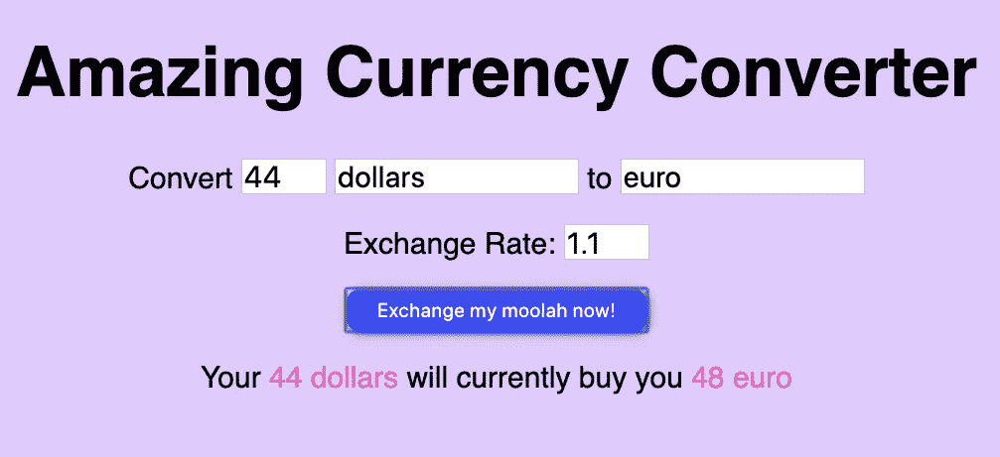
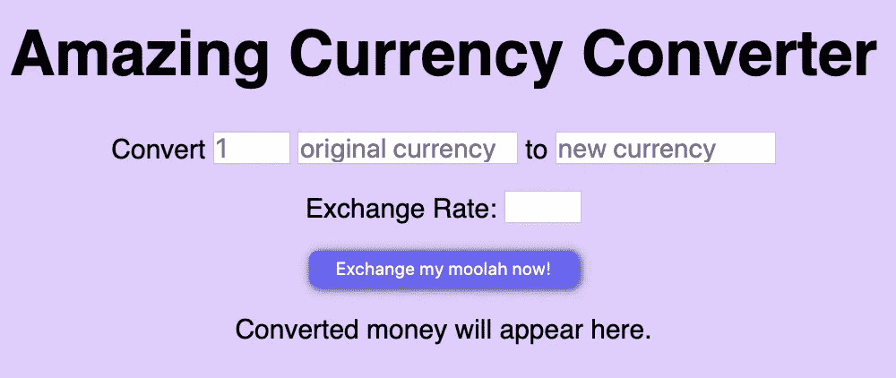

# 当你在生活中从未见过 JS，也不真正知道它是什么的时候，如何用 JS 构建一些东西。

> 原文：<https://medium.datadriveninvestor.com/how-to-build-something-with-js-when-youve-never-seen-js-before-in-your-life-and-don-t-really-know-187ab660d7ec?source=collection_archive---------6----------------------->

**难度等级:**根据经验，1/5 或者 2/5。

**趣味潜能:**无限🎉

**背景:** Javascript (JS)是一种在 Web 上使用的脚本语言。我们可以用它来使 HTML 页面互动(按钮点击，颜色变化，其他类似的有趣的事情)。如果没有 JS，我们将生活在一个枯燥、静态的 HTML 页面的世界里，就像 90 年代初一样。

[](https://www.datadriveninvestor.com/2019/02/21/best-coding-languages-to-learn-in-2019/) [## 2019 年最值得学习的编码语言|数据驱动的投资者

### 在我读大学的那几年，我跳过了很多次夜游去学习 Java，希望有一天它能帮助我在…

www.datadriveninvestor.com](https://www.datadriveninvestor.com/2019/02/21/best-coding-languages-to-learn-in-2019/) 

**先决条件:**这个项目不需要 JS 的先验知识。一点 HTML 和 CSS 将是有用的。你将需要 VS 代码或其他代码编写软件以及如何使用它的基本知识(或者，你可以使用 [Codepen](https://codepen.io) ，它会为你完成所有的设置。)

**我们将构建什么:**在这个项目中，我们将制作这个超级酷、色彩缤纷的货币转换器(点击图片查看 [Codepen](https://codepen.io/LKRR/pen/ExavVKq) ):

[](https://codepen.io/LKRR/pen/ExavVKq)

*免责声明* : *这是一篇初学者 JS 文章，不会创建一个超精确的、由世界银行设定的、可靠的货币转换器。这只是为了展示 JS 的一点能力。所以不要用它来计算你的假期预算。*

现在，这是一种方式，让我们进入它…

**第一步:设置。**

对于这个项目，你需要三个文件:`index.html`、`stylesheet.css`和`converter.js`。

在`index.html`中，添加一个样板文件(我喜欢为此使用 [HTML Shell](http://htmlshell.com) )。

接下来，通过`<link>`和`<script>`标签将 CSS 和 JS 文件链接到 HTML。

```
<!DOCTYPE html>
<html>
  <head>
    <meta charset="UTF-8" />
    <title>title</title>
 **<link rel="stylesheet" href="stylesheet.css" type="text/css" />**
  </head>
  <body>
 **<script src="converter.js"></script>**
  </body>
</html>
```

您可以通过执行以下两项操作来检查文件是否都已连接:

1.通过`stylesheet.css`添加一个`background-color`

2.使用下面的代码通过`converter.js`添加一些`html` :`document.body.innerHTML = “testing 123”;`不要忘记在之后注释掉它。

如果背景颜色和添加的 HTML 显示出来，就可以了。

*故障排除*:如果没有，请尝试以下方法:

*   确保`<link>`包含正确的 CSS 文件名
*   确保`<script>`标签包含正确的 JS 文件名
*   硬刷新页面(cmd/ctrl + shift + r)。

第二步:HMTL

一旦你的文件都工作在一起，它的时间为 HTML。我们需要以下内容:

*   4 个输入:`original-currency-amount`、`original-currency-unit`、`new-currency-unit`和`exchange-rate`。这些都需要`id`属性，这样它们就可以被 JS 作为目标。
*   一个启动`exchangeMoney()`函数的按钮(它将告诉 JS 做什么)——我们稍后将构建这个函数。
*   a `header`解释我们的应用是什么。
*   带有一些填充文本的`paragraph`将最终显示计算的输出。



HTML 代码如下所示:

```
<body>
    <h1>Amazing Currency Converter</h1><p>Convert
    <input type="number" id="original-currency-amount" placeholder="1"></input>
    <input type="text" id="original-currency-unit" placeholder="dollars"></input> 
   to
    <input type="text" id="new-currency-unit" placeholder="euro"></input>
  </p>
    <p>Exchange Rate:
    <input type="number" id="exchange-rate"></input>
  </p>
    <button>Exchange my moolah now!</button><p id="output-text">Converted money will appear here.</p><script src="converter.js"></script>
  </body>
```

**第三步:变量**

我们的 JS 需要四个变量(存储数据的地方)。我们将给出这些不言自明的名字；`originalCurrencyAmount`、`originalCurrencyUnit`、`newCurrencyUnit`和`newCurrencyAmount`。

要声明一个变量，我们使用关键字`let`，后跟变量名和等号:

`let variableName = [code here]`

存储在`originalCurrencyAmount`、`originalCurrencyUnit`、`newCurrencyUnit`中的数据将来自具有相应 id 的输入。为了从 ids 中检索数据，我们通过`getElementById`获取值，例如:

`let exchangeRate = document.getElementById(“exchange-rate”).value;`

`newCurrencyAmount`的数据将由原币金额乘以汇率生成:

`let newCurrencyAmount = originalCurrencyAmount * exchangeRate;`

这将工作，但我们不希望我们的转换器返回一些荒谬的东西，如“你的 44 美元目前将为你购买 48.0000000006 欧元。”为了防止这种情况，我们使用了`Math.floor()`，这是 Javascript 提供的一种将数字向下舍入到最接近的整数的方法。显然，如果我们交换真实的 wonga，我们将不得不创建更精确的东西，但这将满足我们练习的目的。

**第四步:函数()**

现在我们真的进入正题了。为了赋予我们的应用程序功能(例如，让它实际做一些事情)，我们需要创建一个函数。为此，我们使用`function`关键字，给函数一个描述它做什么的名字，然后用括号`()`括起来。我们的函数将被称为`exchangeMoney()`。然后函数体被放在花括号中`{}`。

为了构建我们的函数，我们需要做两件事:

1.  **将变量移入我们的函数:**

```
function exchangeMoney() {
 let originalCurrencyAmount = document.getElementById(
  "original-currency-amount"
 ).value;let originalCurrencyUnit = document.getElementById("original-currency-unit")
  .value;let exchangeRate = document.getElementById("exchange-rate").value;let newCurrencyUnit = document.getElementById("new-currency-unit").value;let newCurrencyAmount = Math.floor(originalCurrencyAmount * exchangeRate);
}
```

**2。告诉函数将我们的** `**output-text**` **段中的预设文本换出为我们的计算结果。**

这是我们函数的核心。为此，我们使用[字符串插值](https://en.wikipedia.org/wiki/String_interpolation#JavaScript)(一种向 Javascript 函数添加变量的方法——见下面的粗体字)。我选择用一句话来表达这一点“你的 X*X*美元将会为你购买 Y *欧元*”:

```
document.getElementById(
  "output-text"
 ).innerHTML = `Your <span>**${originalCurrencyAmount}**</span> <span>**${originalCurrencyUnit}**</span> will currently buy you <span>**${newCurrencyAmount}**</span><span>**${newCurrencyUnit}**</span>`;
```

一个更简单的版本可以这样说:“你的钱可以给你买 X 美元。”

```
document.getElementById(
  "output-text"
 ).innerHTML = `Your money will buy you <span>**${newCurrencyAmount}**</span><span>**${newCurrencyUnit}**</span>`;
```

*注意*:为了样式化，插值变量被包在`<span>`中，这对功能没有影响。

我们的整个 JS 代码现在看起来像这样:

```
function exchangeMoney() {
 let originalCurrencyAmount = document.getElementById(
  "original-currency-amount"
 ).value;let originalCurrencyUnit = document.getElementById("original-currency-unit")
  .value;let exchangeRate = document.getElementById("exchange-rate").value;let newCurrencyUnit = document.getElementById("new-currency-unit").value;let newCurrencyAmount = Math.floor(originalCurrencyAmount * exchangeRate);document.getElementById(
  "output-text"
 ).innerHTML = `Your <span>${originalCurrencyAmount}</span> <span>${originalCurrencyUnit}</span> will currently buy you <span>${newCurrencyAmount}</span> <span>${newCurrencyUnit}</span>`;
}
```

第五步:把所有东西都连接起来。

你可能会想，“很酷的故事——但是我怎么看这个工作呢？”好了，这是真相大白的时刻💫…

为了让这个演示顺利进行，我们需要做的就是将我们的函数链接到 HTML 文件中的按钮，允许它在按钮被单击时触发:

```
<button **onclick="exchangeMoney()"**>Exchange my moolah now!</button>
```

现在，我们可以换钱直到母牛回家:


**第六步:CSS**

谈到造型，世界真的是你的牡蛎。这里有几个我用过的想法:

*   **设计跨度。**为了使输出的句子更容易阅读，我们可以给跨度添加不同的文本颜色:

```
span {
 color: hotpink;
}
```

*   **输入样式**。如果有什么东西让应用程序看起来过时了，那就是无样式的输入。通过改变`border-radius` 和`font-size`来解决这个问题。

```
input {
 width: 240px;
 height: 30px;
 display: inline-block;
 font-size: 30px;
 border-radius: 10px;
}
```

*   **按钮:悬停状态。**当用户悬停在按钮上时，为了清楚起见，您可以更改背景颜色和光标:

```
button:hover {
 cursor: pointer;
 background-color: #3333ff;
}
```

**第七步:有趣的额外小技巧:**

以下是一些非必要但非常有趣的附加功能，您可以用它们来增强您的应用程序:

*   **在应用程序中添加表情符号:**最简单的方法是使用一个`<span>`和一个`aria-label`。你可以从[getemoji.com](https://getemoji.com/)复制并粘贴所有你需要的表情符号。

```
<span role="img" aria-label="money">💰 </span>
```

*   **在标签页添加表情符号:**如果你想让一个表情符号出现在浏览器标签页(谁不想呢？)，只需将它复制并粘贴到`<title>`HTML 中:

```
<title>💰</title>
```

您可以在[这个代码栏](https://codepen.io/LKRR/pen/ExavVKq)中查看和玩我完成的令人惊叹的货币转换器:

**超越:**所以你已经完成了这个项目，并想更进一步？这里有一些改进的建议，你可以谷歌一下，然后实施:

1.  寻找更准确的向下舍入方法(例如，舍入到最接近的分)。
2.  将它与真实的汇率 API 联系起来😬。

货币兑换快乐！💸💸💸