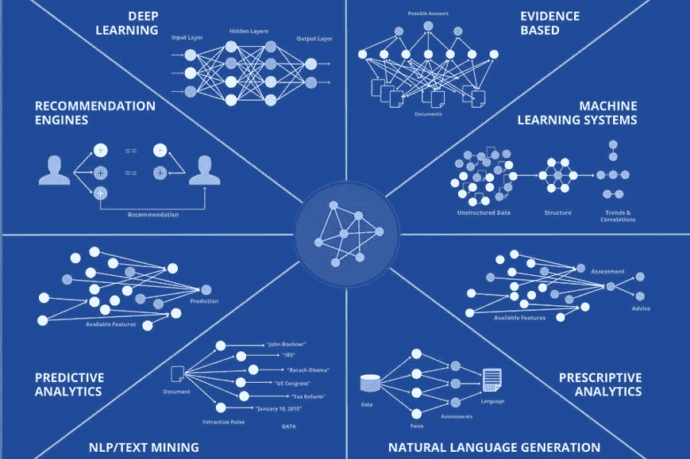

# 如何打造未来的程序化引擎，现在。

> 原文：<https://medium.datadriveninvestor.com/how-to-build-the-programmatic-engine-of-the-future-now-92a88b603793?source=collection_archive---------17----------------------->

Photo by [NeONBRAND](https://unsplash.com/@neonbrand?utm_source=medium&utm_medium=referral) on [Unsplash](https://unsplash.com?utm_source=medium&utm_medium=referral)

> 第二部分:为几乎所有机构揭开 2019/2020 年新兴广告技术和关键关注领域的神秘面纱。

# 如果爱数据是错的，我不想是对的！

无论编程引擎的技术架构是什么，它都必须包括来自具有相似兴趣的相邻合作伙伴的数据的集成。在汽车领域，可能共享分析数据或实际数据的潜在合作伙伴包括制造商、制造商的融资公司、汽车保险提供商。获得雪佛兰、丰田、福特、奥迪、大众、奔驰、宝马等品牌的历史数据，将创造一个巨大的机会来产生关于品牌忠诚度、品牌转换行为和许多其他见解的见解。更好的是，对这些数据的综合形式进行深入分析，甚至可以发现许多不同地区、许多不同品牌的许多不同类型客户的实际销售漏斗。关键是，你可以在“遇见”潜在客户之前洞察他们，并根据你认为他们想要的客户旅程主动驱动他们的行为，除非你的行动将由数据驱动。

## 人工智能:就是数学！现在让我们来建造。

如标题所示，AI 只是数学。尽管有时很复杂，但它只是函数、线性代数和统计方法的简单组合，使用其他函数的输入、吞吐量和输出来决定它的输入、吞吐量和输出。如果这看起来像是一个循环论证，那是因为它确实如此。这正是人工智能与非学习算法的不同之处。反馈回路。也就是说，我们现在可以将一些非常古老的概念纳入我们的模型，因为技术和数据环境已经赶上了历史上假设的学术/理论模型以及对人们行为观察的证据。

## 编程引擎中可能包含的人工智能:

*   支付倾向
*   价格弹性预测
*   价格歧视分析
*   亲和力分析
*   下一个最佳行动推荐引擎
*   目标市场相似推荐引擎
*   全渠道分销优化
*   个性化引擎
*   客户端人工智能推荐引擎

## 你必须实时协调。将繁忙的工作自动化。

每个数字机构都是不同的，因为他们的业务流程是独特的，他们的业务问题也是特定的。利用为期多天(2-3 天)的研讨会来隔离和解决最具附加值/高容量的工作流，将其分解，建模并映射到系统环境和当前数据模型，并实现自动化。这些流程对业务执行至关重要，但简单到足以快速准确地实现自动化。员工和客户都会喜欢办公室服务的节奏。

## ***成长黑客。代理增长&服务增长。***

在这个编程引擎中，我们专注于通过人工智能和人工增强的编程服务执行来提供下一级增长即服务。对这家数字机构来说，正确执行这一计划同样重要的是，它如何扩大客户群，与他们互动，提供令人惊叹的服务。包含在整个生态系统中的关键功能将满足增长黑客的以下要求:

1.  你将如何利用对数据和人工智能的访问来发现新客户？
2.  您能否在自己的销售过程中加快决策者的识别？
3.  您正在采取什么措施来实现面向潜在代理商的个性化内容的自动化？
4.  您的团队将使用什么平台来执行多渠道/全渠道合作？
5.  你将如何创造在客户服务和日常交流中令人惊叹的微观体验？
6.  你将如何为你的品牌创造一致的内容，给公众/追随者/潜在客户最大的价值？
7.  创造创新文化、自由创造、惊喜和内部进步的计划是什么？具体来说，公司会从事哪些行动？
8.  当团队创造新价值并庆祝胜利时，工作是如何完成的视频、语音、发布？
9.  增长和快速扩展是关于启动和获取资本，确保有计划在适当的时候利用这两者，这样就不会错过市场份额。确保钱在你需要之前就在那里，这需要时间。

如果我们仔细考虑上面讨论的观点，并在 2019 年和 2020 年设计包含至少 60%这些关键要素的战略，您将有望击败竞争对手。

更多信息，请直接联系我。大家联系一下，讨论一下。

 [## Blake Williams -应用交付副总裁-业务发展| LinkedIn

### 在全球最大的职业社区 LinkedIn 上查看布莱克·威廉姆斯的个人资料。布莱克在他们的清单上列出了 8 份工作…

www.linkedin.com](https://www.linkedin.com/in/blakewilliamsmba/)