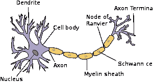
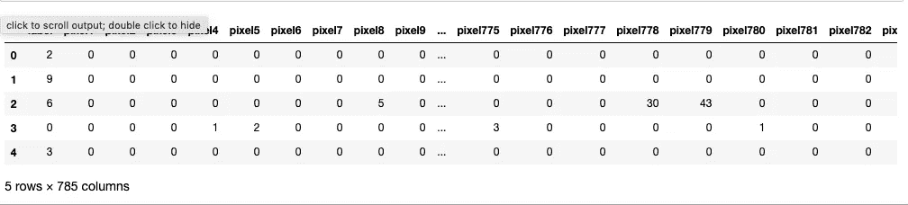
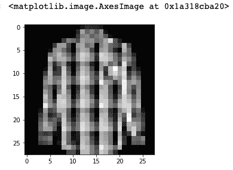
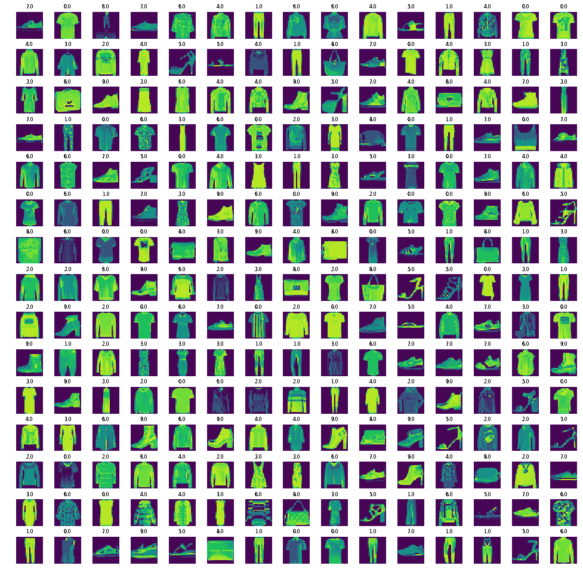
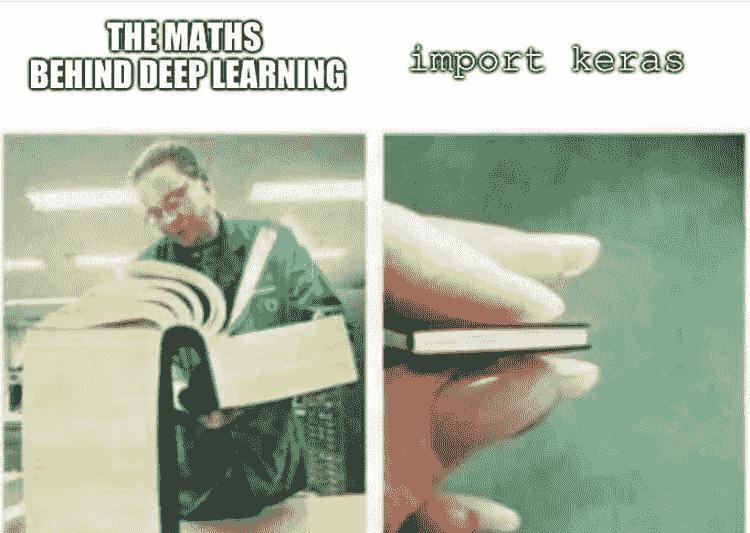
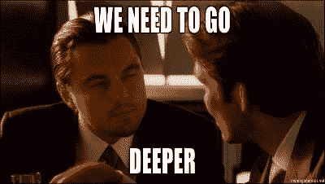

# 如何使用深度学习通过 5 个简单的步骤构建一个时尚分类器。

> 原文：<https://medium.datadriveninvestor.com/how-to-build-to-a-fashion-classifier-in-5-easy-steps-using-deep-learning-c0817b615ef8?source=collection_archive---------4----------------------->

[](http://www.track.datadriveninvestor.com/1B9E)

每个周末，我都会建立一个机器学习项目来涉足数据科学，本周我选择了 MNIST 数据集。

> "如果你为生活而打扮，你就能得到你想要的任何东西。"——伊迪丝·赫德。

*所以，准备好一些代码、迷因和一点理论吧。*

# 步骤 1:问题陈述和业务案例

时尚训练集由 70，000 幅图像组成，分为 60，000 个训练样本和 10，000 个测试样本。数据集样本由 28x28 灰度图像组成，与来自 10 个类别的标签相关联。

> 这 10 个类如下:
> 0 = > T 恤/上衣 1 = >裤子 2 = >套头衫 3 = >连衣裙 4 = >外套 5 = >凉鞋 6 = >衬衫 7 = >运动鞋 8 = >包 9 = >踝靴

每幅图像高 28 像素，宽 28 像素，总共 784 像素。每个像素都有一个与之关联的像素值，表示该像素的亮度或暗度，数字越大表示越暗。该像素值是 0 到 255 之间的整数。


[https://becominghuman.ai/param-ishan-for-deep-learning-101-d6f049970584?gi=686405f4538d](https://becominghuman.ai/param-ishan-for-deep-learning-101-d6f049970584?gi=686405f4538d)

但在深入编码之前，让我们先了解一下什么是人工神经网络，**人工神经网络**是一组相互连接的节点，类似于**和**大脑中神经元的庞大**网络**。这里，每个圆形节点代表一个**人工神经元**，一个箭头代表从一个**人工神经元**的输出到另一个人工神经元的输入的**连接。**


[https://en.wikipedia.org/wiki/File:Colored_neural_network.svg](https://en.wikipedia.org/wiki/File:Colored_neural_network.svg)

神经元从称为树突的输入通道收集信号，在其细胞核中处理信息，然后在称为轴突的细长分支中产生输出。通过改变这些神经元之间的结合强度，人类的学习适应性地发生。



[https://simple.wikipedia.org/wiki/File:Neuron.svg](https://simple.wikipedia.org/wiki/File:Neuron.svg)

# 步骤 2:导入数据

```
# import libraries 
import pandas as pd # Import Pandas for data manipulation using dataframes
import numpy as np # Import Numpy for data statistical analysis 
import matplotlib.pyplot as plt # Import matplotlib for data visualisation
import seaborn as sns
import random
```

## 为训练数据集和测试数据集创建数据框

```
fashion_train_df = pd.read_csv(‘input/fashion-mnist_train.csv’,sep=’,’)
fashion_test_df = pd.read_csv(‘input/fashion-mnist_test.csv’, sep = ‘,’)
```

# 步骤 3:数据集的可视化

让我们来看看训练数据集的头部

```
# 784 indicates 28x28 pixels and 1 coloumn for the label
# After you check the tail, 60,000 training dataset are present
fashion_train_df.head()
```



df.head()

```
# Let's view the last elements in the training dataset
fashion_train_df.tail()
```


df.tail()

测试数据也是如此

```
# Let’s view the head of the testing dataset
fashion_test_df.head()# Let's view the last elements in the testing dataset
fashion_test_df.tail()fashion_train_df.shape
(60000, 785)
```

## 创建培训和测试阵列

```
training = np.array(fashion_train_df, dtype = ‘float32’)
testing = np.array(fashion_test_df, dtype=’float32')
```

## 我们来看一些图片吧！

```
i = random.randint(1,60000) # select any random index from 1 to 60,000
plt.imshow( training[i,1:].reshape((28,28)) ) # reshape and plot the imageplt.imshow( training[i,1:].reshape((28,28)) , cmap = 'gray') # reshape and plot the image# Remember the 10 classes decoding is as follows:
# 0 => T-shirt/top
# 1 => Trouser
# 2 => Pullover
# 3 => Dress
# 4 => Coat
# 5 => Sandal
# 6 => Shirt
# 7 => Sneaker
# 8 => Bag
# 9 => Ankle boot
```



shirt

## 让我们以网格格式查看更多图像

```
W_grid = 15
L_grid = 15# fig, axes = plt.subplots(L_grid, W_grid)
# subplot return the figure object and axes object
# we can use the axes object to plot specific figures at various locationsfig, axes = plt.subplots(L_grid, W_grid, figsize = (17,17))axes = axes.ravel() # flaten the 15 x 15 matrix into 225 arrayn_training = len(training) # get the length of the training dataset# Select a random number from 0 to n_training
for i in np.arange(0, W_grid * L_grid): # create evenly spaces variables# Select a random number
    index = np.random.randint(0, n_training)
    # read and display an image with the selected index    
    axes[i].imshow( training[index,1:].reshape((28,28)) )
    axes[i].set_title(training[index,0], fontsize = 8)
    axes[i].axis('off')plt.subplots_adjust(hspace=0.4)
```



images in a grid format

# 步骤 4:训练模型

## 准备培训和测试数据集

```
X_train = training[:,1:]/255
y_train = training[:,0]X_test = testing[:,1:]/255
y_test = testing[:,0]from sklearn.model_selection import train_test_splitX_train, X_validate, y_train, y_validate = train_test_split(X_train, y_train, test_size = 0.2, random_state = 12345) 
```

## 解包元组

```
X_train = X_train.reshape(X_train.shape[0], *(28, 28, 1))
X_test = X_test.reshape(X_test.shape[0], *(28, 28, 1))
X_validate = X_validate.reshape(X_validate.shape[0], *(28, 28, 1))
```

# 你到底在说什么！



[https://www.reddit.com/r/ProgrammerHumor/comments/a8ru4p/machine_learning_be_like/](https://www.reddit.com/r/ProgrammerHumor/comments/a8ru4p/machine_learning_be_like/)

```
import keras # open source Neural network library madke our life much easier# y_train = keras.utils.to_categorical(y_train, 10)
# y_test = keras.utils.to_categorical(y_test, 10)cnn_model = Sequential()# Try 32 fliters first then 64
cnn_model.add(Conv2D(64,3, 3, input_shape = (28,28,1), activation='relu'))
cnn_model.add(MaxPooling2D(pool_size = (2, 2)))cnn_model.add(Dropout(0.25))# cnn_model.add(Conv2D(32,3, 3, activation='relu'))
# cnn_model.add(MaxPooling2D(pool_size = (2, 2)))cnn_model.add(Flatten())
cnn_model.add(Dense(output_dim = 32, activation = 'relu'))
cnn_model.add(Dense(output_dim = 10, activation = 'sigmoid'))cnn_model.compile(loss ='sparse_categorical_crossentropy', optimizer=Adam(lr=0.001),metrics =['accuracy'])epochs = 50history = cnn_model.fit(X_train,
                        y_train,
                        batch_size = 512,
                        nb_epoch = epochs,
                        verbose = 1,
                        validation_data = (X_validate, y_validate))
```

# 步骤 5:评估模型

**模型评估**指标**用于**评估**模型**和数据之间的拟合度，在**模型**选择的背景下比较不同的**模型**，并预测预测(与特定的**模型**和数据集相关)的预期准确度



[https://hacktilldawn.com/2016/09/25/inception-modules-explained-and-implemented/](https://hacktilldawn.com/2016/09/25/inception-modules-explained-and-implemented/)

```
evaluation = cnn_model.evaluate(X_test, y_test)
print('Test Accuracy : {:.3f}'.format(evaluation[1]))
```

获得测试数据的预测

```
predicted_classes = cnn_model.predict_classes(X_test)L = 5
W = 5
fig, axes = plt.subplots(L, W, figsize = (12,12))
axes = axes.ravel() #for i in np.arange(0, L * W):  
    axes[i].imshow(X_test[i].reshape(28,28))
    axes[i].set_title("Prediction Class = {:0.1f}\n True Class = {:0.1f}".format(predicted_classes[i], y_test[i]))
    axes[i].axis('off')plt.subplots_adjust(wspace=0.5)from sklearn.metrics import confusion_matrix
cm = confusion_matrix(y_test, predicted_classes)
plt.figure(figsize = (14,10))
sns.heatmap(cm, annot=True)
# Sum the diagonal element to get the total true correct valuesfrom sklearn.metrics import classification_reportnum_classes = 10
target_names = ["Class {}".format(i) for i in range(num_classes)]print(classification_report(y_test, predicted_classes, target_names = target_names))
```

# 参考

[1][https://github.com/zalandoresearch/fashion-mnist](https://github.com/zalandoresearch/fashion-mnist)

[2][https://www . pyimagesearch . com/2019/02/11/fashion-mnist-with-keras-and-deep-learning/](https://www.pyimagesearch.com/2019/02/11/fashion-mnist-with-keras-and-deep-learning/)

[3]https://pravarmahajan.github.io/fashion/

# DDI 特色数据科学课程:

*   [**用于数据科学的 Python**](http://go.datadriveninvestor.com/intro-python/mb)
*   [**Scikit-Learn**](http://go.datadriveninvestor.com/scikitlearn/mb)
*   [**深度学习**](http://go.datadriveninvestor.com/deeplearningpython/mb)

**DDI 可能会从这些链接中收取会员佣金。我们感谢你一直以来的支持。*