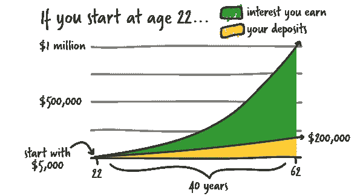
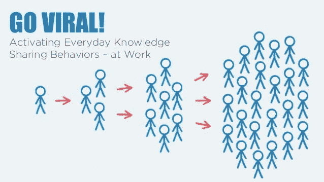
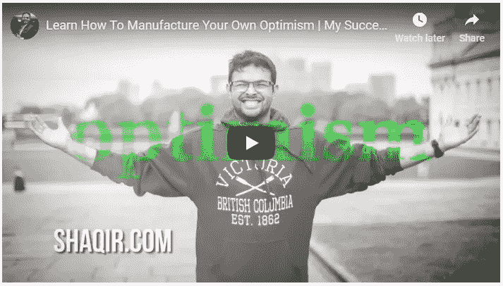
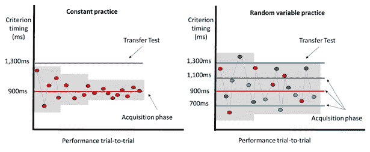

# 如何建立财富和成功指南

> 原文：<https://medium.datadriveninvestor.com/how-to-build-wealth-and-success-guide-b91d18903a53?source=collection_archive---------33----------------------->

财富和成功来自持续不断地为自己和他人提供价值。当你觉得自己已经停滞不前时，沿着这些思路改变一些事情可能会有所帮助:

# 1.使用复利
2。利用网络
3。锻炼纪律

因此，现在是时候深入了解这三个关键要素，以获得巨大的财富和成功了。这是适用于任何利基或市场，所以你要确保你写下这些！

花时间评估如何在您的企业中实施这些方法，并采取大规模行动。

*让我们开始吧！*

# #1.理解复利

财富的关键是**理解复利**。这不仅适用于金钱，也适用于时间。时间是最好的标准。为了帮你一把，想办法把你的宝贵时间复合起来。

一个很好的类比是火箭如何将有效载荷送入轨道。为了到达轨道，火箭必须达到逃逸速度。它必须**快速加速**以达到足够高的速度来摆脱地球的引力。一旦它达到临界阈值，逃逸速度，所需的能量就少得多，一旦它到达轨道，只需要轻微的推动就可以保持在那里。逃脱速度的唯一方法是加速，每一秒都比以前快。

正如我们的地球有一个恒定的引力，我们的经济系统有其基线成本和摩擦，不断将你拉回到你来的地方。正如你所经历的，账单、抵押贷款、育儿、生活中的干扰——每个人和每件事——都会出现，并试图从你身上分一杯羹。你需要达到增加财富的努力最小的逃逸速度。

获得加速度的一个方法是:跑得比它快。从现在开始的每一天，设定一个目标，让自己做得更好一点。日常工作速度仅提高 1%。在你的工作中，每周只提高 1%。每月节省 1%以上。经过足够的日子，你会看到一倍。然后翻了两番。然后增加 10 倍。保持一致。

更好的是，每天提高 2%，甚至 3%。仅仅几年后(你所做的所有工作)，如果你能每天增长 3%,一年后你会比每天增加 1%要好 50 倍！

# #2.为庞大的人际网络增加价值。

个人只能到此为止。紧密的关系网让你变得更好，但是他们的影响力和资源是有限的。当价值来自你并到达他人时，财富就积累起来了。

一旦你最大化了你能在现有网络中为他人提供的价值，你就需要拓展业务，在你不太了解的人需要的地方增加价值。

以移民母亲为例，她知道如何让她的孩子从一个地方到另一个地方，并让他们做作业和在学校表现优异，并能让他们在无数的活动中保持领先。她是物流专家。

只要有合适的机会和一点培训，她可以为一家跨国公司管理供应链和复杂的员工队伍。

在这两个角色中，许多技能是相同的，但是范围和影响是不同的。

拓展业务，结交新朋友。总是试着帮助他们，找出他们可能需要的东西，如果这对你来说不太麻烦，就给他们。

把他们介绍给其他可以帮助他们的人，帮助他们扩大人脉。

新的机会会回到你身边，你从来不知道它的存在，你已经健康的风险处理方式会帮助你利用优势，给你和他人带来胜利。

# #3.不断实践，创造财富和成功

除非你持续不断地练习，否则上面的东西不会起作用。在马拉松比赛中，达到最快速度的方法是调整自己的速度。选择一个可持续的配速并坚持下去，尽可能保持接近你的目标平均速度。以稳定的配速跑完 26 英里，比反复冲刺和休息要快。

如果这仍然难以想象你将如何开始实践它，你可以看看我下面的视频，我展示了“如何制造你自己的乐观|我的成功秘诀” [**【视频】**](https://youtu.be/Jtw4fLOJ3kQ)

***同样，除非你每天的+1%加上之前所有日子的+1%,否则复利不起作用。***

确保你在需要的时候休息，但是保持专注和每日进步。由于你目前负债很少，事情会迅速发展。

这同样适用于你的工作和职业生活。将这些存款存入自己和他人的账户，并保持自律和一致性。你的投资会有回报的。

我将很快补充一点，在这个领域取得成功的诀窍之一是自动化。让它成为你不必每天都去思考如何增加那 1%的东西，它就这样发生了。

例如，设置你的银行账户，每月自动将 250 美元存入一个有息账户，10 年内不要再看那个账户。每年把你的罗斯个人退休帐户的最大值投入到指数基金中，并在一年中严格递增。

过一段时间后，你会发现事情变得更容易，你会有机会越来越多地关注对你来说重要的事情。你会达到逃逸速度。

# 最终想法和建议

我希望你已经发现这篇文章的信息和价值。它还帮助解释了如何为自己和家人创造财富和成功。

如果你正在认真考虑拥有自己的生意，学习如何在网上赚钱，你一定要把这个网页收藏起来。我们不断发布与[财富构建](https://wealthacademy.com/)相关的文章。

你对话题有什么看法？

你打算自己创业吗，如果是，你更倾向于在网上创业还是有实体店？

**让我知道你的想法吧！；)**

# 准备好成长了吗？

如果你喜欢这篇文章，请点击拍手按钮👏加入我们的[脸书小组](https://www.facebook.com/groups/shaqirhussyin/announcements/)或在[财富学院](https://wealthacademy.com/)查看更多关于我们的信息

**。。。**

*由 Wealthacademy.com 为* [*约翰·德克林*](https://medium.com/@johndecleene?source=user_profile---------2------------------) *出版。*