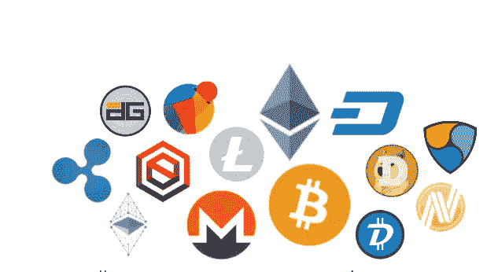

# 如何购买和交易硬币:循序渐进？

> 原文：<https://medium.datadriveninvestor.com/how-to-buy-and-trade-coins-step-by-step-897de709743e?source=collection_archive---------8----------------------->

要开始交易，你必须先买一些 BTC(比特币)、LTC(莱特币)或 ETH(以太坊)。我推荐以太坊，交易更快，费用低。

1.  如果你还没有硬币，去比特币基地创建一个新账户。使用您的信用卡或其他可用于即时转账的支付方式，然后购买以太坊。你可以稍后电汇更多。
2.  现在去币安创建一个新账户。
3.  将您的以太坊(或其他)从比特币基地转移到您的币安帐户。(转到币安<funds>、<deposit>，选择 ETH 币<deposit>，复制你的地址，回到币基，<accounts>，ETH 钱包<send>，从币安粘贴你的地址，输入金额，发送，完成)。</send></accounts></deposit></deposit></funds>
4.  现在把你的以太币兑换成 EOS(伊俄斯)、XRP(瑞波)、TRX(创)、阿达(卡尔达诺)、IOTA(伊塔)、NANO(纳米)、Stellar (XLM)、NEO(尼奥)或者任何你喜欢的硬币。(点击此处查看币安的可交易硬币)。
5.  完成了。享受你新获得的硬币。

**有用的东西**

*市场新闻和工具* Coindesk.com
Cryptopanic.com
Livecoinwatch.com
coinlib . io
Coinmarketcal.com
Cryptomaps.com
Onchainfx.com
Icotrackernet
solume . io

**社区**

比特币论坛——讨论密码的好地方。
[Reddit](https://www.reddit.com/) —只需搜索你想了解更多的硬币。
[中型](http://medium.com)——大量关于加密的博客。
[不和](https://discordapp.com/) —简单易用的桌面聊天客户端。
Telegram——与开发人员联系的聊天客户端。如果你是初学者，就不要去那里。

**交易所**

Kucoin
Bittrex
比特币基地
币安
Bitfinex

logos of popular coins