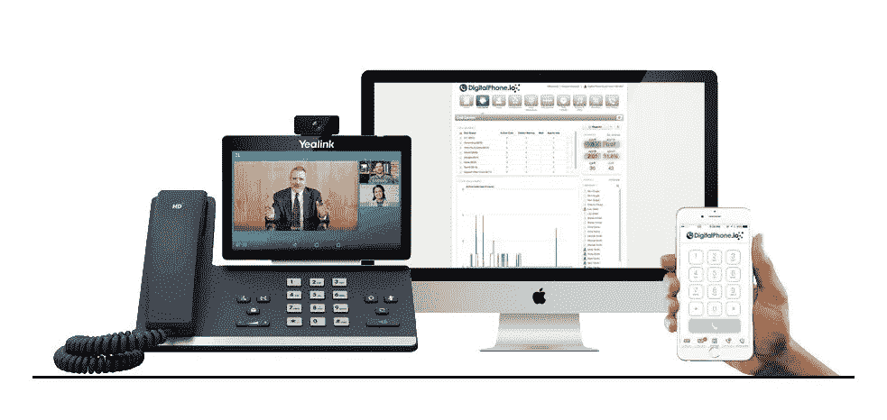

# 如何为您的企业选择基于云的电话服务

> 原文：<https://medium.datadriveninvestor.com/how-to-choose-a-cloud-based-phone-service-for-your-business-d46a3e55023d?source=collection_archive---------8----------------------->

Hosted VoIP, a business system that saves you money, increasing productivity and mobility

云服务彻底改变了现代商业格局。通过互联网轻松访问关键业务服务，使您的公司运营成本越来越低。然而，选择正确的服务可能是一个相当大的挑战，尤其是在有大量选择的情况下。

如今使用最广泛的云服务之一是基于云的电话。无论是长途电话解决方案，还是仅仅专注于[本地服务](https://carolinadigitalphone.com/northcarolina/)支持，在为您的企业选择理想的基于云的电话服务时，有许多选项可供选择。在本文中，我们将讨论一些需要关注的首要标准。

 [## 信息图:云之旅|数据驱动的投资者

### 聪明的企业领导者了解利用云的价值。随着数据存储需求的增长，他们已经…

www.datadriveninvestor.com](https://www.datadriveninvestor.com/2018/09/22/infographic-journey-to-the-clouds/) 

# **业务移动性**

基于云的解决方案让我们有机会实现业务的移动化。这意味着员工可以在家甚至在另一个国家工作，同时保持工作效率。无论是与您的[移动员工](https://carolinadigitalphone.com/mobile-productivity/)保持联系，还是为他们提供无论身在何处都可以工作的工具，使用您选择的基于云的电话服务专注于移动性都是一个好主意。

您需要确保您选择的基于云的电话服务支持以下服务，例如为您的 iPhone 或 Android 智能手机安装一个移动应用程序，find me/follow me，这是一个允许您在不在办公室时呼叫转移到您的手机或其他号码的工具。点击呼叫是另一个有用的功能，它允许你在电脑上通过简单的点击来拨号。如果你和你的员工充分利用笔记本电脑和移动设备，软电话也很有用。

# **本地存在**

一个本地服务提供商意味着你的公司可以在这个国家甚至世界的不同地方拥有强大的影响力。例如，如果你是北卡罗来纳州的企业，那么你会想寻找一个在北卡罗来纳州提供本地服务的合作伙伴。基于云的电话提供商应该为您提供选择特定费率中心的选项，以便为您的客户提供本地通话费率。许多提供商提供无限通话计划，但如果他们对每个用户的分钟数有软限制，限制通话路径的数量或不允许电话会议，请阅读小字。

确保你联系了你心目中的基于云的电话服务，并询问他们是否有可能选择你的电话号码。如果你正在寻找一个可能拼出你的企业名称或服务的特定数字，这可能特别重要。根据服务的不同，所涉及的过程也可能有所不同。例如，一些服务强迫你在注册时随机选择一批电话号码，而其他服务将与你合作，为你的企业找到最合适的号码。

# **服务设置**

大多数基于云的服务可以在几分钟内设置完成，为您的企业提供了一种快速有效的方式来利用特定的服务。然而，配置电话系统可能具有挑战性，根据基于云的电话服务采用的方法，您可能会发现它不像其他基于云的服务那样简单。

幸运的是，大多数知名的基于云的电话服务都有直观的设置流程。他们将通过简单的引导菜单提供所有的基本元素，如路由选项和电话分机。设置这些服务和添加用户应该很简单，所以如果改变这些解决方案需要很长的过程或等待时间，当您需要进行调整时，可能会很麻烦。

# **未来计划**

在选择合适的基于云的电话服务时，面向未来也是一个重要的考虑因素。您最不希望的事情就是因为当前提供商缺乏灵活或可扩展的选项而在未来苦苦挣扎。所以这里有几件事要记住:

*   如果您将来需要更多控制和功能，您将来是否需要切换到本地解决方案？
*   该提供商是否也提供可以轻松与您现有的基于云的电话解决方案合并的内部电话解决方案？
*   如果您决定将来从基于云的电话解决方案转向内部解决方案，需要多少培训？
*   如果您决定改用本地解决方案，功能会有多大变化？
*   通过您的云提供商更换手机和设备有多容易？

# **结论**

正如您所看到的，为您基于云的电话服务需求选择合适的合作伙伴可能会很棘手。最好去看看像 [Carolina Digital Phone](https://carolinadigitalphone.com/) 这样的知名公司，直接联系他们(336)544–4000，看看他们是否能满足你的需求。由于每种服务都是不同的，所以在早期阶段与他们交谈以了解他们是否是适合与您建立长期关系以满足您基于云的电话服务需求的合适人选至关重要。