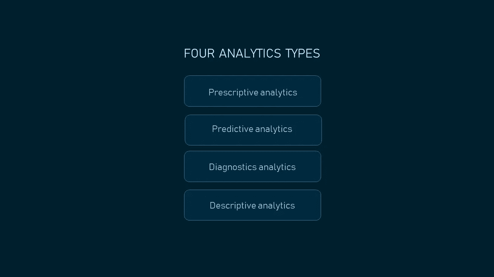
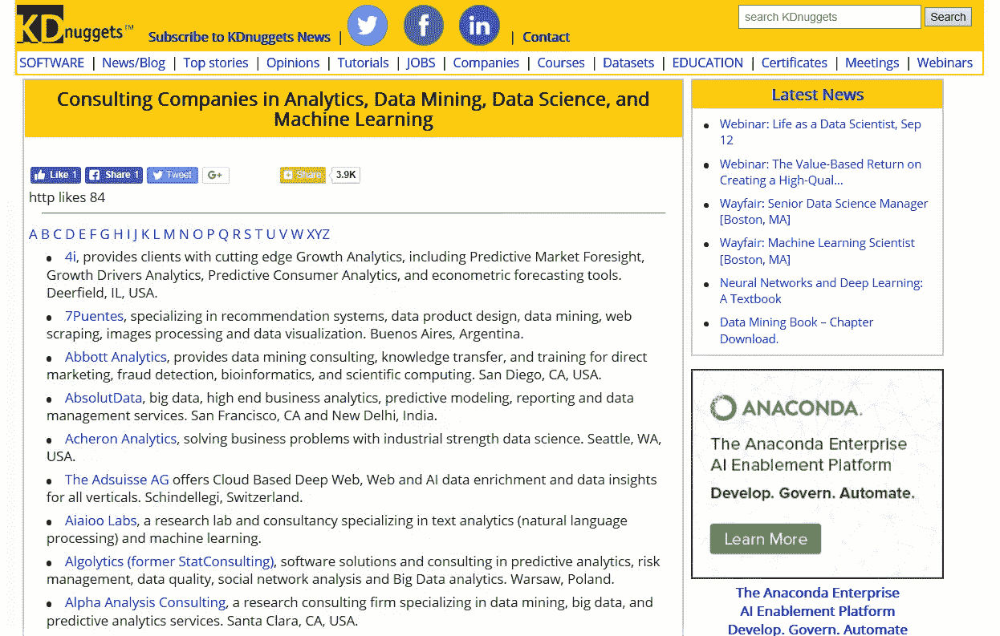
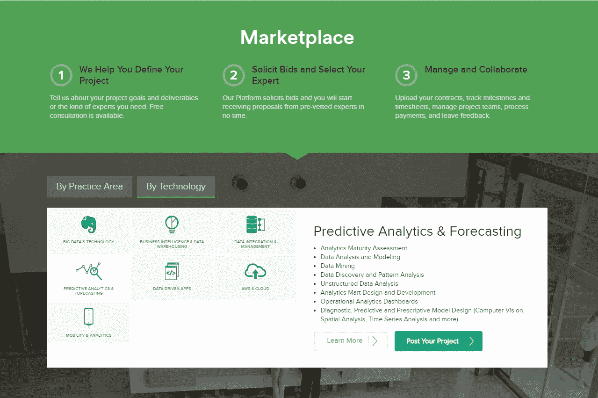

# 如何选择一家数据科学和 AI 咨询公司

> 原文：<https://medium.datadriveninvestor.com/how-to-choose-a-data-science-and-ai-consulting-company-49d695aa999c?source=collection_archive---------3----------------------->

数据科学和人工智能是热门的媒体话题。一位专家在早间电视节目中谈论商业预测分析的能力并不罕见。脸书和 LinkedIn 上涵盖人工智能或数据科学的文章经常出现，如果不是每天都出现的话。

由于互联网上关于人工智能和大数据的信息过多，公司可以假设数据分析是大多数数据相关问题的解决方案。

 [## 挑战你对人工智能和社会的看法的 4 本书——数据驱动的投资者

### 深度学习、像人类一样思考的机器人、人工智能、神经网络——这些技术引发了…

go.datadriveninvestor.com](http://go.datadriveninvestor.com/4AI1) 

比如我们工作中就有这样一个案例。一家使用 Innovata 数据集的航班信息的 OTA 联系了我们的数据科学团队，请求对其进行分析以提取数据。Innovata 由 FlightGlobal 新闻和信息网站合并而成，是全球 900 多家航空公司历史、当前和未来时刻表数据的领先提供商。我们的客户认为处理大型数据集是一个大数据问题。虽然数据集确实很大，但 OTA 解决的问题不需要数据分析，只需要数据检索。我们的数据科学团队将项目委托给了软件架构师，而不是数据科学家。

因此，在计划将数据科学或人工智能用于您的业务之前，请确定这是否是您需要的技术。您可以通过隔离和指定您的问题来回答这个初始问题。

在本文中，我们将讨论与有能力的数据科学或人工智能供应商合作时需要考虑的因素和采取的步骤。

# 1.将您的问题与可能的解决方案配对

一般来说，数据科学和人工智能解决方案需要利用可用数据获得有价值的见解。一些公司接触数据科学供应商，以构建其关键功能围绕[机器学习](https://www.altexsoft.com/whitepapers/machine-learning-bridging-between-business-and-data-science/?utm_source=MediumCom&utm_medium=referral)的产品。例如，这可能是一个将语音转换成文本的应用程序。其他组织可能希望开发一个定制的分析和可视化平台来控制他们的运营，并根据这些见解做出战略决策。

从最广泛的意义上来说，您可以应用数据科学来获得对您业务的洞察力并提高您的运营效率，或者您可能希望向您的最终客户提供基于人工智能的应用程序。在前一种情况下，最终消费者是你的公司，在后一种情况下，是你的客户。

## 面向客户的应用和欺诈检测

由机器学习算法驱动的面向客户的应用程序可以解决您客户的问题。人们可以在日常活动中使用这些产品，或者更快更轻松地完成工作任务。

以下是需要数据科学参与的面向客户的解决方案示例:

*   虚拟文本和语音助手(如 Mezi 旅行助手或 Expedia 聊天机器人)
*   电子商务和顶级媒体服务提供商的推荐引擎(如亚马逊和网飞推荐系统)
*   价格预测引擎(如 [Fareboom](https://www.altexsoft.com/case-studies/travel/altexsoft-creates-unique-data-science-and-analytics-based-fare-predictor-tool-to-forecast-price-movements/?utm_source=MediumCom&utm_medium=referral) 或 Kayak 票价预测)
*   将语音转换为文本的应用程序(例如，QuanticApps 的 IBM Watson 语音转换为文本或语音助手)
*   声音识别和分析应用程序(例如，我要研磨医疗保健应用程序吗)
*   图像编辑应用程序(如 Prisma 应用程序)
*   图像识别应用程序和功能(例如，使用优步应用程序进行信用卡识别)
*   实时视频和语音翻译器(例如谷歌翻译应用程序或 iTranslate Voice)
*   文档分类应用程序(例如 Knowmail)

还有一组[欺诈检测产品](https://www.altexsoft.com/whitepapers/fraud-detection-how-machine-learning-systems-help-reveal-scams-in-fintech-healthcare-and-ecommerce/?utm_source=MediumCom&utm_medium=referral)，它们采用数据科学和传统编程技术来构建。

商业分析:商业智能和统计分析

商业分析(BA)是通过统计和运营分析对数据的探索。BA 的目的是监控业务流程，并利用从数据中获得的洞察力做出明智的决策。

商业分析技术可以分为两组——[商业智能](https://searchbusinessanalytics.techtarget.com/definition/business-intelligence-BI)和[统计分析](https://whatis.techtarget.com/definition/statistical-analysis)。拥有**商业智能(BI)** 专业知识的公司分析和报告历史数据。对过去事件的洞察使公司能够就当前的运营和发展选择做出战略决策。**统计分析(SA)** 允许在探索问题时更深入地挖掘。例如，你可以发现本周顾客为什么更喜欢从在线旅行社而不是你的酒店网站预订，或者某个特定用户在阅读了关于当前交易的电子邮件后是否会购买产品。

业务分析可用于:

*   数据管理
*   仪表板和记分卡开发
*   大数据分析
*   价格、销售或需求预测
*   客户分析
*   社交媒体上的情感分析
*   风险分析
*   市场和客户细分
*   客户终身价值预测
*   追加销售机会分析等。

业务分析允许解决各种复杂的问题，从简单的报告到风险缓解或运营改进措施的建议。为了解决这些问题，你可以使用不同类型的分析。有四种分析类型:描述性、诊断性、预测性和规范性。

*Four types of analytics*

让我们假设你拥有一家汽车经销商。据分析，与去年同期相比，新车型的销量有所下降。这是**描述性分析**的一个例子，其目的是提供一个性能概述。描述性分析可以回答这个问题*发生了什么？*

请注意，大多数情况下的描述性分析并不需要数据科学家。你可以用 BI 工具自己做。

你可以试着深入挖掘，了解为什么人们在你的店里购买的汽车越来越少。其中一种方法是根据行业趋势或市场数据等外部数据来衡量销售记录。换句话说，执行**诊断分析**。这种分析类型允许找出*为什么事情会发生*。

如果你想估计未来三个月将会购买多少辆汽车，或者是否会购买，你需要**预测分析**。这种更复杂的分析类型使用描述性和诊断性分析的洞察力[来预测](https://www.kdnuggets.com/2017/07/4-types-data-analytics.html)未来事件和结果的概率。此外，您可以评估某个事件可能发生的时刻。因此，预测分析允许确定*接下来可能会发生什么*以优化持续运营。

预测分析通常需要[机器学习](https://www.altexsoft.com/blog/datascience/machine-learning-project-structure-stages-roles-and-tools/?utm_source=MediumCom&utm_medium=referral)，你可以在我们的文章中了解更多。

如果你想知道*采取什么措施*来增加销售额，就着手**规定性分析**。这种分析类型需要采取一系列行动，包括评估对过去事件、其原因的见解，以及对未来事件的各种预测。借助规范分析，企业家可以获得消除未来问题或从新兴趋势中获益所需的行动建议。规定性分析也使用机器学习。

想象一下，你业务中的每一个事件，无论是交易、网站访问还是人员变动，都被拍摄下来，并成为一个长系列中某一集的一部分。商业分析是一种工具，你可以用它倒带视频，发现一些事实，分析它们，并得出结论。但你能做的不止这些。BA 让您了解事件的原因，预测接下来会发生什么，并制定最佳计划，以确保您的计划是一个成功的故事。

# 2.考虑现成的产品

在开始寻找团队之前，确保你已经分析了现成的解决方案。像 [KDnuggets](https://www.kdnuggets.com/solutions/index.html) 和 [PCMag](https://www.pcmag.com/business/directory/data-analytics) 这样的网站有分析解决方案和 SaaS 公司的列表。他们中的一些人(例如 [Capterra](https://www.capterra.com/data-analysis-software/) )甚至专门从事软件研究。我们将讨论更多的资源，您可以在下面查找供应商或产品。此外，如果您寻求客户洞察，并使用常见的 CRM 软件来收集和维护客户交互数据，请查明您的供应商是否提供了可以解决您的问题的模块。

但是，现成的解决方案可能不支持您需要的功能。例如，让我们假设，为了调整你的营销活动，你需要分析客户在社交媒体上分享的评论。由于您的数据分析平台不支持此功能，您需要一个定制的平台来分析您所在领域的反馈。这些是客户在讨论您的服务时可能经常使用的句子、单词和单词组合。例如，*预订，客房服务，取消，房间钥匙，*或*早餐包括*如果你经营酒店业务。在这种情况下，你可以雇佣一个由数据科学专家组成的团队来开发定制软件。

# 3.研究公司列表

现在是时候找一个专门为你开发解决方案的顾问了。我们挑选了几个网站，可能会帮助您填补合格数据科学家的劳动力缺口。

## KD nuggets:DS 咨询、产品公司和分析解决方案的列表

除了新闻和文章之外，KDnuggets 还有一些出版物，可能对想要利用 DS 的企业有用。网站上有数据科学咨询公司的列表，简要描述了他们的专业知识和办公地点。您还可以在同一页面上找到按技术和行业分类的产品公司和分析解决方案列表。

*KDnuggets provides a list of consulting companies with brief notes about each of them. Source:* [*KDnuggets*](https://www.kdnuggets.com/companies/consulting.html#E)

## Experfy:寻找大数据、分析和 BI 项目专家的市场

[Experfy](https://www.experfy.com/howitworks#clients) 是一个总部位于哈佛的数据科学咨询市场，来自不同行业的客户可以在这里与专家合作开展短期和长期项目。该平台允许客户雇佣外部团队或扩充现有团队。虽然大多数专家是自由职业者，但如果需要，客户可以与他们协商在现场工作。

用户根据他们的实践领域或技术发布他们的项目，指定目标和要求。然后 Experfy 代表客户招标，缩小潜在承包商的范围，客户开始得到专家的建议。与自由职业专家的合作是在 Experfy 项目室进行的，这是一个私人的工作环境。该平台与联系人打交道，并对每笔交易收取 20%的费用。

*This is how Experfy works. Source:* [*Experfy*](https://www.experfy.com/)

## 离合器:经过验证的审查，以数据驱动的招聘决策

[Clutch](https://clutch.co/) 是一家位于 DC 华盛顿州的独立 B2B 研究公司。它的目标是帮助企业做出明智的招聘决定，并允许服务提供商宣传他们所做的事情。Clutch 调查客户与在网站上注册的公司的合作经历。评论位于公司简介上，包括关于评论员和项目的一些信息，以及反馈摘要。还提供了完整的评估表。客户根据进度、质量、成本和推荐意愿对提供商进行评分，帮助潜在客户了解整体服务质量。

Clutch 有一份[最佳大数据分析公司名单](https://clutch.co/it-services/analytics?sort_by=field_pp_page_sponsor&field_pp_min_project_size=All&field_pp_hrly_rate_range=All&field_pp_size_people=All&field_pp_cs_small_biz=&field_pp_cs_midmarket=&field_pp_cs_enterprise=&client_focus=&field_pp_if_advertising=&field_pp_if_automotive=&field_pp_if_arts=&field_pp_if_bizservices=&field_pp_if_conproducts=&field_pp_if_education=&field_pp_if_natural_resources=&field_pp_if_finservices=&field_pp_if_gambling=&field_pp_if_gaming=&field_pp_if_government=&field_pp_if_healthcare=&field_pp_if_hospitality=&field_pp_if_it=&field_pp_if_legal=&field_pp_if_manufacturing=&field_pp_if_media=&field_pp_if_nonprofit=&field_pp_if_realestate=&field_pp_if_retail=&field_pp_if_telecom=&field_pp_if_transportation=&field_pp_if_utilities=&field_pp_if_other=&industry_focus=&field_pp_location_country_select=All&field_pp_location_province=&field_pp_location_latlon_1%5Bpostal_code%5D=&field_pp_location_latlon_1%5Bsearch_distance%5D=100&field_pp_location_latlon_1%5Bsearch_units%5D=mile)。该名单包括 600 多家公司，并不断更新。您可以通过排名、评论数量、公司名称和评论评级来筛选提供商。

# 4.查看供应商组合:案例研究和参考

一旦你有了一个供应商候选名单，开始了解每个潜在顾问的专业知识。当研究一个公司的网站时，公司为其构建解决方案的行业必须是首先要考虑的。拥有领域知识的数据科学咨询公司不仅仅提供解决方案:专家可以就产品开发向您咨询，通常会花更少的时间来研究您的问题。

**案例分析。**每家公司都努力证明自己在该领域拥有足够的专业知识。然而，网站主页上漂亮的客户证明和客户标识并不能像相关的[案例研究](https://www.altexsoft.com/case-studies/)那样给公司增加可信度。通过案例研究，可以了解客户的背景、咨询公司解决具体问题的技术和方法，当然还有结果。案例研究中使用的分析水平是顾问搜索和选择的另一个指导来源。

除了阅读案例研究，考虑联系以前的客户或至少访问他们的网站来评估供应商的能力。你可以要求候选名单上的公司提供客户联系方式作为参考。

**其他营销材料。新闻、新闻稿和博客文章能告诉我们很多关于专家的熟练程度、公司商业战略和声誉的信息。一家公司参与或举办了哪些活动？媒体或其他行业参与者在其出版物中多少次提到该公司，在什么背景下？此外，查看社交媒体上的公司页面，更全面地了解潜在合作伙伴的专业知识。**

# 5.面试一家咨询公司:评估阶段

最后，名单上有一些你想联系的公司。这意味着顾问搜寻之旅最重要的部分——评估阶段——已经到来。理想情况下，这个阶段是顾问和潜在客户之间有意义的对话。

## 问题探索

首先，数据科学专家必须确定用数据科学还是人工智能来解决你的问题是否可行。您必须准备好详细描述您的问题，并向专家提供操作数据。数据的质量和数量也至关重要，因为算法性能直接取决于它们。

事实上，参加由 Kaggle 进行的 [2017 年数据科学和机器学习状况调查](https://www.kaggle.com/surveys/2017)的 49.4%的数据科学家称脏数据是他们在工作中面临的痛点之一。如果你想知道如何[为机器学习](https://www.altexsoft.com/blog/datascience/preparing-your-dataset-for-machine-learning-8-basic-techniques-that-make-your-data-better/?utm_source=MediumCom&utm_medium=referral)准备数据集，请阅读我们的专题报道。

缺乏明确的问题答案(30.4%)和数据不可用或难以获取(30.2%)是专家希望他们不知道的其他困难。

*The top 15 answers about difficulties faced at work from data scientists. Source:* [*Kaggle*](https://www.kaggle.com/surveys/2017)

## 工作范围定义和初步结果

一个可靠的顾问总是在描述工作范围和谈判合同条款之前花时间核实客户是否有足够的高质量数据。专家通常会研究一个问题，研究科学文章，将客户数据提供给可能用于某个项目的算法，并提交*初步结果*——算法对解决方案的估计精度。

例如，Fareboom 首席执行官 Marko Cadez 联系了我们的数据科学团队，目标是通过[票价预测功能](https://www.altexsoft.com/case-studies/travel/altexsoft-creates-unique-data-science-and-analytics-based-fare-predictor-tool-to-forecast-price-movements/?utm_source=MediumCom&utm_medium=referral)升级现有的旅行预订引擎。Fareboom 是一个机票搜索和预订网站，客户可以在这里找到最便宜的旅行交易。在对预测可信度做出任何假设之前，我们的团队研究了近 10 亿个存储的票价(花了他们大约 6 个月的时间)。最终，该团队展示了在真实数据上测试时显示 80%预测准确性的模型。值得注意的是，并不是每个数据科学相关的项目在初始阶段都需要这么长时间。但是你必须做好长期合作的准备，因为 DS 项目需要时间。

## 投资回报(ROI)估算

找到挑战的解决方案是不够的。对解决方案的投资必须在特定的时间内获得回报。因此，供应商团队的关键任务之一是计算解决方案成本和投资回报之间的差异。

例如，您的公司因欺诈损失了大量资金。消除近 60%可疑流量的最简单方法是购买一份检测到欺诈活动的 IP 列表。一个现成的软件将阻止另一部分潜在的欺诈交易。

但是如果你必须达到 95-100%的[欺诈检测](https://www.altexsoft.com/whitepapers/fraud-detection-how-machine-learning-systems-help-reveal-scams-in-fintech-healthcare-and-ecommerce/?utm_source=MediumCom&utm_medium=referral)准确率(这在大多数商业解决方案中是不可能的)，那么雇佣一个数据科学团队来开发一个模型是合理的。期望的检测精度越高，所需的投资就越大。如果您每年在 ML 解决方案上花费至少 250，000 美元，那么在定制解决方案上分配 50，000 美元是一个合理的决定。中小型企业在开发一个需要一年多时间才能收回成本的复杂解决方案之前，必须三思而行。重要的是要评估一个复杂的 ML 解决方案是否适合一个组织的当前发展阶段。

考虑雇佣数据科学顾问团队，诚实地评估解决方案选项、其成本以及这些解决方案在 ROI 方面的价值。

# 一锤定音

如果你有一个明确的项目目标，并且至少基本了解实现目标需要什么样的专业知识，那么大量的数据科学和人工智能顾问不会让你感到困惑。与此同时，供应商必须研究您的问题，以确定它是否可以通过 DS 或 AI 来解决。如果利用这些技术似乎合适，那么咨询公司必须为您提供一个工作范围，展示初步结果，并评估项目成本和投资回报。

在做出最终选择之前，以下是需要考虑的其他因素:

*   数据科学团队培训。如果您计划在未来组建一个数据科学团队，请了解供应商是否提供知识共享。
*   其他专业知识。除了建模之外，提供相关服务的公司可以帮助您定义产品愿景。
*   合作方式。与潜在顾问讨论合作细节。例如，遵循精益[项目管理框架](https://www.altexsoft.com/whitepapers/agile-project-management-best-practices-and-methodologies/?utm_source=MediumCom&utm_medium=referral)的团队将要求你或你的公司代表与开发团队一起度过整个项目。

*原载于 AltexSoft Tech 博客**[***如何选择一家数据科学与 AI 咨询公司***](https://www.altexsoft.com/blog/business/how-to-choose-data-science-and-ai-consulting-company/?utm_source=MediumCom&utm_medium=referral)*