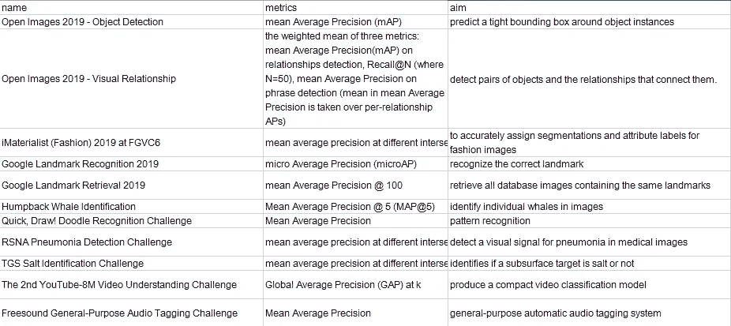
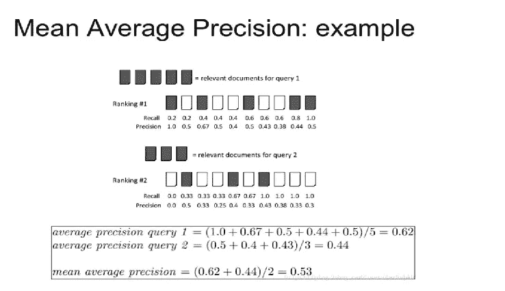
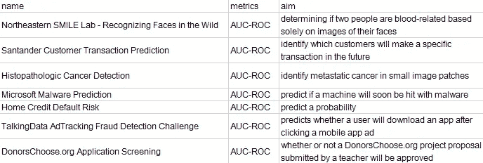
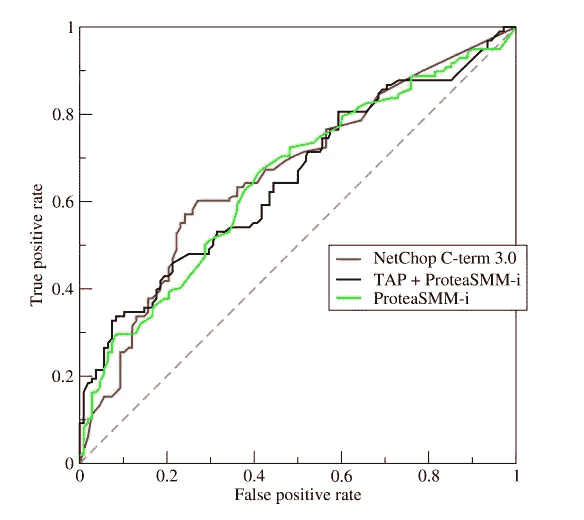
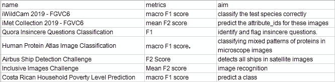
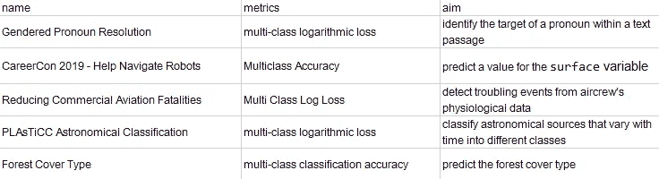
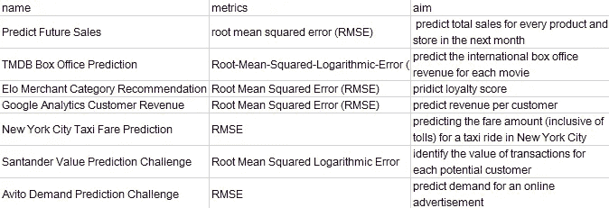

# 如何选择正确的绩效指标？让我们向 Kaggle 竞赛学习吧！

> 原文：<https://medium.datadriveninvestor.com/how-to-choose-the-right-performance-metrics-lets-learn-from-kaggle-competitions-185d8bfc7574?source=collection_archive---------3----------------------->

# 介绍

选择正确的性能指标是机器学习中的一个大话题。有大量不同的性能指标，每一个都有自己的优点。

学习所有这些指标的一个有效方法是研究好的案例。我相信 kaggle 竞赛是实现这一目标的最佳场所。因此，我经历了数百场比赛，并在下面的部分报告了我的发现。

 [## 金融中的机器学习——数据驱动的投资者

### 在我们讲述一些机器学习金融应用之前，我们先来了解一下什么是机器学习。机器…

www.datadriveninvestor.com](https://www.datadriveninvestor.com/2019/02/08/machine-learning-in-finance/) 

# 地图

该指标通常用于 CV 区域的**识别和检测**等任务。下面的比赛都使用地图作为最终的衡量标准。

下面的视频清楚地解释了这一指标的含义。

通过看这幅图，我们可以很容易地理解地图的概念。

# AUC- **ROC**

这个度量常用于**二元分类问题**，尤其是当样本不平衡的时候。下面的比赛都使用地图作为最终的衡量标准。

AUC-ROC 曲线是在各种阈值设置下对分类问题的性能测量。ROC 曲线用不同阈值下的真阳性率对假阳性率作图。下面是一个例子。

AUC 就是 ROC 曲线下的面积。它表示模型的可分性程度或度量。

# f 分数

F-score 综合了精确度和召回率。对于**多类问题，**我们有宏观 F 分和微观 F 分。下面的比赛都用各种 F 分数作为最后的衡量标准。

这里很好地解释了宏观和微观 F 值之间差异

 [## 多类分类设置中的微观平均与宏观平均性能

### 感谢您为 Data Science Stack Exchange 贡献答案！请务必回答问题。提供…

datascience.stackexchange.com](https://datascience.stackexchange.com/questions/15989/micro-average-vs-macro-average-performance-in-a-multiclass-classification-settin) 

# 多级精度/测井损失

对于多类分类问题，除了 F 分数之外，通常还使用多类准确度和对数损失。

# RMSE/平均绝对误差

这两个指标通常用于**回归问题**或需要比较值差而不是分类的问题。下面的比赛都使用 RMSE 作为度量标准。

# 结论

现在，我们有几类性能指标，每一类都有不同的用途。我还列出了使用每个特定指标的竞争。希望我也会包含相关的代码。