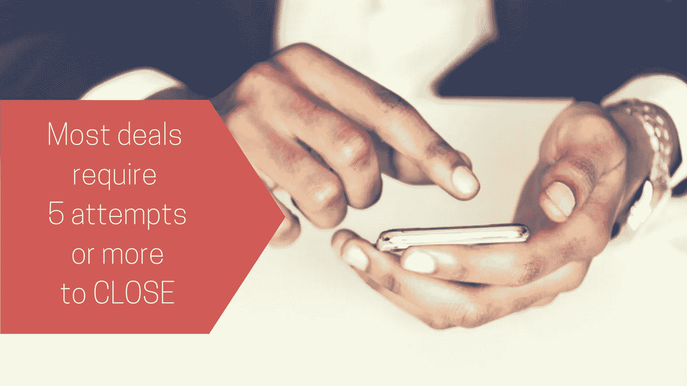
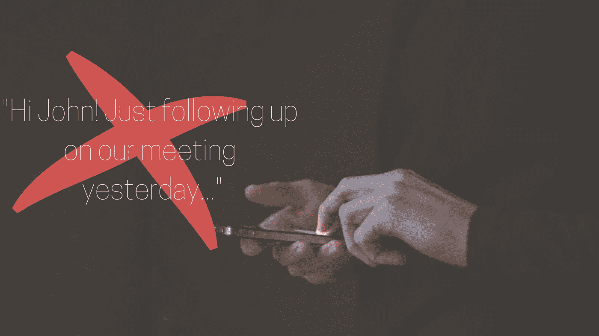
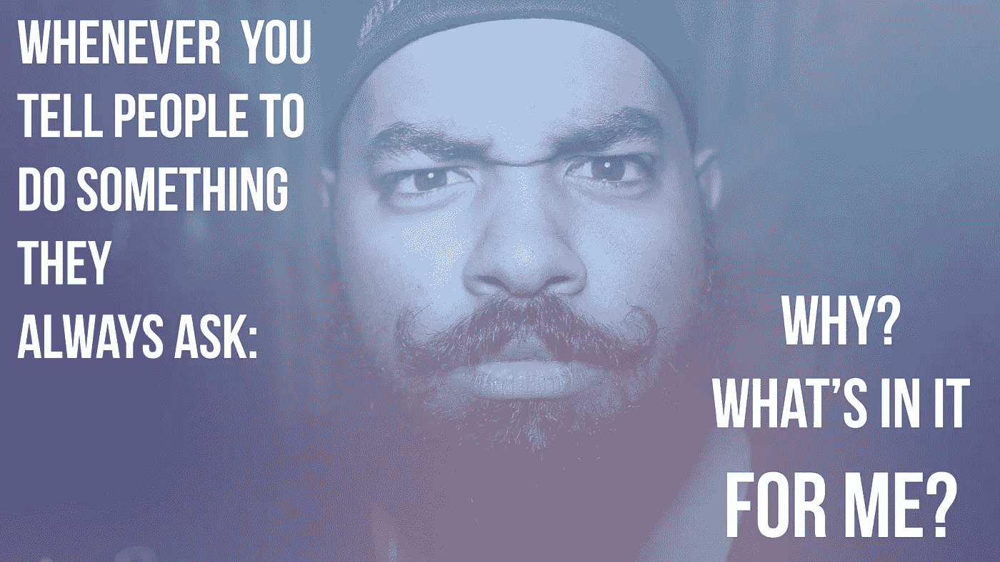

# 如何通过正确的跟进策略达成更多交易

> 原文：<https://medium.datadriveninvestor.com/how-to-close-more-deals-with-the-right-follow-up-strategy-6e9b02c94395?source=collection_archive---------2----------------------->

## 由于跟进不力，企业损失了 50%的交易。

如果你从事营销或销售工作，你可能至少经历过一次以下情况:你刚刚与一位潜在客户进行了一次非常棒的谈话。他们告诉你，他们喜欢你的产品，并希望尽快收到你的来信。很自然，你会为自己是一名多么优秀的销售人员而庆幸。但是过了几天甚至几周，你仍然没有收到你领导的回复。

有点疼，不是吗？

我知道当你的潜在客户突然停止回复你的信息时有多痛苦。当我为谷歌、IBM 等公司做销售的时候。，我不得不多次听到经典(“我会给你回电话的”，“把你的信息发给我就行了”，或者“我们周末再来”。这就是我如何认识到**伟大的后续战略**的重要性。

您是否知道 80%的交易需要 5 次或更多的跟进？我知道这看起来很多。根据我的经验，跟进是销售中最耗时的部分。然而，这是值得的，它会得到回报。

你不想因为不够坚持而错过机会。44%的销售代表在第一次跟进后就停止了！坚持不懈，在正确的时间传达正确的信息会让你在这个领域的其他公司中脱颖而出。

不幸的是，有效跟进可能比人们想象的要困难得多。许多人犯了可以轻易避免的错误，因此错过了很好的交易。

# **四不要**

## 1.不要为发邮件道歉

即使这看起来像是一种礼貌的方式，向你的联系人表示你考虑到了他们的时间，你也没有什么好道歉的。伸出手只是过程的一部分，你是在帮助他们并为他们提供价值。每个人都明白。

此外，没有必要提及任何过去失败的尝试。这是后续阶段的另一个明显的部分，你不想让你的潜在客户觉得你在责怪她没有回复你。

## 2.避免提出要求

是的，你联系你的潜在客户是因为你想从他们那里得到什么。但是提出要求会赶走你的潜在客户。如果你总是向他们要东西，他们不会把你的邮件和有价值的东西联系起来。相反，他们会在收件箱里看到你的名字时畏缩不前。

## 3.不要欺骗你的潜在客户

这应该是显而易见的，但偶尔还是会被忽略。没有人想被愚弄。你可能会通过写一个偷偷摸摸的标题让你的联系人打开一封电子邮件，但你永远不会完成销售。

与客户建立基于信任的关系对于健康的业务至关重要。

## 4.“只是打个招呼”或“只是想跟进一下”

别这么说。虽然这些短语被广泛使用，听起来很有礼貌，但实际上它们并不具有可操作性，而且可能会让人感到讨厌。这两个短语都没有真正传达价值。

# **完美的跟进策略**

那么，完美的后续策略是什么样的呢？我用不同的方式跟进我的客户。坚持打电话最终会惹恼他们，侵蚀你的信誉。另外，你不想显得绝望。

## 你的第一步

不要在第一次见面后就打电话，而是给他们发一封感谢邮件。感谢他们抽出时间，提及谈话中的关键要点，并说明*你的*下一步和*他们的*下一步。最后一点对于在销售渠道中移动销售线索至关重要——解释您将采取的下一步措施，您希望他们做什么，以及他们的任务将如何帮助这一过程向前推进。

这是我在公司使用的**跟进邮件模板**,[獾图](https://www.badgermapping.com/?utm_source=medium&utm_medium=follow-up&utm_campaign=medium-project):

> *约翰*
> 
> 感谢您今天下午抽出时间。 ( **感谢他们的时间**——刷新他们与你相遇的记忆。)
> 
> 很高兴能更好地了解你在这个项目上的目标。这里成功的关键是让您的现场销售代表每天额外参加两次会议。 ( **陈述你从对话中获得的关键信息**——表明你在倾听。)
> 
> 我将建立我们讨论过的分析，其中我们将讨论您的销售代表通过优化路线每周将节省多少时间，然后我们可以确定您的销售代表将参加多少次会议。 ( **说明你的下一步**，“我会这么做的。”)
> 
> 您提到可以将您的销售团队上个月的里程报告发送给我，以便我进行分析，请告诉我什么时候可以收到报告，以便我与我们的顾问预约时间。讲述他们的下一步行动，“你会做到的。”给他们一个你需要他们遵循某个时间表的理由。)
> 
> 祝你这周过得愉快！

## 保持头脑清醒

第一次接触后，我通常会创建一个多步骤的后续序列。这里你需要优先考虑的两件事是**与你的潜在客户保持最优先的考虑**和**让他们尽可能容易地与你互动**。我通过电子邮件、电话、短信、语音或网上研讨会邀请与他们联系。你的客户会感到被欣赏，最重要的是，你会一直在他们的脑海中。

如果你因为电话总是转到语音信箱而感到沮丧，那可能是因为你打电话的时机不对。麻省理工学院的研究表明，周三或周四午饭后是某人最乐于接受推销电话的时候。

跟进时我喜欢用的一个巧妙的技巧是**与我的潜在客户建立真正的关系**。你可能和他们就共同的兴趣进行了简短的交谈，你可以利用这些共同的兴趣来接近他们。我曾经有一个潜在客户是绿湾包装工队的忠实球迷。每次我遇见他，我们都会谈论他们的游戏。他们最终赢得了那年(2011 年)的超级碗，我也成功完成了销售。我相信我们的私人关系在其中发挥了巨大的作用。如果你的潜在客户喜欢你，你已经迈出了第一步。

同样，他们也更有可能打开你的邮件，阅读里面的内容。我总是在我的电子邮件中添加一篇短文或与他们工作领域相关的有趣事实。这表明你知道是什么让他们忙碌，让你更接近他们。

另一件要记住的事情是:你永远无法**充分传达你产品的价值。在你的潜在客户决定购买之前，他们需要听到你的产品有多有价值，并看到足够的证据，所以在跟进时，寻找不同的方法来展示你的产品的好处。**

当然，这总是取决于你面对的人。人们总是要求采取千篇一律的跟进方式。事实是:没有这回事。

这些是让我超越同龄人的一些技巧。它们都是你可以借鉴的策略。尝试一下，体验一下你的潜在客户的反应。随着时间的推移，你将能够调整那些机制，完善你的后续策略。在那之前…

**快乐销售。永远不要太早放弃！**

## *想了解更多跟进信息？查看我的* [*LinkedIn 学习课程*](https://www.linkedin.com/learning/following-up-after-a-sales-meeting) *如何有效跟进每次成交。与我联系获得免费访问！*

## 你如何为成功的后续阶段做好准备？通过完善你的推销来铺平道路。获得关于此短视频的可操作提示[！](https://www.badgermapping.com/blog/sales-follow-up-guide/?w=9gnofdtqtz/?utm_source=medium&utm_medium=follow-up&utm_campaign=medium-project)