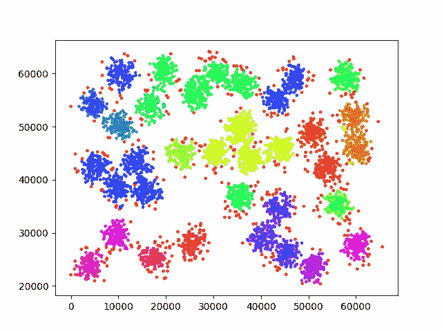

# 如何同时聚类和检测异常值

> 原文：<https://medium.datadriveninvestor.com/how-to-clustering-and-detect-outlier-at-the-same-time-30576acd75d0?source=collection_archive---------2----------------------->

[](http://www.track.datadriveninvestor.com/P12O)

source: [https://img.buzzfeed.com/buzzfeed-static/static/2014-06/23/15/enhanced/webdr06/anigif_enhanced-19102-1403551654-26.gif](https://img.buzzfeed.com/buzzfeed-static/static/2014-06/23/15/enhanced/webdr06/anigif_enhanced-19102-1403551654-26.gif)

在[之前的故事](https://medium.com/datadriveninvestor/how-the-simplest-clustering-algorithm-work-with-code-b8af21aabda2)中，我们讨论了如何使用 k-mean 进行聚类。该算法非常简单，收敛速度快。缺点是，我们必须设置(或猜测)数据集中有多少个聚类。此外，每次运行时形成的集群也将是不同的，也称为**，不能保证达到全局最优**。

在这个故事中，我们将探索聚类算法，我们可以自动找出聚类的数量，我们也可以根据数据集检测异常值。这种算法叫做**基于密度的带噪声应用空间聚类** ( **DBSCAN** )。对于一个简单的算法来说，这个名字太长了。

让我们回忆一下在[之前的故事](https://medium.com/datadriveninvestor/how-the-simplest-clustering-algorithm-work-with-code-b8af21aabda2)中，我们是如何确定某个数据点是否属于某个集群的？这是因为该数据点比另一个群集更靠近某个群集**。另一个特征是有一组与数据点**相邻的**其他数据。在 DBSCAN 中，我们必须明确定义“接近度”和“与该数据点相邻的大量其他数据”的含义。这就是为什么在这个算法中，我们设置相邻半径(接近度)和最小邻居(有多少其他数据与该数据相邻)。下面是算法的细节:**

1.  第一次，没有集群。
2.  随机选择数据集中的数据，并测量该数据到所有其他数据的距离。如果数据和特定数据之间的距离小于我们已经设置的半径，则将该特定数据指定为“该数据”的邻居。如果“数据”的邻居数量超过最小邻居数量，则将数据及其邻居指定为 1 个聚类。
3.  按照第 2 步操作，但数据被其邻居替换。**邻居**的邻居与**之前的数据**在同一个簇中。执行此步骤，直到选择了所有检测到的邻居。
4.  选择所有检测到的邻居后，使用尚未选择的数据构建一个新的集群。新的集群如步骤 2 和 3 中那样形成。
5.  不属于任何被视为异常值的聚类的数据。

为了使它更清楚，这里有一个算法的动画演示。


source: [http://arogozhnikov.github.io/images/opera/post/clustering-dbscan-smiley.gif](http://arogozhnikov.github.io/images/opera/post/clustering-dbscan-smiley.gif)

为了更好地理解，这里的代码使用 numpy 而不是 sklearn 这样的花哨库来构建(在 sklearn 中，您只需两行代码就可以完成这个算法)。

```
#!/usr/bin/pythonimport numpy as np
import matplotlib.pyplot as plt
import matplotlib.cm as cm#setting
datasrc = 'datacluster.dat'
neighbor = 4.0
radius = 0.015#read data
data = np.genfromtxt(datasrc, delimiter=[8, 8])###############
#normalization#
###############maxcnt = np.zeros((len(data[0])))
mincnt = np.zeros((len(data[0])))
datanorm = np.zeros(np.shape(data))
for i in xrange(len(maxcnt)):
 maxcnt[i] = np.max(data[:,i])
 mincnt[i] = np.min(data[:,i])
 datanorm[:,i] = (data[:,i] - mincnt[i]) / (maxcnt[i] - mincnt[i])#extra 2 column for: class (index 0) and current state (index 1)
#state-> 0 = not scanned, 1 = scanned, 2 = checked
#class-> 0 = class unknown
unkdatastat = np.zeros((len(datanorm), 2))################
#real algorithm#
################running = True
clusternumbering = 0
while running:
 print 'number of cluster', clusternumbering
 hitung = 0
 for i in xrange(len(unkdatastat)):
  if unkdatastat[i,1] == 2:
   hitung += 1
 print hitung
 #scan all data, check if it already scanned or not
 #modescan = True, clustering with already known data otherwise construct new cluster
 modescan = False
 for i in xrange(len(unkdatastat)):
  if unkdatastat[i,1] == 1:
   datacheck = i
   modescan = True
   break
 if modescan:
  cntdist = []#assign data to cluster
  for i in xrange(len(datanorm)):
   #get all euclid distance to check neighbor
   if i == datacheck:
    continue
   dist = np.sum((datanorm[datacheck] - datanorm[i])**2.0)**0.5
   if dist < radius:
    cntdist.append(i)
  if len(cntdist) >= neighbor:
   for j in xrange(len(cntdist)):
    if unkdatastat[int(cntdist[j]), 1] != 2:
     unkdatastat[int(cntdist[j]), 0] = clusternumbering
     unkdatastat[int(cntdist[j]), 1] = 1
   unkdatastat[datacheck,0] = clusternumbering
   unkdatastat[datacheck,1] = 2
  else:
   unkdatastat[datacheck,1] = 2
 #construct new cluster
 else:
  cntdist = []
  running = False
  clusternumbering += 1
  #scan once again
  for i in xrange(len(unkdatastat)):
   if unkdatastat[i,1] == 0:
    datacheck = i
    running = True
    breakif running:
   #assign data to cluster
   for i in xrange(len(datanorm)):
    #get all euclid distance to check neighbor
    if i == datacheck:
     continue
    dist = np.sum((datanorm[datacheck] - datanorm[i])**2.0)**0.5
    if dist < radius:
     cntdist.append(i)
   if len(cntdist) >= neighbor:
    for j in xrange(len(cntdist)):
     if unkdatastat[int(cntdist[j]), 1] != 2:
      unkdatastat[int(cntdist[j]), 0] = clusternumbering
      unkdatastat[int(cntdist[j]), 1] = 1
    unkdatastat[datacheck,0] = clusternumbering
    unkdatastat[datacheck,1] = 2
   else:
    unkdatastat[datacheck,1] = 2
    clusternumbering -= 1##########
#plotting#
###########prepare color
colors = cm.hsv(np.linspace(0, 1, clusternumbering+1))#plot the change of clustering
alllabelcol = []
for i in xrange(len(unkdatastat)):
 col = colors[int(unkdatastat[i,0])]
 alllabelcol.append(col)
alllabelcol = np.asarray(alllabelcol)fig = plt.figure()
ax = fig.add_subplot(111)
scatter = ax.scatter(data[:,0],data[:,1], color=alllabelcol,s=5)fig.savefig('clustering/DBSACN')
```

你可以下载上面的脚本，[这里](https://github.com/genomexyz/machine_learning/blob/master/dbscan.py)。在下面的脚本中，我做了一些归一化的预处理，使数据的范围在 0 和 1 之间。这样做是为了更容易确定邻居的半径。对于相同配置中的每次运行，该算法的输出保持不变。下面是上面脚本的输出，最小邻居= 4，邻居半径= 0.015。



正如我们所见，星团周围有许多红点。这些红点被检测为**异常值**。与 k-mean 相比，DBSCAN 的**运行时间非常长**，因为 DBSCAN 迭代的数据与数据集中的数据一样多。这就是 DBSCAN 的缺点。另一个故事再见。