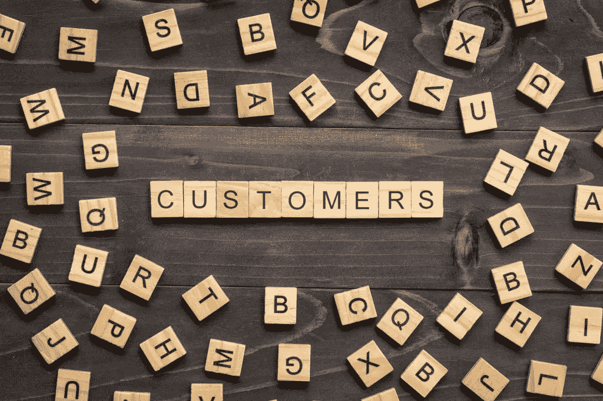
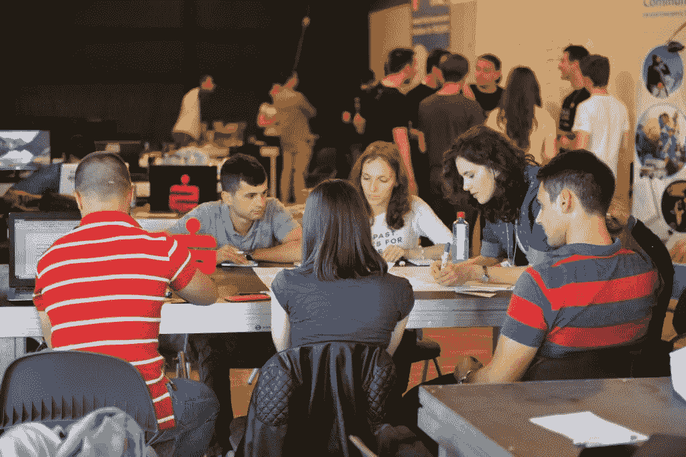

# 如何通过以客户为中心的营销传播价值？

> 原文：<https://medium.datadriveninvestor.com/how-to-communicate-value-through-customer-centric-marketing-e879224bea0b?source=collection_archive---------8----------------------->

## 营销从来都是以客户为中心的。然而，公司仍然难以创造和传播真正的价值，因此无法吸引正确的客户。

此外，客户不断发展他们的兴趣和购买行为，使这项任务变得更加困难。找出客户是如何做决定的，为什么营销活动会失败，以及为什么你应该努力创建一个以客户为中心的公司。

# 客户如何决策？

为了接触到客户并影响他的选择，首先，你必须了解每一个购买决定背后的 [**决策过程**](https://www.lucidchart.com/blog/consumer-decision-making-process) 。

这一过程包含了一个非常重要的因素，即由于不舒服或疼痛而产生的需求识别，然后客户试图通过参与信息搜索来解决这一问题。一旦他熟悉了这些选择，他就会评估这些选择并做出选择。

 [## 不开玩笑:营销是为了搞笑|数据驱动的投资者

### 当你把幽默和营销结合在一起时，这是一件有趣的事情。当然，马克·安德森希望如此。别叫他雪莉。相反…

www.datadriveninvestor.com](https://www.datadriveninvestor.com/2019/02/25/no-fooling-marketing-goes-for-laughs/) 

不能排除的最后一步是顾客的购后感受。他们决定他是会推荐给别人，还是再次购买。

该过程的各个阶段通常是相同的，尽管顺序并不总是相同。例如，有时顾客只是在以广告的形式向他展示了解决方案后才发现他感到不舒服。

这 5 个阶段的过程是总的蓝图，然而，每个行业和市场，就像每个客户一样，在细节上有所不同。这就是为什么了解你的利基市场非常重要。

顾客会留下面包屑，尤其是数字面包屑，所以跟踪这些面包屑是了解顾客行为的良好开端。此外，避免错误地认为你知道客户如何使用你的产品。

相反，通过与客户交谈并亲自观察他们的行为，努力发现客户的需求和习惯。获得关键洞察力后，借助 [**设计思维方法论**](https://www.solveo.co/how-can-design-thinking-boost-your-business/) 的工具，营销人员可以开始像客户一样思考。通过这种方式，你可以创建一个以用户为中心的营销活动。

# 为什么竞选失败了？

营销活动的成功不仅仅是活动本身的结果。营销是产品的外观和性能、价格、包装、销售地点、用户体验和广告努力的结合。即使一个活动非常有创意和吸引力，如果其他元素不一致，产品就卖不出去。

营销人员需要关注客户，从客户的角度看世界，产品开发人员也是如此。一个没有把顾客放在心上的产品，不管有多少广告，都无法吸引顾客。

用设计思维方法为客户创造价值是最容易的。它使创作者能够换位思考，将不同的想法组合成可测试的原型。通过团队合作和共同努力，他们创造出一种对顾客有吸引力的产品，因为它满足了顾客独特的需求。

一旦你创造了这种产品，下一步就是 [**与公众**](https://conversionxl.com/blog/value-proposition-examples-how-to-create/) 交流它的价值。作为营销人员，你也可以运用设计思维来创造一个成功的广告活动。为客户量身定制强有力的信息，并以这种方式实现预期目标。

# 你为什么要努力创建/成为一家以客户为中心的公司？

以客户为中心的公司作为一个概念在过去的十年里越来越受欢迎，这是有原因的。

许多公司犯了过分关注竞争对手的错误，像老鹰一样盯着他们的一举一动。

相比之下，成为一家以客户为中心的公司是一种承诺，为你想卖给的人创造真正的价值。只有这样，你才有希望拥有忠诚的顾客。这伴随着巨大的口碑广告和在市场上的持续优势。

最忠诚的顾客是那些与你的品牌有关联的人。当然，他们只被独特的价值主张所吸引。

想想苹果和每次 iPhone 发布前的大肆宣传。人们在商店前扎营，就是为了第一个拿到这款设备。市场上有更强大的手机，价格也更低。但是“令人惊讶”的是，大多数人仍然想要新的 iPhone。

苹果能够创造并维持其顾客前所未有的忠诚度。他们通过始终把他们放在第一位来实现这一点:在创造产品、包装、商店、广告和整个用户体验中。

他们能够通过在所有内部流程中使用设计思维方法来实现这一点，他们的结果证明了该方法的有效性。

成为一个成功的品牌绝非易事。在营销的各个方面都采用以客户为中心的方法是关键。设计思维方法可以帮助你更有效地实现它。 [**以世界上最伟大的公司为榜样，将设计思维融入你公司的创意流程**](https://www.solveo.co/how-big-companies-innovate-implementing-design-thinking/) 。