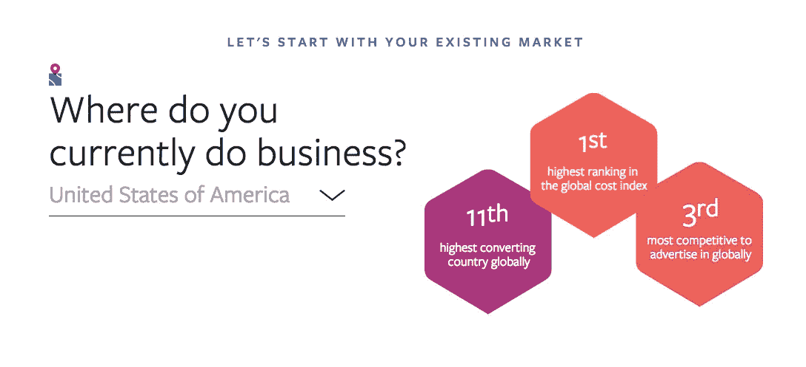
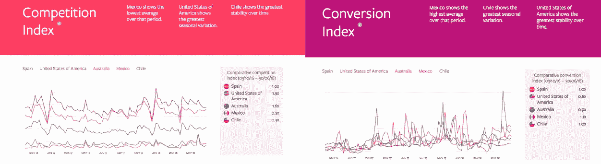

# 作为一家创业公司，如何征服新市场？

> 原文：<https://medium.datadriveninvestor.com/how-to-conquer-new-markets-as-a-startup-60565bebba76?source=collection_archive---------4----------------------->

不久前，要征服世界，你必须建立一支强大的军队，让成千上万的士兵随时准备牺牲。如今，只需要一台联网的电脑、一个好主意、一些技能和无尽的渴望就能实现。

我可以说，幸运的是，我在职业生涯的最后几年被多个项目和真正改变世界的人包围着。这很鼓舞人心，因为信不信由你，他们的故事和我的没什么不同，我敢打赌，他们和你的故事也没什么不同。

This is us at the Google for Startups 2017 Residency Program kick-off party.

此外，我曾是一个团队的成员，这个团队将[的一家小初创公司变成了一家价值数百万美元的国际公司](https://medium.com/datadriveninvestor/how-to-thrive-at-a-startup-and-not-die-trying-806c9f6dabfe)，在最重要的全球市场都有业务，并拥有清晰而稳健的国际扩张战略。

回顾我们的经历，以及我读到的关于其他成功公司的信息，我总结了一些在我看来对任何创业公司成功拓展业务都至关重要的东西。

> [DDI 编辑推荐——创业成长战略:快速成长的简单方法](http://go.datadriveninvestor.com/startup1/matf)

## 小心！美国:一个危险的市场

每年有超过 2596 亿美元从外国企业流入美国。这是迄今为止世界上最大的市场，互联网普及率很高，电子商务文化根深蒂固，根据皮尤慈善信托调查显示，超过 3 . 3 亿居民消费“远远超过收入”

对大多数数字业务来说，这听起来很有希望，对吗？

嗯，等一下。在大多数行业中，竞争对手的数量与商机的数量一样多。因此，如果你回顾你的经济学 101 笔记，你会注意到，尽管这是一个对大多数品牌都有吸引力的市场，但如果你没有做好充分准备，竞争的程度可能会让你出局。

对我来说，一家准备从国外进入美国市场的公司必须遵守这些要求，以增加成功的机会:

1.  做好在头两个季度损失 30%到 37.5%营销预算的准备。当心，一些大减价假日，如黑色星期五，可能是你最糟糕的噩梦。

The U.S. is a very competitive market in Facebook Ads. This is from Facebook IQ Research; look at those numbers.

2.将你的生产成本至少降低到最初价格的 1/3。这样你就可以采取积极的定价策略，这将成为你弥补营销损失的筹码。

3.坐下来和[一位专家谈谈你创建美国公司的选择](http://xkale.business)

4.他们说德州的一切都是更大的，所以你最好开始看到全局。

然而，在前两个季度之后，如果你做得好，大笔资金将开始从*这个自由之地流入。*

## 你可能想学点西班牙语…没错。

如果你认为这与我的[拉丁裔血统](https://medium.com/equapply/why-being-an-immigrant-changed-my-life-forever-7330083748e)有关，那你就完全错了。

根据你的产品或服务，西班牙语市场可能是你开始国际扩张的一个很好的选择。为什么？因为下面的原因:

1.  这些国家的广告和营销成本非常低，竞争也非常激烈。

In the graph, you can see Mexico, Chile, and Spain have lower competition index and higher conversion rates compare to the United States and Australia.

2.对于一个好的产品，人们愿意支付高价，尽管众所周知这些国家的工资往往较低。

3.这些市场在社交媒体上非常活跃，将成为你的品牌大使。

这是我带着高价产品进入这些市场的经验。我推荐墨西哥、西班牙和智利。

***平视！你必须控制你的活动，尤其是你的点击费，因为在 LATAM，当他们喜欢一个广告时，他们会疯狂点击。***

## 开放你的物流

这部分是针对电商商家的。在这里我要告诉你一些事情:

> 在任何情况下，都不要因为运输产品时出现的问题而发疯。即使是最昂贵的航空公司也会时不时地让你的日子变得灰暗。会有事情发生。

也就是说，探索一些提供运输解决方案的新项目。这些程序可能比加急和第一类货运慢，但它们是在你的网站上提供的一个很好的选择；请记住，在一天结束时，客户拥有最终决定权。

此外，有时，习俗可能是一个痛苦的背部；因此，你可以考虑在当地生产或履行订单，这通常会为你节省数千美元。

## 获得新的视野，放眼全球

当你决定征服新市场的时候，你就正式成为了世界公民。这意味着一件事，你必须习惯于调整你的信息，品牌，甚至你的产品来适应你的新市场。

当然，你的民族自豪感很重要，因为这是品牌精神的重要组成部分。然而，尝试重复“这在我们国家行得通，所以在那里也会行得通”或者只是创造产品和活动，而不采纳来自这些国家的人的意见，可能会使你的扩张战略成为一场灾难。

这也意味着拥有一支国际团队。在一些国家，这可能比在其他国家更难，但如果你想在国外获胜，这是至关重要的。如果你打开了法国市场，而你所在的城市没有多少法国人，为什么不给一个偏远的工人一个机会呢？至少想想吧。

我想用我用来激励我的客户的一句话来结束这篇文章:

自从有了互联网，世界变小了。这取决于你使用可用的工具，并获得领先的包！