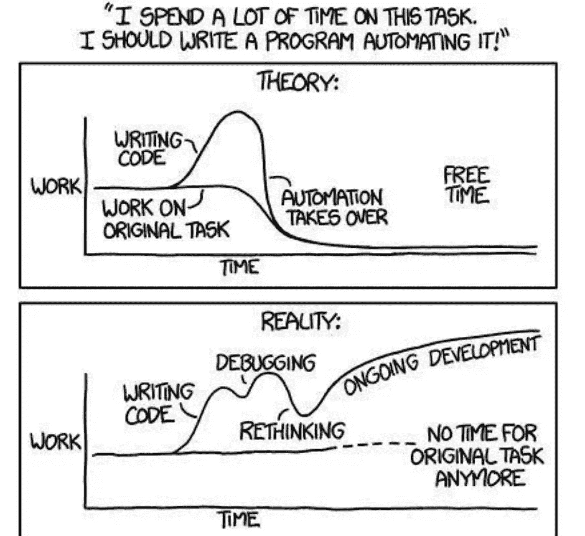

# 如何创建购买与构建软件的商业案例

> 原文：<https://medium.datadriveninvestor.com/how-to-create-a-business-case-to-buy-vs-build-software-7b3286b3882e?source=collection_archive---------6----------------------->

当处理新问题时，例如成本优化或任务自动化，开发和 IT 团队面临着购买还是构建解决方案的决策。在确定每种情况下的最佳选择时，需要考虑许多财务和战略因素，这些因素可能很难分析清楚。以下是我们关于构建购买与构建商业案例的建议，无论是供自己使用还是向管理层展示。

# 构建您自己的解决方案的理由

**1。没有现成的产品可以解决你的问题**。如果你不能购买一个产品或拼凑几个不同的现有解决方案，你可能不得不自己开发软件。没有太多的“蓝海”留在那里，但如果你有一个需求，没有产品可以解决它，那么它可以有意义。在确定是这种情况之前，要小心并确保你已经完成了你的研究:也许这个解决方案不是你正在寻找的，或者是作为一个更大的产品套件的一部分而存在。

 [## 信息图:云之旅|数据驱动的投资者

### 聪明的企业领导者了解利用云的价值。随着数据存储需求的增长，他们已经…

www.datadriveninvestor.com](https://www.datadriveninvestor.com/2018/09/22/infographic-journey-to-the-clouds/) 

2.**这将为你提供超越竞争对手的显著竞争优势。这通常需要独特的知识产权(一些特殊的酱料),你可以在产品中加入其他现有产品无法提供的知识产权，这将有助于你的公司取得成功。**

3.**你可以看到一个商机**，你不仅可以自己在内部使用该产品，还可以将其提供给客户，从而利用公司的投资。

4.**你有一个工程师团队坐在板凳上**无事可做(即最小的机会成本)。这确实时有发生，这样的项目可以让他们更有效率。

5.**专业知识已经存在于公司内部**并且存在一个天然的产品负责人。这不足以成为决定建造的理由，但没有它，事情可能会变得更加困难。

# 购买预构建解决方案的理由

1.**构建软件复杂且昂贵**。如果这是一个您将在整个企业中推广的软件产品，它将需要支持，并且很可能需要在产品的生命周期中进行功能更新和改进。

2.**支持您的团队可能构建的产品是一项重要的承诺**，通常是“花大钱”的地方。一个 MVP 风格的产品不可能让大众满意很久，你需要为持续的更新、改进、修补和支持做预算。这通常会成倍增加构建 1.0 版的成本。

3.将主要用于内部使用的产品商业化是一个伟大的理论，但在现实中，很少行得通。这样的例子确实存在，但少之又少。建立一个新产品公司需要的不仅仅是技术，而且执行风险很高，除非它成为你公司的第一要务。

4.**一个新产品项目的价值评估需要很长时间**，这意味着如果选择了现有的“现成的”(现在通常指的是 SaaS 的解决方案)，你往往会错过可以实现的重大价值。

5.**企业级软件自带企业所需的花哨功能**。这通常意味着大量的集成点、单点登录需求和给定的安全性。家庭烘焙产品[通常不包括这些项目](https://www.parkmycloud.com/blog/parkmycloud-alternative/?utm_medium=referral&utm_source=medium&utm_campaign=medium blogs&utm_content=parkmycloud-alternative)，它们被认为是‘额外增加的’,不是解决手头问题的核心。

# 创建您的商业案例

如果您在一个可以访问技术资源的组织中工作(现在包括许多公司)，通常会有一种构建的愿望，因为“他们可以”并且感觉他们可以以更加定制的方式解决他们组织的精确需求来满足需求。即使从其他项目转移资源的机会成本很低，也可能有忽略包括企业级软件的长期维护、升级和支持需求的趋势。此外，我们经常遇到已经开始构建内部解决方案的公司，但却发现额外的复杂性或看到内部优先级发生变化。在这种情况下，即使存在巨大的沉没成本，重新评估替代路径和第三方解决方案仍然有意义。

最终，每个案例都是独一无二的，权衡相对利弊，构建购买还是构建的业务案例需要考虑财务和非财务方面，以帮助做出正确的决策。

*原载于 2019 年 9 月 5 日*[*www.parkmycloud.com*](https://www.parkmycloud.com/blog/buy-vs-build/?utm_medium=referral&utm_source=medium&utm_campaign=medium blogs&utm_content=buy-vs-build)*。*