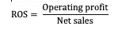
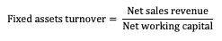
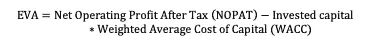

# 如何创建公司的财务计划？

> 原文：<https://medium.datadriveninvestor.com/how-to-create-a-companys-financial-plan-898f8d564bc4?source=collection_archive---------17----------------------->

今天我们将讨论什么是财务预算，并为公司制定一个简单的指导方针。我想你会了解到许多对你和你的公司有用的有趣信息。
**财务预算是企业内部计划的一部分，换句话说，它是公司在金钱方面的工作和发展的多用途计划。这对有效利用公司资源至关重要。**

**回到正题。**

**为了更清楚，我将使用例子。假设我们公司是一个在线项目，为长期受众发布商业新闻。因此，我们将为该公司创建一个财务预算。**

**这份文件里应该有什么？**

****1。** **编制费用(预算)****

**财务计算的第一步是创建预算，这与启动业务流程有关。**

**律师事务所执行(₽25'000)**

**计算机(₽100'000)**

**广告/营销(₽50'000)**

**网站创建(₽60'000)**

**Sundryexpenses(₽？)**

**总计: ₽235'000**

**一旦你做了简单的计算，了解我们将从哪里吸引这些资金是很重要的。让我们看看报道的来源。**

****2。** **报道来源****

**自有资金、建筑物、任何有形资产**

**潜在合作伙伴或投资者的来源**

**政府支持**

**银行贷款**

**其他来源**

**该是我们考虑这篇文章的要点并写下收支计划的时候了。**

****3。** **收支计划****

**与公司主要活动相关的费用(一年期):**

**由公司支付的工资，包括税**

**₽150'000 * 12 月= ₽1'800'000**

**月租金**

**₽35'000*12·曼特= ₽420'000**

**管理费用，包括会计工资**

**₽30'000*12·曼特= ₽360'000**

**贷款本金和利息支付**

**₽40'000 *12 月= ₽480'000**

**总费用: ₽3'060'000**

**与公司主要活动相关的收入(一年期):**

**公司主要活动的收益**

**₽600'000 *12 月= ₽7'200'000**

**加盟计划的收入**

**₽200'000 * 12 月= ₽2'400'000**

**总收入: ₽9'600'000**

**服务定价和销售量的详细说明是准确计算收入的两个最重要的因素(你可以从营销计划中获取这些数据，如果有的话)。**

**当收入和支出计划完成后，你需要将它与预算计划结合起来，以便了解你的业务有多盈利和有效。**

**让我们回顾一下，我们有以下计算结果:**

**₽9’600’000 — (₽3’060’000 + ₽235’000) = ₽6’305’000**

**₽6'305'000 代表息税前利润。说明这个生意可以称之为有效。**

**创建这些类型的文件不是一个耗时的过程，但它会给你一个机会，看看当前的财务状况和你的公司的缺点。**

****有用系数****

**还有一些有用的系数，可以帮助你评估一家公司的财务健康状况。**

****销售回报率****

****

****流动性比率****

****

**效率比率显示你的投资对营运资本的效率**

****

****EVA(经济增加值)**这个是我最喜欢的系数**

****

**规划你公司的财务，你所有的计划都是可以实现的！**