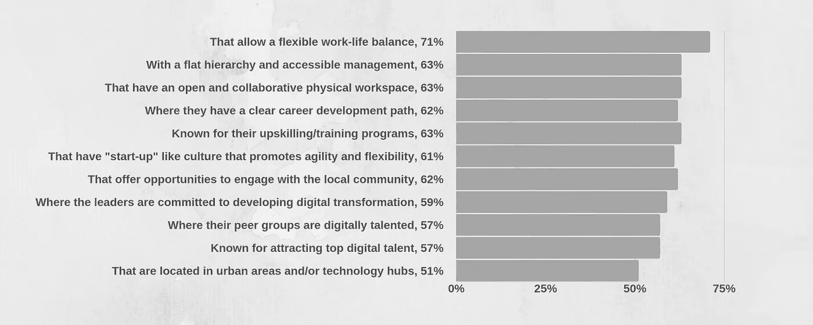

# 如何在软件团队中创建自我激励的文化

> 原文：<https://medium.datadriveninvestor.com/how-to-create-a-culture-of-self-motivation-in-a-software-team-4165e2c18ea?source=collection_archive---------6----------------------->

激励是每个公司成功的关键。在敏捷项目团队中建立动力和协作是实现共同目标和扩展业务的必要条件。只有当每个团队成员都高效地交付高质量的工作并致力于手头的任务时，你才能取得成功。你如何在工作场所创造这样的文化？

# **为什么文化对成功至关重要**

组织中的文化和思维过程比你使用的方法或工具更重要。没有正确的文化，方法论就没有机会。这对于敏捷方法尤其重要。敏捷开发团队，就其本质而言，需要由训练有素、积极向上的个人组成，他们能够很好地合作。

 [## 一个企业在肚子上移动:如何照顾直觉|数据驱动的投资者

### 事实证明，直觉不仅仅是一种感觉。科学很清楚:你的直觉比你知道的更多…

www.datadriveninvestor.com](https://www.datadriveninvestor.com/2018/11/09/a-business-moves-on-its-stomach-how-to-make-allowances-for-gut-feelings/) 

如果你想采用像 Scrum 或看板这样的敏捷方法，那么确保你有正确的文化。任何伟大文化的三个主要支柱是**目标、自主和掌控。只有能看到最终目标并对结果负责的员工，才给你的公司带来真正的价值。Forbytes，以及[许多领先企业](https://www.businessinsider.com/best-company-culture-2018-full-list-2018-12)都使用这一原则，因为公司文化深深植根于每一个业务流程中。**

根据 LinkedIn 的一份报告，有几个文化因素对全世界的员工都很重要。专业人士更喜欢加入公司:

# **有上进心的人的标志**

那么，你能期望在一个有动力的人身上看到什么样的特征呢？当发现一个有上进心并能交付成果的人时，需要寻找什么样的特征？

*   他们可以看到他们正在做的事情的全貌；
*   他们积极参加活动；
*   他们愿意接受挑战；
*   他们总是处于学习状态——渴望学习新技能；
*   他们不会为小事操心；
*   他们知道自己的优势和劣势所在；
*   他们能够应对失败，因为他们认为这是一个学习曲线。

因此，没有上进心的人与上述特征形成鲜明对比。

# **激励员工的正确和错误方式**

你应该“激励人们去实现某件事”还是“提供机会让人们变得有动力”？

当一个团队的文化是**“激励人们实现某事”**时，通常会有某种形式的奖励。金钱常常被用作激励的手段。像这样的团队被给予在某个日期之前交付的工作项目，并且在时间、成本和范围变量上几乎没有灵活性。需求的积压在增长，导致其他工作项目不能按时交付。管理的重点是让每个人在任何时候都忙得不可开交，但这样会因为工作量过大而面临精疲力竭的风险。它给员工一个离职的理由。高级经理需要介入并接管，因为他们认为他们可以做得更好。

另一种方法不是试图激励人们，而是**为人们提供取得成果的机会**，这样他们就会被自己的行动和成就所激励。个人从提供好的产品或服务中获得满足感和自豪感。对雇主和雇员来说，这种方法的改变是免费的。

# **阅读激励你**

人们很容易被如何成为一个有动力的人或如何激励你的团队的信息淹没。我认为有帮助的书籍(以及我建议所有高级经理阅读并鼓励组织中其他人阅读的书籍)有:

斯蒂芬·R·科维的《高效人士的 7 个习惯》

这本传奇性的书在许多人的生活中，以及在许多全球性公司的发展和哲学中扮演了重要的角色。作者斯蒂芬·R·科维被《时代》杂志评为 25 位最有影响力的美国人之一，他给出了一种以原则为中心的方法来解决个人和职业问题。

*“想象某人经历了他们在培训方面有史以来最好的经历——这是他们说的。人们认为这 7 个习惯改变了他们的生活，让个人和职业生活重回正轨。商学院的肯·m·拉德兹万诺夫斯基。*

[**从为什么开始:伟大的领导者如何激励每个人采取行动**](https://www.goodreads.com/book/show/7108725-start-with-why) **作者西蒙·西内克**

Simon Sinek 建议人们如何激励不同类型企业的员工，从小企业到像微软这样的公司，从好莱坞到五角大楼。在这本书中，他解释了为什么一些人和组织比其他人更具创新性和更有利可图，以及为什么从“为什么”开始如此重要。

*“从为什么煽起我内心的火焰开始。这本书可以带领你达到你从未想过会达到的卓越水平。”查克·霍纳将军，空中老大，沙漠风暴。*

*最初发表于*[*【https://forbytes.com】*](https://forbytes.com/blog/culture-self-motivation/)*。*

> ***需要一个可靠的软件伙伴？*** [***触点为字节***](https://forbytes.com/contact/)

# 阅读更多信息:

 [## 如何为您的项目成功构建角色和职责

### 任何项目的成功都需要每个团队成员负起责任。与任何公司一样，个人需要…

medium.com](https://medium.com/datadriveninvestor/how-to-structure-roles-and-responsibilities-for-your-project-success-3ab952db3510)  [## 管理良好的项目的 5 个特征

### 为了获得最好的项目结果，你首先需要了解开发过程并澄清问题…

medium.com](https://medium.com/@donlowe/5-characteristics-of-a-well-managed-project-bcccfe9e5b50)  [## 如何在双赢的职场中创造有效的沟通

### 伟大的沟通是任何企业的艺术和动力。它创建了对项目及其…

medium.com](https://medium.com/@donlowe/how-to-create-effective-communication-in-the-workplace-where-everyone-wins-87ade51935b7)