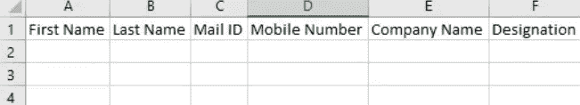
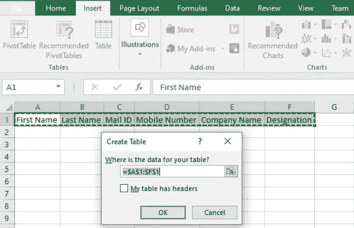
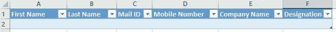
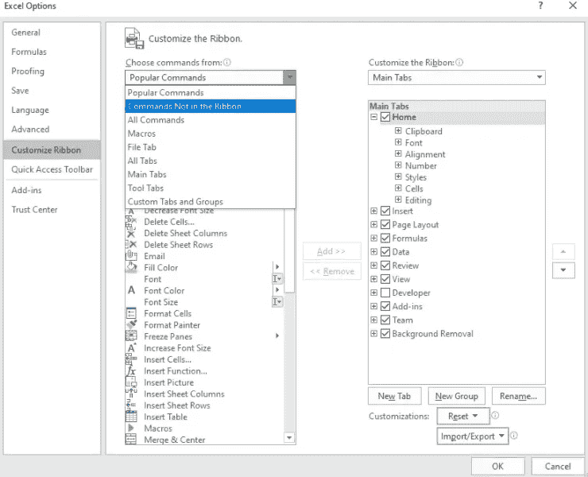
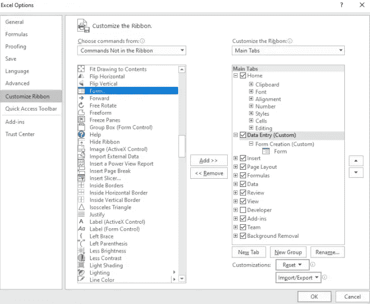
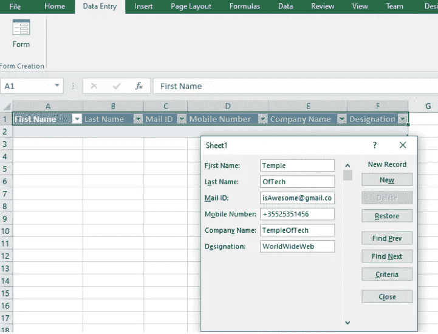

# 如何在 Microsoft Office Excel 中创建数据输入表单

> 原文：<https://medium.datadriveninvestor.com/how-to-create-a-data-entry-form-in-microsoft-office-excel-e321a0fe8b49?source=collection_archive---------1----------------------->

Microsoft Excel 是 Office 软件包提供的最强大的程序之一，它的用途几乎是无穷无尽的。在本文中，我将讨论 [Excel](https://templeoftech.net/how-to-find-data-in-google-sheets-with-vlookup/) 中的数据输入表单。这是一项有用的技能，任何参与该程序的人都可以学习。

## 让我们立即开始演示如何创建数据输入表单

首先，你要打开 Excel 应用程序。在下面的演示图片中，我将使用 2019 版的程序。

**创建表格**

**确保表格有标题**

Select the Cells that you want to make Headers and press the Table button under the Insert tab.

**创建标题后，它将看起来像下面的图片**

## 下一步是在功能区中添加表单创建选项

您可以转到选项，自定义功能区。如下所示，选择“命令不在功能区中”。

**选择“表单”并按下“新建”选项卡和“新建组”,以便将表单命令添加到功能区中。完成后，按“确定”按钮。**

**转到刚刚创建的新选项卡，选择表格标题，然后单击“表单”。现在，剩下的就是学习如何使用这个表单，你就大功告成了。**

# 结束语

这个表格对数据输入非常有用，它使工作变得更加愉快。如果你正在从事数据录入工作，那么这个工具将会提高你的效率，使生活更加简单。我希望你喜欢这篇文章，如果你有任何问题，请在下面留言。