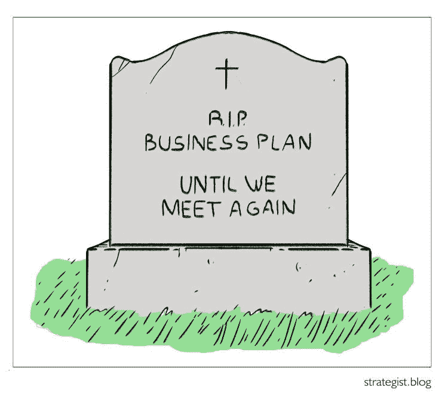

# 如何为投资者创建推介平台

> 原文：<https://medium.datadriveninvestor.com/how-to-create-a-pitch-deck-for-investors-63049dc93dd1?source=collection_archive---------6----------------------->

*这是“如何建立一个创新的新产品或公司”系列的第 8/18 部分，主题是撰写曾经被称为商业计划的东西*

商业计划曾经是记录你所看到的机会的故事和你提出的步骤的推荐方式。随着书面文件被 PowerPoint 演示文稿广泛取代，随着精益/敏捷思想的兴起(即，你应该在公司的头几个月学习，而不是假装事先知道所有答案和完美的计划)，商业计划变得不那么有用，甚至毫无帮助。

推介资料是解释你的战略(在你开始精益创业之旅之前就应该准备好)、为什么你的团队是执行战略的最佳团队以及你对潜在投资者的要求(和建议)的简单方式。

 [## 动荡迫使暴风雨中的平静|数据驱动的投资者

### 自然界中很少有东西是直线行进的，尤其是经济。当投资者和消费者希望平静时…

www.datadriveninvestor.com](https://www.datadriveninvestor.com/2019/03/25/volatility-compels-calm-amid-the-storm/) 

构建您的投资者推介平台

你给投资者的文件应该大致有这些部分:

*   **开篇:**五个要点总结，展示你将做什么，在吸引一个大的价值池方面，为你的买家、用户和投资者创造独特的价值。
*   **价值池是什么，有多大？**:一页。这是个大问题。很多美元。一个普通买家/客户不解决这个问题要花多少钱。
*   **为什么买家有这个价值池；为什么现有的解决方案行不通:**一到两页。今天人们解决问题的方式。这些解决方案的经济性。使用每种方法的主要竞争对手—理想情况下，在一个简单的网格中显示两个不同的维度，可以根据这两个维度对竞争对手进行细分，并且在我们的网格区域中没有任何竞争对手。维度可以是产品聚焦于购买者而不是用户(例如微软和苹果的区别)；解决问题的不同方法；那些使用新技术和新趋势的人与那些不使用新技术和新趋势的人。
*   **我们要做什么，为什么与众不同，为什么更好:**我们产品的一页。截图模型是一个好主意。否则，投资者会在 30 分钟后说“等一下”。你的产品是什么来着？这是手机 app 还是什么？”
*   **市场力量和趋势如何让现在成为新方法的关键时刻:**一页。也许是引用或举例说明这一趋势如何改变了另一个行业。
*   **我们是谁，为什么我们是解决这个价值池的最佳团队:**1-2 页。说很多创始人的事。他们在这家公司全职工作吗？他们过去有过哪些成功？如果有董事会或顾问，他们是谁？这种新的公司+商业模式与这些关键人物的经历和成功有多接近？
*   **我们的里程碑是什么；对我们计划如何增加收入和成本的一些预测:**假设公司的估值是收入的 6 倍或 EBITDA 的 15 倍(如果它是一家快速增长的 SaaS 公司)，四年后它的估值会是多少？潜在收购者的页面。
*   **我们希望筹集的资金:**已经锁定了多少资金(如果适用的话):创始人投入的资金越多，投资的风险就越低。投资前的估值

请注意，几乎所有这些都直接来自“制定战略的 4 个步骤”。如果你已经进行到这一步了，但对这些问题还没有清晰、清晰的答案，我的猜测是你跳过了战略思考的步骤，而且没有一个演示文稿可以掩盖好的思考中的差距。

**给天使/种子轮投资者的一些建议**

所有投资者(无论投资的阶段和规模如何)从根本上来说都在寻找同样的东西:在公司增长的拐点投资，让他们在未来几年的增长中获得有意义的份额。投资者投资于价值池(一个真实存在的问题)，投资于你和你的团队，他们是解决这个问题的最佳人选。他们没有投资于你的技术或你的小工具。许多年轻的公司变得迷恋他们的方法或产品；聪明的投资者知道产品创意会随着客户的使用而改变。

你是否能够通过热情的关系与潜在投资者建立联系，或者这种联系是否冷淡，这是有区别的。理想情况下，是你认识的人。在这种情况下，你可以边喝咖啡边和他们交谈，分享你的故事。如果是冷淡的接触，投资者可能会通过电子邮件要求提前看你的推介文件，你可能不得不发出许多文件，以便参加几次会议。

如果你担心投资者在你与他们见面之前就发现了你的秘密，那就像 HotMail 创始团队所做的那样:发出一个比实际产品更能概括你的技术的推销。如果他们拒绝了你(例如，因为他们认为你的团队资历太浅)，你可以在不冒任何风险的情况下了解结果。

试着边喝咖啡边和潜在的投资者见面。在开始推介之前的前十分钟，尝试讲述您的故事。如果可以避免，不要提前发送文件:他们可能会阅读文件并得出某些结论和误解，而你不知道这些是什么或如何理解它们。如果你能在会议期间完全避免使用这份文件，那就更好了——你可以把它作为后续文件，在会后通过电子邮件发送出去。不要要求他们在 NDA 上签名；投资者看到如此多的推销，他们无法做到这一点。

保持你的文档简单。少图。不要让演示和设计妨碍你的故事和价值池。专注于信息。

**一个有效故事的大致轮廓(当然你的实际故事会有所不同)**

“我在这个行业工作了很长一段时间——最初是作为买家和用户，最近是作为供应商。作为一名供应商，我看到我的客户有一个问题，我们无法解决它。问题很大——价值池很大。我意识到我必须停止在供应商那里工作，因为这个问题需要一个新的解决方案，一个只能从外部构建的解决方案。在我之前的角色中，我认为现有的供应商是解决方案的一部分；然而，我们碍手碍脚。十年后，我们回过头来说，‘当然现在这个问题就是这么解决的。’无论我们是否参与，向这种新方法的过渡都将发生。我们有机会早期介入并塑造方向。其他人也可能尝试这种方法，但机会足够大，可以有多个赢家。这不是一个假设的想法。已经被证明了。是真的。我们有证据证明它在起作用。我们需要做的是扩大规模。我已经组织了最好的团队来承担这个任务。"

这个故事的主要方面，你可以边喝咖啡边讲，自然会把你引向本文前面提出的文档大纲中的关键页面。

**你将得到的反馈和他们会说“不”的原因……以及该怎么办**

我最近咨询的一家公司正在为医生建立一个学习平台。医生每年必须进行一定量的学习才能获得认证。他们的平台受到了早期用户的喜爱，因为他们找到了一种让学习变得如此快速和简单的方法。该公司标榜自己是医生更好的“年度学习”平台。

他们的第一个投资者说“不……因为医生有很多免费的方式进行年度学习。”此时，应该给战略家敲响警钟了。这家公司的价值池不是每年的学习，而是节省忙碌的高薪医生的时间。他们的时间是他们拥有的最宝贵的东西。他们要么想要 400 美元/小时的账单，要么想和家人在一起。我的建议是，该公司应该将自己定位为一个这样做的平台。在这种情况下，“免费学习是一个竞争者”的论点不再适用。

投资者在听到你的推销后拒绝你的原因可能属于以下几类:

*   价值池不够大，不足以发展他们感兴趣的业务。希望这个问题得到解决，因为你完成了制定战略 的 [**4 步。**](https://strategist.blog/further-resources-and-acknowledgements/#19)
*   太多的潜在竞争对手。请看上面的轶事，有一种方法可以避免这种情况。确保你围绕你创造的价值而不是你做的事情来定位自己。
*   他们不投资 x 或 y 类型的公司，而你的公司正符合这种类型。例如，一些基金只投资于特定的行业，这些行业是他们学院的校友，处于特定的估值水平，或者有特定的商业模式(如 B2B SaaS)。对于这种反对，你无能为力，尽管，对于后一种情况，如果你选择了最佳的商业模式，它是值得重新考虑的。我接触过的投资者中，很少有人会投资 B2C 技术；最喜欢 B2B。
*   没有持久的竞争优势来源；对模仿者过于开放。如果你对“为什么是我们？”这个问题有了一个坚如磐石的答案。为什么一个宿舍里的两个孩子不能这样？”(从 4 个步骤中的第 3 步开始)，然后你只需要确保你正在阐明它。

**完成融资后，你的投资者推介资料还有价值吗？**

你可能再也不会提到它了。你的策略应该定期检查和参考，你可能会发现将你的实际里程碑和现金支出与你建议的进行比较的价值。但是如果你在你的产品开发中是敏捷的，并且利用你最初的几个月和几年花时间和客户在一起，学习实际的产品应该是什么，那么你最初的计划一旦写出来就会过时。当初创公司使用固定的计划，然后盲目执行时，他们就会失败。学习是创业公司的工作，而不是坚持一个计划。董事会和投资者可能需要接受这方面的教育。关于你是否在错误的轨道上的一个试金石是，在开始你的产品开发的几个星期后，你是否对你的“产品”何时完成有一个清晰的想法。

也发表在[strategic . blog](http://strategist.blog/)上，在那里我分享了关于构建基于分析的产品和业务的想法(例如“产品策略”)。本文中提及或参考的任何书籍或其他资源都列在[这里](https://strategist.blog/further-resources-and-acknowledgements/#19)。