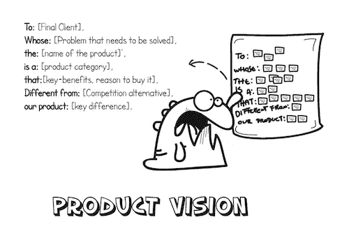
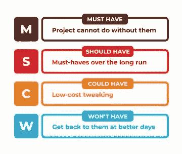
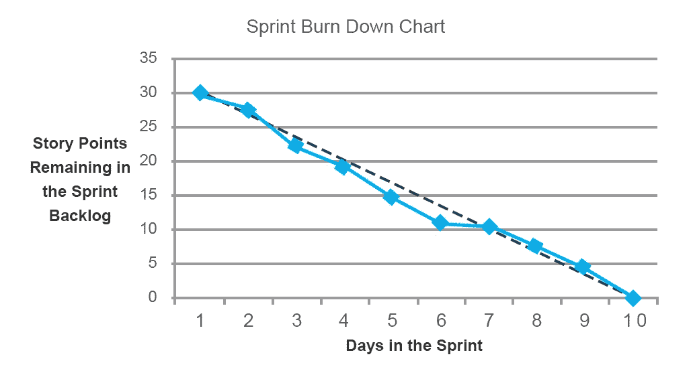
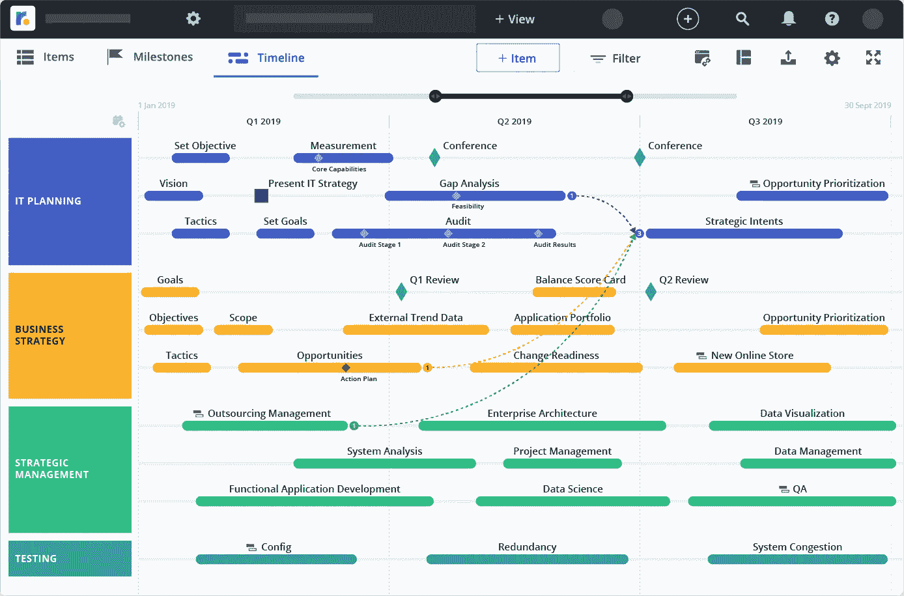
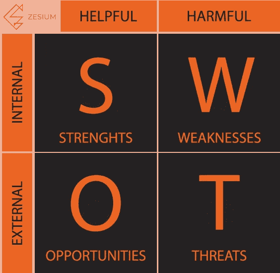

# 如何为移动应用创建产品路线图

> 原文：<https://medium.datadriveninvestor.com/how-to-create-a-product-roadmap-for-a-mobile-app-3e850bdd52cf?source=collection_archive---------1----------------------->

现代技术需求最近有所增加，为了获得相对于他人的竞争优势，企业旨在推出移动应用程序，并改善他们的客户体验和保留。

开发一个移动应用并不像听起来那么简单，尽管今天你可以在商店里找到将近 200 万个应用。

移动应用程序开发是有风险的，需要遵循许多步骤，这就是为什么你应该使用路线图。

# **什么是产品路线图？**

产品路线图是概述产品开发过程主要阶段的战略文件。

产品路线图的主要目标是绑定您的产品愿景和业务目标。

路线图完全是关于优先化和组织的——它允许你分析特性想法，决定哪些特性应该发布，如果必要的话，删除或重组哪些特性。

最好的路线图甚至还不止于此——提供对全局的更多洞察，澄清任何错过的机会，并消除前进道路上的困难。

你应该使用你的路线图来概述你的产品的长期发展。

# **如何开始？**

首先，你需要理解[产品愿景](https://www.aha.io/roadmapping/guide/product-strategy/what-is-product-vision)，并且[有一个清晰的战略](https://www.aha.io/roadmapping/guide/product-strategy)，应该是用户驱动的。

在制定路线图之前，制定一个计划来协调团队中的每个人，让他们专注于最重要的工作。路线图带领你的团队达到目标，成为你的产品，并计划需要做什么来达到同样的目标。

路线图是战略规划的结果—通常，路线图应包含以下要点:

> **产品愿景** —你希望你的最终产品是什么样的
> 
> **策略** —详述您需要做什么来满足需求的执行计划
> 
> **目标** —通过特定指标衡量的目标
> 
> **计划** —为实现目标而实施的一组功能
> 
> **功能** —产品的一部分:功能或第三方应用
> 
> **时间框架** —完成某个目标/功能所需的时间(近似值)
> 
> **状态标记** —用于工作进度
> 
> **指标** —目标的衡量，如有机流量或流失率。

…

让我们来分解如何创建成功的路线图来实现您的目标的过程:

# **1。定义你的战略和产品愿景**

首先，你需要想出一个计划——你的移动应用将解决哪个问题，为什么，为谁解决。你不必列出所有的特性，但要关注路线图如何符合你的业务的战略方向。

它将帮助你阐明你的产品的使命——它将解决的问题，它的目标用户和它的[独特的价值主张](https://conversionxl.com/blog/value-proposition-examples-how-to-create/) (UVP)。你最不想做的事情就是浪费你的时间和资源去开发一个[没有任何用途](https://www.pcworld.com/article/2045524/there-really-shouldn-t-be-an-app-for-that-13-apps-that-dont-need-to-exist.html)的应用。

Source: martinfowler.com

定义你的[客户角色](https://www.usertesting.com/blog/customer-personas/)，研究你的市场和你的竞争对手，倾听你的客户并与你的利益相关者交谈。

> 一旦你向所有相关人员展示了你的愿景，你就有了开始制定路线图的必要信息。

# **2。定义你的‘受众’**

今天最重要的事情之一是知道你在为谁写路线图。路线图并不适合所有人——你应该注意格式、类型和内容。请注意它的格式，因为它必须[适合您的特定受众](https://roadmunk.com/guides/roadmap-templates/)。

例如，仅列出特性的路线图不适合销售或营销部门，但适合您的工程团队。

Source: nebocompany.com

路线图也可以为特定受众定制，并在不同的关键点上具有特定的信息、方法或方向。

根据 Brian Lawley 的著作[Expert Product Development](https://280group.com/products/books/expert-product-management/)，他将路线图分为几种最常见的类型:

*   战略和市场路线图
*   愿景路线图
*   技术路线图
*   跨产品路线图的技术
*   平台路线图
*   内部和外部产品路线图

> 选定的格式将提出需要强调的必要信息和需要优先考虑的目标。

# **3。使用指标**

无论您做什么，您都需要测量数据，以了解实际的进展或可能的障碍。

如果您按时定义了您的[KPI](https://kpi.org/KPI-Basics)，您将会明白您的第一个版本应该关注哪些方面，以及在迭代您的产品的后续版本时应该改进哪些方面。如果你正在构建一个[最小可行产品](https://en.wikipedia.org/wiki/Minimum_viable_product) (MVP)，只关注有限数量的度量标准。

你应该创建一个**所有你想包含的**特性的主列表，然后开始组织和优先排序它们，以保持你的产品开发精益。

最广为人知的方法是[莫斯科方法](https://en.wikipedia.org/wiki/MoSCoW_method)——这是一个缩写词，代表 **M** ust、**S**should、 **C** ould 和**W**on t。

Source: railsware.com

该方法帮助您定义先实现哪些功能，后实现哪些功能，以及是否需要完全删除。

[莫斯科方法](https://railsware.com/blog/moscow-prioritization/)会让你的项目走上正轨。

你的具体指标将帮助你掌握更广泛的情况，衡量你的进展，给你足够的空间来调整你的行动，以达到最好的结果。一些[相关指标](https://www.altexsoft.com/blog/business/agile-software-development-metrics-and-kpis-that-help-optimize-product-delivery/)可以是分析市场和/或竞争、冲刺消耗、流动效率、速度、周期时间等等。

Source: altexsoft.com

注意[功能蠕变](https://www.chargify.com/blog/feature-creep/)，因为不断增加的众多功能会导致产品变得复杂和令人困惑——永远记住用户喜欢简单的产品。

> 一旦您收集了必要的信息，您就可以修改您的目标，并确定哪些功能需要紧急关注，哪些功能可以在下一个版本中添加。

# **4。使用路线图工具**

不久前，Excel 是构建路线图的主要工具——它是开发过程的静态表示。

如今，有了基于云的路线图工具，您可以加快这一过程，并在过程中轻松更新。

一些工具包括:

[open project](https://www.openproject.org/)——根据敏捷/Scrum 团队的需求开发开源软件。

[路线图规划器](https://www.roadmap-planner.io/)—Linux 的开源工具。

[ProductPlan](https://www.productplan.com/) —一款提供大量[路线图模板](https://www.productplan.com/resources/roadmap-templates/)的流行软件。您可以从吉拉、电子表格等导入项目。这使得计划更加容易。

[啊哈！](https://www.aha.io/) —用于路线图的软件，具有令人印象深刻的与各种应用程序的集成列表，如吉拉、Salesforce、Slack、Zendesk、Confluence、Trello 和[。](https://www.aha.io/product/features/integrations)

Source: roadmunk.com

[Roadmunk](https://roadmunk.com/) —最受欢迎的软件之一，用于以“不同”的路线图视图为您的项目绘制路线图，这意味着它可以针对不同的参与者(开发人员、营销/销售部门等)进行定制。)

> 您可以根据自己的具体需求和预算选择最好的软件。

# **5。仅路线图的重要更新**

战略路线图有一个明确的目标——优先考虑产品开发行动。

如果您想保留功能，您需要关注提供总体策略，而不是方法。

Source: iconfinder.com

避免过于详细，不要包含太多信息或不必要的数据。

您应该始终保持路线图的更新——路线图的动态变化会带来新的特性和目标。

跟踪您的修改，以便成功地将信息传达给所有团队(工程、营销、销售等)。)和利益相关者。

> 请记住，您的路线图代表了产品开发的逐步增长。

# **6。了解你的用户**

[用户反馈是一座金矿](https://medium.com/dataseries/how-can-user-feedback-improve-your-mobile-app-zesium-559b583cdc54)，它可以帮助你找出产品中可以改进的地方以及做得好的地方。收集的信息将帮助你决定你是否在一个好的轨道上，或者你需要改变方向。

分析用户反馈，因为它会告诉你你的用户想要什么，他们需要从你的产品中得到什么。

Source: buzinga.com.au

方法和资源的结合可能更有用——回顾你现有的所有反馈，加上直接渠道，如调查、采访、聊天机器人等。使用专业的应用程序客户之声工具也是一个不错的主意，比如 [Mopinion](https://mopinion.com/) 或[appentive](https://www.apptentive.com/)工具——它们可以帮助你收集反馈并监控产品趋势。

[了解用户行为](https://medium.com/dataseries/the-best-ways-to-track-user-behavior-in-mobile-app-e4ef5269395)不仅有助于确定哪些方面需要改进，还有助于确定使用哪种技术——例如，如果您的用户主要使用 iOS，您将知道首先使用哪种技术，或者如果您对用户看重的最重要的功能有反馈，您将有一个坚实的开端来决定包含或删除哪些功能。

> 在确定未来产品开发领域的优先顺序时，所有这些见解都非常有价值。

# **7。欠挖**

你可以运用 SWOT 分析来确定你的产品开发状况。将你所有的发现整合到一个全面的 [SWOT 分析](https://theappsolutions.com/blog/marketing/swot-for-mobile-app/)中，为你的移动应用创意做准备。

Source: zesium.com

SWOT 是一个分析框架，帮助你创建一个大图，分析形势，找到最佳解决方案。它确定了影响开发过程的内部和外部因素。

> SWOT 分析将为您提供开发过程中潜在机会和风险的概述。

# **最后一句话**

构建移动应用是一个包含许多不断发展的部分的动态过程——路线图任务是支持协作并消除前进道路上的障碍。

产品路线图在很多层面上都是有用的，从展示您的愿景、确定步骤的优先级到充当团队之间的沟通工具。虽然看起来很复杂，但一个有用的路线图是清晰的和容易理解的。

> 产品路线图不仅对于传达你的移动应用的目的来说是必不可少的，而且它还显示了确切的目标，并将它们与你的商业目标相匹配。

*原载于 2019 年 10 月 28 日*[*http://zes ium . com/how-to-create-a-product-roadmap-for-mobile-app/*](http://zesium.com/how-to-create-a-product-roadmap-for-mobile-app/)*。*