# 如何为你的线下业务创建一个拼车应用

> 原文：<https://medium.datadriveninvestor.com/how-to-create-a-rideshare-app-for-your-offline-business-5aa77380dbe7?source=collection_archive---------1----------------------->

短短几年，拼车已经成为最赚钱的商业模式之一。虽然市场上有很多参与者，但拼车应用程序的开发需求很大。在这篇文章中，我们分享了关于如何制作一个 rideshare 应用程序的有用技巧，并告诉了所有关于开发过程和成本的知识。

# **为什么选择拼车？**

拼车程序大受欢迎源于它们的便利性、可用性和低廉的价格。成千上万居住在城市地区的人在上下班、外出和旅行时共用汽车。拼车应用给乘客和司机都带来了很多好处。

*Ridesharing has become a fixture in our everyday life*

虽然乘客节省了运输成本，但司机却从他们的空座位中获利。更不用说拼车有助于缓解高峰时段的交通拥堵，减少人们的环境足迹。

 [## 2019 年移动应用开发之路——数据驱动投资者

### 任何在移动应用程序开发行业工作的人，无论他们是专注于在伦敦开发 iOS 应用程序还是…

www.datadriveninvestor.com](https://www.datadriveninvestor.com/2019/01/15/the-path-of-mobile-app-development-in-2019/) 

优步和 Lyft 的巨大成功震撼了世界。短短几年间，这些拼车公司颠覆了传统的城市出租车服务，成为其目标市场的绝对领导者。

> *许多相对年轻的拼车公司，如 Gett、Ola、滴滴出行和 BlaBlaCar，表现惊人地好，尽管面临来自优步和 Lyft 的激烈竞争*

据 [Statista](https://www.statista.com/statistics/550635/uber-global-net-revenue/) 统计，2018 年，优步全球净收入达 113 亿美元。去年，通过优步应用交付了 52.3 亿次乘坐。另一家大型拼车提供商 Lyft ，预计 2020 年仅在美国和加拿大运营的业务将产生 60 亿美元的收入。

优步模式吸引了许多企业家的目光。开发类似优步的应用程序是当今全球创业领域的一个流行趋势。尽管拼车市场增长迅速，但似乎不可能战胜现有的大公司。但事实上，许多本地拼车公司，如 Gett、Ola、滴滴出行和 BlaBlaCar，都做得令人惊讶的好，尽管来自优步和 Lyft 的激烈竞争。

因此，如果你想开展拼车业务或设计一款拼车应用来提升你现有的出租车服务，首先你需要决定你真正想要什么类型的应用。

# 选择什么类型的拼车 app？

首先，你打算推出拼车、拼车或汽车共享应用吗？你不应该混淆这些术语。*сar pooling*和 *ridesharing* 经常互换使用。然而，它们之间有一个根本的区别。

# 拼车/叫车

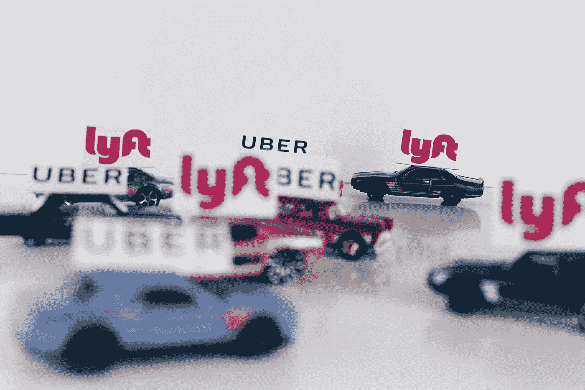

*Uber and Lyft are the main players in the ridesharing market*

拼车是一种按需汽车服务，中介(如优步或 Lyft)收取费用，客户通过智能手机应用程序请求乘坐私人车辆。拼车司机的行为就像出租车。他们不会和他们的乘客去同一个目的地，旅行结束后，司机载着另一名乘客。

拼车的好处之一是，你等待乘车的时间更短，可以选择车辆类型和司机，然后可以对应用程序中提供的服务进行评级。无现金应用内支付也让现代骑行者的生活更加轻松。

# 合伙使用汽车

*Carpooling suits for daily rides shared among friends, colleagues, and neighbors*

在拼车的情况下，你不需要向第三方付费。有了拼车，骑手和司机都是一起走向最终目的地。拼车者通常是一群朋友、同事或家庭成员，他们每天一起拼车。司机和通勤者经常分摊燃料和汽车维护费用。

虽然有一些拼车应用(Via，Carma，BlaBlaCar)已经将其服务货币化，但拼车通常不涉及利润。然而，共享乘车的想法相当受欢迎，所以即使是拼车公司也在他们的服务中增加了团体旅行(UberPool，Lyft Shared)。

拼车不仅有助于节省乘车费用，还能保护环境。路上更少的汽车减少了我们的碳排放。

# 点对点汽车共享

*Getaround, a San-Francisco-based carsharing operator, is called ‘Airbnb for cars‘*

点对点汽车共享也称为 P2P 汽车共享，是车主在固定时间内将车辆出租给他人的一种做法。

在 P2P 汽车共享中，典型的汽车租赁车队被成员拥有的车辆组成的车队所取代。通过点对点汽车共享，车主可以在不用车的时候赚点外快。反过来，租车者可以使用附近的车辆，只需为他们需要的时间付费。

Getaround、Turo、Zipcar、RelayRides 和 Hertz 等公司已经成功实现了 P2P 汽车共享，受到了旅行者的欢迎，尤其是在出国旅行期间。

# 拼车应用的基本功能

*A standard rideshare app should consist of both passenger app and driver app*

你的应用程序的功能列表是影响开发成本的第一大因素。拼车服务的关键功能是连接乘客和司机。该功能必须通过两个独立的应用程序来执行——一个用于骑手，另一个用于驾驶员——以及管理面板形式的调度系统。

虽然基本功能可能有所不同，但 MVP 的技术体系应该包括以下内容:

# 乘客应用程序

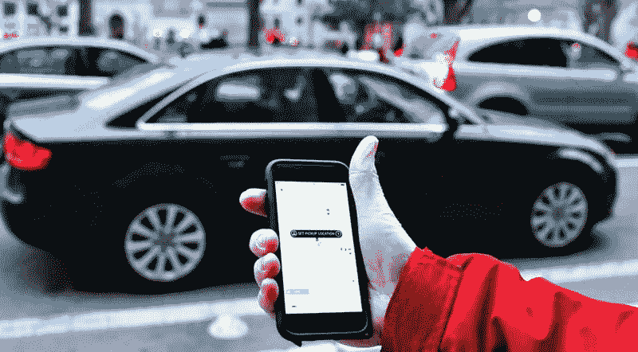

*With real-time tracking feature the rider always knows the driver’s current location*

**入职:**用户可以使用社交账户/电子邮件登录在应用程序中注册。

**用户简介:**注册后，应要求用户提供其账户中的信息，以有效地与应用程序互动(管理乘车请求、给司机评分、创建群组、保存路线等)。).

**实时跟踪:**一个 app 应该及时发送司机当前位置的更新。

**搜索:**要找到路线和司机，用户需要搜索。

**过滤:**通过先进的过滤系统，用户可以根据舒适度和价格选择汽车类型
。

车辆列表:一个精心设计的目录可以让用户选择他们想要的车。

**预订:**用户可以马上要求搭车，也可以稍后预订。

**乘车历史:**该功能允许乘客查看自己之前的行程。

**应用内支付:**增加这一功能可以让乘客注册信用卡/借记卡，并在旅程结束时提供无现金支付。

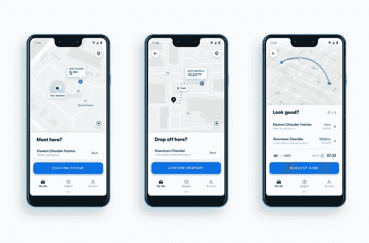

*Users can request an immediate ride or book it for later*

**Autoprice 建议:**内置的车费计算器通过计算上下车点的距离来估算乘车费用。

**推送通知:**一旦司机接受请求，就通知用户他们的乘车状态。通知还可以包含附加信息，如汽车品牌、颜色、车牌号码和预计到达时间。

**评分&点评:**乘客可以对自己的乘车体验进行评分，并留下评论。

**客户支持:**要处理投诉并帮助客户解决问题，您可以在应用程序中启用实时聊天、сhatbot 或直接通话。

*高级功能:*

上车地点:利用手机内置的 GPS 模块，乘客无需输入地址就可以设定自己的位置。群组创建:当几个用户想共乘一辆车时，这个功能对拼车应用程序很有用。

**多语言支持:**默认情况下，你的应用只使用一种语言。然而，如果你想覆盖更大的市场，你可以添加更多的语言。请注意，有些语言是从左到右编写的，而其他语言是从右到左编写的，因此您需要在开发过程之前考虑这些特性。

**社交分享:**允许乘客通过社交媒体分享他们的乘车体验，并在社区成员中推广您的应用。这将帮助你用最少的努力增加客户数量。

**紧急按钮:**乘客可以使用紧急按钮报警，警察将能够借助从拼车平台接收到的 GPS 坐标找到他们。

**实时跟踪:**另一项安全预防措施是实时跟踪，乘客可以随时向他们的亲人告知他们的路线、目的地和到达时间。

**聊天:**内部信息系统将确保乘客和司机通过应用程序直接沟通。

# 司机的应用

*Adding chat feature will allow passengers and drivers texting each other directly*

司机应用的一些功能可能与乘客应用的功能重叠，例如，注册和个人资料、推送通知、地理跟踪和应用内消息。与此同时，对于车手来说，还有一些独特的元素:

**状态:**当司机准备好搭载乘客时，可以在应用程序和地图上看到他们。

**预订:**司机应该能够接受和取消订单，显示接送地点。

**导航:**通过这一功能，驾驶员可以获得实时信息，如交通状况更新和替代路线。

**费用估算:**估算行程费用和折扣。

**报告:**显示关于旅行和收入的统计数据。

**乘客评论:**司机应该能够在确认乘坐之前检查乘客的评论和评级。此外，司机应该能够评级骑手和否决坏客户，所以他们不会再与他们匹配。

# 管理面板

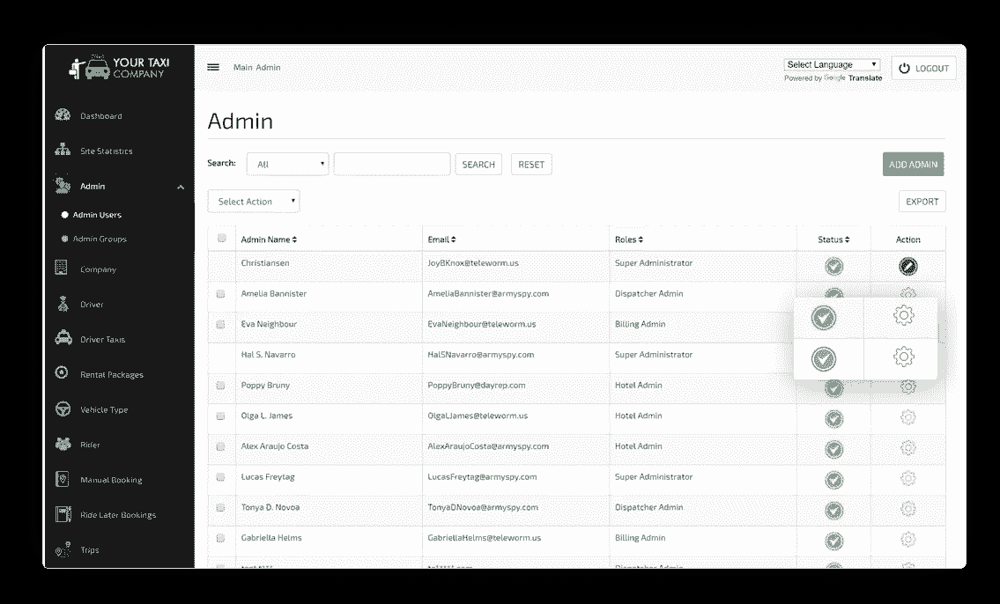

*Admin can manage the registered drivers and view vehicles added by them*

管理仪表板通常是一个(桌面)web 应用程序，它存储数据并管理乘客和司机在应用程序中的活动。基本上，它是将骑手和司机应用程序绑定在一起的中心枢纽。管理面板给出了所有过程的简要总结，并允许您管理路线和财务。它可以从头开始创建，也可以使用管理面板模板创建。模板的常见功能包括:

**仪表板:**允许管理员查看关键统计数据和拼车服务指标，管理车辆，并使用电子邮件模板向骑手和司机发送通知。

**司机管理:**此功能支持批准新司机和处理付款。

**乘客管理:**该功能会记录您平台上注册的所有用户，并显示他们的反馈和预订历史。

**支付管理:**这个功能可以让你设置司机的佣金率。

**报告&分析:**借助该功能，您可以通过收集应用使用数据和 rideshare 服务上的指标，获得业务运营的综合摘要，并深入了解您的在线营销绩效。

# 应该依靠哪些技术？

优步的技术现在是开源的，所以你可以使用最好的代码来创建你自己的 rideshare 应用。

# 地理定位

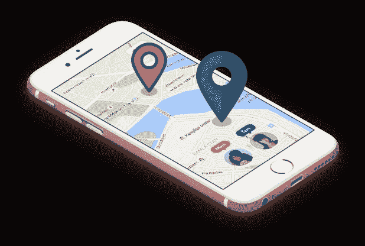

*GPS integration is a key feature for on-demand ride-hailing service*

为了确定骑手/驾驶员的当前位置并跟踪路线，开发者使用 GPS。基于 Android 的应用程序的地理定位可以在谷歌位置 API 的帮助下实现。它们智能地管理底层定位技术，同时满足开发需求。iOS 开发者可以使用 CoreLocation 框架来获取用户的位置和方向信息。

Android 上的路线和方向是通过谷歌地图 Android API 实现的。要在 iOS 中的地图上显示点对点的方向，开发者可以选择 MapKit。实现这个 API 使得地图软件在用户的设备上可用。优步已经为他们的应用程序的 iOS 和 Android 版本实现了谷歌地图。

# 推送通知和短信

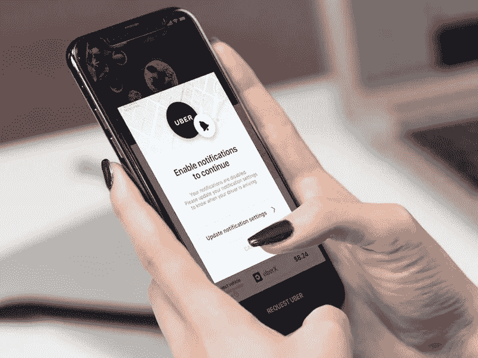

*Push notifications keep users posted about their ride’s status*

在构建你的 MVP 时，推送通知足以连接需求和供给。对于 iOS 设备，推送通知是通过苹果推送通知服务提供的。Android 的类似物是谷歌云消息。

SMS 通知是项目开发的下一个阶段。优步的短信服务是由 Twilio 提供的，尽管也有像 Plivo、Nexmo 和 Sinch 这样的替代服务。

请注意，如果用户的设备离线或不可用，可能无法接收某些推送通知。另一方面，短信总是会发送的，否则你的短信提供商会通知你发送失败。

还可以集成一个 messenger，这样乘客就可以在应用程序中与司机聊天。但是，这需要大量的开发时间。所以这个选项最好在项目建立并获得足够多的忠实用户后实施。

# 支付集成

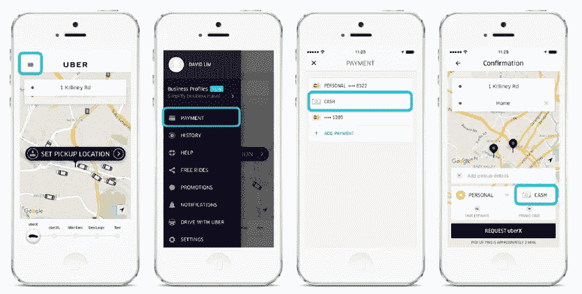

*PayPal, Braintree, and Stripe are the most common payment gateways for rideshare apps*

大多数拼车应用使用无现金系统。客户通过借记卡或信用卡支付，并可以输入促销代码。移动应用最流行的支付网关是 PayPal、Braintree 和 Stripe。

然而，当接受信用卡支付时，公司必须遵守要求。支付卡行业数据安全标准(PCI DSS)是一组要求，旨在确保所有处理、存储或传输信用卡信息的商家和服务提供商保持所需的安全级别。

Stripe 和 Braintree 可以帮助您的应用程序顺利符合 PCI 要求，因为这两个支付系统都为 Android 和 iOS 提供了坚实的本地库，并通过发送加密的信用卡数据作为令牌来提供 PCI 合规性。因此，您可以轻松集成应用内支付，同时避免大多数 PCI 合规性问题，因为重要的信用卡数据会跳过您的服务器。

# 计算机网络服务器

> 服务器的后端编程语言包括 Node.js、Java、PHP 和 Ruby on Rails

要制作一款拼车应用，你需要一个后端来存储信息、处理用户请求和计算司机路线。您可以为您的服务器考虑这些选项。

***自定义服务器***

您可以请求从头开始开发一个服务器，并在其上托管后端。个人服务器将提供对应用程序的完全控制，您可以根据自己的具体要求进行定制。后端编程语言(您将用来在服务器上编写代码)包括 Node.js、Java、PHP 和 Ruby on Rails。

***云服务器***

另一个可以考虑的选择是云服务器。云平台提供广泛的基础设施服务—数据库存储、计算能力、网络—并为 web 和移动项目提供经济实惠的解决方案。流行的云计算服务包括亚马逊网络服务、谷歌应用引擎、微软 Azure 和 phoenixNAP。

***移动后端即服务(MBaaS)***

MbaaS 提供 API 和 SDK，允许您轻松连接到云服务器，并包括用户身份验证、数据管理、推送通知和与社交网络服务集成等功能。一些可靠的 MBaaS 平台有 Firebase、Parse、Oracle Cloud 和 Red Hat。

***数据库***

为了存储和管理数据，服务器需要一个数据库。流行的数据库管理系统包括 MySQL、SQLite、PostgreSQL 和 MongoDB。SQLite 是轻量级和快速的，这使它成为较大的 MySQL 的流行替代。

# 开发一个 rideshare app 要多少钱？

除了前端和后端开发的成本，你需要对用户界面和 UX 进行定价。虽然你可以放弃昂贵的设计，但是创建一个用户友好的界面是必须的。此外，您还需要支付诸如规划阶段、质量保证和项目管理等伴随服务的费用。

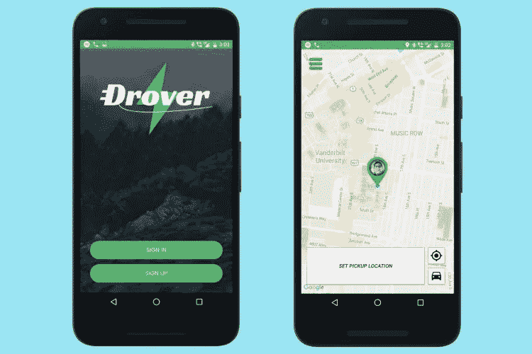

*Make sure to create a user-friendly interface for your rideshare app*

费用取决于服务提供商的小时费率，从每小时 18 美元到每小时 180 美元不等。

下面，我们给 rideshare app 开发一个大概的估算。请注意，我们只涵盖原生应用的成本，因为 Android 和 iOS 的后端和基本功能非常相似。

**乘客 app**

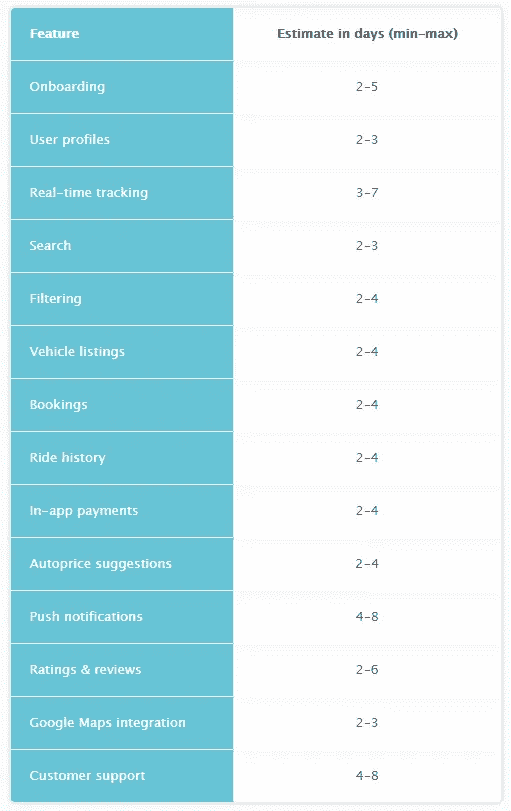

**驱动 app**

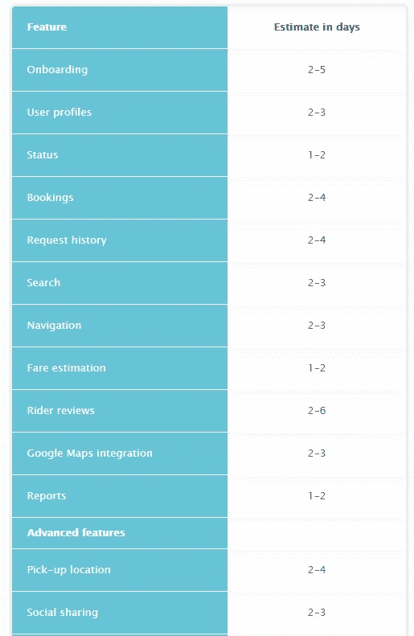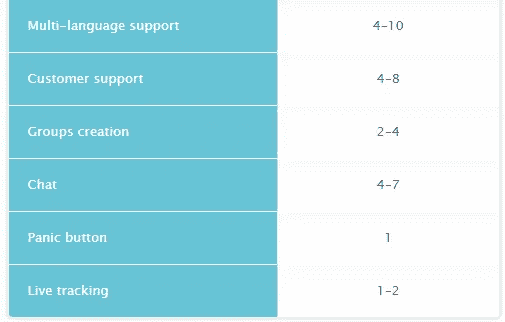

**管理面板**

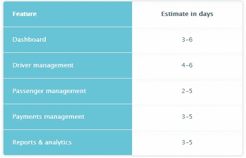

# 结论

在本文中，我们介绍了如何创建拼车应用的基本步骤，并给出了一个创业项目的粗略估计。现在你已经了解了如何构建一个合适的拼车应用来创办一家拼车公司。它可以是一款独特的拼车应用，也可以是像优步这样的下一代叫车应用。

然而，了解这些工具和特性是一回事；以正确的方式实现它们是另一回事。确保雇佣一个有经验的开发团队，他们能够满足你的期望。如果你目前正在筛选开发拼车应用的开发公司，我们希望移动行业能引起你的注意。我们很乐意给你一个更详细的时间、费用和所需专家的估计。

**获得免费咨询！**sales@mobindustry.net

 [## 如何为你的线下业务创建一个拼车应用

### 短短几年，拼车已经成为最赚钱的商业模式之一。虽然有很多玩家…

www.mobindustry.net](https://www.mobindustry.net/how-to-create-a-rideshare-app-for-your-offline-business/#)