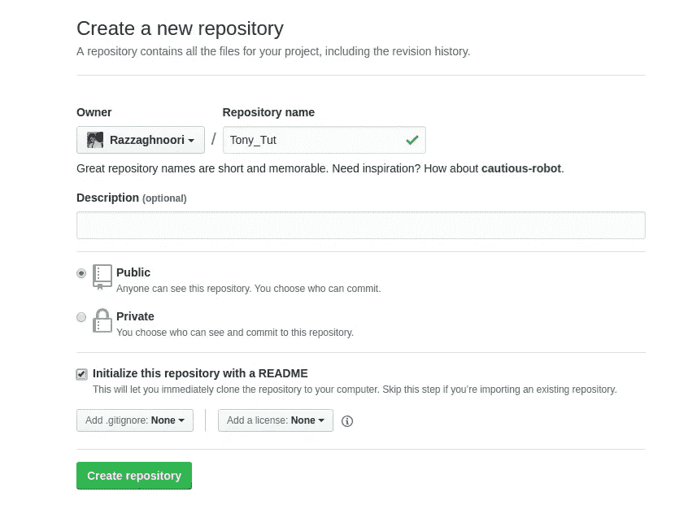

# 如何创建一个简单的 JARVIS——聊天机器人来了

> 原文：<https://medium.datadriveninvestor.com/how-to-create-a-simple-jarvis-chatbots-are-coming-b2cd9238376e?source=collection_archive---------2----------------------->


我无法清晰地记得我决定献身于开发聊天机器人的时间，也许是在第一部钢铁侠电影问世的时候。这么多年过去了，我很自豪地说，你眼中的贾维斯只是一个梦--就目前而言！！！抱歉让你失望了。

但是 Siri，Cortana，Alexa，Google Assistant 呢？他们都工作得很好…

是的。你说得对。他们没有贾维斯的感知能力。但是它们很有趣。所以，看看他们解决问题的方式并不完全是浪费时间。本教程结束时，你将能够编写一个完整的聊天机器人，类似于之前提到的现有聊天机器人。但请记住，我们仍然需要在机器学习方面取得巨大突破(不太确定让网络更深入是解决方案)，才能拥有我们自己的智能助手。

我本人讨厌介绍。我们开始吧。

## 不同类型的聊天机器人

聊天机器人有三种类型。其实最后一个也没太大区别。但是我想得太多了。

1.  基于知识:顾名思义，基于知识的问答使用某种结构化的数据库作为信息来源。在这种方法中，在从用户查询中检索有用信息的预处理阶段之后，通过相应数据库的搜索产生输出。稍后将更详细地解释预处理阶段。但是，为了让你明白，让回答问题更容易的一件重要的事情是提取问题的类型。一个问题可以想象出很多种类型。是在问一个地方吗？某个时间？一个人？也可能只是随便聊聊。听起来可能很简单，但这是当今大多数人工助手的主要组成部分，也是本文的主要主题。下一个方法将在下面的文章中讨论。
2.  基于信息检索:我不知道你是否想过这个问题——我们为什么不在谷歌上搜索一下呢？答案是基于 IR 的问题回答背后的直觉。是的，我们可以在任何我们喜欢的搜索引擎上搜索它，并在那里找到答案。但是，令人惊讶的是，找到答案并不那么容易。记住:我们是在搜索非结构化数据。所以，答案可能就在屏幕上的任何地方，不管它值不值得，你甚至不知道要找什么。读到这里，你可能会有一些想法和算法在你的脑海中找到答案。试试看！！！他们会给你很多关于挑战的想法。

## 我们可以开始了吗？

前阵子，我决定打造一份特别的简历；一个会说话的，(不知何故)聪明的人。于是，我开始写《托尼》(以两个神奇的角色命名:托尼·斯塔克和托尼·阿尔梅达)。

这个想法很简单，我用关于我自己的问题和相应的第三人称的回答来填充一个数据库(只是为了酷！！).现在，每当有查询输入，我都会找到最相似的问题并返回其答案。容易吗？给它时间。

实际上，这是第一批聊天机器人背后的主要算法。不过，他们确实在搜索数据库。我的意思不是“完全”完全。但是，如果数据库中有一个问题说“他在哪所大学获得学士学位？”对于“他毕业于哪里？”这个问题，这些系统可能会产生错误的答案。。幸运的是，我们的系统理解单词“大学”、“学士”、“学位”和“研究生”的语义相似性。在这个之后，我们将创建另一个基于知识的聊天机器人，使我们的生活更容易；希望在下一篇文章中。

现在我们已经知道了这个过程，让我们通过为我们的项目创建一个文件夹并在其中创建一个虚拟环境来开始代码，以使一切都有组织。

我们现在在虚拟环境中。这里安装的所有东西都不会影响您计算机上运行的其他软件。

下一步是安装依赖项。因为我们还不知道要用什么，所以我将安装一个作为实例，剩下的就交给你了。程序当然是一样的。

我打算用 MySQL 作为我的 RDBMS。非常欢迎你尝试任何你喜欢的东西。因此，要安装 python 的 MySQL 客户端，你需要在基于 Debian 的 GNU/Linux 系统上做以下工作。

```
sudo apt-get install python-dev libmysqlclient-dev
pip install mysqlclient
```

快速提示:在本教程的其余部分，我将假设您正在安装了 python 2.7 的基于 Debian 的 GNU/Linux 机器上工作。如果您不是，我相信您可以根据自己的需要修改代码。但是，如果你觉得卡住了，请随意写评论。

现在，在我们开始任何严肃的编码之前，让我们把它变成一个 git 存储库。首先，转到 GitHub 页面，创建一个新的存储库。



接下来，点击 Clone 或 download 按钮来获得项目的 https 链接，并使用它来添加一个遥控器。

现在我们已经设置好了一切，是时候创建一个负责创建和填充数据库的 SQL 文件了。

我将把它保存在一个名为“spec.sql”的文件中，并放入。/scripts/db/'。将你的文件保存在单独的、有组织的目录中，会让你在以后的整理过程中省去一些麻烦。

现在，让我们创建数据库并用我们的记录填充它。

```
mysql -u root -p < ./scripts/db/specs.sql
```

然后你将被要求输入你在安装 MySQL 时选择的 root 用户的密码。

好的。现在我们已经建立并运行了我们的数据库，我将告诉你一些我最喜欢的近年来在深度学习领域发生的创新:**单词嵌入。**

## 单词嵌入

向神经网络输入单词和一般文本一直是一个挑战。为什么？因为神经网络的输入通常是固定大小的对象(矢量或张量)。所以，我们需要想出一个有意义的单词表达方式，并把它发给我们的网络。你可以在这里花点时间想个解决办法。

以前，有一种技术叫做一键编码，顾名思义，就是将单词编码成向量。根据 one-hot 编码，一个单词对应的向量是 v 维向量，其中 v-1 个元素为零，只有第 i *个*个元素等于 1。“v”是你的字典的大小，“I”是你的单词在字典中的索引。

没明白吗？好的。我举个例子来说明一下。假设我们有一个关于猫的文档，我们想用向量表示它的单词。首先，我们需要创建一个在文档中看到的所有单词的列表，并根据出现的次数对它们进行排序。因此，您可能已经猜到，该文档中最常见的单词是— cat。对吗？不。可能是“the”这个词。无论如何，现在，如果文档中唯一单词的数量是 100，您需要创建一个 100 维的向量，将其所有元素设置为零，并将第一个元素更改为 1，以获得单词“the”的一键表示。继续前进…

所以，让我告诉你一次性编码的主要缺点，它能引导我们产生更好的想法。

one-hot 的第一个也可能是最重要的缺点是，意思相似的单词没有相似的向量。这很重要，因为对于任何分类问题，相似的单词更有可能被分类在同一类中；它们相似是有原因的，你知道。除此之外，我们不想丢失信息。如果我们能发明一种保持语言的语义和句法信息的表示法，就能对这种语言有一个合理的理解。

第二个缺点源于字典的大小。对于英语来说，大约有 180，000 个独特的单词，这会给你留下一个明显的维数灾难。

所以要想出解决这种效率低下的办法，2013 年，word2vec 应运而生。当然，还有 Google 推出的另一个令人敬畏的算法 GloVe，它使用完全不同的方法来计算相似的向量，但是，今天，我要谈谈 word2vec。我不会用获取向量的细节和程序来烦你。但是，我要告诉你一点为什么它会改变游戏规则。

使用 word2vec，每个单词的语义和语法上的重要细节都保存在它的向量中。怎么会？如果两个词在现实世界中是相似的，它们的向量会彼此接近，这个命题是如此惊人的准确，基本上，使你能够在文学上做数学。

什么？是的。从“King”中减去“Man ”,然后在结果中加上“Woman ”,将会产生一个与单词“Queen”的矢量表示非常接近的矢量。

通常情况下，你会期待这样一个惊人的结果，使用监督算法进行训练。令人惊讶的是，事实并非如此。你只需要用自然语言编写大量的文本来训练一个好的 word2vec 模型。如果你对 word2vec 及其背后的数学感兴趣，有很多视频可以帮助你。

## 把所有的放在一起

到目前为止，我们已经学会了将单词转换成向量。但是，等一下。我们如何把一个句子转换成一个向量？

据我所知，有两种主要方法可以做到这一点。第一种简单的方法是将句子中出现的单词的线性组合作为输出向量。所使用的系数可以像*“TF-id*f”的变体一样新颖，也可以像`1/n`(所有向量的平均值)一样简单。

第二种方法是训练基于序列的模型，如 LSTM 或 GRU，以生成单个向量作为输入句子的表示，这显然需要大量的努力来训练。

为了简洁起见，我将使用第一种方法，取输入句子中单词的平均值。但是，请记住，在这里付出一些努力可能会极大地改变最终结果。

我将使用一个名为“spaCy”的 python 模块，它有几个预先训练好的 word2vec 模型和有用的函数，使我们的生活更加轻松。

好的。别说了。让我们写一些代码。

我有三种不同的选择。删除停用词、保留停用词或组合使用停用词。我都试过了，决定选最后一个。如果你不知道停用词，它们就像自然语言处理世界的美国队长；它们毫无用处，没有它们我们通常会过得更好。

好的。现在一切都正常了。我很想继续写这个。所以，如果你喜欢它，请考虑点击拍手按钮，并在下面给我留下评论，我会尽快开始写下一篇。但是，请记住:当天网到来时，孤独的机器学习工程师死了，但包生存。