# 如何创造真实的令人敬畏的噪音

> 原文：<https://medium.datadriveninvestor.com/how-to-create-awesome-noise-that-is-actually-real-cf178c9f0ae0?source=collection_archive---------0----------------------->

[](http://www.track.datadriveninvestor.com/1B9E)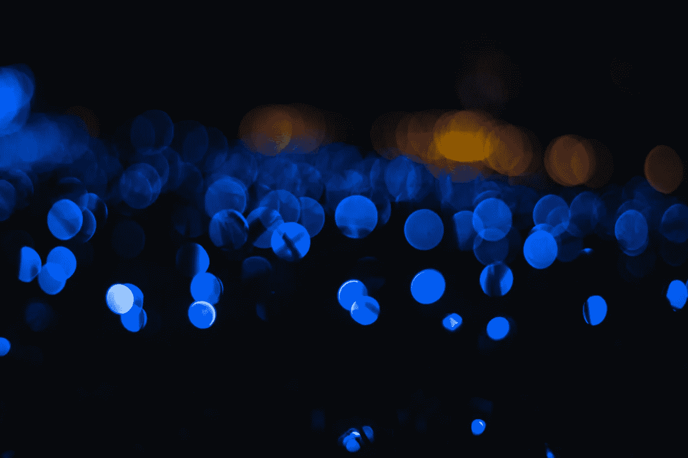

如果你曾经看过一张数码图像，你不会不注意到这种颗粒状的搅动噪声区分了实际上观看同一物体的两个相邻像素。例如，在上帝的绿色地球上，为什么捕捉晴朗天空的两个像素不会有相同的灰度值？


U.S Capitol Building — Left Clean image Right Noisy image

当然，可能有很多原因——可能是相机传感器、相机的光学系统、拍摄对象的纹理，也可能只是因为我是一个糟糕的摄影师？不，我不会试图解释所有可能的影响，我没有疯。相反，这篇文章是关于一种特殊的噪音。

我说的是**散粒噪声**或者**光子噪声**。

[](https://www.datadriveninvestor.com/2019/02/08/machine-learning-in-finance/) [## 金融中的机器学习——数据驱动的投资者

### 在我们讲述一些机器学习金融应用之前，我们先来了解一下什么是机器学习。机器…

www.datadriveninvestor.com](https://www.datadriveninvestor.com/2019/02/08/machine-learning-in-finance/) 

# 所以，我为什么要在乎？

散粒噪声会一直存在。它与光的[粒子性质](https://en.wikipedia.org/wiki/Wave%E2%80%93particle_duality)有关，因此不会去任何地方(你需要光来看你的图像，不是吗？).

想象一下，你是一个门卫，你想知道一个小时内有多少人进门。假设在一个小时内，你数了一下有 65 个人走进了那扇门。我谅你也不敢再数了！

无论何时计算独立事件，你的测量都会有随机波动。这意味着在下一个小时的计数中，你可能会得到一个与 65 稍有不同的值。令人惊奇的是，即使到达的人数保持不变，这种情况也会发生。

所以现在，让我们用称为光子的微小球体代替人(为了简单起见，让我们假设它们代表光)，用相机的光圈代替门，我们在图像传感器中得到**散粒噪声**。

# 你是怎么数光的？

图像传感器通过计算在给定时间间隔内入射到传感器上的离散光子的数量来测量场景辐照度。在数字传感器中，光电效应用于将光子转化为电子，而基于薄膜的传感器则依赖于光敏感的化学反应。在这两种情况下，随机单个光子到达的独立性导致散粒噪声，散粒噪声是一种依赖于信号的不确定性形式，是潜在信号本身的属性。

信号散粒噪声从根本上与光子在空间和时间上到达图像传感器的方式有关。例如，下图显示了一个蒙特卡罗模拟，其中 200 个光子与一个 20 × 20 像素区域随机相互作用。可以看出，光子相互作用的数量从每像素零到四个相互作用不等。每像素相互作用次数的标准偏差称为光子散粒噪声。

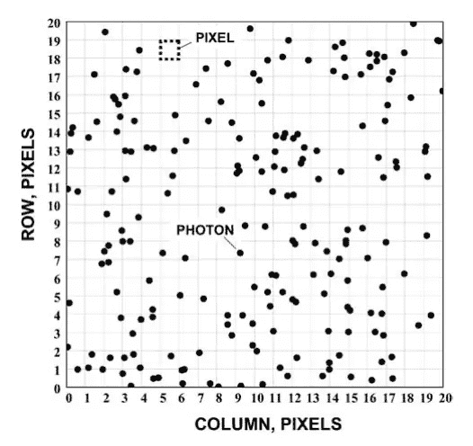

Monte Carlo simulation showing photons interacting with pixels.

光子分布中的这种差异主要是由于随机统计波动。也就是说，当在一段设定的时间内从一个不变的源收集光子时——比方说在 20 分钟的过程中以 10 个随机的 30 秒为间隔——每次收集 20 个光子是非常不可能的。相反，第一个间隔可能给你 20 个光子，下一个间隔 23 个光子，下一个间隔 18 个光子，等等。

那么，到达图像传感器的光子的这些波动是如何影响我们的图像的呢？噪点会扭曲照片的视觉细节，这是摄影师试图避免的。下图显示了一组模拟图像，其中指定了每个像素的平均粒子数或光子数。这表明，对于低数量的光子，噪声占主导地位，但随着光子数量的增加，图像结构变得更加明显。


对散粒噪声的原因有了充分的了解后，现在让我们检查光子和图像灰度值之间的关系。

# 图像传感器中的全阱容量和信噪比(SNR)

对于机器视觉应用，除了分辨率和帧速度之外，决定相机是否满足测量要求的一些最重要的规格是全井容量、[信噪比(SNR)和动态范围(DR)](https://www.adimec.com/how-to-interpret-the-dynamic-range-and-signal-to-noise-ratio-snr-in-image-sensor-and-industrial-camera-specifications/) 规格。

使用全阱容量和 SNR，我们可以推导出每个像素的灰度级强度，作为与其相互作用的光电子数量的函数。光子和光电之间的关系被称为“**量子效率**”(q . e .)。

这意味着并非所有入射到像素区域的光子都对其值有贡献。其中一些只是不做任何事情，例如，想象 100 个光子击中一个 Q.E 等于 0.5 的单个像素。也就是说只会产生 50 个电子。

一个像素中可以包含的电子数量被称为全阱容量。让我们检查一个真实相机的规格 [Adimec S-25A70/CXP](https://www.adimec.com/cameras/machine-vision-cameras/) ，它使用了 [OnSemi Vita25k](http://www.onsemi.com/PowerSolutions/product.do?id=VITA25K) 图像传感器。OnSemi 将传感器数据表中的最大满井数值指定为 22kel。全井容量对应于从传感器分辨率可能得到的最高灰度值。例如，对于 8 位传感器，它将是 2⁸-1 = 255 个灰度值。我们可以很容易地计算每个像素的灰度值，如下所示:

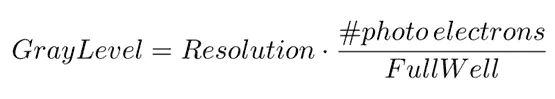

有时，规格表中没有规定全井。我们可以从信噪比中提取全井容量。规格表中的 SNR 由最大信号(满井)除以最大信号的散粒噪声或 SQRT(满井)确定。

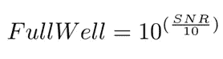

# 让我们制造一些噪音

现在是有趣的部分，假设我们想要创建一个散粒噪声发生器，模拟到达图像传感器的光子的波动。首先，我们需要弄清楚散粒噪声是如何表现的，或者更准确地说，散粒噪声是如何分布的。幸运的是，光子计数是一个经典的泊松过程。为什么这么问？我找到了一个关于[泊松分布和泊松过程](https://towardsdatascience.com/the-poisson-distribution-and-poisson-process-explained-4e2cb17d459)的非常彻底的演练。看看这个。

现在，让我们回顾一下实现过程，看看它如何与实测散粒噪声相对应。

这里有一种在 MATLAB 中实现它的方法(源代码可以在我的[散粒噪声发生器](https://github.com/erezposner/Shot-Noise-Generator) GitHub 库中找到)。首先，我们需要定义传感器的分辨率和全井。然后，对于每个像素，我们将其灰度值转换为到达传感器的光电数量。接下来，我们从泊松分布生成随机样本，以模拟到达图像传感器的光电波动，并最终转换回新的灰度值。

```
**% Define Full Well and sensor Resolution**fw = 20000;bit_level = 8;**% Generate Noisy pixel value**number_of_photo_electrons= graylevel_2_photoelectrons(pixel_value,fw,bit_level);new_photo_electrons_number=poisson_random_gen(photo_electrons_number);noisy_pixel_value = photoelectrons_2_graylevel(new_photo_electrons_number,fw,bit_level);
```

这里有一些嘈杂的图像，我们只在右侧应用了散粒噪声进行比较。很吵吧？

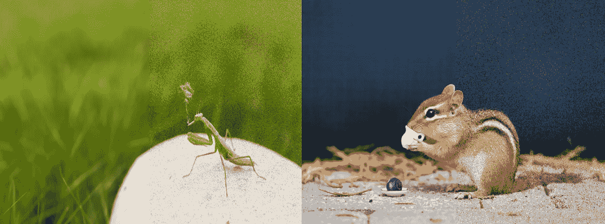

Shot Noise Generator applied on smoking mantis and dining Squirrel drinking tea. Left Clean, Right Noisy

# 与实际设备相比

让我们在真实相机上捕捉的实际散粒噪声和我们的散粒噪声发生器之间进行比较。在下图中，我们可以看到两个图。在 ***蓝色*** 中，像素的平均灰度值在 X 轴上显示为 50 到 255 之间，在 Y 轴上我们可以查看像素的散粒噪声。即像素灰度值的标准偏差。

在 ***橙色、*** 中我们可以看到根据特定的平均灰度值模拟的散粒噪声。我们可以看到两个图对齐，验证了我们的散粒噪声发生器。

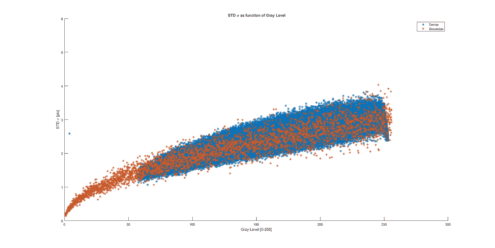

似乎随着光子-电子数量的增加，散粒噪声的标准偏差随着信号的平方根而增加。实际上，可以准确地说，信噪比(SNR)随着图像强度的增加而增加。

# 生成泊松随机值

原来有一种生成泊松过程的通用方法，这种方法 [Wikipedia](http://en.wikipedia.org/wiki/Poisson_distribution#Generating_Poisson-distributed_random_variables) 将以下算法归功于 Donald Knuth:

```
**algorithm** *poisson random number (Knuth)*:
    **init**:
         **Let** L ← *exp(*−λ), k ← 0 and p ← 1.
    **do**:
         k ← k + 1.
         Generate uniform random number u in [0,1] and **let** p ← p × u.
    **while** p > L.
    **return** k − 1.
```

这个算法背后的思想很简单。泊松过程中光子到达的时间间隔是指数分布的。因此，我们只需要通过模拟到达之间的时间并将其相加，直到时间总和溢出间隔，来计算间隔中有多少个到达。你最终会得到一些光子到达的时间间隔。

虽然它相当简单，但仍然有它的问题。循环的预期运行时间与参数λ成正比。其中λ是入射到传感器上的平均光子数。尽管这种算法对于大型参数的性能很差，但它仍然被广泛使用。

还有其他更适合实时应用的算法，但一般来说，大多数都是基本的[接受-拒绝方法](https://jblevins.org/notes/accept-reject)。

所以，回到手头的问题。我们希望创建一个生成器，在特定的时间间隔(在我们的例子中是我们的相机曝光时间)内，它将计算发生事件的数量。这些事件是光子事件。任何时候，当你有个别事件在随机时刻发生，但作为一个群体来看，它们往往以平均速度发生，你就有了一个泊松过程。

例如，如果平均每 3 毫秒的曝光时间，我们知道有 1000 个光子入射。这些光子事件在整个曝光时间内随机散射，但每次曝光时间大约有 1000 个。

如果每次曝光时间发生 1000 次这样的光子事件，这意味着平均每 3 毫秒/1000 =3 秒发生一次光子事件。所以，让我们定义一个变量λ=1/3 秒，称之为*速率参数。*速率参数λ是频率的度量:每单位时间(本例中为毫秒)内事件(本例中为光子事件)的平均速率。

知道了这一点，我们可以问这样的问题，光子事件在下一秒内发生的概率是多少？有一个众所周知的函数可以回答这样的问题。它被称为[指数分布](http://en.wikipedia.org/wiki/Exponential_distribution)的[累积分布函数](http://en.wikipedia.org/wiki/Cumulative_distribution_function)，看起来是这样的:

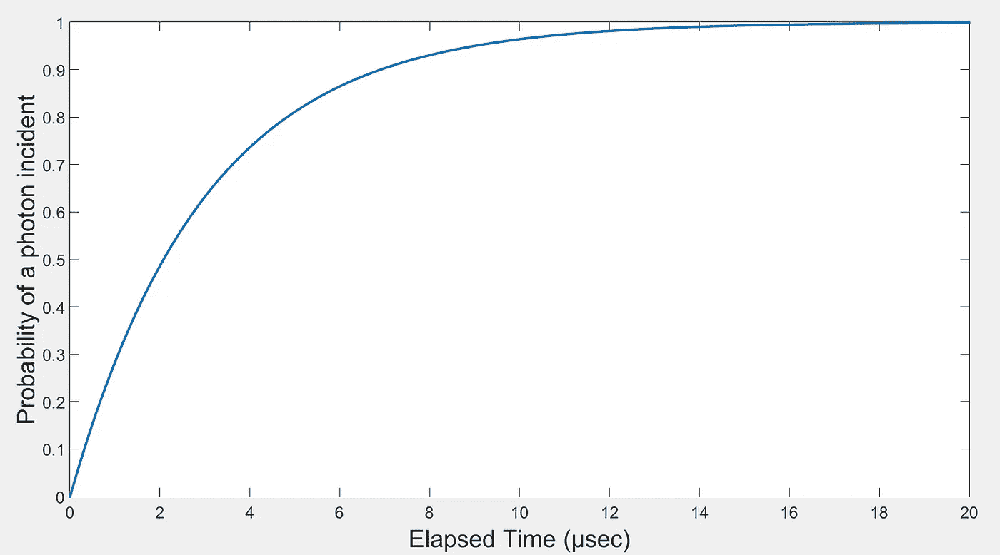

cumulative distribution function for the exponential distribution

基本上，时间越久，光子入射的可能性就越大。假设我们要模拟的泊松分布是:

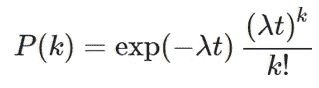

则事件时间间隔的相应指数分布及其 CDF(累积分布函数)将为

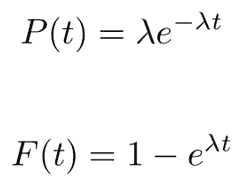

这里应用了逆变换方法:我们生成落在[0，1]中的均匀分布变量 *u* ，并根据下式对其进行变换:

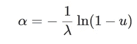

那么 *a* 是一个服从指数分布的随机变量，代表时间间隔。将 *1-u* 替换为 *u* ，将这些时间间隔相加得到:

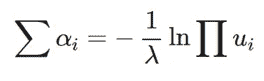

这就是 Knuth 算法的第五行正在做的事情。最后，我们只需要计算单位时间内总共包含多少个时间间隔，即我们的曝光时间，这就是光子入射数的泊松数。

Donald Knuth 在《计算机编程的艺术》中描述了这种方法，它是一种采样方法，允许从难以或不可能通过逆变换模拟的分布中进行采样。相反，从*仪器密度*中抽取，并以精心选择的概率接受。结果绘制是从目标密度绘制的。

为了形象化我们刚才所做的，请看下图；我们简单地在 y 轴上选择 0 到 1 之间的一个随机点，均匀分布，在 x 轴上定位对应的时间值。例如，如果我们选择距离图表顶部 0.5 的点，到我们下一次光子入射的时间大约是。2.1 秒。

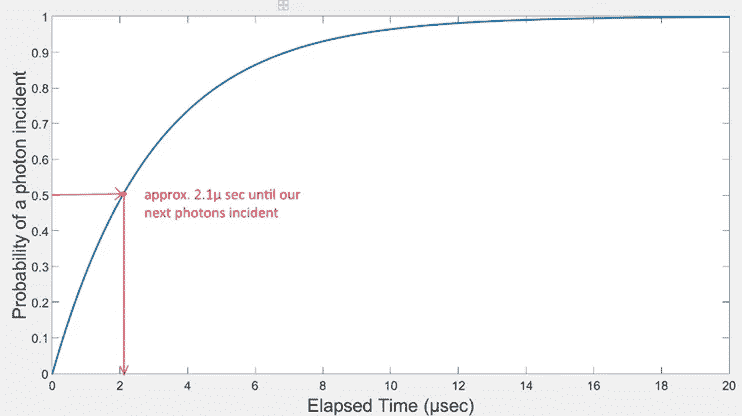

# 最后的想法

感谢您的阅读。

如果你对源代码感兴趣，可以在我的[散粒噪声发生器](https://github.com/erezposner/Shot-Noise-Generator) GitHub 库中找到。

一如既往，如果您有任何问题或意见，请随时在下面留下您的反馈，或者您可以随时通过 [LinkedIn](http://www.linkedin.com/in/erezposner) 联系我。在那之前，下一篇文章再见！😄